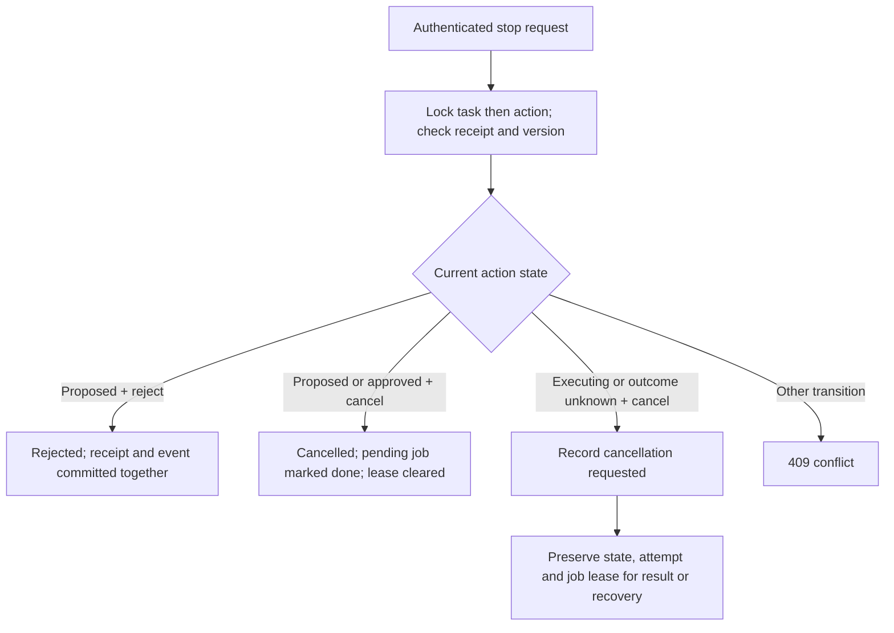

# Exact approval and stopping actions — B04

B04 implements atomic exact-payload approval/outbox persistence and public rejection
and cancellation. **New public approval remains disabled** because the sender and
uncertain-write recovery are not installed. Internal tests enable the service with
a simulated dispatcher; no request field, environment flag or model output can
enable public approval in this release. Draft review remains independent.

## Runtime mapping

| Responsibility | Location |
|---|---|
| Strict request and response contracts | `backend/app/schemas/actions.py` |
| Thin authenticated routes / transaction commit | `backend/app/api/routes/actions.py` |
| Exact approval and durable stop decisions | `backend/app/actions/approval.py` |
| Saved preview and current blockers | `backend/app/actions/email_preview.py` |
| State changes / edit supersession | `backend/app/actions/service.py` |
| Receipt storage and guards | `ActionDecision`; migration `a0426e9bc731` |
| Acceptance and migrated service tests | `test_action_approval.py`, `test_action_decision_migration.py` |

## API

All routes are authenticated and owner scoped. Unknown/other-owner IDs return 404;
missing bearer auth returns 401. Extra fields return sanitized 422 errors. Success
responses carry `Cache-Control: no-store`.

| Route | Strict request | Result |
|---|---|---|
| `POST /assistant/actions/{id}/approve` | `request_id`, positive `expected_version`, lowercase 64-character `payload_hash` | New approval blocked with 409 in B04; an existing matching approval can replay with 202 |
| `POST /assistant/actions/{id}/reject` | `request_id`, positive `expected_version` | 200, proposed → rejected |
| `POST /assistant/actions/{id}/cancel` | Same as reject | 200, proposed/approved → cancelled; executing/unknown → request recorded |
| `GET /assistant/actions/{id}` | No body | Current owned preview, state, blockers and available operations |

Example stop body:

```json
{"request_id":"stop-unique-key","expected_version":1}
```

Mutation responses contain `request_id`, `operation` (`approve`, `reject`, `cancel`),
`decision` (`approved`, `rejected`, `cancelled`, `cancellation_requested`) and nested
`action` with the full current `EmailActionView`. `decision` is the durable result
of that request; `action.state` is current. A retried approval after cancellation
therefore says `decision: approved`, `action.state: cancelled` and **does not enqueue
again**. Use current state for current UI status, never the receipt alone.

The action view adds:

- `approval_id`: nullable ID of the preserved exact-payload approval.
- `authorization`: `none` or `exact_payload_approval`. This reports historical
  approval evidence; cancelled, expired or superseded actions cannot dispatch on it.
- `cancellation_requested`: true when a durable post-cutoff request exists, including
  after a later provider outcome. It is not proof of recall or non-delivery.
- `allowed_operations`: `reject` for proposed; `cancel` for proposed/approved or
  executing/unknown with no recorded cancellation request. Terminal actions expose
  neither. These are hints; the route still checks version/state.

`approval_available` and `sending_available` remain false; `send_executor_unavailable`
remains a blocker. Existing preview fields/hashes/MIME never change. A stop remains
possible when Google disconnects or a preview expires: withdrawing work does not
require Google credentials. Reject applies only to proposed actions; cancel applies
to already approved work. Frontend integration is deferred; no Send control is wired.

Errors use the existing envelope: 409 `version_conflict`, `payload_conflict`,
`idempotency_conflict`, `action_state_conflict`, `action_execution_unavailable`, or
`action_approval_blocked` with current `blockers`. Expiry crossing a database guard
also returns a sanitized approval blocker and rolls back. Queue/storage failures
cannot produce a success response or leave a partially committed approval.

## Exact approval transaction

```mermaid
sequenceDiagram
    participant C as Authenticated client
    participant A as Approval service
    participant D as PostgreSQL
    C->>A: Action ID, request key, version and saved payload hash
    A->>D: Lock owned task, then action
    A->>D: Find prior approval request
    alt Matching prior request
        A-->>C: Saved decision with current action; no new job
    else New request
        A->>D: Lock account; refresh source and permission snapshots
        A->>A: Check proposed state, hash, revision, expiry and grants
        alt Executor unavailable (all new public approvals in B04)
            A-->>C: 409; no approval or job
        else Internal simulated executor / future gated implementation
            A->>D: Insert exact approval; change state; enqueue one dispatch job
            A->>D: Commit together with IDs-only event
            A-->>C: 202, approved; delivery not yet confirmed
        end
    end
```

Approval never accepts replacement recipients/body/MIME. It loads the saved B03
payload, validates its artifact hash, effective source versions, Google subject,
account version, actual scopes, connected/verified identity and credential metadata.
No remote token refresh or provider call happens inside this transaction. A new
approval requires an actual Gmail send grant. Public write consent acquisition is
still outside this slice; current OAuth begin requests Gmail read only.

Lock order is **task → action → account → job/attempt** for approval. Sync/auth
publication holds the account lock and does not acquire task/action locks afterward;
this fences concurrent mailbox publication or disconnect while validating/enqueuing.
Read queries refresh cached thread/message rows. Future dispatch must repeat relevant
checks immediately before persisting dispatch intent, including its rollout flag.
Local readiness is not proof that a remote token or permission remains valid.

Approval expiry is exactly the candidate expiry; no extension or MIME regeneration.
The approval binds the proposed action version; transition to approved advances it.
Insert approval before the guarded state transition; enqueue and event share the
caller-owned transaction. A queue failure or caller rollback removes all changes.
No approval helper commits caller work or performs network I/O.

## Cancellation cutoff and replay



Committed dispatch intent is the cutoff; it is not proof of provider acceptance.
A late cancel cannot recall an email, mark it not sent or stop reconciliation. It
keeps action version/state and job/attempt untouched, while advancing the task event
sequence and appending `action.cancellation_requested` containing only `action_id`.
Before cutoff, cancellation advances action version and closes pending work. Draft
edits still atomically supersede pending proposals/approvals under the same task lock.

Request keys are owner scoped. Approval keys use the existing approval namespace;
reject and cancel each have separate namespaces. Hashes bind action ID, operation
and normalized body. Same key/same input replays after state changes; changed input
or action conflicts. Failed requests do not reserve a key. A distinct key still has
to satisfy current version/state. Replay reads do not modify historical payloads,
extend expiry, enqueue again or change a recorded stop decision.

`action_decisions` records ID, owned action, operation, request key/hash, expected
version, decision and timestamp. Unique owner/operation/key, composite ownership FK,
valid operation/decision pairs and immutable update/delete trigger preserve receipts.
There is no copied email body, token or recipient in these records or events.

## Migration, rollout and next work

Migration `a0426e9bc731` follows `f1a2b3c4d5e6`, adds an empty receipt table/indexes
and immutability trigger. Existing drafts, approvals, payloads, jobs and attempts
are preserved. Downgrade to B03 is allowed only with zero receipts; otherwise it
refuses. Do not delete history to force downgrade. Existing retention/recovery
policy remains a live-write release gate.

Deploy only the reviewed merged release, with backup and matching API/worker code.
No new settings, secrets, model/Flow changes or Google calls. The pinned deployment
command targets merged PR26; B04 is not deployed by that command. Old code can run
against additive columns/tables but must not be allowed to dispatch around the
new cutoff/approval contract. No dispatcher exists in either deployed slice today.

B05 implements the dedicated sender and its capability/rollout checks. B06 provides
unknown-outcome reconciliation; keep live sending disabled until both and controlled
Gmail delivery/threading/Bcc/recovery tests pass. B18 later adds the explicit approval
UI. B04's internal `execution_enabled` argument is a trusted testing/future integration
seam, never HTTP authority or an existing production switch.

Evidence and resume: [B04 checkpoint](backend-execution/checkpoints/B04.md).
Prior exact-payload contract: [email previews](email-action-previews.md).
