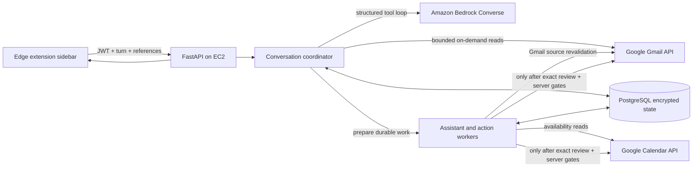

# Architecture — what runs where

The isolated chat-context prototype and its unresolved architecture gaps are
documented in [Shared conversation context](chat-context-design-review.md).
That review distinguishes implemented storage mechanics from unverified semantic
behavior; it is not a claim that a new release has been deployed.

[Email badge classification](classification/README.md) is a separate on-demand
service: authenticated thread ID → bounded live Gmail context → dedicated configured
published Bedrock classification Flow (or explicit Converse baseline) → strict
four-field/evidence validation → fresh Gmail and
session checks → transient badge response. It preserves BERT category/priority/action
labels and adds independent binary reply. It makes no external writes, restores no
mailbox import/cache, and changes no existing assistant Flow registry. Disabled by
default in fresh configuration; the public backend enabled Claude Haiku 4.5 on
7 October 2026. See the [deployment record](classification/ROLLOUT-2026-10-07.md).
Nova Micro is retired.
Classification Flows use a numbered managed CHAT prompt, a numbered Flow version
and an alias verified before/after invocation. The backend checks the prompt,
model, graph and role; it does not accept a console-edited replacement release.
See [Flow provisioning and evaluation](classification/VISUAL-FLOWS.md).

Conversation release 1.7.0 combines direct Calendar creation with the
[shared email context design](shared-mail-context.md):
provider-thread reads, a separate reply target, up to five evidence threads,
bounded retained source handles and per-dependency freshness checks. Summaries,
replies and drafts consume the same reference-only plan. This local implementation
requires live evaluation and rollout before installed behavior changes.

> Current conversation layer: [context, lifecycle and limits](contextual-conversation.md).

> Current inbox chat: [conversational search and result cards](inbox-chat.md).

> Current selected-thread behavior: [grounded answers and receipt fixes](grounded-thread-fixes.md).

> Current correction: [on-demand Gmail](on-demand-gmail.md) supersedes the historical
> mailbox-sync, local-search and stored-source sections retained later in this document.

This opening section is the source of truth for the current topology. Later dated
sections record earlier implementation slices and remain useful for compatibility,
but do not override this topology.

## Topology

The extension is a thin conversational client. The authenticated backend owns
conversation memory, source references, capability checks, workflow state and
all write approvals. Bedrock decides which bounded read or workflow tool is useful;
it never receives a send/book/approve tool. Gmail is queried on demand and message
bodies are not imported into PostgreSQL.



Runtime invariants:

- Browser code sends the actual user turn and backend-issued references; it does
  not classify intents or concatenate synthetic prompts.
- The coordinator reconstructs recent dialogue, the pinned message, ordered search
  results, active task/question, current artifact and live capabilities.
- An open compose clarification retains the original user request and its user-authored
  answers for the durable draft task. Recipient references are scoped to explicit
  To/Cc/Bcc roles in that goal; a prior unrelated or incidentally mentioned address
  and assistant-authored text grant no recipient authority.
  Draft creation does not depend on Gmail send access.
- Bedrock Flow assets remain specialist prompt experiments. The production master
  conversation loop uses the Converse tool-use API and invokes existing durable
  workflow services behind validated tools.
- Gmail reads are request-scoped. Search cards and raw tool observations are transient;
  encrypted conversation state retains bounded dialogue and provider references.
- Email send and Calendar booking use their existing exact-payload review, approval,
  execution and reconciliation lifecycles. Conversation text cannot authorize them.
- `INFERENCE_PROVIDER=bedrock` is required for this release. The feature remains
  gated until the operator reviews the cloud-processing boundary and separately audits
  model invocation logging for the configured account and region. The acknowledgement
  environment flag records that manual decision; preflight does not perform the audit.

## Historical deployment baseline

The following diagram describes the original MailMind deployment and is retained
to explain legacy modules and releases. Ollama/OpenRouter placement, bulk mailbox
sync and the week-based build plan are not the current conversation architecture.

```
Chrome extension (frontend/) ──HTTPS 443, REST + SSE──▶ AWS EC2 (t3.small+, Elastic IP)
                                                        security group: 443 + 22 only
                                                        billing alarm: $20

  docker network: threadly_net (compose-managed)
  ┌────────────────────────────────────────────────────────────┐
  │  caddy :443 ──reverse_proxy──▶ api :8000 (FastAPI)         │
  │  auto-TLS, SSE passthrough      │        │                 │
  │                              SQL│        │vectors          │
  │                        postgres:16     chroma              │
  │                        13 tables       per-user            │
  │                                        sent-mail embeddings│
  │  named volumes (survive redeploys): pgdata · chromadata ·  │
  │  caddy_data (certs)                                        │
  └────────────────────────────────────────────────────────────┘
          │ Tailscale (private) :11434         │ HTTPS
          ▼ direct identifiers masked         ▼
  Mac M4 16GB — Ollama                  OpenRouter (fallback when Mac down,
  qwen3.5:4b + LoRA (PRIMARY)           long-thread summaries, ablation Tier-1)
  qwen3.5:2b (voice/planner)
  both resident, no swap                ElevenLabs (STT/TTS, keys server-side only)
                                        Google (OAuth test mode 100u, Gmail read/send)
```

Rules encoded by this topology:

- Legacy inference runs on the Mac/OpenRouter; Bedrock mode uses AWS managed
  inference (decisions/003). The EC2 box orchestrates in both modes.
- Cloud-model input masks email/phone/card-like tokens first. This is not full
  anonymisation: configured providers still process the remaining requested content.
- Data stores are off-the-shelf containers; we own the schema, not the images.
- Voice/API keys live server-side only. The extension holds Threadly access and scoped renewal JWTs; Google credentials remain server-side.

## Inside the api container — module map

Assistant migration: `app/planner/intent_router.py` provides the five-intent
proposal router through authenticated `POST /assistant/route-preview`.
`app/schemas/assistant.py` contains strict runtime contracts and
`app/planner/intent_prompt.py` the versioned prompt. The historical planner below
is retained for compatibility; the preview does not call its broad regex rules.
No additional service/container is needed for routing. Contextual summary execution
uses `app/assistant/` and the optional Compose `assistant-worker` service. Request
acceptance persists context/task/job/event state; the worker claims and commits,
generates outside a transaction, then publishes a fenced artifact. Browser state
and SSE connections do not own execution. Bedrock Flow invocation, planning/scheduling and bounded other
execution workflows remain upcoming work; draft execution is described below. See the
[worker runbook](assistant-worker.md) and [runtime API contract](api-contract.md).

| # | Box (architecture doc)      | Folder                      | Responsibilities                                            | Week |
|---|-----------------------------|-----------------------------|-------------------------------------------------------------|------|
| 1 | API layer                   | `backend/app/api/`          | routes, JWT check, error envelope (R18)                     | W1+  |
| 2 | Auth service                | `backend/app/auth/`         | OAuth exchange/refresh, Fernet-encrypted tokens             | W1   |
| 3 | Sync worker                 | `backend/app/sync/`         | paginate ALL Gmail pages, clean, upsert postgres            | W1   |
| 4 | Planner                     | `backend/app/planner/`      | rules first, 2b JSON fallback                               | W3   |
| 5 | Orchestrator                | `backend/app/orchestrator/` | dispatch by intent (FETCH_ENTITY / SUMMARISE / DRAFT)       | W2+  |
| 6 | Extractor                   | `backend/app/extractor/`    | tier1 regex (90%+), tier2 LLM residue, dedupe               | W2   |
| 7 | RAG service                 | `backend/app/rag/`          | embed sent mail, retrieve(k, cap=3000 chars)                | W3   |
| 8 | Model client                | `backend/app/model_client/` | mac | openrouter, 2s health probe fallback, thinking OFF     | W1   |
| 9 | Voice proxy + PII           | `backend/app/voice/` + `backend/app/pii/` | STT/TTS passthrough; mask on ALL cloud egress | W3   |
|   | Data layer                  | `backend/app/db/`           | engine, 7 table models, repositories                        | W1   |
|   | Request/response contracts  | `backend/app/schemas/`      | pydantic models mirrored by docs/api-contract.md            | W1+  |

Orchestrator principle (decisions/002): **structured data goes AROUND the LLM,
never through it.** Entity lookups return DB rows directly; models only see the
residue that regex/rules can't handle.

## AI team hand-off (`ml/`)

The AI team ships FILES, not services — backend code loads them:

- `ml/classifier/bert.safetensors` + `labels.json` — reply-or-not / priority classifier
- `ml/adapter/` — QLoRA adapter (applied to qwen3.5:4b on the Mac, via Ollama Modelfile)
- `ml/prompts/prompts.yaml` — versioned prompt templates

Mounted read-only into the api container at `/ml`. Contract details: `ml/README.md`.

## Build order (backend, 4-week plan)

- **W1**: auth (2) → sync (3) → data layer → model client (8) → `/summary` SSE
- **W2**: summary cache · `/threads` · extractor (6) · `/entities`
- **W3**: RAG (7) · `/draft` · voice + PII (9) · planner (4)
- **W4**: load drill · PII hardening · golden tests · freeze

## Gmail source consistency (T02)

`app/sync/worker.py` captures a pre-scan cursor and replays Gmail history before
committing a backfill. All network reads happen outside DB transactions. A
per-user `sync_version` compare under a row lock rejects stale concurrent work;
message changes, deterministic thread heads/versions, cache invalidation and
cursor advancement commit together. Incremental sync includes deletions and
label changes, maintaining the same non-SPAM/non-TRASH scope as backfill.

`app/db/repositories.py:message_order` is shared by thread details, context
capture and legacy summary rendering. Selected RFC reply headers and parsed
mailboxes are stored for later recipient services. The legacy summary cache
checks the captured thread version before publication. Durable summaries retain
their immutable input even after later sync. This remains inline sync, with
large-mailbox/background scheduling work outstanding; see the
[Gmail lifecycle, diagram and rollout guide](gmail-sync.md).

## Durable routing and dispatch (T06 partial)

`app/assistant/routing.py` binds the stateless classifier to authorized snapshot
capabilities. Request acceptance persists instructions before inference; the
existing worker routes, checkpoints under its lease, then runs the installed
summary workflow. Clarification and unsupported outcomes persist as distinct
stopped task states. Uninstalled compound workflows do not execute a supported
subset. Source bodies never enter classification, and only the backend binds
snapshot IDs. New task release manifests pin both routing and generation assets.
See [contextual routing diagrams and handoff](assistant-routing.md).

## Initial reply/compose artifacts (T10/T11/T13 partial)

`app/assistant/drafting.py` binds explicit recipients and a selected reply message
at acceptance, constructs generation input without adding envelope addresses,
validates model text/source numbers and produces a reviewable draft artifact.
`app/assistant/routing.py` now dispatches single summary/reply/compose operations;
compound scheduling requests remain unavailable. `routing_v1.py` retains the prior
contextual release for already-queued work. All generation/publication uses the
existing lease/cancellation protocol. Drafts are stored in Threadly only; no Gmail
writes occur during draft generation. The disabled B05 action worker is described
below. See [draft lifecycle](assistant-drafts.md).

## Draft editing and review (T10 partial)

`app/assistant/draft_review.py` provides a DB-only editing/review service through
the existing assistant API. It serializes mutations on the task row, appends new
artifact/envelope revisions and records exact-hash review acknowledgements.
It does not enqueue a job, call a model or perform a provider write. Saved task
inputs and historical artifacts stay immutable. UI task reads resolve the latest
revision; review validity also checks local reply/source and sender changes.
A separate action proposal/approval/execution service is still required to send.
See [editor lifecycle](assistant-draft-review.md) and [backend remaining work](backend-remaining-work.md).

## Bedrock Flow prototype provisioning

[CloudShell Flow launcher](../infra/bedrock/README.md) provisions six isolated,
proposal-only visual Flow drafts for Haiku 4.5 experiments. It does not change the
runtime topology or enable Flow invocation in the assistant worker. The B16 registry,
B17 read bridge/invocation adapter, backend validators and live evaluation gates
remain required before integration. Prepared AWS resources are not evidence of
working end-to-end Gmail/Calendar workflows.

## Application Flow runtime

The [workflow runtime](workflow-runtime.md) adds a registry and bounded InvokeFlow
adapter for the existing summary/reply/compose worker paths. The backend supplies
masked, owner-bound context before invocation and validates the result afterward.
This restricted release has no Lambda/read callback or write nodes. It preserves
native admission by default, pins configured targets into new tasks, validates
published graph/alias identity and uses the existing cancellation/lease fencing.
The six earlier prototypes use a different output envelope; a compatible, evaluated
runtime release must be published before activation. Other/planning/Calendar, compound
steps, durable clarification and approved external actions remain pending.

## UI reference binding

Capture schema 1.1 adds an owner-checked, immutable Gmail thread-view map.
`assistant/ui_context.py` hydrates selected IDs from PostgreSQL in one consistent
source/version query. `assistant/ui_routing.py` binds supported references against
visible order and returns exact source quotes natively, or filters a single-message
summary before the existing generation adapter. No source text can select another
operation. The worker keeps release compatibility and fenced artifact publication.
Legacy captures retain their semantics; UI-aware tasks wrap the pinned native/Flow
release. [Capture lifecycle and frontend integration](ui-context-mapping.md) covers
bounds, errors, rollback and the remaining B08/B09/browser gates.

## Summary quality release

`summary_policy.py` supplies the versioned concise policy shared by the runtime and
a separate console experiment. `summary_quality.py` builds numbered-source prompts
and applies bounded output checks before the existing artifact/evidence builder.
New tasks pin this wrapper without reinterpreting old queued releases; UI selection
filtering still occurs before generation. Graph completion and schema validity do
not establish factual quality. [The diagnosis and evaluation guide](summary-quality.md)
separate offline regression, live Haiku evaluation and frontend presentation.

The [master workflow contract](master-workflow.md) maps the actual API/worker/router/
registry coordinator and the planned multi-label → validated step graph integration.
Summary policy 1.0.2 separates descriptive output from requested planning; its
offline/live evaluation distinguishes JSON validity from known semantic regressions.
No AWS master orchestrator or compound scheduling executor is added by that fix.


## Durable typed clarification (B08)

New requests pin `typed-continuation-1.0.0` separately from their unchanged generation
release. `POST /assistant/tasks/{task_id}/inputs` consumes a current owned question
and requeues the same task with typed effective inputs. It preserves the original
instruction/request hash and does not classify the answer as a new command.
New task views expose `question`, `input_version`, `continuation_release`,
`effective_context_snapshot_id`, `effective_draft_input` and `resolved_inputs`.
Historical tasks keep their prior behavior. See [the complete API and lifecycle
contract](assistant-continuation.md) for examples, error handling and frontend forms.

Migration `f2b6049c7a81` adds task continuation/effective-context fields and the
`task_questions` / `task_inputs` tables. Owned composite FKs, one input per question,
request-key uniqueness and bounded versions guard acceptance. Effective source
deletion cascades the dependent task just like its initial source. Questions and
answers commit atomically with task/job changes; downgrade rejects remaining new
state. This adds no Calendar handler, compound executor or approval to send.


## Bounded read actions (B09a)

Explicit `AssistantRequest.read_options` adds native help, literal saved-capture
search and single-message rewriting through the existing durable task API. New
read tasks now pin `bounded-reads-task-1.1.0` for capability-aware help.
See [compose routing correction](compose-routing-fix.md) for strict model-output
parsing, prompt versions and live replay evidence.
Migration `a6417c29d805` adds nullable `assistant_tasks.read_input` and guards rollback
with retained read tasks. No external writes or mailbox-wide search are enabled.
Source ownership/freshness is checked before execution, publication and artifact
retrieval. See [request examples, lifecycle, limits and remaining B09 work](assistant-bounded-reads.md).


## Scoped local-mail search (B09b)

`POST /assistant/mail-search` adds explicit owner/date/folder search over synced
cleaned bodies, with bounded exact excerpts and signed pagination tied to the
mailbox sync version. It is a native read endpoint, not a task, model or Gmail
invocation. `GET /assistant/workflows` advertises this capability separately.
Migration `b7180d3f9e62` adds the owner/effective-date/row-ID search index, preserving
all data and prior task contracts. [Frontend contract, concurrency, coverage and
rollout](assistant-mail-search.md) describes the remaining extraction/planning gates.


### Explicit compound generation (B10a)

`POST /assistant/compound-requests` saves a fixed, user-selected summary → draft
plan through the existing task service. `assistant/steps.py` executes the pinned
template under the existing worker lease, checks local sources before each stage
and publication, and persists immutable per-step output/checkpoint hashes. The
summary and draft use separate artifact streams; only the final draft commits task
success. Failures retry the missing step while reusing valid completed output.
No transaction spans model/Flow inference. This branch does not add Calendar or
external-write handlers, or an automatic natural-language compound planner.
See [whole workflow/testing map](workflow-testing-map.md) and
[compound contract](assistant-compound-workflows.md).

## Action persistence (B02)

`app/actions/service.py` stores immutable candidates behind owner and task locks,
separately from generation jobs. Draft edits supersede pending proposals in the
same transaction; executing/unknown records remain unchanged. PostgreSQL guards
ownership, legal transitions and preserved unresolved attempts. This is the storage
foundation; B03 below adds proposal/read HTTP routes. No action worker or Google writes are enabled.
See [action lifecycle and rollout](assistant-action-storage.md) for the full mapping
and the source-deletion policy that must be completed before live writes.

## Google auth and capability boundary (B01)

`auth/flow.py` owns one-use state/PKCE and account-bound reconnect.
`auth/google.py` handles sanitized fixed-endpoint HTTP calls; `auth/service.py`
separates credential refresh transactions from caller work and fences late refresh
results. `capabilities/service.py` combines actual grants, verified identity and
credential availability with installed handlers. No send/Calendar executor is
enabled. The [Google lifecycle](google-capabilities.md) records the existing frontend
getAuthToken mismatch, typed API contract and live consent gate.

A separate stdlib laptop test client (`backend/tools/google_local_login.py`) can
complete the same handshake through an SSM tunnel. An off-by-default setting permits
one exact loopback HTTP callback; it adds no endpoint and does not change token
storage, scope authority or write approval. [Setup](google-local-testing.md).

## Exact email proposals (B03)

`actions/email_preview.py` validates the current edited artifact, effective context
and verified Google account before `actions/email_payload.py` builds immutable
plain-text MIME. Public proposal/read routes expose the saved envelope and hashes
with current blockers. B02 supplies transaction ownership, task-first locking,
immutable storage and edit supersession. No model or provider call occurs here;
source/account revalidation remains mandatory at future approval and dispatch.
[Preview lifecycle and B04 handoff](email-action-previews.md).

## Approval and cancellation (B04)

`actions/approval.py` binds request identity to the saved action hash/version, locks
task → action → account before source/grant revalidation, then atomically stores
approval, approved state, dispatch job and event. The internal enabled seam is
exercised with fake dispatch only; public approval cannot enable it. Stop decisions
use immutable receipts and the same task/action lock order. Post-cutoff cancellation
records intent while preserving the running/unknown action and recovery job. No
transaction spans a provider call. [Full lifecycle](action-approval.md).


## Isolated Gmail action worker (B05)

`actions/worker.py` owns leased action jobs, preflight, committed dispatch intent,
result fencing and expiry recovery. `actions/gmail_sender.py` performs one bounded
POST with exact saved MIME. Credentials and provider HTTP run outside task/action
transactions. Crashes after intent become held reconciliation work, never a second
send. Root Compose offers an optional `actions` profile. B05 staging did not start
this worker; B06 below adds deployment wiring and bounded recovery. Environment and
compiled live-verification gates keep writes disabled; public approval remains unavailable.
[Lifecycle, failure policy and rollout](email-actions.md).


## Read-only send reconciliation (B06)

`actions/reconciliation.py` owns bounded read leases/observations and fenced result
publication. `actions/gmail_reconciliation.py` scopes GETs to the original mailbox
and compares one complete Sent candidate against saved plain-text MIME semantics.
New sends from the same task are blocked while an earlier result is uncertain.
`EMAIL_RECONCILIATION_ENABLED` independently gates provider reads; live sends/public
approval remain disabled. Staging now wires the same-image action worker into
stop/migrate/restart, but this branch has not been deployed. [Contract](email-actions.md).

### Captured-text lookup plus draft (B10b)

The explicit compound endpoint now accepts lookup → reply/compose as a separate
pinned contract. `assistant/lookup_draft.py` defines native source selection and
its prompt policy; the existing `steps.py` worker owns checkpointing, leases,
publication and retries for both summary and lookup pairs. Native lookup performs
no external call. Only matched captured messages plus an explicit reply target
enter draft generation; no/too-many matches stop first. The saved runtime registry
still controls the generation Flow. No master AWS Flow, free-text full-command
planner, mailbox-wide automatic retrieval or Calendar executor is introduced.
See [runtime](lookup-draft-workflows.md) and [whole-backend progress](backend-progress.md).

### Reviewed compound-command planning (B10c)

`planner/command.py` interprets numbered user-command words into a strict span/operation
proposal and deterministically compiles one of four installed compound pairs.
`assistant/command_plans.py` persists a reservation before bounded model inference,
then saves the reviewable interpretation. No source email or typed provider IDs enter
the planner. Explicit whole-command confirmation rechecks ownership/source/release
and atomically links one existing compound task. No separate step executor or AWS
master Flow is introduced. Structural coverage cannot prove semantic correctness;
automatic dispatch remains disabled pending live quality evidence. Unsupported
operations block the whole proposal. [Runtime contract](command-planner.md).

### Calendar read foundations (B12)

`calendar/service.py` coordinates JWT-owned account/preferences around bounded
`calendar/client.py` httpx reads. API calls are direct reads, not assistant generation
jobs or model-selected tools. It reuses B01 token refresh, requests narrow Calendar
read scopes only through authenticated reconnect, and requires actual list + freebusy
grants. Transactions close before network calls; short final account/preferences
locks fence publication. Saved evidence has explicit per-calendar unknown coverage,
version checks and expiry. This service makes no calendar write; B14b1 adds the
explicit assistant read handler described below. The shared provider adapter
rounds only its outgoing freeBusy window outward to whole UTC seconds, validates
Google's exact echoed window, then clips intervals back to the original request.
This handles provider timestamp precision without weakening coverage validation
or changing saved request dates, evidence bounds or event preflight semantics.
[Calendar lifecycle, diagram and B13 handoff](calendar-reads.md).

### Deterministic Calendar slots (B13)

`calendar/slots.py` commits an idempotent owned request/anchor before invoking B12's
read service, then fences publication under fresh account/preferences/receipt locks.
`time_resolution.py` resolves typed relative dates and genuine clock ambiguity;
`availability.py` computes UTC intervals, DST-aware working windows, padded busy
conflicts, notice and up to three options without model arithmetic. Saved explicit
working hours or caller-supplied local context may resolve AM/PM; unknown busy data
cannot do so. Immutable receipts retain assumptions, source versions and stable IDs.

These direct read routes are reused by B14b1's durable typed scheduling handler. B14 owns
negotiation, further assistant integration and fresh slot selection; B15 owns exact approved
booking/recovery. External Calendar changes are not pushed into B12 evidence, so a
five-minute offer always requires fresh validation before booking. Diagram and full
contract: [Calendar slots](calendar-slots.md).

### Meeting negotiation foundation (B14a)

`calendar/negotiations.py` groups immutable B13 offers and explicit selection checks
under an owned synced thread. It locks account → preferences → thread → negotiation,
commits a checking receipt, invokes B13 outside DB transactions, then fences exact-
time publication against the same offer/version/source. Unknown/busy/stale results
cannot select an alternative; superseded checks cannot restore earlier state.

The direct API has no model call, generation task or external write. B14b1 adds typed
assistant scheduling continuation/artifacts. B14b2a adds reviewed command extraction below. Remaining B14b work owns replies and later-
email proposals; B15 owns event approval/execution/reconciliation. Read `usable`/
blockers on historical records. Sync's real update timestamp prevents an old slot
query from passing new-thread adoption after an account-lock wait. Runtime API,
diagrams and recovery: [meeting negotiations](meeting-negotiations.md).

### Typed assistant scheduling reads (B14b1)

`assistant/scheduling.py` runs explicit `check_time`/`suggest_slots` tasks on the
existing durable worker. Acceptance pins owned source, preferences, release and
request/message anchor. A versioned scheduling answer schema reuses B08 storage,
limits and task fencing without altering older continuation releases. B13 resolves
typed constraints; saved working hours/context can eliminate needless AM/PM questions.

Short transactions lock account → preferences → source → task. Google reads occur
outside them; publication verifies a matching owned B13 receipt and current source,
preferences and lease. Stable query keys per task/input allow completed-read reuse
after publication failure. Unknown/elapsed/fewer/no slots have distinct honest
outputs. Artifact GET recomputes usability without rewriting historical content.

This typed handler does not itself call a model; B14b2a preparation is described below.
Generated replies remain open. The explicit handler
does not enable Calendar compound routing or mutate negotiations automatically.
Its query IDs can be adopted through B14a's existing checked offer endpoint.
[API examples, sequence, error and recovery contract](assistant-scheduling.md).

### Reviewed scheduling extraction (B14b2a)

A separate `/assistant/scheduling-proposals` surface reserves a durable receipt,
releases DB locks, calls the configured model once for whole-command clauses and
literal word spans, then deterministically normalizes supported scheduling phrases.
No email source text enters this prompt. The user reviews the saved proposal and
confirms its exact hash before `tasks.submit` receives the pinned original scheduling
binding. Existing B14b1/B13 clarification, Google reads and publication fences remain
in force. Account/preferences/source locks precede proposal/task locks. This is a
backend preparation step, not a newly provisioned AWS master Flow. Workflow/state
charts, unsupported combinations and live-quality gate: [contract](scheduling-extraction.md).


## Combined MVP orchestration (17 September 2026)

See [the complete runtime workflow map](mvp-workflow-map.md) and
[ADR 004](decisions/004-mvp-backend-owned-orchestration.md). The reviewed master
coordinator validates the whole command before selecting installed templates;
backend workers own context reads, deterministic Calendar logic, human waits and
external actions. New `workflow_input` tasks support up to three checkpointed steps.
Non-calendar plans, selected commitments, later-email choices and bounded facts
share existing owner-bound artifacts. Separate Calendar approvals and a stable-ID
executor join the existing Gmail lifecycle. Optional auxiliary generation-only
Flows do not contain Google or Lambda tools. Background sync stages paged reads
before one version-fenced atomic publication. API and all three workers share a
pinned release. Historical partial-feature descriptions above are superseded only
for the bounded paths listed in the linked map; live acceptance remains pending.


### Extension integration reference fix

The Chrome panel uses reference-only schema-1.1 captures. Factual questions with
one resolved email/message reference now enter the grounded-answer generator with
only that message, not the whole visible thread. The deterministic UI binder keeps
its independent source fingerprint and exact ordinal mapping; generation still
uses the existing validated quote contract. It does not authorize writes or split
a compound command. No new tables, mailbox cache, model prompt or AWS Flow required.

Verification: full local PostgreSQL suite **1,146 passed, zero skipped** on
2026-09-23; Ruff passed. Replay cases cover selected/ordinal facts, changed source,
ambiguous selection, mixed requests, and a real task/worker/artifact lifecycle with
a fake model. Live EC2 frontend verification is recorded in the integration PR.

### Conversational recipient questions (2026-09-23)

Router release `intent-preview-1.3.1` normalizes only `recipient_email`,
`recipient_address` and `recipients` missing-field labels to the existing
`recipient` precondition. A compose request without an authoritative recipient
envelope now opens the existing typed `recipients` question instead of failing
with `clarification_fields_unavailable`. It never derives an address from a
name or from email content. Already bound recipients clear that precondition;
unknown missing fields and exact saved-action review requirements remain intact.

The prompt and schema are unchanged. Six alias/envelope replays, an unknown-field
and action-review regression, and a PostgreSQL task/worker/question regression
cover the change. The committed synthetic Bedrock receipt was rerun on this router
release (six route checks, summary, reply, present/absent factual answers and two
compose checks); it is not a mailbox-wide or external-write acceptance claim.
Pending jobs pinned to an unavailable older release fail closed and must be
resubmitted. Completed artifacts remain readable.

### Direct day availability (2026-09-29)

`app/calendar/day_availability.py` handles a bounded standalone “am I free on this day?”
question before conversational model inference. It resolves the local day from user text,
reads saved owner-scoped preferences and reuses `calendar.service.query_freebusy` with its
existing account/ACL/version/freshness checks. It renders only checked busy intervals or
explicit unknown coverage. The conversation runtime retains a confirmed user request;
assistant-authored dates cannot select the window. Complex scheduling still uses the
reviewed coordinator. Current-day checks cover remaining hours, named future days cover
the full local day, and Calendar results are withheld from later model history.


## Availability request recovery (2026-09-29)

Conversation release `contextual-conversation-1.2.5` / policy
`calendar-day-answer-1.1.0` adds the argument-free terminal read tool
`check_day_availability`. The semantic assistant can use it for standalone
whole-day self-availability paraphrases. The backend extracts a single supported
day only from user-authored dialogue, resolves it in saved Calendar timezone,
and rejects unsupported date/time qualifiers and compound actions. Models cannot
supply calendar IDs or dates. Common imperative wording also takes the direct
read path, including both requests reported in the screenshot.

When some selected calendars fail, replies retain verified busy periods and
explicitly name unchecked calendars when current list metadata is available.
Incomplete coverage never supports a claim of being free. Calendar selections
are not silently changed. The additive nullable `display_name` field in each
free/busy calendar result is provider data, not instruction authority. Existing
stored evidence without names remains readable; no migration is required.

Failed and expired workflow proposals use status-appropriate conversation text,
including when hydrating an interrupted turn. They do not claim work is ready
for review. These changes do not grant permission to send or book.

### Calendar agent read catalogue

Conversation release `contextual-conversation-1.3.0` adds five typed direct reads
in `schemas/calendar_tools.py`, dispatched by `conversation/runtime.py` to
`calendar/conversation_tools.py`. This is the first connector-catalogue slice,
reusing B12 access/evidence fences and B13 pure availability calculations.
Semantic tool selection replaces the need for new intent regexes per phrasing;
backend literal binding and temporal parsing constrain the selected parameters.
The legacy day fast path and agenda tool remain compatible.

Event searches reuse the owner-scoped agenda service with a bounded custom window
and literal provider search query. Calendar/account/preference versions are
rechecked after network IO, outside database transactions. Free-slot reads use
saved preferences and normalized freebusy evidence; no model calculates dates,
conflicts or free time. Every read produces a terminal deterministic answer.
Provider descriptions/titles cannot invoke a later tool, and Calendar answers are
removed from model history. The existing finite eight-call conversation budget
still applies; no new scheduler, vector index, classifier, model or AWS resource
is required.

The conversation claim persists the Calendar date anchor before inference; retrying
an unfinished request preserves its relative-date interpretation. Google evidence
remains freshly checked and expired/stale context still fails closed. Prompt/tool
snapshots and deterministic replay cases live in
`docs/evaluation/calendar-agent-tools/`; historical 1.2.5 assets are retained.
Live Bedrock selection quality and real Google ACL behavior are separate integration
checks, not inferred from deterministic fixtures.

Remaining connector slices: individual event reference/detail reads and bounded
continuation, participant/common availability with explicit access, rooms, and
approved create/update/delete/RSVP workflows. Existing create-event infrastructure
is not made generally available by this read-only change.


### threadly.au public entry point

The opt-in `--public-launch` deployment adds a static homepage and extension
installation guide on threadly.au, a www redirect, and the existing API on
api.threadly.au. The frontend remains a Gmail browser extension; the site is not
a separate authenticated web client. Its Google callback remains the stable
extension's chromiumapp.org URI. The website serves bundled interactive demos with sample data, with no tracking
code or access to the database network. Its local-storage theme preference and
Google Fonts requests are separate from extension authentication. Launch details and readiness limits are in
[the deployment runbook](../infra/deploy/ec2/APP-DEPLOYMENT.md#threadlyau-public-launch-mode).
This source configuration is not evidence of a completed public rollout.

The homepage install section and installation guide read
`/downloads/threadly-extension.json` to show the extension version beside their
download buttons. The extension updater derives this public version/checksum from
the ZIP installed on the website host and restores it on rollback. Caddy serves
only that exact metadata path with `Cache-Control: no-store`; the site's CSP permits
same-origin reads. Missing or invalid metadata hides the label without blocking
downloads. No backend API, authentication or database access is involved.


### Semantic Calendar interpretation (1.4.0)

All conversational availability requests now reach the semantic coordinator. The old
natural-language day matcher and engine fast path are removed. Calendar tools separate
a structured date meaning from its quoted user source. There is no spelling alias table.
The deterministic backend resolves relative offsets, weekday/week selectors or explicit
dates against the persisted request anchor and saved Calendar timezone, then enforces
ownership, horizon, clock constraints and incomplete-coverage rules. Whole-day checks
now use that same persisted anchor across retries. Legacy literal date-window calls remain
compatible; model-facing instructions use structured dates.

Versioned assets and deterministic replays are under `evaluation/calendar-agent-tools/`.
`python -m app.conversation.calendar_evaluate --live --output <receipt.json>` exercises
actual Bedrock tool selection and the real Calendar handlers with synthetic freebusy,
without any Google access or writes. Failed attempts are retained as evidence; live-model
results measure only the covered cases, not every possible phrasing.


Calendar connection recovery distinguishes outdated saved preferences from a concurrent
read race. Preferences expose `needs_review` and retain strict owner/account/policy/version
checks. Only a whole-day read may restart once after a concurrent change; the new attempt
loads fresh preferences and recomputes the day. Incomplete calendar coverage remains
unknown. A bounded recovery code is carried through encrypted conversation history for
client navigation; no background import, new scope, or external write is introduced.

### Calendar follow-up context (conversation 1.4.1)

A bounded, owner-scoped Calendar request now survives a completed read, including
partial coverage and connection failures. The semantic coordinator selects
`retry_calendar_read` for follow-ups such as “check now”; runtime reuses the
original user instruction and typed date/window, then rereads current preferences
and Google evidence. Whole-day answers pin the backend-resolved civil date. The
original date anchor and the fresh read clock are separate: a retry after midnight
still checks the requested day, while elapsed availability is clipped to now.

The remembered request contains no provider results. Calendar answer history
remains masked before model inference, and an unrelated completed turn clears the
active request. Older conversations can recover the prior Calendar user instruction
from history/receipts; relative-date recovery requires the possible original anchors
to fall on one local day. Otherwise the assistant asks for the date once.
Versioned assets and replay evidence: `evaluation/calendar-agent-tools/followup-context.md`.

### Extension login persistence

The extension stores only its origin-bound Threadly identity/credential pair in
trusted local extension storage, which survives extension reloads and browser
restarts. Google access/refresh tokens remain encrypted on the backend. A scoped
renewal JWT can refresh access or sign out, but cannot call application/Google
connection routes. Its fixed deadline is preserved in renewed access credentials
to prevent extending the session through the legacy access-token refresh path.
Revocation remains server-owned through the existing account/session generations;
no migration or model change is needed. Transient connection failures retain the
local session for retry; a confirmed current-session 401 clears it.


### Direct Calendar creation and approval mode

Conversation release 1.5.0 adds a source-bound single-event tool without an email
requirement. Semantic interpretation produces event fields; backend code validates
user origin, resolves date/time, binds a writable selected calendar, and freezes a
candidate. The model cannot choose the approval mode. A separate authenticated UI
endpoint saves Ask or Always for Calendar creation in that chat. Always is bound to
the user session and does not authorize email, changes to existing events or deletion.
Both modes use the existing exact-payload approval/job/attempt state machine and
read-before-retry recovery. Revocation shares the dispatch account lock. A failed
preflight that exhausts its retry policy becomes visibly stopped rather than Queued.

## Calendar public eligibility (2026-10-06)

`CALENDAR_PUBLIC_ROLLOUT_ENABLED` is a separate, default-off Calendar eligibility
control. When explicitly enabled, current and future authenticated accounts can request
Calendar write consent and use event creation after the existing Google-grant, account,
ACL and exact-action authorization checks. Otherwise the existing local pilot list
applies. The API's capability/consent paths and Calendar action worker use the same
policy; the worker rechecks it before dispatch. `CALENDAR_WRITES_ENABLED` remains the
execution kill switch. Neither control selects a chat's Always allow mode or grants
OAuth scopes. Gmail sending retains its existing pilot and execution controls.

This requires compatible code and consistent configuration across API and workers;
public website or OAuth publication alone does not activate application eligibility.
Changing eligibility does not revoke past Google grants or undo dispatched events.
Unknown write outcomes continue through the existing read-only reconciliation path.

### Spoken Calendar inputs and interrupted conversation recovery

Conversation 1.7.2 routes recognized time-first Calendar requests through the existing
exact-payload preparation path and reads durable action state for status questions.
The backend accepts dotted meridiems, preserves pending slots through empty model
defaults and emits a terminal, replayable failure after bounded preparation exhaustion.
The new single-start availability tool computes a displayed interval from the user's
clock and saved or explicit duration; date and clock constraints remain source-bound.
It retains the resolved civil date for subsequent checks and never treats partial
coverage as confirmed availability.

The authenticated conversation recovery endpoint uses User then Conversation locks.
It finalizes checkpointed work or cancels a childless request only after the lease has
expired/released and the issued ID/version/hash still match. Cancellation checks all
existing task/plan/proposal/input/edit/action request keys and saves an exact-hash
receipt before releasing the pending turn. Candidate mutations and their conversation
checkpoint share a transaction; losing the old lease rolls that transaction back.
GET recovery hints are observations, with all decisions rechecked by POST. Hydration
reads current owned action/task state after the transaction. This does not grant
Google access, approve actions, retry unknown writes or cancel existing provider work.


Calendar creation now freezes its original user authority independently from later
missing-field answers. Read tools cannot consume those creation replies; explicit
Calendar discovery offers editable destinations while keeping event details. A
new independent availability question can still switch to the Calendar read path.
Backend-issued opaque choice IDs resolve against saved display order and fresh ACL,
account and preference checks. The selection endpoint enters the existing conversation
lease/receipt machinery with a distinct internal command type; ordinary turn hashes
remain unchanged. It bypasses inference and resumes the same pending event, then
uses the unchanged exact-payload approval/worker path. A checkpoint also preserves
selected destinations and still-missing fields across interrupted responses.


Conversation 1.7.3 extends the leading user-request creation guard to ordinary
“help me create” wording. It does not replace semantic tool selection or permit
quoted/provider content to authorize creation. Calendar destination resolution
rechecks pending expiry after provider reads and returns a typed unavailable
result. The same-request provider retry preserves structured event details and
the existing Ask setting; retry/backoff policy and live provider capacity are unchanged.

### Event field memory and transitions (conversation 1.8.0)

Calendar creation state now records a bounded goal ID/revision, structured current
arguments and per-field user request/source provenance. Replacement and clearing
operate on fields rather than appending old user text. Resolved dates are pinned
to civil dates. Read-only detours preserve the draft; expiry, explicit cancellation,
new creation goals and account fences bound its lifetime. Semantic tool intent is
kept separate from user-source provenance checks and immutable action approval.
Direct-event policy 1.2.0 removes the positive phrase-order parser: the model's
required typed operation selects creation, and the backend checks the exact current
user source, disqualifying source/negation boundaries, literal fields, ownership,
capability and approval. Attempted Calendar preparation drives response recovery.
Resume cannot replace known fields; explicit typed revisions can. Content words in
explicitly named titles do not determine operation type.

A completed preparation retains a reference to its action for correction/replay.
It exposes no stale picker. Corrections take the existing account→task→action locks,
stop only a pre-dispatch action, then create a separately reviewed candidate. An
already dispatched/unknown action cannot be silently replaced. No provider calls
run in these transactions. Historical prompt/tool snapshots remain immutable;
1.8.0 is a new snapshot. Tests use scripted decisions and Google transports and do
not establish live model language quality or a successful Google event write.

Editable Gmail cards save through `actions.gmail_draft`: existing capability,
account, source and MIME validation precede a committed immutable draft receipt.
Only then does a bounded HTTP call invoke Gmail `users.drafts.create`. The request
never creates a send action or approval. Provider uncertainty is durable and has
no blind retry path. Read-only receipt refresh survives a closed card or lost
response. A named-recipient conversation supplies structured generated text;
the user supplies literal recipient addresses only when choosing Create draft.

### Email draft follow-up boundary

Conversation release 1.8.7 retains validated compose fields through model-tool
repair and returns structured draft identity to keep the same editor current
across follow-ups. The read-only draft review tool reads owned save receipts and
renders actual card/permission controls. Account draft grants do not grant the
conversation a write tool. Only the existing explicit UI save freezes and submits
an exact payload; generic chat confirmations never save, send or approve mail.

### Mail goal and reply continuity (1.8.8)

Conversation search accepts a typed USER interpretation containing an entity,
sender, receipt/application purpose and latest ordering. Refinement keeps the
original date anchor, timezone and folder/sender scope. A new goal replaces it.
Entity discovery avoids accidentally quoting the entire task as a Gmail phrase;
optional literal USER fragments form separate AND terms. Named senders are
checked against the actual incoming From header, never a body mention.

Receipt/application candidates require exact evidence from their own messages
before relevance assessment. The model supplies the semantic assessment; backend
code checks reference and quote provenance. At most two result pages are examined
for a goal (each retains the existing five-provider-page fill bound). Responses
and visible cards use the same verified relevant set. Unknown or incomplete
coverage cannot establish absence or an application decision. Tool exhaustion
retains the goal and excludes unchecked cards.

A typed source-bound reply-preparation intent uses complete current USER text,
not a growing list of spoken trigger phrases. The backend retains user-only
context, checks the newest displayed incoming target, sender ambiguity and fresh
thread metadata, and requires the selected full scope to be read. Specific repair
codes can be retried within the same eight-call budget. Failed calls are not
deduplicated as successful observations. An interrupted preparation retains its
source identity; retrying a prepared request reuses its task. The durable worker
still requires explicit outgoing recipients and the existing review/approval
fences. Chat clarification reloads the owned effective capture before its DB
transaction. No new Gmail write capability, grant or migration is introduced.

Mail presentation 1.2 removes hidden HTML comment metadata and repeated/boundary
combining joiner padding while retaining ordinary numbers and meaningful Unicode
joiners. Historical model/tool assets remain immutable. The versioned 1.8.8
snapshot and synthetic replay live in `docs/evaluation/handsfree-mail/`.
