# Durable action storage — B02

This slice stores exact proposed external actions separately from generation jobs.
It does **not** install Send, Book, an approval endpoint, or an action worker.
Draft review still has `authorization: none`; `sending_available` remains false.
The implementation checkpoint is [B02](backend-execution/checkpoints/B02.md).

## Runtime mapping

| Responsibility | Implemented location | Boundary |
|---|---|---|
| Internal candidate validation | `backend/app/schemas/actions.py` | Strict metadata, JSON object payload, aware expiry; not an HTTP input contract |
| Proposal, replay, owner lookup, pre-dispatch stop | `backend/app/actions/service.py` | Caller owns commit/rollback; no tokens, SDKs or provider calls |
| Legal state graph | `backend/app/actions/state.py` | Unknown outcomes cannot return to approved/executing |
| Durable records and ownership | `backend/app/db/models.py` | Four action tables; composite owned references and restricted deletion |
| Database transition/immutability guards | Migration `d9302f5b7a14` | Frozen PostgreSQL triggers in addition to model constraints |
| Draft supersession | `backend/app/assistant/draft_review.py` | Same task lock and transaction as the appended draft revision |
| Exact Gmail payload builder | B03, implemented for review | [Owned MIME preview](email-action-previews.md) from current edited artifact; no approval or send |
| Approval and dispatch/recovery | B04–B06, pending | Must recheck source/capability/expiry and persist dispatch intent before network call |

`propose` accepts an internal backend-built candidate for a current, completed final
artifact. It validates the expected revision, owner, artifact kind and future expiry
(no more than 24 hours), caps payload plus source metadata at 128,000 encoded bytes,
and snapshots the exact payload, schema, hash, source artifact hash and source versions.
`send_email` requires a draft; `create_event` reserves a `schedule_options` contract
for later work. No Calendar artifact handler is installed by this slice.

A user-scoped proposal key replays the saved result even after expiry or a draft edit.
Reusing the key with different input returns `idempotency_conflict`. Backend callers
must construct and retain the candidate expiry once rather than generating a new
expiry for each transport retry. Old payloads are never edited in place.

## State and transaction lifecycle

```mermaid
stateDiagram-v2
    [*] --> proposed: internal proposal
    proposed --> approved: matching approval required; service pending B04
    proposed --> rejected
    proposed --> cancelled
    proposed --> expired
    proposed --> superseded: draft edited
    approved --> cancelled
    approved --> expired
    approved --> superseded: draft edited before dispatch
    approved --> executing: persisted dispatch intent; worker pending B05
    executing --> outcome_unknown: provider result uncertain
    executing --> succeeded: matching attempt evidence
    executing --> failed: matching attempt evidence
    outcome_unknown --> succeeded: reconciliation evidence
    outcome_unknown --> failed: reconciliation evidence
```



Only proposal and pre-dispatch stop helpers are installed. The full graph is a
storage constraint, not evidence that all transitions have executable services.
A proposed/approved action can be superseded by a draft edit. Executing and unknown
actions keep their old payload and outcome; editing does not recall a provider write.

```mermaid
sequenceDiagram
    participant C as Backend caller
    participant S as Action / draft service
    participant DB as PostgreSQL
    C->>S: Save candidate or revise draft
    S->>DB: Lock owned task
    S->>DB: Lock owned actions in ID order
    alt Save candidate
      S->>DB: Check current artifact, revision, expiry and replay key
      S->>DB: Insert exact proposed action and reference-only event
    else Revise draft
      S->>DB: Supersede proposed/approved actions, close their jobs
      S->>DB: Append draft; advance final pointer and task version
    end
    S-->>C: Uncommitted result
    C->>DB: Commit atomically (or rollback all changes)
```

Future approval/executor code must use **task → action → job/attempt** lock order.
Dispatch-intent insertion and the transition to `executing` must commit together
under the task/action lock before releasing locks for the provider call. A job lease
is storage only today; there is no claim loop, lease recovery, or dispatch implementation.
Action jobs default to `held` and cannot enter the generation worker's retry queue.

## Tables and invariants

- `assistant_actions`: unique owner/proposal key; immutable payload/schema/hash,
  artifact and source identity; optimistic version increments on every transition.
- `action_approvals`: immutable exact action payload hash, proposed version, bounded
  expiry and owner/request key. It is separate from `draft_reviews`.
- `action_jobs`: one per action, bound to the same owner's approval, bounded attempts,
  consistent lease fields, distinct dispatch/reconcile kinds.
- `action_attempts`: immutable action/version/approval/lease/provider identifiers;
  unique attempt number and at most one dispatched or unknown attempt per action.
  Terminal evidence cannot be changed; unresolved attempts cannot be deleted.

Database guards require current unexpired approval before approval/dispatch, and
matching attempt evidence before terminal execution outcomes. These are structural
checks. They do not prove that evidence is authentic or that a provider did/did not
accept a write. B05/B06 and B15 must validate provider responses and reconciliation
semantics. A timeout cannot be treated as proof of failure.

Events contain action/artifact IDs, type, state and a bounded reason, never payloads,
recipient envelopes or provider credentials. Existing task event replay carries
`action.proposed` and `action.state_changed` if an internal caller creates an action.
No public action route is registered.

## Source deletion and rollout policy

**Implementation default before writes are enabled:** any action history blocks
cascading deletion of its task/artifact and source account/thread. All action-owned
references use `RESTRICT`. An internal owner-checked preflight returns IDs, state
and a retention/recovery reason. There is no automatic purge or retention scheduler.
An unresolved action cannot silently lose the history needed for reconciliation.

This intentionally retains the referenced source data too. It is a temporary
pre-launch control, not a completed privacy/deletion policy. Before enabling writes,
the backend and release owner must settle retention duration, access, minimal
reconciliation evidence, cancellation/draining, source redaction and eventual purge
(B19). Do not bypass FKs/triggers or delete user history to force a deployment rollback.

Migration parent: `c8291e4a6f03`; new head: `d9302f5b7a14`. Upgrade adds four empty
tables and guards without rewriting draft UUIDs, content, reviews or legacy drafts.
Downgrade refuses while **any** action history exists. With no action history it
removes only the new tables/guards. Back up PostgreSQL, stop API/workers, migrate,
then start the matching release. No new environment settings, scopes or AWS resources.

## Verification boundaries

`test_action_storage.py` exercises real PostgreSQL service/concurrency/ownership
constraints using the repository's ORM-created test schema. `test_action_migration.py`
separately installs actual Alembic migrations and exercises immutable payloads,
approval/attempt guards, legal transitions, preserved edited drafts/reviews and
rollback refusal. Test approvals and provider evidence are synthetic fixtures.
No actual email, invitation, approval HTTP request or live AWS invocation is performed.
