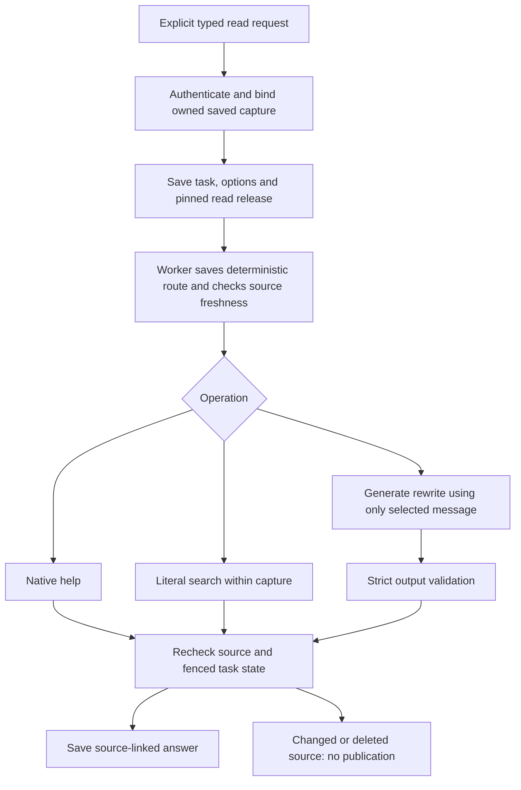

# B09a — Help, saved-source search and selected-message rewriting

Implemented on `codex/bounded-assistant-reads`, based on merged PR #20 (`ba040b6`).
This is the first bounded B09 slice. B09/T09 remain **in progress**: mailbox-wide
search/index coverage, entity/commitment extraction and corrections, natural-language
read planning and general source-grounded answers are not installed here.

The follow-up [scoped local mailbox-search endpoint](assistant-mail-search.md) now
provides cross-thread retrieval with explicit folder/date bounds. The capture-read
release described here retains its original behavior.

## What the frontend can use

Use the existing authenticated `POST /assistant/requests`, task polling/events and
artifact endpoint. Add `read_options` to request an explicit read action; omit
`draft_options`, set `intent_hint` to `other` or null, and keep `continuation: null`.
`instruction` carries the user's original request (and style instruction for rewriting).
The typed operation is authoritative for this explicit UI action. It cannot contain
multiple operations or an external action. The natural-language router retains its
previous contract; a predicted search label alone does not activate these handlers.

Capture the owned source first using the existing context-snapshot API. No uploaded
email bodies, arbitrary SQL, provider URLs or other-user IDs are accepted.

### Search an already captured thread

```json
{
  "schema_version": "1.0",
  "request_id": "search-unique-key",
  "instruction": "Find mentions of the invoice in this capture",
  "intent_hint": "other",
  "context_snapshot_id": "OWNED_CAPTURE_ID",
  "continuation": null,
  "read_options": {"operation": "search_mail", "query": "invoice"}
}
```

Search is a case-insensitive literal substring match over captured cleaned bodies.
It does not interpret Gmail query operators or run another mailbox search. A query
such as `.*`, `%` or SQL-looking text is literal. The fixed capture has at most 50
messages and 12,000 body characters. Each page has at most 10 matching messages,
with exact quotes of at most 1,000 characters around the match.

The task returns 202, then saves an `answer` artifact with:

- `coverage: partial`, original `context_snapshot_id`, capture omission/truncation notes;
- backend-owned `evidence` references, source IDs/versions and exact quote strings;
- `content.operation: search_mail`, `search_scope: saved_capture`, `query`;
- `matched_messages_in_capture`, `returned_messages`, `next_cursor`;
- exact excerpt `claims`, each citing its backend evidence reference;
- `no_match_scope: captured_text_only` if no match, otherwise null.

An empty result means **no match in this captured text**. It does not mean an email
or fact is absent from Gmail. Attachments, omitted messages and truncated tails are
outside the search. Thread order is the saved capture's order, never an inferred UI order.

For the next page, submit a **new request ID** with the same snapshot/query and the
returned `read_options.cursor`. Cursors bind capture identity, content hash, query
and page size. They are consistency tokens, not access grants; normal owner checks
always apply. Changing query/capture requires starting without a cursor. Stable
pagination applies to that immutable capture, not live mailbox contents.

### Rewrite one selected message

```json
{
  "schema_version": "1.0",
  "request_id": "rewrite-unique-key",
  "instruction": "Make the selected message shorter, keeping its meaning",
  "intent_hint": "other",
  "context_snapshot_id": "OWNED_CAPTURE_ID",
  "continuation": null,
  "read_options": {"operation": "transform_text", "message_id": "OWNED_CAPTURED_MESSAGE_ID"}
}
```

For a visual ordinal, use the saved schema-1.1 map to select the corresponding ID;
never use backend chronological position as visual position. Only that message's
body and the user's instruction reach generation. Other captured messages, sender
headers, provider IDs and cursor/query metadata are not included in the prompt.

The result is `kind: answer`, `coverage: selection_only`, with
`content.result_type: text_suggestion`, generated `text`, `source_ref_ids` and
`search_scope: selected_message`. Evidence references are constructed by the backend;
the model only returns strict `{"text":"..."}`. No draft envelope, Insert operation,
Send approval or calendar event is created. The frontend decides how to present
Copy/Insert, and must not present this result as an email that was sent.

This release uses the existing masked ModelClient (Bedrock when configured) directly
for rewriting, not an additional Bedrock Flow. Help and search use no model.
The versioned prompt instructs meaning/date/number preservation, but structural
validation is not proof of semantic fidelity. Live quality evaluation is still required.

### Help

Use `read_options: {"operation":"help"}`, null context and any nonblank help
instruction. It returns a native answer with no evidence and
`coverage: not_applicable`. The help text lists installed functionality and explicitly
names unavailable mailbox-wide search, tracked commitments, compound and write features.

`GET /assistant/workflows` adds `read_actions`: installed operations, release,
`requires_explicit_read_options: true`, `search_scope`, page size and
`external_actions: false`. Existing generation and UI capability shapes remain intact.
Task views expose saved `read_options` (null for historical/unrelated requests).

## Lifecycle and failure handling



Ownership checks apply to task acceptance, captured source hydration, worker source
checks and artifact reads. Search does not build a cross-user cache. Before execution
and before publication, the worker checks the owned thread version and that all
captured message IDs still exist in that thread. Final checking holds task then
shared source locks only for the database transaction; no lock spans model inference.
Fetching a read artifact repeats the source check and returns a stale-source error
if the source has since changed or been removed. Context/account deletion continues
to cascade dependent tasks/artifacts through existing foreign keys.

The existing lease, cancellation, idempotency and three-attempt generation retry
bounds apply. Transform inference is limited to 120 seconds, below the 180-second
lease. Duplicate request keys do not create another task; changed typed options
with the same key conflict. Cancellation/source changes during generation prevent
publication. These retries never call Gmail or Calendar writes.

| Code | Meaning / recovery |
|---|---|
| 404 `context_not_found` / `read_source_not_found` | Select an accessible captured source/message |
| 422 `read_context_required` | Capture the source before submitting this explicit action |
| 422 `read_context_not_required` | Help takes no email source |
| 422 `read_options_conflict` | Use Other/null intent and no draft options |
| 422 schema validation | Missing query/selection, extra fields, malformed cursor or unknown operation |
| 409 `read_cursor_changed` | Restart with the current capture and query |
| 409 `idempotency_conflict` | Same request key cannot change payload |
| 409 artifact read / failed task `read_source_changed` | Sync and recapture; the old result is stale |
| failed task `invalid_read_output` | Invalid generated schema or altered saved route; no answer published |
| failed/retrying `upstream_model_unavailable` | Bounded generation recovery; no provider body in errors |
| failed task `release_unavailable` | Deploy matching pinned read implementation/configuration |

## Release, migration and evaluation

Migration `a6417c29d805` follows `f2b6049c7a81` and adds nullable
`assistant_tasks.read_input`. Historical rows remain SQL NULL; absent/null
`read_options` is excluded from request hashes so existing request replay is unchanged.
Only explicit new read tasks wrap their original generation release in
`bounded-reads-task-1.0.0`. Its hash pins schemas, prompt, search policy, limits and
model configuration. Existing summary, UI, draft and clarification releases keep
their old behavior. A future incompatible read implementation needs another retained
version; never silently reinterpret an already queued task.

Stop old API/workers, migrate, then start matching code. Downgrade refuses while read
tasks exist; it does not delete their options/history. No deployment was performed.

[Replayable synthetic transform references](evaluation/bounded-read-transforms-v1.json)
are exercised by `backend/tests/test_bounded_reads.py`. They establish schema/source
boundaries and reference-output preservation, not observed Haiku quality. AI/frontend
must test real selection, faithfulness, PII placeholders, useful rewrites and corpus
coverage before enabling this experience for users.

Next B09 work: explicit mailbox/time/folder scope and index coverage, persistent
entity/commitment provenance/corrections, then validated natural-language read
planning. B10 can consume stable evidence only after those intended read operations
have actual contracts and acceptance evidence. No compound subset is executed here.
