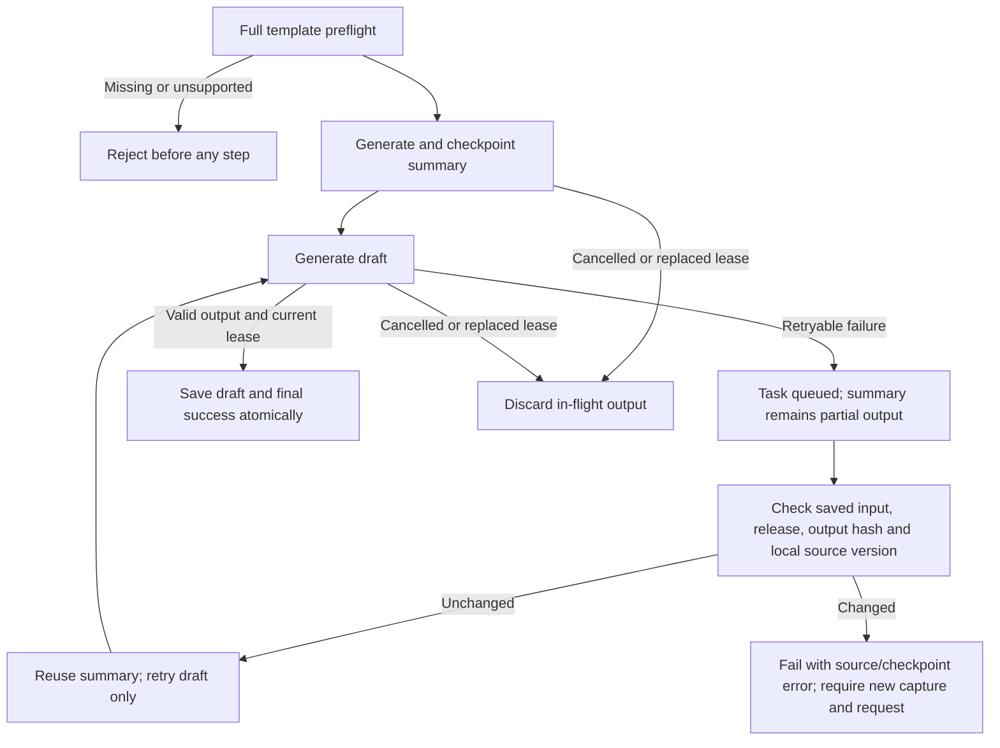

# Compound workflow runtime and testing handoff

Status: B10a summary templates are merged (PR #23). B10b adds separate
[lookup → draft templates](lookup-draft-workflows.md) in the current PR. Live-model
and frontend integration gates remain open. This section describes the unchanged
summary contract; the linked document describes lookup inputs and source mapping.

## What runs

Two explicit templates run through the durable worker:

- `summary_then_reply`: captured-thread summary, then an editable reply draft.
- `summary_then_compose`: captured-thread summary, then an editable new-email draft.

Both return a summary stream and a separate final draft stream. `summary_in_draft`
controls whether the draft receives the generated summary as an untrusted aid,
always alongside the original numbered excerpts. If false, the summary is only
for the user and is not included in the draft prompt. Steps run sequentially;
execution order and data dependency are reported separately.

The caller must present these as explicit user choices. The new endpoint accepts
a selected template and draft instructions, not a classifier output or a free-form
master plan. Do not automatically map a partial classifier match to a template:
“summarise + check availability + reply” must never be silently reduced to this pair.
The original natural-language `/assistant/requests` route is unchanged; its compound
proposals remain unavailable until the separately evaluated planner is installed.
BERT email metadata is still not command-planning authority.

## Request to result mapping

```mermaid
sequenceDiagram
    actor User
    participant UI as Frontend
    participant API as FastAPI
    participant DB as PostgreSQL
    participant W as Durable worker
    participant AI as Model adapter or pinned Bedrock Flow
    User->>UI: Select summary + draft template, source, recipients
    UI->>API: POST /assistant/compound-requests
    API->>API: Validate entire template and owned bindings
    API->>DB: Save immutable request, release and one job
    API-->>UI: 202 task + two planned steps
    W->>DB: Claim task lease
    W->>DB: Check local source version; start step 1
    W->>AI: Bounded summary prompt
    AI-->>W: Summary JSON
    W->>DB: Validate and save summary stream under lease fence
    W->>DB: Recheck source; start step 2
    W->>AI: Draft prompt + original sources + optional summary
    AI-->>W: Draft JSON
    W->>DB: Atomically save draft stream + final pointer + success
    UI->>API: Read task/events and both artifacts
    API-->>UI: Summary and editable draft; sending unavailable
```

All inference occurs outside database transactions. Each attempt has a 120-second
budget inside the existing 180-second task lease. The task has at most three
attempts; each executed step also has at most three attempts. There is no model
repair loop or external write step. Provider/Flow timeouts follow bounded generation
retry rules. Database failures use lease recovery.

## Frontend request example

First capture the owned source with `POST /assistant/context-snapshots`, using
schema `1.0` and an accessible `thread_id`. A `1.1` capture is also supported, but
this template summarises the captured thread excerpts, not a selected ordinal.
Then submit the following with the existing authenticated session:

```json
{
  "schema_version": "1.0",
  "request_id": "unique-client-request-id",
  "context_snapshot_id": "returned-owned-snapshot-uuid",
  "template": "summary_then_reply",
  "summary_in_draft": true,
  "draft_options": {
    "to": ["selected-recipient@example.test"],
    "cc": [],
    "bcc": [],
    "reply_message_id": "selected-message-id-from-that-capture"
  },
  "draft_instruction": "Write a concise update based on the thread. Do not send it."
}
```

For compose, use `summary_then_compose` and omit `reply_message_id`. Recipients
are explicit mailbox literals. A reply requires a usable source subject and a
current captured message; missing RFC Message-ID remains a draft-review blocker.
Neither template infers recipients, availability, calendar facts or attachments.

| Response / route | Frontend interpretation |
|---|---|
| `GET /assistant/workflows → compound_templates` | Installed templates and explicit-selection requirement; not live AWS readiness |
| `POST /assistant/compound-requests` → 202 | Accepted once; not generated/sent yet |
| `GET /assistant/tasks/{id}` → `compound.steps` | Both steps, ordinal, operation, state, attempt count, stream, artifact ID, dependency and execution order |
| `compound.completed_steps / total_steps` | Per-task progress: 0/2, 1/2, 2/2; not product completion |
| `artifact_id` on task | Final draft revision only after success; null during partial failure |
| `compound.steps[0].artifact_id` | Saved summary; may be displayed as partial output when drafting fails |
| `compound.steps[1].artifact_id` | Original generated draft; immutable even after user edits |
| `GET /assistant/artifacts/{id}` | Owned artifact, `stream_key`, stream-relative `is_latest`, `is_final_result` |
| `POST /assistant/tasks/{id}/draft-revisions` | Edit only final draft stream; moves task final pointer to revision 2+ |
| `GET /assistant/tasks/{id}/draft-revisions` | Draft history only, excludes summary even when revision numbers overlap |
| `POST /assistant/artifacts/{id}/review` | Exact draft review; authorization remains `none` |

Use `task.artifact_id` for the current editable draft after edits. Do not substitute
the original step output. Stream-relative `is_latest` can be true for both the
summary and the current draft; `is_final_result` identifies the current task result.
An old artifact is historical evidence, not proof current source/availability is valid.

Events use the existing ordered, replayable task event endpoint. New events:
`step.started`, `step.succeeded`, `step.failed`. `step.succeeded` publishes the
intermediate artifact ID; only final publication emits `artifact.ready` and
`task.finished` with success. Cancelled steps stop reporting `running`.

## Recovery and invariants



- Owner checks apply to request, capture, task, steps and artifacts. Composite FKs
  prevent linking a result from another task, including another task of the same user.
- Hashes include complete selected template, context, envelope, release and relevant
  dependency output. Same request ID with different input returns 409; exact replay
  returns the same task even if it has progressed.
- Source existence/version is rechecked before each inference and fenced publication.
  Source changes stop the request; this slice deliberately requires a new request
  rather than rewriting historical artifacts or silently recomputing against new mail.
- A failed draft does not mark the task complete. Three failures leave a failed task
  and its valid summary. No manual retry endpoint is added here; start a new request
  after fixing a terminal error. Cancelling queued/running tasks preserves completed
  output, discards late output and stops the job.
- New tasks pin the template/schema/prompt/dependency contract and the configured
  generation release. Flow invocations use the existing alias/version/definition
  verification and masked egress. Published configuration can still fail remotely;
  preparing a Flow is not proof that the model is invocable.
- Two generated outputs can each be revision 1. Old artifact UUIDs/revisions,
  envelopes, reviews and exact review hashes are retained.
- Incoming mail and derived summaries are data, never tool permission. Generated
  source numbers are checked against the bound excerpts. Semantic factual quality
  remains a live AI evaluation gate; schema validity alone does not prove it.

## Migration and release

Migration `c8291e4a6f03` follows PR #22's `b7180d3f9e62`. It adds
`assistant_steps`, task `compound_input` and `final_artifact_id`, and artifact
`stream_key`. Existing artifacts map to `result`; final pointers backfill to the
latest existing revision without rewriting payloads/UUIDs/review hashes.

Stop old API/workers before migration and start the matching new code afterwards,
using the pinned EC2 deployment script. An old worker cannot populate the new final
pointer. Downgrade refuses while compound tasks, steps or non-result streams exist;
do not delete user history just to roll back. A backup/forward fix is the normal
recovery option after compound use. With only historical single-stream data, the
migration supports a guarded downgrade preserving revisions.

No new AWS resources, Google scopes or model provider are required for these two
read/draft templates. They do require the existing Bedrock runtime configuration
and an owned captured source for a live run. This branch is not deployed by merging
or by running offline tests.

## Test and next-slice boundaries

See `backend/tests/test_compound_workflows.py` and `test_assistant_migration.py`.
They exercise both templates and summary-dependency modes, task/API/DB boundaries,
retry checkpoint reuse, tampered/stale evidence, cancellation and replaced leases,
owner isolation, draft revisions/reviews, unsupported graphs, duplicate acceptance,
pinned Flow adapter replay, migration backfill and guarded rollback.

B10 remains in progress. Next: evaluate a versioned user-command → complete plan
contract (including negation and all requested clauses), integrate bounded lookup
steps and typed plan clarification, and then enable Calendar combinations only
with B12/B13. This template is a concrete frontend/testing seam for that engine;
it is not the general planner or an arbitrary DAG API.

Versioned synthetic replay and live-review rubric:
`backend/tests/fixtures/compound_templates_v1.json`. The fixture contract hash must
match the installed template policy; changing it requires deliberate versioned
evaluation updates. No live quality pass is claimed by fixture replay.
