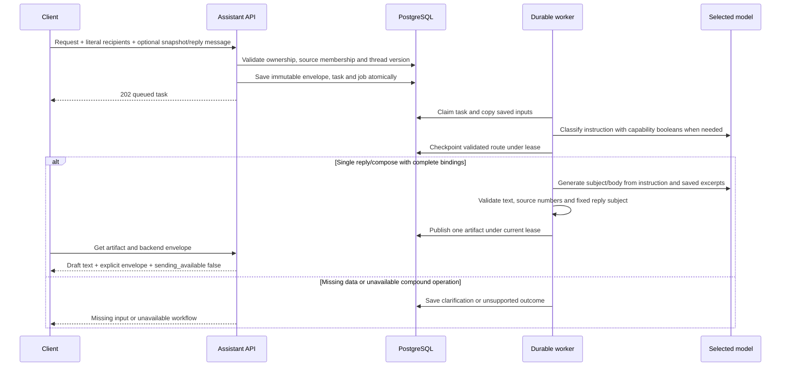

# Reply and compose draft artifacts — T10/T11/T13 initial slice

The durable worker now generates initial reply and compose drafts. It saves an
immutable artifact in Threadly with an explicit envelope for review. It does not
create a Gmail draft, insert text in an editor, send mail, upload attachments,
create approval records, or call Calendar. The legacy `/draft` and
`/draft/{id}/send` routes remain 501 stubs; use the assistant API below.

## End-to-end workflow



Exact “Draft a reply” and “Write an email” commands avoid a classification call.
Free-text requests use the configured small model. The full operation sequence
must be installed: scheduling-dependent replies and compound requests do not
silently run a plain draft. Missing recipients/targets become saved clarifications.

## Request examples

Compose without mailbox context:

```json
{
  "schema_version": "1.0",
  "request_id": "compose-001",
  "instruction": "Write an email",
  "intent_hint": "compose",
  "context_snapshot_id": null,
  "continuation": null,
  "draft_options": {
    "to": ["person@example.test"],
    "cc": [],
    "bcc": [],
    "reply_message_id": null
  }
}
```

Use a fuller instruction to specify purpose, style and facts, for example “Write
an email asking whether the report is ready; keep it brief.” With no supplied
facts, the model should expose missing input rather than invent project details.
A selected snapshot may supply background evidence for compose; it does not turn
the draft into a reply or set its thread reference.

Reply using a message ID returned in an owned snapshot:

```json
{
  "schema_version": "1.0",
  "request_id": "reply-001",
  "instruction": "Draft a reply",
  "intent_hint": "reply",
  "context_snapshot_id": "<saved snapshot ID>",
  "continuation": null,
  "draft_options": {
    "to": ["person@example.test"],
    "cc": ["teammate@example.test"],
    "bcc": [],
    "reply_message_id": "<message ID in that snapshot>"
  }
}
```

`draft_options` is optional; omitting it preserves old summary-request behavior
and idempotency hashes. It accepts To/Cc/Bcc arrays (defaults empty), and an
optional reply message ID. Addresses are conservative ASCII mailbox literals,
casefolded, at most 320 characters with a 64-character local part and bounded
DNS-style labels. Display names, groups, control characters and duplicate
recipients across fields are rejected. At most 20 recipients total are allowed.
This is syntax validation, not a contact lookup or delivery guarantee.

To must be nonempty before draft generation. Recipients are only the explicitly
submitted addresses. No From/Reply-To inference, automatic reply-all expansion,
name-to-address guessing or inferred Bcc exists. To make a reply-all draft, the
client/user must explicitly supply the complete reviewed To/Cc list. The sender
is the connected account's saved email; aliases are not implemented.

For replies, the API checks snapshot ownership, exact captured-message membership
and the current local thread version in one message/thread query. Changed or
missing source data returns 409 `reply_context_changed`; recapture before
submitting. Missing context is `reply_context_required`, an uncaptured target is
404 `reply_target_not_found`, and an unusable subject is 409
`reply_subject_unavailable`. A reply subject uses the saved message subject with
`Re:` added only if absent. The model must return that subject unchanged.

An original RFC Message-ID is copied when single, bounded and valid for this
binding. Otherwise the artifact records that reply headers need revalidation.
This is not a completed outgoing MIME/header builder. The future sender must
validate References/In-Reply-To, current source state, verified sender identity
and the exact approved envelope independently.

## Artifact and review contract

Task views expose nullable `draft_input`, the frozen backend-bound envelope:
`from_address`, `to`, `cc`, `bcc`, `reply_message_id`, and nullable `reply`. The
reply object includes Gmail thread/message IDs, local thread version, subject
and original RFC Message-ID. Ownership checks protect both task and artifact reads.

`GET /assistant/artifacts/{id}` returns the usual `artifact`, `revision` and
`provenance`, plus `draft_envelope` (null for non-drafts) and
`sending_available: false`. The envelope comes from the saved task, never from
model output. Reference `to-1` maps to `draft_envelope.to[0]`, likewise `cc-1` and
`bcc-1`. These are positional bindings within this immutable envelope, not global
contact IDs. Display the literal addresses with the text before reuse.

The artifact follows the shared draft contract: `kind=draft`, `content.mode=reply|new`,
subject, plain-text body, recipient references, nullable thread reference,
`unresolved_fields`, empty attachment references and backend-resolved fact references.
Context-free compose has a null snapshot ID; the shared schema permits null only
for drafts. Compose always has a null thread reference, even with background mail.
Evidence includes the user's request and any validated message source numbers.
Numbers must be unique and in range; the model cannot supply arbitrary source IDs.

The generation prompt contains instruction, mode, saved source text and reply
subject. Envelope addresses, Bcc and provider IDs are not added by the backend.
Addresses written by the user in their instruction or inside source bodies can
still occur in model input; existing cloud masking applies. The classifier receives
only capability booleans, not bodies or envelope addresses.

Extra model fields (including recipients or attachments), changed reply subjects,
unknown citations, malformed JSON, control characters and oversized output fail
with `invalid_draft_output`. Missing facts reported by the model stay visible;
common bracket/template placeholders add a review reminder. These checks do not
prove factual accuracy or detect every unsupported promise/attachment claim.
Human review and live-model evaluation remain necessary.

## Persistence, retries and compatibility

The envelope and reply metadata are copied at acceptance, in the same transaction
as the task/job. Recipients, target, source snapshot and instruction contribute
to request identity. Changing recipients with the same request ID returns 409
`idempotency_conflict`. Omitting/null `draft_options` preserves canonical hashes
from pre-draft clients so old request retries remain valid.

Generation uses immutable excerpts/envelope even if subsequent sync changes mail.
The artifact is an as-of draft; it is not a current-source check or approval.
Routing checkpoints, retry limits, cancellation and fenced publication are shared
with [contextual routing](assistant-routing.md). New tasks pin
`contextual-task-1.1.0`, including `draft-artifact-1.0.0` prompt/schema fingerprints.
The old `contextual-task-1.0.0` routing behavior is retained in `routing_v1.py`, and
original `summary-task-1.0.0` tasks also remain executable with matching settings.

Migration `c6e0419a72df` adds nullable `assistant_tasks.draft_input`. It preserves
existing mail, task/artifact rows and the legacy integer-ID `drafts` table. New
drafts use UUID assistant artifacts and do not share that old ID namespace. There
is no automatic conversion or link to legacy drafts and no sender consumes either
store in this release. A future sender migration must define that linkage explicitly.

Apply the migration with older API/workers stopped, then start matching code.
Downgrade refuses while draft-release tasks or bound draft inputs exist; it does
not silently lose recipient/target data. No live migration was performed here.

This slice supports initial immutable revision 1 only. Editing, AI rewrites,
in-place clarification continuation, approval invalidation and a sender are still
open T10/T11/T12 work. To change input now, submit a fresh request ID and review the
new artifact. Do not interpret task success as approval, sending or Gmail persistence.

## Evidence and next work

`tests/test_draft_workflows.py` uses synthetic model responses with real PostgreSQL
for lifecycle tests. It covers recipient validation, source ownership/versioning,
compose background context, reply subject integrity, invalid model fields/citations,
missing facts, request replay conflicts, retry/cancellation, old-release compatibility
and calendar-dependent rejection. Migration tests verify existing drafts/tasks
survive and incompatible downgrade fails. See the
[progress record](implementation-playbook/13-implementation-progress.md) for results.

Next: persistent draft editing/revisions and exact review state, then approved
sending and uncertain-outcome reconciliation. Calendar availability, attachment
uploads, authorized retrieval and writing-style retrieval remain separate services;
Bedrock Flow execution and live model-quality evaluations also remain outstanding.
