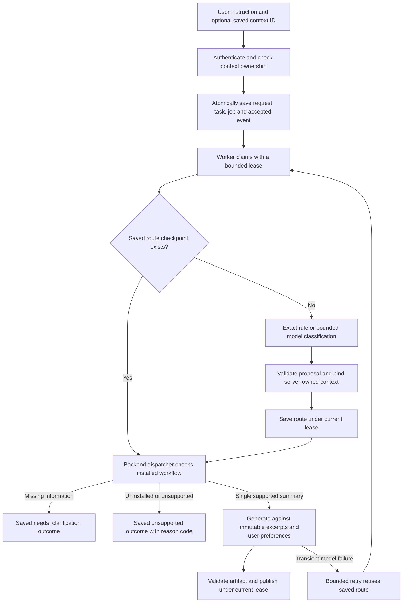

# Contextual task routing — T06 implementation slice

For the current coordinator, classifier boundary and planned multi-intent dependency
graph, see [master workflow](master-workflow.md).

**Historical routing slice:** the guide below describes `contextual-task-1.0.0`.
The current `contextual-task-1.1.0` release also supports initial reply/compose
drafts; see [draft inputs and current behavior](assistant-drafts.md).

This release connects the five-intent classifier to durable assistant requests.
It executes free-text summaries of a saved thread. Other workflows produce saved
clarification/unavailable outcomes rather than running a partial request. Bedrock
Flows and reply/compose/calendar execution remain separate work packages.

## Request-to-result lifecycle

The API performs no inference during request acceptance. Routing executes in the
same separate worker used for summary tasks. Browser closure does not lose work.
Duplicate request keys with identical canonical input return the same task; a
changed body returns 409. An explicitly supplied inaccessible context ID fails
with 404 before a task or model call is created. Null context is valid and lets
the worker save a source-selection clarification.

Routing receives the user's instruction, advisory intent hint and server-derived
capability booleans. It does not receive message bodies, recipient addresses,
Gmail IDs or snapshot IDs. The model must leave source/recipient IDs unbound.
After validation, the backend attaches the already authorized snapshot ID. A
saved thread resolves “this thread/email”; it does not bind a selected reply
message, another thread, an inbox position, a calendar, or an approval target.

The dispatcher runs only `intent=summarise`, `operations=[summarise_thread]`,
`output_kind=summary`, empty structured parameters and `requested_action=none`.
Summary style/focus remains in the original user instruction, passed separately
from untrusted email excerpts. All other operation combinations stop as a whole.
A ready route is a validated proposal; it is not a claim that its workflow is
installed, nor permission to invoke external tools.

## Frontend contract and examples

Use the existing `POST /assistant/requests` body. `context_snapshot_id` may now be
null. Send the full user instruction and `continuation: null`. It returns 202
immediately with a queued task. Do not run the preview endpoint first and then
execute its operations in the browser.

Task views now return the original `instruction`, a nullable `intent`, and a
nullable `route`. Intent is null until routing completes; old summary-release
tasks retain `intent=summarise`. A route contains `decision`, `source=rule|model`,
nullable model `provenance`, the base `router_version` and the contextual `release`.
Display model-produced rationale/clarification as escaped text, never instructions.

| Example | Saved outcome in this release |
|---|---|
| “Summarise this thread” + owned snapshot | Exact rule → summary worker → artifact |
| “Give me a short recap focused on decisions” + snapshot | Model-classified summary → original preferences + saved excerpts → artifact |
| “Summarise this thread” without context | `needs_clarification`, missing `source_context`; no inference needed |
| “What is in the 3rd thread?” | `needs_clarification`, missing `reference_mapping`; no positional guess |
| “Summarise the third message” | Ask to select the message; current thread order is not a saved UI mapping |
| “Reply with three meeting slots” | Preserve `suggest_slots → draft_reply`; ask for missing calendar/reply data; no summary or send |
| “Turn these requests into a work plan” + snapshot | `unsupported` with `workflow_not_available` |
| “Help” | `other` is recognized, but the answer workflow is not installed; `workflow_not_available` |
| Unsupported request, e.g. deleting mail | Model proposal must have no actions/operations; `unsupported_request` |

This is synthetic replay behavior, not a measured promise of model accuracy.
English ordinal guards recognize first–fifth and numeric ordinal references to
thread/message/email/option. They deliberately stop and ask for selection; they
do not supply the complete UI reference resolver or understand every language or
reference phrasing. The contextual prompt asks about unbound source scope; full
mailbox scope and reference resolution still need frontend bindings and evals.

Terminal task states are now `succeeded`, `failed`, `cancelled`,
`needs_clarification`, and `unsupported`. `GET /assistant/tasks?state=...` accepts
all of them. `queued` and `running` remain active. There is no artifact or implicit
approval associated with a clarification/unavailable outcome.

For `needs_clarification`, show `route.decision.clarification` and the missing
fields. The original task is stopped with its job closed. The user can select
context/restate the full request and submit a **new request ID**. In-place
continuation still returns 501 `continuation_not_available`; it never falls
through to global rerouting. Do not repeatedly retry the old request ID and
expect it to acquire different context or become a new task.

| Outcome/error code | Client behavior |
|---|---|
| `needs_clarification`, no error code | Show saved question; collect missing input for a new request |
| `unsupported` / `unsupported_request` | Explain unsupported request; no work executed |
| `unsupported` / `workflow_not_available` | Recognized proposal but workflow absent; do not run a supported subset |
| `unsupported` / `workflow_parameters_not_available` | Proposed parameters exceed the installed summary path |
| `failed` / `invalid_route_output` | Model JSON/schema/reference validation failed; no guessed fallback |
| `queued` or `failed` / `upstream_model_unavailable` | Worker retries within the saved three-attempt budget, then stops |
| `failed` / `release_unavailable` | Operator must align worker configuration; failed tasks need new requests |

## Checkpointing, cancellation and progress events

New tasks emit `task.accepted → task.stage_changed → task.routed`, followed by
`artifact.ready → task.finished` for success or just `task.finished` for a stopped
outcome. Versions/event sequences increase when the route is checkpointed; clients
must use returned versions, not hardcoded numbers. `task.routed` carries only
intent/status; fetch the owner-scoped task view for the full decision and question.

Routing model calls and summary generation run outside database transactions.
The entire routing/checkpoint/generation attempt has a 120-second timeout inside
a 180-second lease. Both route checkpoint and final publication recheck owner,
state, token and lease deadline under a task lock. A cancelled, deleted or replaced
worker cannot save its route or publish an artifact. Cancellation can suppress
publication without stopping an already-dispatched model request.

A successful checkpoint is reused after a generation failure or worker restart.
If classification failed before checkpointing, a retry can repeat classification.
At most three worker claims are allowed in total, not three per stage. Database
checkpoint errors escape to lease recovery; they are not misreported as model
quality failures. SSE remains finite replay with persistent cursors.

## Versioned assets, migration and deployment

New tasks pin release `contextual-task-1.0.0`, base router `intent-preview-1.1.0`,
contextual prompt/schema/reference-policy fingerprints, summary prompt policy,
and small/main model configuration. Actual routing provider/model provenance is
saved in the checkpoint; summary provenance stays on the artifact. The API and
worker must share configuration. No model SDK or cloud resource is added.

Migration `b7a219c40e6d` follows `3c6e9a1207bd`. It adds nullable `intent_hint` and
`route`, makes context optional while preserving the composite ownership FK, and
widens task state/check constraints for stopped outcomes. Existing tasks, snapshots,
artifacts and events are preserved. The worker recognizes the original
`summary-task-1.0.0` release and runs its original prompt without rerouting it.

Stop older API/workers, apply `python -m alembic upgrade head`, then run matching
new API/workers. Old workers cannot interpret context-free tasks/new states.
Downgrade fails before changing data if contextual tasks exist; it does not delete
or reinterpret them automatically. Retain the compatible schema or make an
explicit export/removal decision before rollback. The migration test verifies
this guard and preservation of queued tasks from the previous schema.

## Verification and next handoff

`tests/test_contextual_routing.py` supplies replayable synthetic cases for the
contextual routing policy and real PostgreSQL lifecycle/concurrency tests. The
existing intent suite covers strict proposal validation and all five categories;
legacy task and artifact tests remain in the full regression suite. See the
[progress record](implementation-playbook/13-implementation-progress.md) for actual
commands/results (176 passed, zero skipped for this slice). These tests do not measure live Bedrock classification accuracy,
summary instruction-following or semantic citation quality.

T06 remains partial: UI selection/ordinal maps, in-place continuation, capability
and granted-scope integration, multilingual reference resolution and live-model
evaluations remain. The next execution slice can add bounded reply/compose draft
artifacts using this dispatcher, followed by backend-owned exact approvals and
external writes. Never register a send/event operation as an unrestricted model tool.
