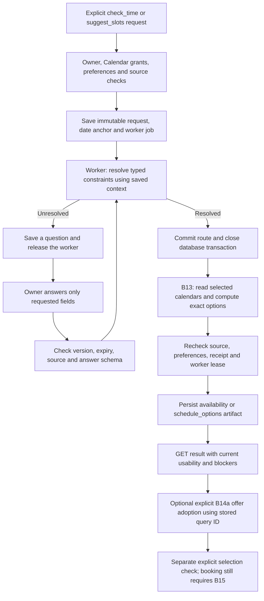

# Assistant scheduling reads — B14b1

Implemented release: `assistant-scheduling-1.0.0`. The assistant worker can now run
explicit `check_time` and `suggest_slots` tasks through B13, persist a clarification,
resume the original request, and publish an `availability` or `schedule_options`
artifact. This is a backend API contract, not a new natural-language router or UI.

**The caller supplies typed constraints.** No model extracts fields in this slice.
Do not pass BERT labels, unreviewed model fields or an arbitrary email body directly
to this API. Natural-language extraction/review, slot-grounded generated replies,
later-email selection proposals and complete Calendar compound graphs remain open.
The current `/assistant/requests` router behavior and Bedrock generation registry
are unchanged. B15 owns eventual exact event approval and execution.

## End-to-end flow



## Create a task

`POST /assistant/scheduling-requests` — JWT, 202, no-store; normal owned task view.
Calendar list and read grants plus saved preferences are required at acceptance,
before reads, after reads and when checking result usability.

```json
{
  "schema_version": "1.0",
  "request_id": "check-tomorrow-four-1",
  "operation": "check_time",
  "expected_preferences_version": 1,
  "constraints": {"date": "tomorrow", "at_time": "4"}
}
```

For three options use `operation: "suggest_slots"` and
`constraints: {"date": "tomorrow", "count": 3}`. Options may be fewer than requested;
an incomplete calendar response produces unknown availability, not free time.

| Field | Meaning and limits |
|---|---|
| `context_snapshot_id` | Optional existing owned, fresh, nonempty saved thread capture; use it to bind the request to email context |
| `anchor_message_id` | Optional exact captured message ID with an aware `sent_at`; requires context; anchors relative dates to that email |
| `date` | Optional `today`, `tomorrow` or valid ISO date; missing date becomes a question |
| `at_time` | Optional exact clock for `check_time`; missing clock becomes a question; forbidden for `suggest_slots` |
| `days` | 1–14 consecutive local dates; exact check requires one |
| `timezone` | Explicit IANA zone or the pinned saved preference |
| `duration_minutes` | 5–480 or pinned saved default |
| `count` | 1–3; exact checks always return at most one option |
| `meridiem`, `fold`, `time_context` | B13's AM/PM, repeated-clock occurrence and explicit local time window; require a clock |
| `participant_timezones` | Up to five distinct named display zones; does not read attendee calendars |

No instruction, arbitrary timestamp anchor, slot IDs, attendee availability,
recipients, approval, send or booking fields are accepted. Extra fields fail 422.
Use the returned task ID with ordinary owned task GET/history/cancellation and
finite event replay. Queued tasks already report `intent: "plan_schedule"`.

Request ID + identical normalized input replays the existing task, without another
job. Different input under that key returns 409. Accepted input saves preference
content/version, account version, source hash and anchor; changing preferences or
source requires a new task. The `scheduling` property exposes that saved input.

## Clarification and context

The Calendar engine resolves ambiguity before asking. Explicit `time_context`, or
saved working hours with exactly one fitting interpretation, can resolve “4” to
4 PM. When both interpretations fit, the question asks AM or PM. Busy/free data
never chooses the interpretation. DST gaps ask for another clock; repeated clocks
return two exact UTC choices and ask for `fold` 0 or 1. No generated question text
or provider body is copied into a question.

The task's `question` includes `question_id`, `expected_version`, `input_version`,
`fields`, `reason`, `choices`, `prompt`, `expires_at`, `anchor_at`, `anchor_source`
and `input_url`. For an AM/PM question, post to that returned URL:

```json
{
  "schema_version": "1.0",
  "request_id": "four-is-pm-1",
  "expected_version": 4,
  "question_id": "REPLACE_WITH_RETURNED_QUESTION_ID",
  "answer": {"meridiem": "PM"}
}
```

`POST /assistant/tasks/{task_id}/scheduling-inputs` returns 202. Replace the example
version with the actual returned value. This separate typed endpoint preserves the
historical `/inputs` schema/release; using `/inputs` for this task returns
`scheduling_input_required`. Answers may contain only requested `date`, `at_time`,
`meridiem` or `fold` fields. Partial answers are allowed. Invalid merged constraints
fail 422 atomically; they do not consume a round or enqueue a job.

Questions expire after 24 hours; at most five answer rounds are accepted. Cancelled,
expired, stale-version, changed-source or changed-preference questions cannot resume.
Same answer key/body replays, including after later completion; key/body mismatch
returns 409. Concurrent duplicates create one input and one resumed job.

The original goal, context and relative-date anchor survive answers and retries.
Changing a date/clock clears any old DST fold; changing a clock clears the previous
AM/PM correction. A delayed answer to “tomorrow” can yield an elapsed window rather
than quietly moving the request forward. For a message anchor, the source's date
is interpreted in the explicit or saved scheduling timezone; sender timezone is
not guessed. This temporal choice must be shown/reviewed by the future extraction UI.

## Artifacts and offer mapping

`GET /assistant/artifacts/{id}` includes normal artifact/provenance fields plus:

```json
{
  "scheduling_status": {
    "usable": true,
    "blockers": [],
    "has_available_options": true
  }
}
```

`artifact.kind` is `availability` for a clock check and `schedule_options` otherwise.
`content` contains the saved `slot_request_id`, exact B13 `slots` and stable IDs,
resolution/assumptions, reason, calculation/expiry times and date-anchor provenance.
Statuses are `available`, `unknown`, `elapsed` or
`no_available_option_under_preferences`. The latter does **not** mean a calendar
event is definitely blocking the time: working hours, buffers and notice can also
exclude it. Unknown results have no options and never assert availability.

`availability_scope` is `user_selected_calendars`; `attendee_availability` is
`unknown`; `reservation`, `booking_approved` and `event_created` are always false.
There is no generated draft, external action or automatic negotiation mutation.

Historical artifact content is immutable. GET computes current usability from
source, release, account/preferences, policy and receipt/evidence expiry. Expired,
revoked or changed-source history remains readable with `usable: false` and a
blocker. A usable unknown/empty result still has `has_available_options: false`.
Always inspect current status; saved “available” text alone is not current evidence.
Expiry remains B13's maximum five minutes and can be shorter.

For a fresh nonempty result tied to a captured thread:

1. Create/get a [B14a negotiation](meeting-negotiations.md) for that owned thread.
2. POST an offer with the artifact's `slot_request_id`, current negotiation version
   and current thread version. Adoption checks that the query is newer than the
   synced thread update. The artifact does not bypass any B14a check.
3. Explicitly choose an offered `slot_id` through B14a to recheck its exact time.

Task completion does not create an offer or select a slot automatically. All
artifact and offer IDs are backend-generated; the caller cannot replace the times.

## Races, retries and failure outcomes

Account → preferences → source → task is the scheduling lock order. Acceptance,
answering, preflight and publication use short transactions. No caller transaction
or row lock spans a Google read. Cancellation retains the normal task/lease fence;
an already-running read may finish and save its B13 receipt but cannot publish a
cancelled task's artifact. No external write needs compensating.

Each task/input version has one fixed B13 request key and a concrete date derived
from its saved anchor. If artifact publication rolls back or a worker lease expires
after a completed read, recovery reuses that receipt while fresh, with no extra
Google query. A leftover `processing` receipt or timeout produces
`calendar_check_incomplete`; an expired receipt produces `calendar_slots_expired`.
Start a new request explicitly. The worker never restarts an uncertain read under
the same key or silently replaces the date/options. Database failures remain owned
by the existing bounded lease recovery policy; other failures terminate this task.

New source, changed preferences/account or revoked grants block publication. An
unrelated even-owner-matching query is rejected by exact saved input/key comparison.
The saved database receipt supplies artifact facts, not a transport-returned object.
Error/events contain bounded codes, not private email or provider bodies.

## Rollout and next seam

Migration `f14026e9a035` follows `e14026e9a034`. It adds immutable nullable
`assistant_tasks.scheduling_input` and a contract check. Older tasks/hashes/releases
remain unchanged. Use matching API/worker code with the migration; rollback refuses
while scheduling tasks exist. No new SDK, environment variable, cloud resource,
model invocation or Google write grant is introduced.

Offline regression evidence is in [B14 checkpoint](backend-execution/checkpoints/B14.md).
Live Google/staging and frontend acceptance are still required; mock transport
success is not live provider verification. This slice has no model/prompt/Flow changes.

Next B14 work should add a pinned, evaluated scheduling extraction proposal plus
explicit constraint review before invoking this typed handler; then grounded reply
generation and later-email option proposals. Add those operations to complete
multi-intent graphs only once every handler and its validation are installed.
