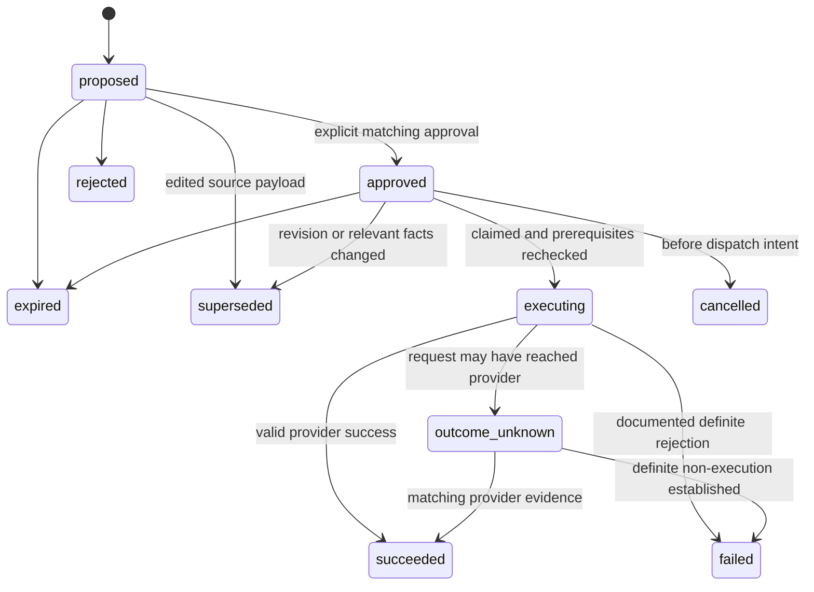

# Shared implementation decisions

All additions in this document are **proposed**. Implement contracts/migrations
in the assigned task and update current runtime docs together. Existing APIs win
where there is a conflict until an explicit migration supersedes them.

## D1 — Application boundaries and trigger dispatch

Keep the existing FastAPI service and durable worker design. Add modules for
capabilities, actions, calendar and flow invocation, not a microservice per intent.
Explicit UI buttons and natural-language requests enter the same authenticated
assistant API. Router output describes a supported plan, not permission to run any
arbitrary function. Capabilities combine implementation, feature flag, granted
scope, connection health and source prerequisites. “Classified” is distinct from
“executable.” The browser must not execute model-proposed tools directly.

```mermaid
flowchart LR
    UI[Explicit user request] --> API[Authenticate and deduplicate]
    EVENT[Opt-in inbound event] --> POLICY[Consent and event dedupe]
    POLICY --> API
    API --> TASK[(Saved task and context)]
    TASK --> ROUTE[Bounded intent proposal]
    ROUTE --> DISPATCH[Backend capability and sequence checks]
    DISPATCH --> READ[Native verified facts]
    DISPATCH --> AI[Converse or versioned Bedrock Flow]
    READ --> ART[(Artifact revisions)]
    AI --> VALIDATE[Strict output and evidence validation]
    VALIDATE --> ART
    ART --> REVIEW[User edits and review]
    REVIEW --> ACTION[Exact stored action preview]
    ACTION --> APPROVE[Explicit approval API]
    APPROVE --> EXEC[Separate durable action worker]
    EXEC --> GOOGLE[Google provider]
    GOOGLE --> RESULT[Confirmed or unknown outcome]
```

Backend read tools use fixed implementations and owner-bound input references.
Flow/Lambda callers receive short-lived grants for specific run/read operations;
Google tokens stay inside the backend. No generated URL, SQL, IAM principal,
recipient address or source ID becomes authoritative without validation.

## D2 — Proposed external-action data and API

Use the assistant UUID artifact as the source of an action; keep generation task
state `succeeded` while a separately tracked action is awaiting approval/execution.
Do not reuse DraftReview or legacy integer Draft.status as action authority.
Start with send_email; create_event uses the same lifecycle and its own validator.

Recommended tables (exact SQL names settled in B02):

| Proposed table | Required content and constraints |
|---|---|
| `assistant_actions` | UUID, owner, task/artifact identity, action type, schema/policy version, immutable canonical payload/hash, optimistic version, state, expiry, proposal idempotency key/hash, source/account/preference versions, result IDs and sanitized error |
| `action_approvals` | Owned action/version/hash, authenticated approver/time, expiry, approval request key/hash. Keep auditable approvals distinct from draft review |
| `action_jobs` | One executable/reconcile job per action, type/state/due time/lease token/deadline/attempt budget and unique dedupe identity |
| `action_attempts` | Owned action FK, attempt UUID/number, persisted provider identifiers, authorization version, dispatch-intent timestamp, lease/fence, outcome and reconciliation evidence |

Use composite ownership FKs and indexed state/due-time queries. Payload bytes must
not be editable in place; material changes create a new action. Proposal keys and
approval keys have independent owner/operation scopes. The executor loads stored
arguments only; the approval request contains no replacement body or recipients.

Recommended API additions, preserving existing error envelopes:

| Route | Required input | Semantics |
|---|---|---|
| `POST /assistant/artifacts/{id}/actions` | request_id, expected_revision, action_type | Construct exact preview from current owned artifact; no arbitrary outgoing fields |
| `GET /assistant/actions/{id}` | JWT | Owned preview, version/hash/expiry, state, outcome and allowed next operations |
| `POST /assistant/actions/{id}/approve` | request_id, expected_version, payload_hash | Recheck, persist approval and enqueue atomically; 202 accepted or replay result |
| `POST /assistant/actions/{id}/reject` | request_id, expected_version | Reject only before execution; idempotent replay |
| `POST /assistant/actions/{id}/cancel` | request_id, expected_version | Cancel pre-dispatch, otherwise record request and return honest executing/unknown state |

Keep the existing planning approval schema as a starting point; URL/body action
identity must agree if both are present. The request hash binds normalized input.
Same key/different payload is 409; matching retries return the saved outcome even
if its state advanced. Stale distinct approval is 409. Unknown/other-owner IDs are
404 without existence disclosure. Draft edits and proposal supersession share the
task lock; lock order is **task → action → job/attempt** throughout the service.
Do not acquire those locks in reverse order from worker, cancel or deletion code.

The global write flag is off by default. In B04, approval/enqueue is tested with a
fake executor only; public approval requires an installed executor/capability.
B05 must remain disabled for live dispatch until B06 reconciliation is implemented
and live test-account gates pass. Never leave a runnable sender ahead of recovery.

## D3 — Action state and dispatch cutoff

At most one dispatch attempt may be active per action. Persist dispatch intent
before network I/O. A crash after that commit is uncertain even if the HTTP call
might not have started. The executor must never infer “not sent” from an expired
lease, missing response, immediate empty search or process restart. A stale worker
cannot dispatch again; late responses must be stored/handled as evidence or left
for reconciliation without permitting a second write.

There is an unavoidable boundary between last validation and the Google request.
Define the user-visible cutoff: edits/cancellation before committed dispatch intent
can stop/supersede the action. After that point, an action may already be executing;
a new edit does not recall it. Return/display that fact. Do not claim an edit can
revoke a message already accepted by Gmail. No DB transaction spans Google calls.

Preflight sequence: load stable refs → release DB transaction → refresh credentials
and check external prerequisites → reacquire ordered locks → compare current
revision/account/capability/source versions and expiry → record dispatch intent →
commit → call provider → short result transaction. If facts changed while network
preflight ran, supersede and require a new preview/approval. Execution checks flags
again; killing new dispatches does not erase unresolved attempts.

Unknown outcome is a durable, visible state with an operational owner. Keep email
and event outcomes independent even when a user approved both in one UI session.
Retries for confirmed pre-dispatch/transient read failures may be bounded; classify
HTTP/provider failures using documented behavior and tests, never a blanket retry.

## D4 — Exact email payload and reconciliation

Build outgoing MIME with Python's email library, explicit policy and text encoding.
Do not interpolate untrusted strings into headers. Bind validated sender identity,
To/Cc/Bcc, subject/body, MIME bytes/hash, RFC Message-ID, Date, reply headers,
Gmail thread ID and source versions into an immutable proposed payload. Generate
Date/Message-ID before approval; if regeneration becomes necessary, create a new
proposal. Bcc is part of approval even though other recipients must not see it;
verify provider behavior using controlled accounts before enabling sends.

Use the artifact's revision envelope. Initial support is one connected sender,
plain text, no attachments. Unknown aliases and ambiguous recipients require
selection, not guessing. Validate original reply headers and References chain
from authorized source metadata. Gmail requires threadId and compliant reply
headers with matching Subject for threading; test current Re: behavior rather
than assuming a subject prefix is enough. [Google threading rules](https://developers.google.com/workspace/gmail/api/guides/threads).

Gmail sends a base64url-encoded MIME message using its message API. The persistent
payload builder and transport should be separate so tests can prove which bytes
were approved and submitted. [Google sending guide](https://developers.google.com/workspace/gmail/api/guides/sending).

Reconcile a possibly accepted send using the pre-generated Message-ID and scoped
Sent-message candidates, then inspect message headers/content/recipient metadata
as available. Search identifiers narrow candidates; they do not themselves prove
an identical action executed. Multiple candidates, mismatched sender/body/thread,
provider transformations that defeat comparison, incomplete Bcc evidence, lost
scope or incomplete search coverage remain ambiguous. Document canonical semantic
comparison versus provider-normalized MIME; do not require raw bytes to round-trip
unchanged. No automatic resend from inconclusive evidence. [Gmail search guide](https://developers.google.com/workspace/gmail/api/guides/filtering).

Retain identifiers/evidence for unknown attempts while respecting deletion policy.
Direct cascades that erase all in-flight action records are unsafe; coordinate
account disconnect/deletion, stop new claims and retain only legally/product-approved
minimal reconciliation metadata. Resolve this policy before public writes, not
by silently preserving full deleted mail indefinitely.

## D5 — Context, continuation and compound artifacts

UI ordering is a client assertion about what was visible, not proof of source
ownership. Persist explicit surface kind (inbox/thread/compose), ordered reference
IDs, selection, capture time and map version after validating each mailbox ID.
Hydrate text from backend sources, not untrusted DOM text. Imported text is a separate
user-input source with no authority to set provider targets. Bound limits apply.
“The third message” uses that captured map; navigation/reorder needs a fresh map or
clarification. Never substitute a different thread to satisfy an ordinal.

Proposed continuation: `POST /assistant/tasks/{id}/inputs` with request ID, expected
task version, question ID and typed answer/selected refs. Add append-only input and
question records. Keep original instruction/hash immutable and preserve the question's
meaning. Under task lock consume the outstanding question once, validate owned
references, invalidate dependent checkpoints and enqueue exactly once. A user answer
may resolve fields but cannot approve a send implicitly. Define recovery after a
new source snapshot without altering old evidence. Reject unknown/stale questions.

Compound execution requires an installed complete ordered plan, typed step inputs,
owned step artifact refs, per-step attempts and saved results. Do not just loop over
operations calling the existing one-result `finish`. In B10 add artifact streams
and an explicit task result pointer: preserve existing artifact UUIDs/envelopes,
map each old task to its original stream, and enforce uniqueness within stream +
revision. New intermediate step outputs get separate streams. User draft edits
stay in the draft stream. Latest-task reads use the explicit final stream/result;
intermediate lookup/slots cannot become a draft's newest revision by accident.
Pin per-step prompt/tool/release versions and provide migration/downgrade guards.

## D6 — Time, availability and event proposals

Anchor relative language to the explicit request time or selected message time,
and record which anchor was used. Store UTC instants plus the IANA zone and displayed
local label. Do not use worker-run time after a retry. “Tomorrow at 4” requires a
known timezone and explicit AM/PM or a recorded user-confirmed preference; it is
not automatically 16:00. Unknown duration needs clarification or an explicitly
configured, displayed default. Reject nonexistent local times (DST gap); clarify
ambiguous fold times unless offset is explicit. Use real timezone data.

The calendar owner selects calendars/preferences. Model-proposed calendar IDs are
never trusted. Fetch all selected calendars' freebusy; errors or omitted calendar
entries are unknown, not empty busy lists. Busy intervals are half-open [start,end),
so adjacent intervals do not overlap. Normalize/merge, clip to request window,
expand buffers, intersect working periods and subtract busy time deterministically.
[Freebusy response/error semantics](https://developers.google.com/workspace/calendar/api/v3/reference/freebusy/query).

Proposed limits: max 3 offered slots, bounded date horizon, fixed configurable slot
step, duration 5–480 minutes, explicit notice/buffers and recorded preference version.
B12/B13 must choose/configure horizon/step limits and test them; do not silently copy
those policy defaults into model instructions only. Expose fewer/no slots honestly.
Calendar freebusy alone does not prove invitee attendance or permission to book.

Persist slot IDs, start/end/zone, source calendar set, checked_at, availability hash,
preference version and expiry. Scheduling language may reference only stored slots;
model cannot invent times. Offers are not reservations. Selection after expiry or
new email/preferences requires revalidation. A meeting negotiation groups related
tasks/offer revisions and the chosen option; it is distinct from an individual run.

Event payload freezes target calendar, stable provider-compatible event ID,
start/end/zone, attendees, title/description/location, notification policy and
selected-slot evidence. Independently approve create_event, recheck availability
before dispatch and never silently substitute another slot. Conflict checking and
Google event creation are not atomic across other calendar writers; no guarantee
of race-free exclusive booking without a supported reservation mechanism.

Use a stable event ID and retrieve it to reconcile uncertain insertion; compare
owned action marker and event fields, not just ID existence. Google constrains event
IDs and notes collision limitations. Different payload at the same ID is a conflict,
not success. [Calendar insertion contract](https://developers.google.com/workspace/calendar/api/v3/reference/events/insert).

## D7 — Bedrock visual Flows and release compatibility

Registry entries map **operation → native handler or published flow alias/version**,
input/output schemas, model/prompt/tool/validator versions, budgets and allowed
read capabilities. New tasks pin this manifest; retries must not adopt a changed
console alias. Release-specific aliases are still mutable resources: verify their
version mapping or fail instead of silently adopting an alias update. Preserve the existing summary/contextual 1.0/1.1 queued releases.
Do not store fake AWS IDs or promote a mutable working draft as production release.

First export a bounded summary flow with Input → context/read bridge → prompt →
validation → Output. Then adapt reply, compose, other, plan and scheduling with
shared validators; authoritative availability and approvals remain backend-owned.
InvokeFlow has output, completion, input-required, trace and error events. Treat a
success HTTP response without the expected valid terminal output as incomplete,
not success. Bound stream time/size, reject duplicate/conflicting outputs and redact
trace content. Handle interruption through durable application state.
[InvokeFlow reference](https://docs.aws.amazon.com/bedrock/latest/APIReference/API_agent-runtime_InvokeFlow.html).

AWS currently documents multi-turn flows as preview. Do not place durable human
approval inside a long-running flow; save the question/proposal in Threadly and
invoke another bounded stage when the user responds.
[Multi-turn flow documentation](https://docs.aws.amazon.com/bedrock/latest/userguide/flows-multi-turn-invocation.html).

Read bridge grants bind owner, run, context, operation allowlist, expiry and nonce.
Service authentication alone is insufficient to select any user's mailbox. Deny
cross-run/context/owner reuse and arbitrary network hosts. Credentials never reach
prompts or Lambda event content. Callback/Lambda/Flow outputs are untrusted and
validated by backend before publication. Cloud assets, role permissions and smoke
tests are reproducible source/configuration, not just screenshots of the console.

## D8 — Live gates, rollout and optional features

Offline fakes prove control flow, not provider behavior or language understanding.
Keep local, CI, live test-account, live model-evaluation and deployed-pilot results
separate. The release owner supplies authorized environment/model/region/account
choices; no task here invents credentials, a spend ceiling or approval to deploy.

A future proactive event can create a suggestion only after opt-in, dedupe and
rate/budget checks. Gmail notifications contain change information used to fetch
history, not trusted instructions to send. Renew watches and recover missed history
with a bounded sync process. [Gmail push contract](https://developers.google.com/workspace/gmail/api/guides/push).
Style data is consented and isolated; voice goes through the same typed contracts;
attachments require content/type/ownership checks and exact action binding;
reschedule/cancel/recurrence require new previews and notification approval.
No optional feature can bypass the initial action/owner/recovery boundary.
