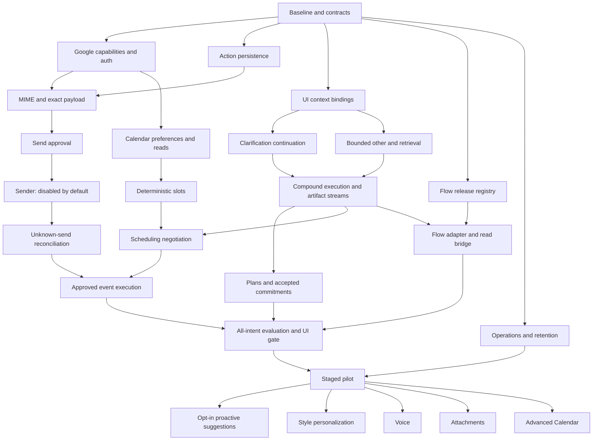

# Threadly backend execution handoff

**14 September 2026 · implementation plan, not implemented functionality.**
Prepared for Codex 5.3 Spark and human reviewers. These instructions aim for the
same engineering acceptance standard across coding agents; they do not promise
identical model capability or code quality. Quality comes from bounded scope,
explicit contracts, failure tests, review and verified integration.

## Start here

First merge the documentation handoff PR into the integration branch so the new
feature branch retains these instructions. If reviewing before merge, keep the
handoff branch checked out; do not switch to a base that drops these files.

1. Give the next coding agent [START-HERE.md](START-HERE.md). It contains a complete
   launch prompt and the rule for choosing the next eligible task.
2. Read [BASELINE.md](BASELINE.md) before changing code; it maps actual files and
   highlights existing traps. Do not rebuild the merged work.
3. Use [INDEX.md](INDEX.md) to choose a task; then read only that task card and its
   linked design sections. Machine-readable scope lives in [tasks.json](tasks.json).
4. Apply [DESIGN.md](DESIGN.md) for shared state/API decisions and
   [QUALITY-GATES.md](QUALITY-GATES.md) for tests, review and evidence.
5. Save an implementation checkpoint using [CHECKPOINT.md](CHECKPOINT.md), and
   update the original [backlog](../implementation-playbook/backlog.json) only to
   the extent supported by evidence.

The existing playbook remains the product specification. This pack divides its
remaining work into smaller implementation slices with explicit prerequisites.
`Bxx` IDs refer to this execution pack; `Txx` IDs refer to the original work packages.
A completed B task does not automatically complete every associated T package.

Only documentation and a documentation validator are added by this handoff.
None of the proposed routes, tables, workers or cloud resources below are live.
Read the current [API contract](../api-contract.md) for implemented routes.

## Verified baseline

PR #9 is merged into `codex/assistant-intent-routing` at commit
`4474322a93b63016aeaf34121121c528d75930c9`. Its feature commit was `c78a340`.
That baseline includes draft revisions/review and migration `e9b7120c4a63`.
Last implementation evidence: **233 tests passed, zero skipped**, Python 3.12.14 /
PostgreSQL 16; PR #9 CI passed. This is historical evidence, not a fresh test run
for this documentation-only change. Live AWS/Google and production deployment
were not verified. Re-fetch and inspect merge status when beginning implementation.

The assistant integration branch is currently **not `main`**. Do not assume a
feature is missing because you opened the wrong branch. Do not retarget or merge
branches automatically. Confirm the base and preserve the user's uncommitted work.

## Product completion target

| User asks | Required backend path | Completion evidence |
|---|---|---|
| “Summarise this” | Authorized snapshot → summary → evidence | Existing path; live quality and UI checks still required |
| “What's in the third message?” | Saved visible-order map → exact message binding → answer | B07 + B09; scrolling/reordering cannot change the reference |
| “Reply to this” | Bound target/recipients → draft → edit/review → action → explicit Send approval | Existing draft plus B01–B06; no inferred Bcc |
| “Write an email” | Purpose/recipient clarification → compose → same email action lifecycle | Existing compose plus B08 and B01–B06 |
| “Plan what I need to do” | Evidence lookup → plan → dependency validation → explicit acceptance | B09–B11; inferred commitments stay unconfirmed |
| “Are you free at 4 tomorrow?” | Anchored date/time/zone → clarification if needed → live freebusy → verified answer/draft | B12–B14; no assumption of 4 pm or sender availability |
| “Give me three slots” | Preferences + freebusy → deterministic slots → proposal → optional reviewed reply | B12–B14; fewer than three is an honest result |
| “Book this one” | Exact selected slot → event action → explicit approval → final recheck → provider result | B15; a send approval never authorizes an invite |
| Incoming email suggests a meeting | Opt-in event → deduped suggestion task → user decision | B21 after pilot; no ambient email instruction authorizes a write |

Copy, editor Insert, Threadly save, Gmail draft persistence, email Send and Calendar
invite are distinct operations. This plan initially sends approved Threadly drafts
through Gmail; Gmail draft persistence and editor insertion need their own explicit
UI/integration semantics if the product includes them. Do not label one as another.

## Dependency map

This graph shows major links; `tasks.json` contains the exact prerequisites.
Start **B00**, then **B01**. B02 can be prepared independently once baseline
contracts are recorded, but a single coding agent should follow the index order.
No autonomous parallel agents are required by this pack. If the team assigns
parallel work, use separate checkouts and coordinate migrations/shared schemas.

## Milestones, not calendar promises

| Milestone | Exit condition |
|---|---|
| M0 baseline | B00; working environment and compatibility decisions recorded |
| M1 safe email lifecycle | B01–B06 with UI review/send integration and live test-account evidence before enabling writes |
| M2 all five read/proposal intents | B07–B14 plus existing summary/reply/compose; no placeholder handlers reported as complete |
| M3 visible Bedrock pipelines | B16–B17; exported versions and same fixtures through actual AWS role |
| M4 complete initial pilot | B15, B18–B20; all-intent UI tests, approved writes and recovery gates |
| M5 follow-on capability | B21–B25 independently evaluated and enabled |

No estimate in “agentic hours” is assumed. Credentials, review, integration,
provider response behavior and test-account access remain real dependencies.
Within a short implementation window, make the M2/M3 demo read-only if needed,
and call it a read-only milestone. Do not claim the full release is complete.

## Ownership

Backend owns trusted identity, state, schemas, tool services, deterministic facts,
action approvals, execution and recovery. AI owns extraction/generation prompts,
versioned flow graphs, labelled cases and model-quality evidence. Frontend owns
selection maps, editor state, explicit approval controls and truthful outcomes.
One release owner records concrete resource IDs, role/scopes, flags and gate results.

Each task card lists the relevant reviewer and external dependency. A coding agent
can prepare fake adapters, contracts and fixtures without credentials. It must
report live integration as pending instead of replacing a real dependency with
hardcoded success or asking repeatedly for routine implementation approval.

## Sources and maintenance

See [SOURCES.md](SOURCES.md) for official documentation checked for this handoff.
The design choices are Threadly recommendations unless explicitly attributed.
Recheck provider APIs and account/region capabilities before implementation.

Run `python3 docs/backend-execution/tools/validate_handoff.py` after editing this
pack. The validator checks references, dependency ordering, T-package coverage,
required card fields and generated-card consistency. It does not execute the
backend, render diagrams or prove model quality. Runtime evidence belongs in the
existing progress log and the task's completed checkpoint.
