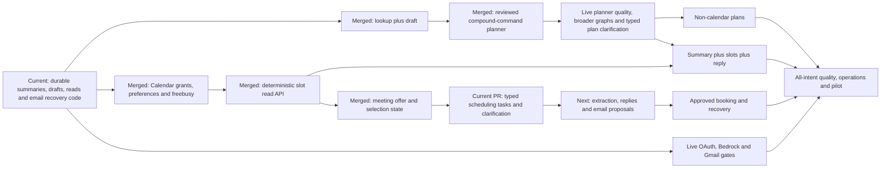

# Whole backend progress — 17 September 2026

Audit baseline: PR #35 merged at `4782ab04b8f47ffbb47354ca4cb29a2635dbb5bc`
on `codex/assistant-intent-routing`. The current PR adds B14b2a reviewed natural-language scheduling proposals into the existing typed tasks.
This report separates implemented code, accepted package scope, and deployed/live
behavior. Frontend integration remains deferred at the user's request.

## Overall progress bar

Initial-release task board, **21 packages (B00–B20)**:

```text
[████▒▒▒▒▒▒▒▒▒▒▒░░░░░░]
 █ Verified package: 4     ▒ Partial / in review: 11    ░ Planned: 6
```

Source: `docs/backend-execution/tasks.json`, checkpoints and runtime source audit.
Four packages (19% of the package count) are formally verified; fifteen (71%) have
implementation evidence. **Neither figure is a percentage of engineering effort or
production readiness.** Packages vary greatly in size. In particular B06 has merged
recovery code but stays open for the live email gate; B10 has working templates but
not a general automatic planner. B00 still needs its shared-contract settlement recorded.
B21–B25 are five additional planned capability extensions, outside that initial-release
bar. PR counts, prepared AWS Flows and passing tests do not close these packages.

## Total still open

**17 of 21 initial-release packages remain open**: eleven contain implementation but
need remaining functionality or acceptance; six are still planned. Including the
five later extensions, **22 of the full 26 packages remain open**. These are package
counts, not 17 equally sized new implementations or a time estimate.

| Remaining workstream | Concrete work left |
|---|---|
| Scheduling conversation | Live extraction evaluation, slot-grounded drafts and explicit later-email choice proposals; bounded extraction/review and typed tasks/continuation/artifacts now implemented |
| Booking | B15 exact event preview/approval, fresh dispatch checks, stable provider IDs and uncertain-result reconciliation |
| Planning and multi-intent | B11 non-calendar plans; broader B10 ordered graphs/clarification, full-command coverage, Calendar combinations and live classifier/planner evaluation |
| Retrieval and AI execution | Broader B09 retrieval/extraction; B16 operation coverage and B17 authorized Flow read bridge/full execution integration |
| Live integration acceptance | B01/B06 OAuth and email actions; B07/B08 client context/continuation later; B12/B13 Calendar comparison and policy acceptance; live Bedrock/model holdouts |
| Release readiness | B00 cross-team contract settlement; B18 whole-intent quality matrix, B19 retention/reliability/runbooks, B20 controlled pilot; deploy current code and record actual staging outcomes |

The six planned initial packages are **B00, B11, B15, B18, B19 and B20**. B14b1
reduces missing code but does not close B14. Frontend integration remains deferred.
API-level testing can run now; complete conversational scheduling and booking are
not yet ready for end-to-end acceptance. Later B21–B25 features are additional scope.

## What works in code now

| Area | Implemented behavior | Evidence / remaining verification |
|---|---|---|
| Hosting and persistence | EC2 bootstrap/deploy tooling, PostgreSQL migrations, API, durable worker, disabled action-worker service | Host deployment was demonstrated; latest merged code is not confirmed deployed |
| Identity and Google capabilities | OAuth state/PKCE, actual granted scope storage, owner-bound token refresh/reconnect | B01 tests/checkpoint; controlled Google login and revocation smoke remains |
| Task lifecycle | Idempotent acceptance, owned captures, durable jobs, leases, retries, cancellation and replayable events | Real PostgreSQL lifecycle/concurrency tests |
| Summaries | Concise structured summaries, explicit evidence validation, versioned grounding policy | Offline fixtures and prior user console examples; current runtime holdout still needed |
| Reply / compose | Bound recipients/reply target, editable revisioned drafts, exact review hashes | Draft and revision suites; text generation is not mail sending |
| Context and follow-up | Saved UI ordering/reference mapping, durable typed answers, contextual time clarification | B07/B08 local cases; actual frontend/live interaction remains |
| Bounded Other / retrieval | Captured-text lookup, selected rewrite, explicit local-mailbox search with scope/cursors | B09 tests; general semantic lookup/extraction not complete |
| Compound tasks | Summary → reply/compose with separate streams, reusable checkpoint and final pointer | B10a merged/deployed in PR #23; live provider setup not verified |
| Lookup → draft | New explicit captured-text lookup → reply/compose; native checkpoint, scoped generation, no/too-many-match stop | B10b merged PR #30; captured-text-only scope |
| Reviewed command planning | Persisted all-word clause interpretation, prohibitions, dependency compilation and exact review → existing compound task | B10c merged PR #31; four pairs only, live semantic gate and automatic routing pending |
| Calendar read foundations | Read-only incremental consent, owned versioned preferences, current ACL selection and saved busy/unknown evidence | B12 merged PR #32; live OAuth/Calendar smoke remains |
| Deterministic Calendar slots | Typed anchored dates, contextual AM/PM, DST-aware working hours, buffered busy checks and stable expiring options | B13 merged PR #33; live comparison/policy acceptance remains |
| Meeting offers and choices | Immutable thread-bound offer revisions, explicit slot selection with fresh exact-time check, source/race/expiry fences | B14a merged PR #34; typed tasks and reviewed command extraction added; drafts and email-response mapping remain |
| Assistant scheduling | Explicit durable check_time/suggest_slots tasks, saved request/message anchors, typed questions, availability/options artifacts and current usability | PR #35 merged; B14b2a adds reviewed command extraction; generated replies and live validation remain |
| Bedrock execution | Native/Flow registry, pinned manifests, bounded InvokeFlow adapter, versioned prompts | B16/B17 code and synthetic SDK replay; cloud end-to-end gate still open |
| Email actions | Immutable action/approval records, exact MIME preview, explicit decisions, dedicated sender and read-only uncertain-outcome reconciliation | B02–B05 verified local scope, B06 merged recovery; public approval/sending remains gated |

## Complete package ledger

| Package | Recorded status | Remaining to close the package |
|---|---|---|
| B00 shared contracts | Planned | Record current baseline and agreed cross-team contracts; do not treat old baseline prose as current |
| B01 auth/capabilities | In review | Controlled OAuth/scope/revocation and callback integration evidence |
| B02 action storage | Verified | Retain live gate at the email-chain level |
| B03 MIME / preview | Verified | Retain live gate at the email-chain level |
| B04 approval decisions | Verified | Public enablement intentionally waits for email gate |
| B05 Gmail executor | Verified, disabled | Controlled end-to-end send evidence before enabling |
| B06 Gmail reconciliation | In review, merged | Live sent-message lookup/MIME semantics and full email gate |
| B07 UI references | In review | Actual client capture/ordering integration acceptance |
| B08 clarification | In review | Staging/client follow-up paths; broader plan clarification not installed |
| B09 bounded Other | In progress | Broader retrieval/extraction and natural-language query coordination |
| B10 multi-step workflows | In progress | Live planner semantic validation, automatic routing, broader lookup coordination, in-place clarification, Calendar combinations once available |
| B11 non-calendar planning | Planned | Evidence-backed plan revisions, owners/deadlines and explicit commitment selection |
| B12 Calendar read | In review | Live consent/list/freebusy/ACL smoke; read foundations implemented, slots belong to B13 |
| B13 time/slots | In review | Local engine/API/migration implemented; live Google comparison and policy acceptance pending |
| B14 meeting negotiation | In progress | B14a offers/selection and B14b1 typed tasks/clarification/artifacts implemented; B14b2a reviewed extraction added; live extraction evaluation, generated replies and later-email proposals remain |
| B15 Calendar writes | Planned | Exact event approval, execution, idempotency and uncertain-outcome reconciliation |
| B16 operation registry | In progress | Extend only when handlers exist; complete target operation/release coverage |
| B17 Flow read bridge | In progress | Current generation Flow adapter exists; authorized bounded read callbacks/full target integration remain |
| B18 all-intent quality gate | Planned | Shared all-intent model/API/client scenario matrix, adversarial and recovery evidence |
| B19 operations | Planned | Remaining retention, reliability/operational controls and runbooks backed by tests |
| B20 pilot | Planned | Controlled pilot, recorded defects/acceptance and original package closure |

Later capabilities: **B21** proactive suggestions/triggers; **B22** consented writing
style; **B23** voice; **B24** attachments; **B25** Calendar changes/recurrence/resources.
These are not implied by the current email generation/sending infrastructure.

The separate BERT handoff also needs review/integration: verify labels, domain,
activation and thresholds; confirm whether it classifies email content or user
commands. Model files in Git LFS are not proof a runtime adapter is installed.
Multi-label scores may advise routing; they cannot choose tools, source IDs,
recipients, Flow ARNs, execution order or permissions.

## What to implement next

1. Evaluate the reviewed B10c command planner against a live command-domain holdout.
   Extend typed corrected-plan continuation and broader retrieval/graphs; preserve
   every requested output/negation before enabling automatic routing. The 14-case
   synthetic corpus is a starting contract, not live quality acceptance.
2. Review B14b2a command extraction and run labelled live extraction evaluation; implement
   grounded generated replies and later-email proposals. Run controlled
   B12/B13 Google consent/list/freebusy and slot-comparison smoke alongside this work.
   B11 non-calendar plans and explicit commitment acceptance remain open.
3. Add B15 exact approved event creation/recovery after B14b. Only then
   enable summary + slots + reply as a supported complete graph.
4. Complete operation/Flow coverage, model quality, staging failure/recovery tests,
   retention/operations and the pilot gates. Frontend integration rejoins when ready.

Live OAuth, Bedrock and Gmail verification can proceed alongside implementation
without waiting for every Calendar feature. Backend API-level tests can start now;
the complete five-intent release cannot pass acceptance while natural-language scheduling integration
remains incomplete and broader planner/quality gates are incomplete.



## Deployment and testing truth

Last confirmed host log in this task: PR #23 commit
`954b4926d5e0c4928ebecde06f2f67e918d5be06`, migration `c8291e4a6f03`, healthy API
and dependencies, but model/OAuth configuration pending in that log. Later merges
are not evidence of an EC2 update. Current merged migration head is `e14026e9a034`; this PR adds `f14026e9a035`.
The current PR does not deploy or alter any AWS resource, Google grant or write flag.

PR #30's exact implementation commit `1aabbdb` passed backend CI with **710 backend
tests, 12 offline EC2 checks and 19 summary-console checks**:
[CI run](https://github.com/bhowmikdham/Threadly/actions/runs/35054635897).
PR #31 passed 760 backend tests; PR #32 passed 823; PR #33 exact-head CI passed
**878 backend tests, 12 EC2 checks and 19 summary-console checks**, plus lint and both
Flow template validations: [CI run](https://github.com/bhowmikdham/Threadly/actions/runs/35077521850).
PR #34 passed **908 backend tests**, 12 EC2 checks and 19 summary-console checks,
plus lint and both Flow validations: [CI run](https://github.com/bhowmikdham/Threadly/actions/runs/35181338415).
Current B14b2a verification is recorded in [its checkpoint](backend-execution/checkpoints/B14.md).
Synthetic models/transports verify orchestration and failure handling, not live Haiku
quality or Google provider behavior. Whole-workflow API mappings and staging scenarios:
[testing map](workflow-testing-map.md); [machine-readable map](workflow-runtime-map.json).

Natural-language scheduling preparation now has a [dedicated contract and diagrams](scheduling-extraction.md).
The package bar is unchanged: bounded implementation progress does not close the full B14 acceptance scope.
