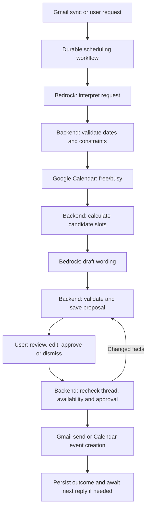

# Bedrock + Google Calendar scheduling workflow

For the complete five-intent design and current proposed shared contracts, start
with [the implementation playbook](implementation-playbook/README.md). It extends
this earlier scheduling-only proposal and takes precedence where the proposals differ.

Status: proposed implementation plan, based on this checkout on 2026-09-13.
This document describes work to build; it does not claim that Bedrock, Calendar,
draft sending, or the workflow below is implemented. Existing API contracts and
accepted architecture decisions remain unchanged until their implementation PRs.

## Recommended architecture

Keep FastAPI as the workflow owner, PostgreSQL as the durable state store, and
Google as the source of mailbox and calendar truth. Use Bedrock to interpret
scheduling requests and compose replies. Compute availability and enforce
permissions, approval, and execution in ordinary backend code.

Start with Bedrock Runtime Converse/ConverseStream behind the existing model
client. This fits the current backend and permits typed model interactions and
application-executed tools. An agent does not need a fully autonomous loop to be
useful: it can interpret a request, obtain facts, prepare an action, pause for a
human, and resume. [Bedrock Converse](https://docs.aws.amazon.com/bedrock/latest/APIReference/API_runtime_Converse.html),
[application-side tool use](https://docs.aws.amazon.com/bedrock/latest/userguide/tool-use-inference-call.html).

If the migration specifically requires the managed **Amazon Bedrock Agents**
service, expose the same backend capabilities through action groups and use
return control for proposed writes. Persist the invocation/session references
with the workflow and return execution results after approval. Application
authorization and durable approval records are still required.
[Bedrock Agents return control](https://docs.aws.amazon.com/bedrock/latest/userguide/agents-returncontrol.html).



Google credentials, recipient resolution, arbitrary HTTP access, and write
authority stay outside model context. Read tools are allowlisted, user-scoped,
and bounded by time range and result count. A proposed tool call is input to the
backend validator, never permission to execute a write.

## What exists in this checkout

| Area | Observed implementation | Work needed |
|---|---|---|
| Model client | `backend/app/model_client/client.py` selects Ollama or OpenRouter and streams text | Bedrock provider; typed extraction/tool results; explicit provider policy |
| Google auth | `backend/app/auth/google.py` and `service.py` exchange/refresh and encrypt tokens | Incremental Calendar consent, actual granted-scope tracking, capability status |
| Gmail | `backend/app/sync/gmail.py` and `worker.py` paginate, clean and upsert messages | Reliable latest-message versioning, scheduling trigger, reply headers and send support |
| Orchestrator | `backend/app/orchestrator/orchestrator.py` implements summaries and caching | Durable scheduling dispatch and lifecycle |
| Planner | Regex intent matching exists; model fallback raises `NotImplementedError` | Scheduling intent and typed extraction |
| Drafts | Table/schema exist; `/draft` and `/draft/{id}/send` return 501 | Persisted editable proposals, approval, MIME reply send, reconciliation |
| Calendar | No client, scope, route or workflow present | Calendar selection, free/busy, later event creation |
| Background work | `/sync` runs inline | Durable jobs, leases, retries and transactional enqueue |
| Frontend | This checkout has `frontend/README.md`; it points to the frontend branch | Review card and reconnectable workflow UI must be integrated with that implementation |

ADR 001 currently says inference never runs on AWS. The Bedrock migration should
explicitly supersede it and update configuration, deployment documentation and
model tests. Preserve ADR 002's principle: trusted structured facts remain owned
by backend code; model-generated wording must not overwrite them.

## Product scope and rollout

1. **Availability assistance:** check a requested time or suggest up to three
   slots, show the evidence and draft a reply. Calendar access is read-only.
2. **Approved email replies:** the user reviews recipients and exact text, then
   explicitly sends through the backend. Copying into Gmail can be an earlier
   preview milestone, but cannot be reported as a confirmed send.
3. **Approved bookings:** when a time is agreed, show an event preview and obtain
   approval to create it and notify attendees.
4. **Proactive continuation:** process new replies in the background and surface
   revised proposals. Rescheduling, cancellations, recurring meetings, room
   booking and automatic holds are separate later capabilities.

Initially support the connected user's availability and one meeting per workflow.
External participants' calendars are unknown unless separately shared and
authorized. Drafts should say “Here are times that work for me,” not claim mutual
availability. Offering slots neither reserves them nor creates events.

## End-to-end lifecycle

### 1. Connect and configure

Add a “Connect Calendar” capability to the existing Google authorization flow.
For the user's own availability, start with `calendar.freebusy`; add
`calendar.calendarlist.readonly` if the UI lets the user select blocking calendars.
Use `calendar.events.freebusy` when the product needs availability on other
calendars the user can access. Add `calendar.events.owned` for later creation on
owned calendars; broader writable calendars require an appropriate scope and ACL.
These are separate capabilities rather than a request for unrestricted calendar
access. [Google Calendar scopes](https://developers.google.com/workspace/calendar/api/auth).

Request additional access when the feature is enabled. Persist the scopes
actually granted; adding strings to `SCOPES` does not upgrade existing tokens.
Preserve existing refresh tokens if the response omits one. Bind account linking
to the signed-in user's Google subject, validate OAuth state and redirects, and
expose `connected`, `insufficient_scope` and `reauth_required` to the UI.
[Incremental Google authorization](https://developers.google.com/identity/protocols/oauth2/web-server#incrementalAuth).

Store an IANA time zone, working hours, selected blocking calendars, destination
calendar, meeting duration, buffer and minimum-notice preferences. Suggested
initial defaults are 30 minutes, weekdays 09:00–17:00, a 10-minute buffer and a
five-business-day search horizon. Present defaults as editable assumptions;
specific meeting requests override preferences when the user confirms them.

### 2. Trigger and capture context

First trigger on an explicit side-panel action, such as “Check availability” or
“Suggest three times.” Later, opt-in detection can create suggestion cards after
incremental Gmail sync. Do not generate suggestions for an entire historical
backfill or keep proposing on threads the user has dismissed or already answered.

Commit a workflow with the owning user, thread, trigger message, thread version,
request and policy version. De-duplicate repeated delivery of the same trigger.
A cheap candidate detector can avoid unnecessary model calls; do not depend on
`needs_reply`, whose classifier currently returns `None`.

Use the latest relevant messages, including prior offered slots and corrections.
Store typed scheduling memory, not model reasoning: participants, proposed slots,
constraints, selected slot, source messages and action outcomes. The existing
summary cache alone cannot represent a multi-message scheduling negotiation.

### 3. Interpret into a typed request

Have Bedrock extract fields such as:

```json
{
  "intent": "check_time",
  "date_phrase": "tomrw",
  "time_phrase": "4",
  "duration_minutes": null,
  "requested_slot_count": 1,
  "timezone": null,
  "participant_refs": ["sender"],
  "evidence": [{"message_id": "opaque-id", "quote": "free at 4"}],
  "unresolved": ["am_or_pm", "timezone", "duration"]
}
```

Resolve dates with backend date/time code using the source message timestamp and
the known or explicitly assumed interpretation zone. “Tomorrow” in an old email
must not become tomorrow relative to whenever the panel is opened. Preserve the
original phrase and its source. Reject implausible or missing date anchors.

For “4,” use thread context and the user's settings to suggest an interpretation,
but display “Assuming 4 pm, Melbourne time, 30 minutes” for confirmation. When
there is no defensible interpretation, request clarification instead. User-provided
clarifications become structured inputs, not another opportunity for the model
to re-infer established facts. Use explicit dates in the reply.

Use strict schema validation, enum/range limits and at most one repair attempt.
Model confidence is a routing signal, not proof. Unsupported, ambiguous, past or
contradictory requests enter `needs_clarification` rather than becoming writes.

### 4. Calculate availability

Query Google Calendar free/busy for the selected authorized calendars and a
bounded interval. Check per-calendar errors even when the HTTP request succeeds.
Missing or inaccessible results mean unknown availability, not an empty diary.
[Free/busy API](https://developers.google.com/workspace/calendar/api/v3/reference/freebusy/query).

For each local working day, build working-hour intervals, convert using the
stored IANA zone, union busy intervals, apply buffers, and subtract them. Generate
slots that fit the requested duration, minimum notice and date constraints.
Use half-open intervals `[start, end)` so adjacent events have correct boundaries.
Store UTC instants and the display zone; explicitly handle nonexistent and repeated
local times around daylight-saving changes.

For a fixed time, report whether the whole requested duration fits. If it does
not, compute alternatives. For three slots, rank deterministically by matching
preferences, soonness and useful spread across days/times. Return fewer than
three with an explanation when only fewer fit; ask before broadening constraints.

Use provider free/busy semantics for recurrence and availability in v1. If later
requirements distinguish tentative events, declined invitations, out-of-office
or travel policy, add an explicitly scoped event-reading feature and test those
rules. Free/busy alone does not expose all event semantics.

### 5. Draft and persist a reviewable proposal

Persist candidate IDs, start/end values, display zones, calendars checked,
availability check time, assumptions and proposal version. Let Bedrock generate
only the surrounding prose and references to candidate IDs. Render exact dates
and times from backend data into the final draft. Reject invented slot IDs or
wording that asserts an unsupported booking or participant acceptance.

The card should show the interpreted request, duration, zone, offered slots,
availability scope, check time, editable recipients/text and the intended action.
Available actions: edit, refresh, dismiss, and approve the named operation.
Slot/time edits update structured data and rerun availability; free-text edits
also invalidate approval and require consistency checks before sending.

Proposed slots are “free when checked,” never guaranteed reservations. A streamed
draft is a preview; approval is enabled only once validation and persistence finish.
Use authenticated workflow events for progress, and a GET endpoint to recover
state when the panel closes or a stream disconnects.

### 6. Approve exact content

Approval binds the authenticated user to one immutable proposal version and a
hash of its canonical action payload: action type, recipients, body, thread,
selected slot, destination calendar, attendees and notification settings as
applicable. The backend loads the payload from storage; it does not execute an
arbitrary payload supplied alongside an approval ID.

Any change to content, recipients, timing or relevant thread context requires a
new proposal and approval. Another user cannot read or approve the action. A
new incoming reply supersedes the old proposal. Expired approval cannot execute.
Use a short proposal lifetime (initial suggestion: 10 minutes), configurable and
clearly displayed; expiry is not a substitute for the execution-time recheck.

“Send these suggestions” authorizes an email. “Create event and invite attendees”
authorizes an event plus its stated notifications. A single UI approval may cover
both only if both exact actions are previewed and independently tracked.

### 7. Revalidate and execute

Atomically claim the approved action with a database state/version check and an
execution lease. Recheck authorization, current thread, proposal expiry and live
availability immediately before a scheduling send or booking. New conflicts or
changed context return a revised proposal for approval; do not silently substitute
a different time.

Serialize conflicting work for the same user's calendar within Threadly. This
prevents competing internal workers, but Google Calendar does not provide an
atomic free/busy-and-reserve operation. External calendar changes can still race
the check. Treat a post-write conflict as a condition to surface and resolve,
not a reason to silently move/delete the event.

For email, create the reviewed MIME message and call Gmail send. Preserve Gmail
thread ID, subject, RFC Message-ID, References and In-Reply-To to keep the reply
in the intended conversation. Parse Reply-To/To/Cc and remove the user's own
addresses; show the final recipient list for approval. A Gmail message resource
ID is not an RFC Message-ID. [Gmail thread requirements](https://developers.google.com/workspace/gmail/api/guides/threads),
[sending email](https://developers.google.com/workspace/gmail/api/guides/sending).

For a booking, use a stable provider-compatible event ID derived from the action,
store the resulting Google event ID, and make attendee notification behavior part
of the approved payload. Inviting attendees commonly uses `sendUpdates=all`.
Creation is distinct from attendee acceptance. [Calendar event insertion](https://developers.google.com/workspace/calendar/api/v3/reference/events/insert).

### 8. Record outcomes and continue

Persist provider IDs and terminal action status before reporting success. An
email with proposed times moves the meeting workflow to `awaiting_reply`; the
email action is complete, but the meeting is not booked. A reply such as “the
second one works” must map to the exact prior offered-slot version. Ambiguous
references need clarification. Recheck the selected slot and prepare a new
booking approval.

After an event exists, report `event_created`, with attendee responses tracked
separately if the feature supports that. If an organizer sends an existing invite,
link or review that event rather than creating a duplicate. A cancellation or
reschedule starts a new explicitly reviewed operation.

## Durable state and proposed contracts

Keep meeting state separate from individual action state. One meeting can have
several proposal revisions, email sends and one eventual event creation.

| Meeting/workflow state | Meaning |
|---|---|
| `received` / `interpreting` / `checking_availability` | Durable processing steps |
| `needs_clarification` | Awaiting missing user input |
| `awaiting_approval` | Current validated proposal is reviewable |
| `awaiting_reply` | Offered slots sent; waiting for the other participant |
| `event_created` | Event exists; participant acceptance may remain pending |
| `dismissed` / `expired` / `failed` | Terminal outcome or user-visible recovery |

Action state: `proposed → approved → executing → succeeded`. Other outcomes:
`rejected`, `superseded`, `expired`, `failed`, `outcome_unknown`. Network ambiguity
must not be mislabeled as a definite failure.

Proposed storage additions, through SQLAlchemy + Alembic:

| Entity | Required contents |
|---|---|
| Google capability fields on users | Granted scopes, connection status, reauthorization reason; retain encrypted tokens |
| `calendar_preferences` | Owner, IANA zone, blocking calendar IDs, destination, hours/buffers/defaults, version |
| `scheduling_workflows` | Owner/thread, trigger, current thread version, typed request, meeting state, optimistic-lock version |
| `scheduling_proposals` | Immutable version, slots, assumptions, check/expiry timestamps, draft reference |
| `workflow_actions` | Owner/workflow, canonical payload/hash, approval identity/time, lease, attempt, idempotency key, provider IDs |
| `workflow_jobs` | Type, dedupe key, payload reference, due time, lease/heartbeat, retry count, last error |
| `workflow_events` | Ordered state/decision/tool-outcome audit, redacted errors, model/prompt/schema versions and usage |

Extend drafts with revision and structured recipients/subject/thread headers.
Persist the source message headers needed to compose valid replies, plus a trusted
received timestamp and original date-zone information. All new records must be
scoped to the authenticated user; enforce ownership at each API and worker boundary.

Proposed APIs below are design inputs for a coordinated API-contract PR:

| Method/path | Purpose |
|---|---|
| `GET /calendar/connection` | Granted capabilities and reconnect state |
| `GET /calendar/calendars` | Authorized selectable calendars |
| `PUT /calendar/preferences` | Validated settings; increments preference version |
| `POST /threads/{thread_id}/scheduling` | Create/reuse workflow; return 202 and workflow ID |
| `GET /scheduling/{id}` | Current durable state/proposal |
| `GET /scheduling/{id}/events` | Reconnectable authenticated SSE; IDs allow replay |
| `POST /scheduling/{id}/clarifications` | Supply missing facts with expected version |
| `POST /scheduling/{id}/revisions` | Edit/refresh proposal with expected version |
| `POST /scheduling/{id}/actions/{action_id}/approve` | Validate expected version/hash; persist approval and enqueue execution |
| `POST /scheduling/{id}/dismiss` | Dismiss and suppress repeated prompting |

The existing `/draft/{draft_id}/send` must use the same approval/execution service
if retained. No generic send or calendar endpoint may bypass it. A client
idempotency key is scoped to user + operation and bound to the request hash;
reusing a key for different content returns a conflict. Preserve the existing
error envelope. Return 409 for stale proposals, and typed reconnect/retry errors.

## Reliability and recovery

Use a PostgreSQL-backed job table initially, consumed by a separate worker process
from the same backend image. Commit state and job enqueue in the same transaction;
claim with leases/row locking, recover abandoned leases and use bounded retries.
Do not hold database transactions open while waiting for Google, Bedrock or a
human. Keep model calls resumable at stage boundaries and cap tool calls, input
size, execution time and output tokens. SQS can replace job delivery later while
PostgreSQL continues owning state and the transactional outbox.

| Failure | Required behavior |
|---|---|
| Duplicate request, double-click or job redelivery | Database uniqueness/CAS returns or resumes the existing action |
| Missing Google scope or revoked refresh token | Pause affected capability and request reconnection |
| Read timeout, 429 or transient 5xx | Bounded exponential backoff with jitter; show unknown availability until successful |
| Invalid model output | One repair attempt, then clarification or recoverable error |
| Calendar/thread changes during review | Supersede proposal and require approval of a revision |
| Worker restarts | Resume persisted steps; inspect in-flight writes before retrying |
| Calendar insert times out | Look up the stable event ID and compare action identity/payload before deciding to retry |
| Gmail send times out | Mark `outcome_unknown`; reconcile Sent mail using a pre-generated RFC Message-ID and stored metadata |
| Send result cannot be reconciled | Keep it unresolved and ask the user to inspect; never blindly resend |
| Event succeeds but optional follow-up email fails | Record partial success per action; recover the failed action without creating another event |
| Panel closes | Processing and approval state remain durable; reopening retrieves current state |

A local idempotency key does not make Gmail send exactly once. A matching
Message-ID is evidence for reconciliation, not a provider deduplication guarantee.
Also distinguish “sent via Gmail” from delivered/read, and “event created” from
accepted by attendees. Do not automatically delete a created event to compensate
for a failed email; compensating changes need their own visible intent/approval.

Start with live free/busy queries; an event mirror and Calendar watches are not
prerequisites. Later watches can invalidate cached suggestions. Treat them as
change signals, verify channel bindings/tokens, handle duplicate/out-of-order
notifications and explicitly renew expiring channels.
[Calendar push notifications](https://developers.google.com/workspace/calendar/api/guides/push).

If later adding event synchronization, request appropriate event-read permissions,
persist sync tokens per calendar, process every page and deleted event, and
rebuild only the affected calendar cache on HTTP 410. Keep periodic reconciliation
and the pre-action live check even with notifications.
[Calendar incremental sync](https://developers.google.com/workspace/calendar/api/guides/sync).

## Backend prerequisites discovered during inspection

- **Latest-message correctness:** `upsert_thread` overwrites `last_msg_*` for
  every processed message. Out-of-order results can regress the apparent latest
  message. Derive a monotonic thread version/newest pointer from reliable message
  ordering, and test reversed and equal-time ingestion. Re-fetch current thread
  context before consequential execution instead of trusting this pointer alone.
- **Backfill race:** initial sync obtains the Gmail history cursor after listing
  and fetching the mailbox. A message arriving during the scan can be missed by
  both the scan and subsequent history processing. Capture a starting cursor and
  replay changes through completion before advancing it; prove this with a
  concurrent-arrival fixture. Deduplicate overlapping sync runs per account.
- **Author/recipient correctness:** replace substring-based `is_from_user`
  detection with parsed address equality and configured aliases. Persist Reply-To,
  Cc and RFC threading headers before enabling sends.
- **Provider stream handling:** the existing `try/except` surrounds creation of
  an async iterator, so failures during iteration escape that fallback branch.
  Define Bedrock stream failure semantics explicitly; never append a second
  provider's response to partial text. Retry from a clean stage and commit only
  complete validated output.
- **PII handling:** current masking is a regex seed implementation, and the cloud
  client discards its reversal map. Use stable participant references and typed
  scheduling fields; keep identity mapping server-side. Test date/time preservation
  as well as masking. Do not send calendar titles or attendee addresses to Bedrock
  merely to calculate availability.

These are concrete prerequisites for this feature, not claims that this document
fixes them. The full production authorization/security review is separate work.

## Implementation chain and acceptance gates

| PR | Work and main locations | Depends on | Acceptance gate |
|---|---|---|---|
| 1 | Bedrock provider in `model_client/`, typed model interface, settings/dependencies, IAM deployment config, superseding ADR | — | Existing summary contract passes against mocked provider; approved-region smoke test; no unconfigured cross-provider fallback |
| 2 | Gmail ordering/backfill/header fixes in `sync/` and repositories; stable thread versions | — | Out-of-order and concurrent-arrival fixtures retain correct newest context and no missed messages |
| 3 | Incremental Calendar consent and preferences in `auth/`, `schemas/`, routes/models/migration | — | Existing Gmail user upgrades access without losing refresh token; denied scopes produce correct capabilities |
| 4 | `calendar/client.py` and deterministic `calendar/availability.py` | 3 | Busy unions, buffers, DST, partial calendar errors and insufficient slots are correct |
| 5 | `scheduling/` workflow/request schemas, planner intent, jobs, proposals and state events | 1, 2, 4 | Both example emails produce grounded editable proposals; restart and repeated trigger tests pass |
| 6 | Side-panel review, clarification and approval; exact content/version binding | 5 | User can see assumptions, edit, dismiss and recover after reconnect; stale/cross-user approvals fail |
| 7 | Gmail MIME sender and shared approval executor; unknown-outcome reconciliation | 6 | Approved reply stays in thread; duplicate delivery/double-click cannot blindly resend |
| 8 | Optional Calendar event writes and next-reply continuation | 7 | Exact approved slot/event, recipient and notification behavior; conflict and timeout recovery pass |
| 9 | Opt-in proactive detection, operational controls and broader evaluation | 7; 8 for booking | Bounded workload, replay-safe recovery, no repeated historical suggestions |

PRs 1–3 are independent workstreams after agreeing the proposed contract and data
model. The first useful product milestone is PRs 1–6: availability cards and
reviewable replies. The first complete approved-send milestone includes PR 7.

Keep `model_main`/`model_small` behind task-oriented configuration, select a
Bedrock model/region with the required streaming/tool/structured-output support,
and benchmark on this workload before fixing the choice. Use the instance/task
IAM role, restrict invocation resources, and make inference-profile routing and
logging explicit. Do not silently fall back to OpenRouter after a Bedrock error.
Streaming SDK work must not block FastAPI's event loop. Record latency, token
usage and provider/model/prompt versions; set per-user budgets and request caps.

Scheduling does not require sent-mail embeddings. Add RAG later for writing style,
without making vector retrieval a prerequisite for date calculations or approval.
Treat email bodies and retrieved passages as untrusted content; they cannot alter
tool permissions, destination calendars, recipient allowlists or approval state.

## Evaluation and definition of done

Maintain synthetic or consented/redacted fixtures for explicit times, “tomrw,”
old messages, AM/PM ambiguity, conflicting zones, daylight-saving transitions,
three-slot requests with no duration/window, fewer than three available slots,
all-day/recurring busy periods, delayed replies, corrections and malicious email
instructions. Evaluate extraction against labeled facts and whether the workflow
asks for clarification appropriately; fluency alone is not success.

Test the deterministic slot engine separately from model evaluations. Use
httpx mock transports for Google, provider fixtures for Bedrock, and real
PostgreSQL integration tests for concurrency/transactions. Exercise crashes
before/after each external write, token revocation, stale approvals and unknown
outcomes. Then run an end-to-end smoke test with a test account and deliberate
calendar edits during review.

Release invariants: every write has matching current approval; every displayed
slot comes from validated backend data; incomplete calendar results never become
“free”; duplicate deliveries do not blindly repeat writes; interrupted workflows
can resume; users see partial/unknown outcomes accurately. Measure intent and
slot extraction quality, clarification frequency, suggestion acceptance/editing,
p50/p95 latency, per-workflow cost, revalidation conflicts and recovery backlog.
Report measured results before claiming production reliability.

The requested end-to-end demonstration is: an email asks for availability, the
system resolves or clarifies the request, calculates real slots, drafts a reply,
the user edits and approves it, the backend rechecks and sends once as far as
the provider outcome can establish, then a later reply can lead to a separately
approved calendar invitation.
