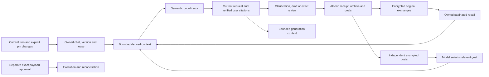

# Shared conversation context: implementation and review

Status: locally committed, integrated implementation, prompt
`contextual-conversation-1.8.9+chat-context.3`. Backend base:
`bc12ef106659f5ac8b5b79890e0887f1431e29ea`; frontend base:
`afa2180fa16b4060587002b6be440ce32573c603`. No publication or deployment.
The voice repair remains intact. This document separates implemented mechanics
from conversational quality. The `.2` diagnostic found partial successes and
contract failures; `.3` has not been evaluated with a real model.

The reported Calendar exchange retained all three user messages. Initial
validation failed before useful fields were saved; later recovery tried to use
old fields against current-turn fences. That caused the clarification loop.
Separately, the old twelve-exchange cache could permanently discard history.
The change addresses both boundaries, rather than treating AEST as the design.

## Data flow and ownership

Original user information remains unstructured dialogue: no universal schema,
fact database, mailbox import or embeddings are required. Tool schemas describe
requested work. The model interprets relevant goals, references and corrections;
the backend checks ownership, provenance, dates, recipients, versions and approval.
A quote proves authorship, not that the model understood the user's meaning.

## Implemented behavior

- `conversation_exchanges` archives encrypted original completed exchanges before
  cache compaction, in the completion transaction. Retained legacy turns backfill
  lazily. Already discarded pre-upgrade turns cannot be recovered. Backfill never
  assigns today's selected email to every historical exchange.
- `conversation_goals` independently retains typed pending payloads and saved
  task/proposal pointers. Starting another draft/event no longer implicitly cancels
  the previous goal. Listing is read-only; selecting one restores focus without
  rerunning or approving it. Cancellation closes only the selected typed goal.
  Closed goals are hidden by default. Saved work is not all automatically active.
- Goal sources use stable independent handles when restored; they do not replace
  the browser's explicit email pin. Handles contain identities, not remembered
  Gmail bodies. Source-dependent work requires fresh reads of the relevant scope.
- Calendar/email fields can cite an exact USER quote and turn version in this
  owned chat. Assistant text, another chat, future turns, expired chats and changed
  account generations are rejected. Current operation intent remains separate.
- Claims record a turn's clock/timezone. Historical relative dates resolve using
  the original anchor; unknown legacy anchors require clarification. Explicit
  AEST/AEDT and IANA zones are preserved, including across partial-field repairs.
  Malformed proposed fields do not erase independently valid fields.
- Arbitrary historical background can be supplied through `context_citations`.
  Verified quotes reach draft/summary generation through encrypted task provenance.
  They do not enter operation routing, recipient binding or execution approval.
  The task acceptance hash uses the original verified value, so encryption randomness
  does not break direct-request idempotency. Provider facts remain separate.
- Single workflow and email preparation accept a model-interpreted operation with
  `request_source` equal to the complete current user turn. Obvious quoted, reported
  and declined requests are rejected. This avoids a positive creation-verb whitelist
  for that path. Legacy calls and compound-operation gates retain their prior rules.
- Browser protocol `context_memory_version:1` stops resending the last displayed task
  or unchanged pin as the next turn's focus. Older server responses retain legacy
  behavior. Explicit attach/detach and immutable retry bodies still work. A current
  text draft is returned separately and restored as an editor after history eviction.

Selecting a past task loads its current artifact rather than regenerating an old
answer. Historical summaries are remembered outputs, never fresh email evidence.
Old instructions and citations cannot approve provider writes. Existing exact
payload approvals, expiry, reconciliation and worker ownership checks remain.

## Bounds and remaining quality limits

Recent dialogue is at most twelve exchanges and 24,000 serialized characters.
Recall scans at most forty turns per page, returns at most four exchanges within
approximately 16,000 characters plus its envelope, and exposes a bounded user-turn
index so later corrections need not repeat the original keyword. Exact-version
fetch and cursors allow further reads. Assistant excerpts are clipped; original
archived text remains intact. Retrieval is literal, not semantic search.

The initial context allocator targets 48,000 serialized characters, removing oldest
context first and explicitly marking omitted goal/artifact views for retrieval.
It preserves the current user turn and never mutates stored originals. The engine
still has its eight-call, 120-second, 85,000-character transcript limits. These are
character limits, not a tokenizer-aware production allocation. A source or correction
outside the inspected window can still be missed; the model must disclose uncertainty.

Historical context is not yet a typed source for deterministic scheduling constraints
or source-quoted plan items. Those workflows retain their existing validators; a
citation does not silently expand their authority. Generic semantic preparation is
review-only; it cannot deterministically prove arbitrary natural-language intent.
Pronoun resolution, goal choice, correction handling, and unfamiliar phrasing remain
model-dependent. A finite suite cannot establish universal conversational reliability.

The history endpoint still exposes compact history, not a full transcript viewer.
Retention is at most seven days with existing account limits. Explicit cleanup can
remove expired chats after its grace period and cascades archive/goals; this change
installs no production cleanup schedule. Calendar choices and approval receipts
keep their separate, shorter lifetimes. There is no cross-chat personal memory.

## Compatibility and rollout requirements

Migration `h071026e9043` adds the archive and goal tables after `g071026e9042`.
It is additive on upgrade and refuses downgrade while either table contains data.
Tests cover an empty install, preservation of existing encrypted chat bytes and
schema drift. Do not drop chat history to make a rollback pass.

New code reads retained legacy state and lazily creates archive/goal records.
New frontend behavior is negotiated by the response flag; old-server fallback is
covered. Old backend releases cannot reliably parse new Calendar timezone fields
or retain registry-only goals. Therefore **mixed old/new backend writers and a
binary rollback to the old writer are not supported after new-format writes**.
A future rollout must stop admissions, drain in-flight work, migrate, switch API
and workers together, then reopen. A rollback needs a compatibility build that
preserves these records. This is a release gate, not approval to deploy now.

## Evaluation evidence and remaining gate

Mechanical tests use real isolated PostgreSQL with scripted model and fake Google
adapters. They exercise citations, date anchors, ownership, independent goals,
worker context, archival, source restoration and browser behavior. See
[evidence](evaluation/chat-context/README.md) for actual counts and receipts.
They do not measure a real model's tool selection or semantic accuracy.

`backend/tools/evaluate_chat_context.py` is an opt-in diagnostic harness using
actual `service.turn`, persistence and worker paths with the real Bedrock model
adapters. It has six varied synthetic families: history beyond forty turns with
a keyword-free correction; two unfinished drafts; interleaved events and ambiguity;
summary → reply → Calendar → saved summary; unknown historical time anchors; and
quoted/negated commands. It supplies no prescribed tool calls or expected answers
to the model. Rubrics are recorded only for review. Google reads are fake, unknown
Calendar operations and mutations are blocked, and no action worker is run.

**The first-stage real-model run consumed all 18 attempts, with 17 responses and
one throttle. None of its three scenarios completed end to end.** It selected three
families (long-history correction, independent drafts and source/workflow detour),
with six attempts per family and eighteen total. Each attempt is bounded to 32,000
counted input and 1,800 output tokens; the shared AWS dispatch guard covers auxiliary
and worker model paths too. Failed preflight stops before paid inference. See the
[concrete proposal](evaluation/chat-context/first-stage-proposal.md) for the verified
production model, official prices, calculated USD 0.81180 metered maximum, tax
assumption, consent requirement and pass/fail/incomplete review rubric. The earlier
48-call proposal is superseded. See [actual outcomes](evaluation/chat-context/approved-evaluation-status.md)
for measured recall, goal and citation successes, draft failures and the conservative
USD 0.61530194 estimate including GST and a failed-attempt reserve. Further paid
testing requires new approval. Offline repair tests do not prove model quality.

Results record prompt/tool/model identity, traces, actual token counts, latency,
clarifications, current goal state and failures. Human semantic review and follow-up
held-out paraphrases are required before release; a successful diagnostic invocation
alone is not a pass threshold. Provider failures, retries, account changes and browser
restoration currently have mechanical tests, not repeated live-model evaluation.

The meeting-email Create event button is integrated into these local stacks while
its original commits remain preserved. It uses a fresh owned email reference,
editable manual date/time fields, immutable preview and final exact confirmation
under Always. See the [combined review](evaluation/chat-context/integration-review.md)
for commit lineage, approval-isolation evidence and remaining release gates.
