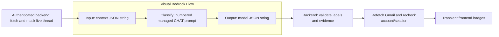

# Visual classification Flow

7 October 2026. The service is merged into `release/backend` and enabled on the
public API. See the [deployment record](ROLLOUT-2026-10-07.md) for current runtime
status. The provisioning history below preserves the earlier stages. The frontend
badge API and trained BERT labels are unchanged.

## Selected model

**Claude Haiku 4.5 is selected by the user on 7 October 2026.** The active
classification Flow uses the Australian inference profile below. Nova Micro is
retired; its comparison results remain as historical evaluation evidence.

| Model | Bedrock target | Location |
|---|---|---|
| Claude Haiku 4.5 | `au.anthropic.claude-haiku-4-5-20251001-v1:0` | Australian profile: Sydney/Melbourne |



Each prompt has a trusted system message and one `request` variable in its user
message. Input is a JSON **string**, not a Bedrock Object. The backend supplies
messages with short source IDs, participant roles, evaluation time, timezone and
the output schema. No Gmail credentials, tokens or account identifiers enter it.
The existing masking policy is limited de-identification, not a privacy guarantee.

AWS rejected inline CHAT configuration in a Flow prompt node despite its presence
in the SDK model. The launcher therefore publishes a managed CHAT prompt version
and uses the Flow node's resource reference to its versioned ARN. This preserves
the system/data distinction. Prompts and graphs are API-managed; CloudFormation
owns the Haiku execution role. The source launcher provisions only Haiku and
checks for drift before reusing matching resources.

Flows have no Lambda, Google, agent, storage, read-tool or write nodes. The
backend remains responsible for source access, strict output checks, freshness
and session validation. A Flow is not a mailbox cache or an action executor.

## Provisioning and release handling

Source assets:

- `backend/app/classification/flows.py`: graph, managed prompt variant and target validation.
- `backend/app/classification/flow_release.py`: role templates and caller policy.
- `infra/bedrock/classification_flows.py`: resumable provisioning/publishing.
- `infra/bedrock/classification.guard`: scoped role-policy checks.

Use the backend Python environment and a current AWS CLI. The local `aws login`
credential provider also needs `botocore[crt]` when running SDK evaluations;
EC2 role credentials do not require that login-specific dependency.

```bash
python infra/bedrock/classification_flows.py --render-only --output /tmp/classification-render
AWS_PROFILE=threadly python infra/bedrock/classification_flows.py \
  --prepare-assets --output /private/path/classification-release
```

Render-only is offline and uses synthetic identifiers. Prepare-assets publishes
only the Haiku managed prompt version and renders real-account graph/role assets.
Validate the resulting template with cfn-lint and the repository Guard rules.
Then run without either flag to create/resume the role stack, create the Haiku
Flow, prepare it, publish a numbered version and create its `candidate-v1` alias.
CloudFormation service validation runs before role creation. Resource names and
idempotency tokens derive from content. Existing resources with mismatching
ownership, templates, prompts or graphs are rejected, never overwritten.

The execution role may invoke only Haiku 4.5, plus render its managed
prompt with `bedrock:RenderPrompt`. Backend verification separately uses GetPrompt.
Haiku's foundation-model permissions are restricted to Sydney/Melbourne and
conditioned on the selected Australian profile.
Bedrock trust is restricted by source account and Sydney Flow ARN. No existing
application role or Flow is changed by provisioning.

The receipt includes prompt ARNs, Flow/version/alias targets, graph hashes and
partial progress on failure. Keep account-specific receipts in the ignored
`.classification-deployments/` directory or protected deployment storage. Never
commit credentials or copy an example's synthetic identifiers into production.
Re-run the same launcher/version to recover interrupted work; AWS state is authoritative.
The existing selected Haiku target is retained from the two-model comparison release.
Its shared stack was reduced to the Haiku role without replacing it. Preserve that
receipt and use its existing target for rollout: the new single-model launcher's
content-derived stack name differs and is for fresh provisioning, not an in-place
migration of that historical stack.

## Backend selection and evaluation

Use the selected `haiku.target.json` as the complete
CLASSIFICATION_FLOW_MANIFEST, set CLASSIFICATION_TRANSPORT=bedrock_flow, and grant
the backend role the exported Haiku caller policy. That policy grants only
InvokeFlow on its alias and the target-specific Flow/prompt reads needed to verify
the release. A DRAFT version, test alias, foreign account, unknown model or graph
cannot activate. Retired Nova targets are rejected. A changed alias/prompt/role is
rejected; no Converse fallback runs.

Provisioning alone does not change EC2, deploy application code, attach caller
policies or enable classification. The separate [backend rollout](ROLLOUT-2026-10-07.md)
completed those steps using the retained Haiku target.

To run the 12 synthetic cases through the selected Haiku Flow, from `backend/`:

```bash
AWS_PROFILE=threadly CLASSIFICATION_ENABLED=true CLASSIFICATION_TRANSPORT=bedrock_flow \
CLASSIFICATION_FLOW_MANIFEST="$(cat /private/path/haiku.target.json)" \
BEDROCK_MAIL_PROCESSING_ACKNOWLEDGED=true GMAIL_SOURCE_MODE=on_demand \
python -m app.classification.evaluate --fixtures ../ml/evals/classification/v1.json --live
```

This invokes billed model inference, but reads no Gmail and performs no database
or external writes. Save the
report and its predictions for replay. Seed-case correctness is not a production
accuracy estimate; human review, broader held-out data and a designated live
mailbox integration check are required before enabling badges.

For deliberate cleanup, remove only the recorded model's aliases, Flow versions
and Flow, then managed prompt versions/prompts and finally its dedicated role.
When roles share a stack, update that stack to remove only the retired role;
delete the stack only when no retained Flow depends on it.
Deleting the role stack alone leaves API-managed resources behind. Do not delete
unrelated summary/conversation Flows or the application's staging stack.

## References

- [AWS Flow support](https://docs.aws.amazon.com/bedrock/latest/userguide/flows-supported.html).
- [Managed chat prompt configuration](https://docs.aws.amazon.com/bedrock/latest/APIReference/API_agent_ChatPromptTemplateConfiguration.html).
- [Flow role permissions, including RenderPrompt](https://docs.aws.amazon.com/bedrock/latest/userguide/flows-permissions.html).
- [Haiku 4.5](https://docs.aws.amazon.com/bedrock/latest/userguide/model-card-anthropic-claude-haiku-4-5.html).
- [Nova Micro](https://docs.aws.amazon.com/bedrock/latest/userguide/model-card-amazon-nova-micro.html).

## Verified outcome

Both prompt-1.0.1 candidates were originally provisioned in Sydney, reached Prepared,
and received numbered Flow version 1 plus a `candidate-v1` alias. Their managed prompt
versions, model, graph, role and alias routing were checked through AWS before
live invocation. Actual identifiers are in the private release receipt; the
backend remains disabled and this feature branch has not been deployed. Haiku is
now the selected release; Nova's Flow, alias, version, managed prompt and dedicated
role have been removed. Haiku retains the same verified prompt/Flow version and alias.

The initial prompt-1.0.0 run exposed non-ID evidence strings in both models. Prompt
1.0.1 adds exact serialization examples and an explicit missing-attachment rule.
The strict backend validator was retained. The initial and revised prompt files,
raw/parsed outputs and replayable predictions are under
[`ml/evals/classification`](../../ml/evals/classification/). Superseded baseline
cloud resources were removed after saving their evidence.

| Synthetic check, prompt 1.0.1 | Haiku 4.5 | Nova Micro |
|---|---:|---:|
| Cases matching all expected labels/status | **11 / 12** | **6 / 12** |
| Invalid outputs | 0 | 1 |
| Reply decisions matching expectation | 11 / 11 | 10 / 11 |
| Priority decisions matching expectation | 10 / 11 | 7 / 11 |
| Category decisions matching expectation | 11 / 11 | 10 / 11 |
| Action decisions matching expectation | 11 / 11 | 8 / 11 |
| Observed median Flow request time | 1.85 s | 1.20 s |

Per-field totals exclude the one expected abstention case; invalid outputs count
as incorrect. Timings cover local SDK verification/invocation, exclude Gmail and
frontend rendering, and are not production latency estimates. This single small
synthetic run does not establish general accuracy. The subsequent model selection
was an explicit product decision, not a production quality certification.

Haiku's mismatch was Medium rather than Low priority for an already-resolved
request. Nova also missed the unavailable-attachment abstention, confused some
actions/priorities, and produced one contradictory classified/ambiguous response
that the backend rejected. These cases need review and broader evaluation.

Exact results and replay inputs:

- [Haiku result](../../ml/evals/classification/results/prompt-1.0.1/haiku.json)
  and [predictions](../../ml/evals/classification/results/prompt-1.0.1/haiku.predictions.json).
- [Nova result](../../ml/evals/classification/results/prompt-1.0.1/nova_micro.json)
  and [predictions](../../ml/evals/classification/results/prompt-1.0.1/nova_micro.predictions.json).

Offline replay reproduced both scores and invalid-output counts. All **1,957
backend tests passed with zero skips** against isolated PostgreSQL (212.08s; one
Starlette/httpx deprecation warning). All **26 provisioning tests passed**. Changed
Python files passed lint; role templates passed cfn-lint 1.56.3 and scoped Guard
3.2.1 checks. Bedrock API shapes, live preparation and live output were separately
verified. The original complete-backend lint's six unrelated findings remain.

An actual live stream omitted nodeType despite the API reference marking it
required. The shared adapter now permits its absence while still requiring the
exact Output node from the verified graph, a single bounded output and terminal
SUCCESS. An explicitly wrong nodeType is rejected. A regression test reproduces
the observed event format.

The account reported no configured CloudTrail trail. Standard event history is
not durable audit retention; provisioning did not change account logging. Live
Gmail integration, fleet-wide concurrency/rate limits, production quality gates,
backend caller-policy attachment and EC2 activation remain outside this result.

## Haiku selection and Nova retirement checks

On 7 October 2026, AWS verified the retained Haiku managed prompt, model profile,
Flow version 1, execution role and alias routing against the existing target.
The Nova alias, published version, Flow and managed prompt were deleted. A
CloudFormation change set contained exactly one resource removal, `NovaMicroRole`,
with no Haiku modification or replacement. The stack reached UPDATE_COMPLETE;
subsequent API reads confirmed that the Nova Flow, prompt and role were absent.
The Haiku target was verified again after cleanup.

Runtime Flow validation and fresh provisioning now permit only Haiku 4.5. The
release manifest and configuration example record that selection. Historical
Nova evaluation results remain available for audit/replay; deleted Nova deployment
assets are under a retired directory in the private receipt. The current receipt
points to `selected.target.json`, identical to `haiku.target.json`.

After this selection change, **97 affected backend tests and 26 infrastructure
tests passed**, with zero test skips, including isolated PostgreSQL API checks,
rejection of retired Nova targets and single-model provisioning. Changed Python
files passed lint and `git diff --check` passed. Both the removal template and
fresh Haiku-only template passed cfn-lint and scoped Guard role checks; the Guard
Flow-node rule was inapplicable because these templates contain only roles.
Offline replay reproduced Haiku's 11/12 score with zero invalid outputs. No new
inference was needed: the retained model, prompt and published graph are unchanged.
The full backend suite was not repeated for this selection-only change; its
preceding 1,957-test result above remains the broader implementation evidence.
Backend deployment, caller-policy attachment, live Gmail acceptance and production
activation remain pending; model selection and Nova resource cleanup are complete.
