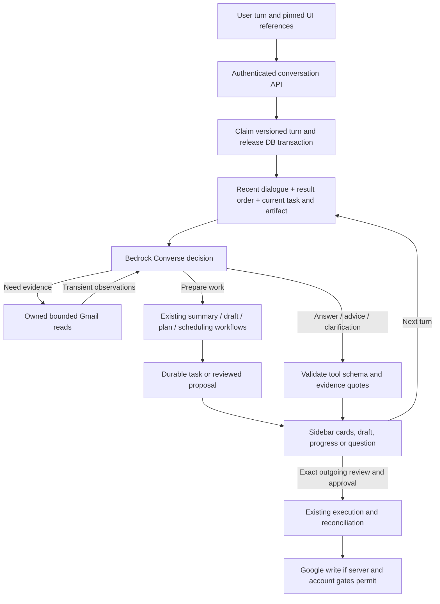
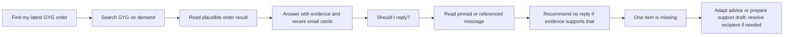

# Contextual conversation architecture

Implementation release: `contextual-conversation-1.1.0`. Feature switch:
`CONVERSATION_ENABLED=true`; default off. Requires configured Bedrock and migration
`c23026e9a039`. The two-trial synthetic Bedrock evaluation passed **26/26** checks;
its sanitized receipt is [versioned here](evaluation/contextual-conversation-live-v1.json).
Unit/integration and synthetic model results are not a general quality guarantee.

## What changed

The extension sends each ordinary user turn to `/assistant/conversation-turns` with a
conversation ID/version and source/task references. It no longer interprets greetings,
search, drafting or conversational refinements using frontend phrase patterns. Explicit
context-menu rewrite and review controls remain typed operations.

The backend reconstructs recent dialogue, ordered search references, the pinned email,
current task/question, current artifact revision, timezone and actual capabilities. A
Bedrock Converse decision can retrieve evidence, answer, clarify, recommend no action,
prepare an existing workflow, answer a typed question or revise the current draft.
The five intent categories remain workflow hints; they do not force every chat turn to
create an artifact. Existing Bedrock Flows remain specialist generators. This layer does
not require a new AWS agent, mailbox ingestion, vector search or a larger server.



There is no send, approve, book, delete-mail or arbitrary HTTP tool in the conversation
registry. Generated revisions are unreviewed and supersede old approval. A conversational
“yes” or “do that” does not authorize an outgoing payload.

## Reference and memory rules

- A selected email is pinned until the user changes/removes it. Changing the open Gmail
  tab does not silently change a reviewed draft's source. Use the existing attach-current
  control for a different visible email.
- Each search page returns up to five candidates from one bounded Gmail query. Gmail may
  match headers as well as message text, and local bounds may leave fewer than five cards.
  The coordinator reads relevant candidates to distinguish an order confirmation from a promotion. It reports limited coverage;
  it must not claim exhaustive mailbox search or a globally latest order without evidence.
- Search defaults to the past year, with an explicit window of at most 366 days. Search
  literals/folder/date wording must come from user dialogue. Provider cursors remain signed
  and account-bound. At most 25 addressable references are retained for one search;
  pagination stops at that boundary.
- `mail-1`, `mail-2`, etc. preserve displayed search order. Tools accept these references,
  not model-invented provider IDs. A new search replaces the old result set.
- When a searched result enters a workflow, the backend creates a one-message UI capture.
  It never widens that result to the other messages in the Gmail thread.
- Actual email bodies, subjects and search snippets are transient tool observations.
  Conversation storage retains Gmail message/thread IDs, snapshot references and the last
  search's filter/cursor state so later turns can address displayed results.
- Up to 12 user/assistant exchanges and 12 idempotency receipts are retained, encrypted
  with the existing Fernet key. Size-based compaction may evict older context or receipts
  while preserving the current recovery receipt. Expiry starts seven days after creation;
  an acquired turn lease can extend it just long enough to finish. Normal turns
  do not renew that period. Generated chat answers and short cited quotes
  may contain email-derived information: **no mailbox import is not a promise of zero
  retention of generated content**. Model tool transcripts/raw email bodies are not stored.
- Hourly assistant-worker maintenance deletes expired conversation rows. Expired data is
  inaccessible immediately. Backend account-version changes invalidate conversation access.
  The delete endpoint removes chat state, not existing tasks, generated drafts or action audit
  records. Backups follow their existing lifecycle; deleting chat is not immediate backup erasure.
- The extension stores the current conversation ID/version and any unfinished exact turn
  request in extension-only browser session storage. That retry record includes the user's
  instruction, timezone and source/task references; it is not an encrypted durable history.
  The extension restores server history when its sidebar or worker reopens in the same
  browser session and can safely retry the same request
  ID/body. Search snippets are deliberately not restored; ask for a fresh search. Older tasks
  remain accessible through **Recent work**.

## Turn lifecycle and recovery

```mermaid
sequenceDiagram
  participant UI as Sidebar
  participant API as Conversation API
  participant DB as PostgreSQL
  participant AI as Bedrock
  participant Tool as Authorized tools
  UI->>API: turn + request ID + expected version + references
  API->>DB: owner/account check; claim 180-second lease
  DB-->>API: encrypted state; release transaction
  loop At most 8 calls, 120 seconds total
    API->>AI: context + validated previous observations
    AI-->>API: structured tool decision
    API->>Tool: validate schema, references and allowed operation
    Tool-->>API: bounded evidence or durable task/proposal
  end
  API->>DB: save generated answer/reference state; increment version
  API-->>UI: answer, cards, task or proposal
  UI->>API: poll durable task through existing task API
  Note over UI,DB: Retry uses identical request ID and input; different concurrent versions conflict
```

Terminal workflow creation/revision checkpoints its result reference in the same transaction
as the created task/revision. A crash before chat publication can resume that reference
without asking the model to generate another task. A proposal still in `planning` is resumed
from its stored request. Expired leases permit retry of the same unfinished request; a
new message cannot silently detach it. The UI offers Retry response and blocks a different
turn until the uncertain request is resolved or the user starts a new conversation.
If a provider splits one compound request into several terminal workflow calls, the engine
executes none of the partial calls. Calls with one consistent source and recipient-role
binding are collapsed into one `compound=true` proposal; conflicting bindings return to the
model for clarification. The runtime still authorizes that proposal against user-authored
turns before reserving any work.
Explicit null source clears the current pin; omitted source preserves it. A concrete task
reference selects that task, while a null task reference clears a stale task without erasing
an active reviewed proposal. Deletion is idempotent, but returns `conversation_busy` while another panel owns
an active turn lease so a newly created task cannot be orphaned from its chat.

Model transport requires a complete tool-use response, finite output tokens and sanitized
errors. Email addresses, phone-like strings and long card-like numbers are reversibly masked,
but this is not anonymisation: Bedrock still processes remaining subjects, names, order IDs,
dates and message content needed for the request. Enabling conversation therefore also requires
`BEDROCK_MAIL_PROCESSING_ACKNOWLEDGED=true` after the operator reviews that boundary and separately
audits model invocation logging in the configured account/region. The flag is a manual
attestation: preflight does not query or disable account logging and cannot prove the audit
occurred. Read tools are
bounded; repeated identical calls are rejected. Per-user active-conversation, retained-row and
retained-turn budgets cap synchronous Bedrock/Gmail fan-out.
Transient provider failures have bounded retries. Tools do not hold DB locks while waiting
for Google or Bedrock. Trace metadata contains tool names/statuses, not private arguments.

## Examples and expected outcomes



No-reply addresses are evidence about a channel, not a universal refusal. Reply-To information
is supplied to the model. A human asking for confirmation should receive a draft when requested;
a receipt can yield useful advice without an unnecessary draft. External approval is separate.
Conversational draft revision is optimistic-concurrency safe and creates an unreviewed
`ai-revision`, but the prompt's instruction to preserve facts is not a factual verifier. The
user must review the complete revised subject, body and recipients before any separate action.

## Versioning and evaluation

- `app/conversation/prompt.py`: release, prompt hash and tool schema hash.
- `app/schemas/conversation.py`: tool registry and request contract.
- `app/conversation/evaluate.py`: synthetic multi-turn cases, real Bedrock decisions, fake mail
  tools, deterministic expected outcomes/quotes/tool choices; no Google access or writes.
- `tests/test_conversation*.py`: actual PostgreSQL/API state, ownership, leases, privacy,
  adapter failure behavior, reference captures and workflow handoff tests.
- Run live evaluation explicitly: `python -m app.conversation.evaluate --live --trials 2`.
  The pinned Australian Haiku profile passed 26/26 synthetic checks on 24 September 2026;
  the receipt above records release, prompt/tool/case hashes and per-case results without
  input or output content. The account audit found model invocation logging disabled in
  Sydney and account retention mode `inherit`, which follows the model's default rather than
  promising zero retention. The processing acknowledgement was set only for this synthetic
  test command; staging remains off by default. A fixture/model replay is not a live Gmail
  test or proof of general reasoning accuracy.

Known limits: only 12 exchanges, one active task and one search result set are in working
context; arbitrary long-running autonomous planning is not implemented. Only existing
workflow combinations are supported. Bounded read failures/ambiguous identity still require
clarification. Browser navigation does not automatically replace a pin. Semantic factual
correctness still needs human assessment beyond exact-quote validation. No assumption is
made about Superhuman's private implementation.

AWS documents the client-side tool-result loop used here in [Converse tool use](https://docs.aws.amazon.com/bedrock/latest/userguide/tool-use-client-side.html).
