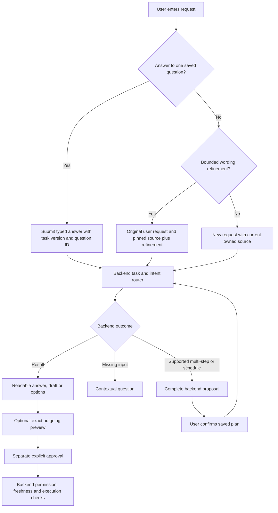

# Conversational panel — implementation and acceptance

Release: `conversation-adapter-1.0.0`, 23 September 2026.

## Product behavior

Threadly is a conversation beside Gmail. The primary interaction is one request
box and the attached email, not a category selector. A slim header holds the
conversation title, menu and new-conversation action. Suggestions start real tasks;
they are not a second navigation system. Results are readable text, draft cards
or meeting options, with controls appearing when relevant.

The reference was the installed Superhuman Go extension in **Microsoft Edge**, on
its public introductory page: compact header, contextual suggestions, a source
chip, a bottom composer and direct answer actions. Its public-page summary was
observed. No private mailbox content was sent to the reference product. Threadly
uses its own icons, styling and implementation. This is an interaction reference,
not a claim of feature parity or a copy of proprietary assets.

### A typical conversation

1. Open Threadly beside an email. It retrieves the open thread once through the
   backend, using provider identifiers. The source chip names that email.
2. Ask “Summarise this for me.” The backend routes and produces the result.
3. Ask a factual question about that email. The selected context stays attached.
4. Ask for a reply. Missing recipient or message choices appear in the conversation.
   A single literal recipient answer can be typed in the main input.
5. Read the draft. Copy it, edit it, or request an outgoing preview. Sending requires
   a separate exact-content approval and enabled backend permissions.

Navigating to another Gmail page does not silently switch an existing conversation's
source. Use **+ → Use open email**, Search mail, or a new conversation to change it.
The context chip exposes included messages and an explicit message target. Message
ordinals preserve the displayed Gmail order. **Rewrite selected message** produces
a text suggestion through the existing bounded read adapter; it does not send or
replace the original email.

## Routing and state boundaries

- New natural-language commands use `intent_hint: null`; the browser does not
  classify them with a replacement model or force a category.
- Backend `unsupported` outcomes for multiple operations or `plan_schedule` are
  handed to `/assistant/workflow-proposals`. The complete plan remains unexecuted
  until the user confirms its saved hash. This also works after missing inputs are
  supplied. Unsupported combinations are not presented as successful partial work.
- An explicit context-chip rewrite uses `read_options.transform_text` and exactly
  the selected message ID. Other typed rewrite commands remain subject to the
  backend's current routing/reference support; the chip action is the verified path.
- A single pending recipient/AM-PM/duration question accepts only its typed answer
  in chat. Multiple-field questions use the inline form. “Send it” is never treated
  as approval by this adapter. Question IDs, versions and expiry remain authoritative.
- “Make it shorter” and a bounded set of wording refinements regenerate the last
  summary or draft from the **original user instruction and original sources**.
  They do not feed assistant prose back as facts. This is not arbitrary conversation
  memory or exact editing of generated prose. Manually saved draft revisions require
  **Edit draft**; regeneration refuses to silently lose those saved edits. Ambiguous
  multiple outputs and unsupported references ask for a full request.
- Settings keeps the conversation mounted. History restores one backend task and
  its owned source, checking the current thread version. It does not reconstruct
  an entire persisted chat transcript. A changed/unavailable source is shown clearly.
- Draft editing preserves immutable revisions, invalidates old outgoing review,
  and retains the existing separate Copy / Insert / Send behavior. Calendar options
  still require a fresh availability check and exact event review.

## Implementation map

| Area | Files | Backend contract |
| --- | --- | --- |
| Shell, composer, suggestions, menus | `sidepanel.tsx`, `style.css`, `components/Icon.tsx` | Existing authentication and capabilities |
| Pinned source and message order | `lib/context.ts`, `components/ContextPicker.tsx` | Owned thread read and schema 1.1 context snapshot |
| Task and clarification lifecycle | `lib/use-assistant.ts`, `components/TaskCard.tsx` | Requests, tasks, inputs, workflow proposal/confirm |
| Bounded follow-up interpretation | `lib/conversation.ts` | Original request/context and backend draft envelope |
| Results, editing and outgoing review | `components/ArtifactCard.tsx` | Artifacts, revisions and existing exact actions |
| Calendar | Existing Settings/Booking components | Preferences, offers, recheck and exact event actions |

No new dependency, browser permission, provider API, schema migration or model
prompt is introduced by the visual redesign. Browser dictation only fills the
input. No background mailbox sync or automatic provider write is added.

## Verification

- TypeScript and production build passed; **60 unit/controller tests passed**.
- **5 packaged Chromium scenarios passed**: summary → grounded answer → reply
  and edited exact preview; reviewed scheduling; new-email recipient answered in
  chat; preferences/history/logout; disconnected login recovery.
- Controller regressions cover natural routing, explicit plan confirmation,
  continuing after missing inputs, and selected-message rewrite bounds.
- Synthetic screenshots inspected at 420 px and 320 px; both light and dark themes.
  Keyboard Enter submits, Shift+Enter adds a line, IME composition does not submit,
  focus indicators remain visible, and reduced motion is respected.
- Live integration acceptance is recorded below after the matching backend release
  is deployed. Synthetic test success alone is not provider acceptance.

### Deployment dependency and limits

The corresponding backend integration PR is #43. Besides grounded selected-message
questions, it normalizes three recipient field aliases to the existing saved
question contract (`intent-preview-1.3.1`). It does not infer email addresses or
weaken exact approval. Existing pending tasks pinned to older unavailable contracts
must be resubmitted; completed outputs remain readable.

Staging email and Calendar writes remain disabled. Real Gmail insertion, interactive
browser OAuth, real sending and event creation are separate account acceptance
steps. The automated live test uses an existing private session and never sends or
books. Edge-specific UI acceptance uses the unpacked build; automated browser tests
run packaged Chromium. Arbitrary web pages, attachments and a general cross-app
assistant are not implemented by this release.

### Live acceptance — 23 September 2026

Built extension → laptop SSM tunnel → EC2 release
`6533e3d511fa9b592fbb8463f18a10a9d85daf9b` → Google / Bedrock passed:

1. Bounded GYG search and owned selected context.
2. Automatic summary routing, then “Make it shorter” against its original source.
3. Grounded factual follow-up in the same conversation.
4. Contextual reply clarification and readable draft.
5. New-email request with no mail source, followed by a recipient answer in chat.
6. Calendar metadata/settings load, then return to the intact conversation.

The helper used an existing private authenticated session in an isolated Chromium
profile, deleted after the run. No raw email, generated private text, session or
live screenshot is committed. No send, booking, mailbox import or preference write
was performed. EC2 API and assistant/action workers were healthy after deployment.
The recipient alias failure found by the earlier run is resolved by the deployed
backend release above. The baseline integration evidence remains in the handoff.
