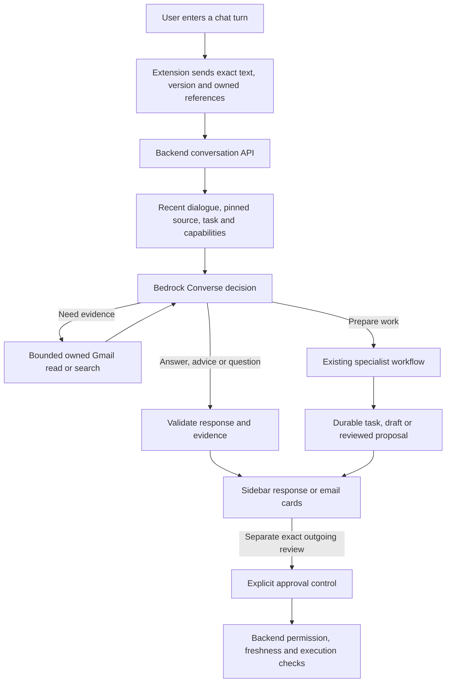

# Conversational panel — implementation and acceptance

Extension PR #50 is the client of backend PR #49, whose model/prompt release is
`contextual-conversation-1.1.1`. The earlier 23 September adapter and
[inbox-chat](inbox-chat.md) releases are historical baselines, not the
ordinary-chat route in this build.

## Product behavior

Threadly is a conversation beside Gmail. The primary interaction is one request
box and an optional pinned email, not a category selector. A slim header holds
the conversation title, menu and new-conversation action. Suggestions submit
ordinary turns. Results are readable answers, up to five email cards per search
page, durable task artifacts, drafts or meeting options. Copy, insertion,
approval and external execution remain separate controls.

The reference was the installed Superhuman Go extension in **Microsoft Edge**, on
its public introductory page: compact header, contextual suggestions, a source
chip, a bottom composer and direct answer actions. Its public-page summary was
observed. No private mailbox content was sent to the reference product. Threadly
uses its own icons, styling and implementation. This is an interaction reference,
not a claim of feature parity or a copy of proprietary assets.

### A typical conversation

1. Open Threadly beside an email. It retrieves the open thread once through the
   backend, using provider identifiers rather than browser message bodies. The
   source chip names the selected email.
2. Ask “Summarise this for me.” The backend conversation coordinator can select
   the existing summary workflow and return a durable task. The panel shows
   progress and the resulting artifact.
3. Ask a factual follow-up. The selected source and task references stay
   attached; the coordinator can read bounded evidence and answer with quotes.
4. Ask for a reply, ask whether a no-reply receipt needs one, or ask to revise a
   draft. The backend decides whether to advise, ask for a missing field, create
   a draft or save an unreviewed revision. A single typed answer can go in the
   main input; multi-field questions use the inline form.
5. Review any generated draft. Copy, insert body and Send are distinct. Sending
   requires a separate exact-content preview, explicit approval and enabled
   backend permission gates; an ordinary chat message cannot approve an action.

Navigating to another Gmail page does not silently switch an existing conversation's
source. Use **+ → Use open Gmail thread**, ask for emails and choose a card, or
start a new conversation to change it.
The context chip exposes included messages and an explicit message target. Message
ordinals preserve the displayed Gmail order. **Rewrite selected message** produces
a text suggestion through the existing bounded read adapter; it does not send or
replace the original email.

## Routing and state boundaries

- Ordinary requests go to `POST /assistant/conversation-turns` with the exact
  user text, `conversation_id`, `expected_version`, `request_id`, timezone and
  optional owned source/task references. The browser does not classify an
  intent, prepend a previous instruction or reinterpret a greeting. The five
  intent categories guide specialist workflows only when the backend chooses
  to prepare work.
- “Show me all GYG emails” and “show more” remain chat turns. The backend
  extracts a literal query, searches Gmail on demand in a bounded window and
  returns no more than five cards per page. Dates and coverage are shown; the
  cards do not imply an exhaustive mailbox search or a proven latest order.
  Selecting a card explicitly pins its owned one-message source.
- Compound work and scheduling return a complete saved proposal when needed.
  The user confirms its plan hash separately before the saved workflow runs.
  Partial work is not displayed as a completed multi-step request.
- An active typed question can be answered through chat, where the backend
  validates the answer against the saved question. Multiple fields remain in
  the inline form. “Send it” in chat is never an email or event approval.
- An ordinary wording follow-up uses server-held history and the current task
  or draft. A draft revision invalidates the old outgoing review. Explicit
  selected-message rewrite still calls `/assistant/requests` with
  `read_options.transform_text` and exactly one selected message.
- The sidebar stores only the conversation ID/version and any exact unfinished
  turn in extension session storage. It reloads encrypted, bounded backend
  history in the same browser session. Search snippets/cards are not restored;
  ask to search again. **Recent work** lists durable tasks and drafts, not the
  full chat transcript. Deleting a chat keeps those tasks and action records.
- An uncertain turn is retried with the identical request ID and body. Another
  message is blocked until that turn resolves or the user starts a new chat.
  A changed or unavailable pinned email asks for an explicit new source or for
  the user to continue without email context.
- Draft editing preserves immutable revisions, invalidates old outgoing review,
  and retains separate Copy / Insert / Send behavior. Calendar options still
  require a fresh availability check and exact event review.

## Implementation map

| Area | Files | Backend contract |
| --- | --- | --- |
| Shell, composer, suggestions, menus | `sidepanel.tsx`, `style.css`, `components/Icon.tsx` | Authentication, capabilities and exact user turn |
| Pinned source and message order | `lib/context.ts`, `components/ContextPicker.tsx` | Owned thread read and context snapshot |
| Chat turns and recovery | `lib/use-assistant.ts` | Conversation turn, get and delete endpoints; version and idempotency |
| Email cards | `components/InboxCards.tsx` | Bounded search page returned by the conversation API |
| Task and clarification lifecycle | `lib/use-assistant.ts`, `components/TaskCard.tsx` | Durable task, typed input and proposal confirmation |
| Draft and outgoing review | `components/ArtifactCard.tsx` | Immutable revisions, exact action preview and approval |
| Calendar | `components/Settings.tsx`, `components/Booking.tsx` | Preferences, offers, recheck and exact event actions |

No new extension runtime dependency, browser permission, direct provider API
or public AI key is introduced by this integration. The backend does add a
conversation schema migration and versioned model prompt. Flight cards are
decorative and require explicit route codes; they do not track a live flight.
Dictation only fills the input. No mailbox sync or automatic provider write is
added. The backend retains bounded short answers and evidence quotes, which
may contain email-derived text; no mailbox import is not a claim of zero
retention. Its `docs/contextual-conversation.md` details those boundaries.

## Verification

The extension's deterministic tests exercise the packaged browser bridge and UI
with a fake API. Unit/controller checks cover ordinary turns without client
intent rules, versioning, exact uncertain-turn retry, restored context, search
pagination, chat deletion and approval boundaries. Five packaged Chromium
scenarios cover greeting, cards, 320 px light/dark layout, summary/refinement,
factual follow-up, draft review, proposal confirmation, Calendar settings,
Recent work and disconnected-login recovery. Keyboard Enter submits,
Shift+Enter adds a line, IME composition does not submit, and reduced motion
is respected. The fake API maps sample phrases to fixture outcomes; these
tests do not measure a live model's semantic quality.

### Deployment dependency and limits

Backend PR #49 must be merged and deployed before this extension is used with
EC2. Its migration is `c23026e9a039` and its chat endpoint is disabled by
default. Set `CONVERSATION_ENABLED=true` only with the reviewed Sydney Bedrock
profile and after the operator reviews the account's model-content and
invocation-logging boundary; `BEDROCK_MAIL_PROCESSING_ACKNOWLEDGED=true` is a
manual acknowledgement, not a technical audit. Keep email and Calendar writes
disabled for the initial read/generation smoke. A disabled chat endpoint
returns `conversation_disabled` rather than falling back to browser rules.

The backend synthetic two-trial Bedrock replay passed 26/26 versioned cases on
24 September 2026. This is real model invocation over fake mail tools, not a
live Gmail test or a general correctness guarantee. Run the extension's opt-in
`scripts/live-smoke.mjs` after deployment and the local SSM tunnel to assess
actual read/generation behavior with an existing private session. It never
sends or books. Interactive Google OAuth, real Edge UI, Gmail insertion,
mailbox-specific quality and controlled write/recovery remain separate
acceptance gates. Arbitrary web pages, attachments and a general cross-app
assistant are not implemented by this release.

### Historical live acceptance — 23 September 2026

Built extension → laptop SSM tunnel → EC2 release
`6533e3d511fa9b592fbb8463f18a10a9d85daf9b` → Google / Bedrock passed:

1. Bounded GYG search and owned selected context.
2. Automatic summary routing, then “Make it shorter” against its original source.
3. Grounded factual follow-up in the same conversation.
4. Contextual reply clarification and readable draft.
5. New-email request with no mail source, followed by a recipient answer in chat.
6. Calendar metadata/settings load, then return to the intact conversation.

The helper used an existing private authenticated session in an isolated Chromium
profile, deleted after the run. No raw email, generated private text, session or
live screenshot is committed. No send, booking, mailbox import or preference write
was performed. This earlier run predates backend PR #49 and does not certify the
new conversation API. The baseline integration evidence remains in the handoff.

Current limits: up to 12 backend-retained exchanges, one active task and one
search result set in working context; arbitrary long-running autonomous
planning is not implemented. Semantic factual correctness still requires
human assessment beyond exact-quote validation.
