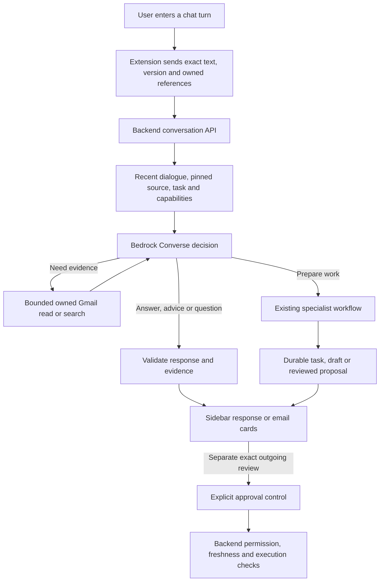

# Conversational panel — implementation and acceptance

Email drafting clarification (backend conversation 1.8.6) arrives as an ordinary
chat question, with no task status, preparation promise or retry button. Follow-up
details use the same conversation/version. Named-recipient drafts render as text
with a generated subject and body; they carry no send or approval control. Existing
address-bound draft artifacts retain their review and action gates. Unsupported
historical tasks use neutral UI copy instead of rendering planner rationale.

The drafting companion was checked with typechecking, 222 unit tests, 29 release
helper tests, and all 36 browser checks, including the separately configured
public-origin packaging test. That test uses an empty profile and rejects the
sign-in permission request; it does not authenticate to the public backend.

Extension PR #50 is the client of backend PR #49, whose model/prompt release is
`contextual-conversation-1.1.1`. The earlier 23 September adapter and
[inbox-chat](inbox-chat.md) releases are historical baselines, not the
ordinary-chat route in this build.

## Product behavior

Threadly is a conversation beside Gmail. The primary interaction is one request
box and an optional pinned email, not a category selector. A slim header holds
the conversation title, menu and new-conversation action. Suggestions submit
ordinary turns. Results are readable answers, up to five email cards per search
page, durable task artifacts, drafts or meeting options. Copy, insertion,
approval and external execution remain separate controls.

The reference was the installed Superhuman Go extension in **Microsoft Edge**, on
its public introductory page: compact header, contextual suggestions, a source
chip, a bottom composer and direct answer actions. Its public-page summary was
observed. No private mailbox content was sent to the reference product. Threadly
uses its own icons, styling and implementation. This is an interaction reference,
not a claim of feature parity or a copy of proprietary assets.

### A typical conversation

1. Open Threadly beside an email. It retrieves the open thread once through the
   backend, using provider identifiers rather than browser message bodies. The
   source chip names the selected email.
2. Ask “Summarise this for me.” The backend conversation coordinator can select
   the existing summary workflow and return a durable task. The panel shows
   progress and the resulting artifact.
3. Ask a factual follow-up. The selected source and task references stay
   attached; the coordinator can read bounded evidence and answer with quotes.
4. Ask for a reply, ask whether a no-reply receipt needs one, or ask to revise a
   draft. The backend decides whether to advise, ask for a missing field, create
   a draft or save an unreviewed revision. A single typed answer can go in the
   main input; multi-field questions use the inline form.
5. Review any generated draft. Copy, insert body and Send are distinct. Sending
   requires a separate exact-content preview, explicit approval and enabled
   backend permission gates; an ordinary chat message cannot approve an action.

Navigating to another Gmail page does not silently switch an existing conversation's
source. Use **+ → Use open Gmail thread**, ask for emails and choose a card, or
start a new conversation to change it.
The email chip sits inside the composer. Its subject opens included-message
details directly above the composer; its separate remove button detaches the
email without opening a menu. A detach remains visible if the side panel
reopens during the same browser session. The next chat turn sends an explicit
null source so the backend clears the conversation pin. Message
ordinals preserve the displayed Gmail order. **Rewrite selected message** produces
a text suggestion through the existing bounded read adapter; it does not send or
replace the original email.

## Routing and state boundaries

```mermaid
flowchart TD
    A[User enters a chat turn] --> B[Extension sends exact text, version and owned references]
    B --> C[Backend conversation API]
    C --> D[Recent dialogue, pinned source, task and capabilities]
    D --> E[Bedrock Converse decision]
    E -->|Need evidence| F[Bounded owned Gmail read or search]
    F --> E
    E -->|Answer, advice or question| G[Validate response and evidence]
    E -->|Prepare work| H[Existing specialist workflow]
    G --> I[Sidebar response or email cards]
    H --> J[Durable task, draft or reviewed proposal]
    J --> I
    I -->|Separate exact outgoing review| K[Explicit approval control]
    K --> L[Backend permission, freshness and execution checks]
```

- Ordinary requests go to `POST /assistant/conversation-turns` with the exact
  user text, `conversation_id`, `expected_version`, `request_id`, timezone and
  optional owned source/task references. The browser does not classify an
  intent, prepend a previous instruction or reinterpret a greeting. The five
  intent categories guide specialist workflows only when the backend chooses
  to prepare work.
- “Show me all GYG emails” and “show more” remain chat turns. The backend
  extracts a literal query, searches Gmail on demand in a bounded window and
  returns no more than five cards per page. Dates and coverage are shown; the
  cards do not imply an exhaustive mailbox search or a proven latest order.
  Selecting a card explicitly pins its owned one-message source.
- Compound work and scheduling return a complete saved proposal when needed.
  The user confirms its plan hash separately before the saved workflow runs.
  Partial work is not displayed as a completed multi-step request.
- An active typed question can be answered through chat, where the backend
  validates the answer against the saved question. Multiple fields remain in
  the inline form. “Send it” in chat is never an email or event approval.
- An ordinary wording follow-up uses server-held history and the current task
  or draft. A draft revision invalidates the old outgoing review. Explicit
  selected-message rewrite still calls `/assistant/requests` with
  `read_options.transform_text` and exactly one selected message.
- The sidebar stores only the conversation ID/version and any exact unfinished
  turn, plus a temporary detached-source marker or replacement email identifiers,
  in extension session storage. It does not store that email's contents there.
  It reloads encrypted, bounded backend history in the same browser session.
  Search snippets/cards are not restored;
  ask to search again. **Recent work** lists durable tasks and drafts, not the
  full chat transcript. Deleting a chat keeps those tasks and action records.
- The composer waits for saved conversation and email-source restoration before
  it accepts a new turn. A late source fetch cannot reattach an email after the
  user changes or clears the selection. If restoring the saved chat fails, the
  panel keeps it intact and asks the user to reopen Threadly or explicitly start
  a new conversation.
- An uncertain turn is retried with the identical request ID and body. Another
  message and any change to its email source are blocked until that turn resolves
  or the user starts a new chat. A tool-limit response retains that exact retry.
  If an older browser lost the original body, the panel offers explicit recovery
  using the server's pending request ID and version. It restores saved work as
  an assistant result. Cancellation is offered separately only after the server
  reports no saved result, and is still subject to the backend's active-lease and
  linked-work checks. Neither recovery nor cancellation approves an event.
  A changed or unavailable pinned email asks for an explicit new source or for
  the user to continue without email context.
- Draft editing preserves immutable revisions, invalidates old outgoing review,
  and retains separate Copy / Insert / Send behavior. Calendar options still
  require a fresh availability check and exact event review.

## Implementation map

| Area | Files | Backend contract |
| --- | --- | --- |
| Shell, composer, suggestions, menus | `sidepanel.tsx`, `style.css`, `components/Icon.tsx` | Authentication, capabilities and exact user turn |
| Pinned source and message order | `lib/context.ts`, `components/ContextPicker.tsx` | Owned thread read and context snapshot |
| Chat turns and recovery | `lib/use-assistant.ts` | Conversation turn, get and delete endpoints; version and idempotency |
| Email cards | `components/InboxCards.tsx` | Bounded search page returned by the conversation API |
| Task and clarification lifecycle | `lib/use-assistant.ts`, `components/TaskCard.tsx` | Durable task, typed input and proposal confirmation |
| Draft and outgoing review | `components/ArtifactCard.tsx` | Immutable revisions, exact action preview and approval |
| Calendar | `components/Settings.tsx`, `components/Booking.tsx` | Preferences, offers, recheck and exact event actions |

No new extension runtime dependency, browser permission, direct provider API
or public AI key is introduced by this integration. The backend does add a
conversation schema migration and versioned model prompt. Flight cards are
decorative and require explicit route codes; they do not track a live flight.
Dictation only fills the input. No mailbox sync or automatic provider write is
added. The backend retains bounded short answers and evidence quotes, which
may contain email-derived text; no mailbox import is not a claim of zero
retention. Its `docs/contextual-conversation.md` details those boundaries.

## Verification

The extension's deterministic tests exercise the packaged browser bridge and UI
with a fake API. Unit/controller checks cover ordinary turns without client
intent rules, versioning, exact uncertain-turn retry, restored context, search
pagination, chat deletion and approval boundaries. Five packaged Chromium
scenarios cover greeting, cards, 320 px light/dark layout, summary/refinement,
factual follow-up, draft review, proposal confirmation, Calendar settings,
Recent work and disconnected-login recovery. Keyboard Enter submits,
Shift+Enter adds a line, IME composition does not submit, and reduced motion
is respected. The fake API maps sample phrases to fixture outcomes; these
tests do not measure a live model's semantic quality.

### Deployment dependency and limits

Backend PR #49 must be merged and deployed before this extension is used with
EC2. Its migration is `c23026e9a039` and its chat endpoint is disabled by
default. Set `CONVERSATION_ENABLED=true` only with the reviewed Sydney Bedrock
profile and after the operator reviews the account's model-content and
invocation-logging boundary; `BEDROCK_MAIL_PROCESSING_ACKNOWLEDGED=true` is a
manual acknowledgement, not a technical audit. Keep email and Calendar writes
disabled for the initial read/generation smoke. A disabled chat endpoint
returns `conversation_disabled` rather than falling back to browser rules.

The backend synthetic two-trial Bedrock replay passed 26/26 versioned cases on
24 September 2026. This is real model invocation over fake mail tools, not a
live Gmail test or a general correctness guarantee. Run the extension's opt-in
`scripts/live-smoke.mjs` after deployment and the local SSM tunnel to assess
actual read/generation behavior with an existing private session. It never
sends or books. Interactive Google OAuth, real Edge UI, Gmail insertion,
mailbox-specific quality and controlled write/recovery remain separate
acceptance gates. Arbitrary web pages, attachments and a general cross-app
assistant are not implemented by this release.

### Historical live acceptance — 23 September 2026

Built extension → laptop SSM tunnel → EC2 release
`6533e3d511fa9b592fbb8463f18a10a9d85daf9b` → Google / Bedrock passed:

1. Bounded GYG search and owned selected context.
2. Automatic summary routing, then “Make it shorter” against its original source.
3. Grounded factual follow-up in the same conversation.
4. Contextual reply clarification and readable draft.
5. New-email request with no mail source, followed by a recipient answer in chat.
6. Calendar metadata/settings load, then return to the intact conversation.

The helper used an existing private authenticated session in an isolated Chromium
profile, deleted after the run. No raw email, generated private text, session or
live screenshot is committed. No send, booking, mailbox import or preference write
was performed. This earlier run predates backend PR #49 and does not certify the
new conversation API. The baseline integration evidence remains in the handoff.

Current limits: up to 12 backend-retained exchanges, one active task and one
search result set in working context; arbitrary long-running autonomous
planning is not implemented. Semantic factual correctness still requires
human assessment beyond exact-quote validation.

## Clickable Calendar destinations (2026-10-05)

Creation clarifications now render the backend's `calendar_choices` as neutral,
wrapping buttons. Only options marked `access: "editable"` appear. The selected
label is display data; the client sends its opaque `choice_id` to
`POST /assistant/conversations/{id}/calendar-choice` with a fresh `request_id`
and the displayed conversation's `expected_version`. It does not send a generated
instruction, provider calendar ID, or event fields. The backend resumes its owned
pending creation and validates the choice's account, expiry, preferences and ACL.

Buttons are bound to their original conversation/version, expire while displayed,
and disable during submission or recovery. Repeated clicks cannot start multiple
requests. A transport failure retains the exact selection identity and endpoint
for retry, including after the panel reopens. The current server choices can also
be restored from conversation GET or from a recovered clarification. A settings
change can return fresh choices for the user to select; none is chosen automatically.

The event result retains the existing exact approval card. Choosing a destination
does not change Ask/Always settings. Read-only calendars are never offered as
writable destinations. The companion backend Calendar follow-up is required for
choice issuance, selection, retained title/date/time and corrected access labels.
This frontend contains no natural-language calendar resolution or write authority.

The picker is based on merged recovery PR #91 (`b38a08b`) and preserves the merged
settings redesign. Local checks: 162 unit/controller tests, 32 packaged Chromium
tests, TypeScript, formatting and both builds passed. The public-origin test is
skipped in the local build and passed separately in the public build. The browser
scenario uses synthetic Meeting/4 p.m./tomorrow data,
tests keyboard selection, panel reopen, exact retry and Ask approval at 320px in
light/dark themes. It is UI/protocol evidence, not a live model or Google write test.

## Calendar request recovery (2026-09-29)

Failed and expired proposals render an honest status with a Try request again
button. They do not show internal reason codes, ready-for-review wording or
Continue controls. Retry submits a new request; external writes still require
their separate exact approval. Historical failed cards receive the same rendering.
The setup banner now says Calendar connected: saved preferences and OAuth
readiness do not establish complete coverage for every provider read.

Verification: 101 frontend tests passed, TypeScript check and production build
passed. Built against merged frontend `ea905b1`, preserving the voice changes.

### Interrupted conversations (2026-10-05)

The reported sequence was a time-first booking (`book 2 pm tmrw for doctors
appointment`) reaching `conversation_tool_limit`, followed by an availability
question getting stuck on `conversation_retry_required`. The client now preserves
the exact frozen booking request after a tool-limit error and reconciles the
pending server request before offering a retry. It never replays a new question
under an older request ID.

For legacy chats with no matching local request body, **Recover unfinished
response** calls `POST /assistant/conversations/{id}/recover` with
`pending_request_id`, `expected_version`, and `operation: "recover"`. Only a
`conversation_result_unavailable` response makes **Cancel unfinished request**
available; that separate click uses `operation: "cancel"`. Busy, changed, or
linked-work responses keep the chat blocked. A dropped recovery response can be
replayed with the same request identity. Returned conversation ID, recovered
request ID, and resulting version must match before the client resumes the chat.

Recovered tasks, proposals, and event actions use the existing typed cards and
approval controls. They do not fabricate a user instruction from saved output.
In particular, only a confirmed succeeded action displays **Event created**;
queued, uncertain, failed, and cancelled actions retain their own status.

This frontend change is based on merged settings PR #90 (`ee115b3`) and leaves
its Connectors/CSS implementation intact. Legacy recovery requires the separate
backend Calendar wording/recovery follow-up and its `/recover` endpoint. The
client keeps unfinished work blocked if that endpoint is unavailable. The backend
owns booking interpretation, date/time normalization and timed availability;
fake-API frontend checks are not evidence of live model interpretation.

Local verification: 152 unit/controller tests, 31 packaged Chromium scenarios,
TypeScript, formatting, local and public-origin builds passed. The public-origin
scenario is skipped in the local build and checked separately against the public
build. All 29 release-tool tests passed. Browser recovery cases cover the exact
booking retry, explicit cancellation after busy/no-result responses, same-chat
2 p.m. availability follow-up, and saved assistant-only recovery. Controller
cases additionally cover saved event/task work, concurrent work, dropped recovery
responses and mismatched ownership/version. No real Google writes were used.

## Direct Calendar events and approval menu (0.2.3)

The composer shield opens two choices: Ask for approval (default) and Always
allow for Calendar events in this chat. The setting is saved on the backend,
versioned, and bound to the signed-in account. New chats ask again; email still
needs approval. A failed save is reread and never optimistically shown as granted.

Direct event results use a compact card with title, resolved date/time/timezone,
destination and any guest invitations. Create approves its exact payload. Queued,
creating, confirmed, stopped and uncertain outcomes have separate wording. History
stores the action ID and reloads current status rather than reusing stale success
text. Polling is bounded, with a manual Refresh status action.

Calendar settings show Create events as a skill and an Enable event creation
button when the backend pilot permits it but Google consent is missing. Granting
Calendar access does not enable Always allow. Google reconnection invalidates
old account-bound chats; start a fresh chat after completing the connection.

Validation for 0.2.3: 128 frontend unit tests, 22 offline browser tests and the
separate production-origin browser test passed; all 29 release-packaging tests
passed. Type checking and the public build passed. A deferred-response regression
covers switching chats during an approval save; stale results cannot change the
new chat's displayed mode. Visual review covered the compact event card and menu.
