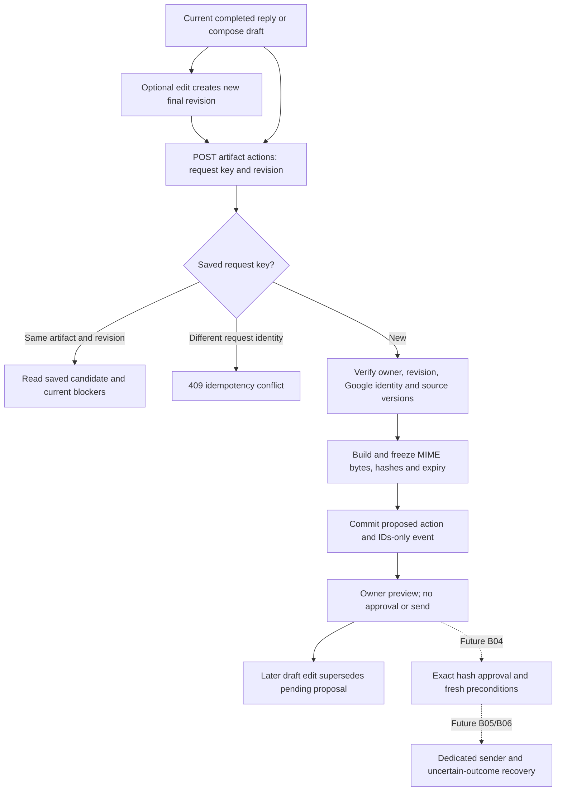

# Exact email action previews — B03

The backend now turns the current completed reply/compose draft into an immutable
`send_email` proposal. It stores the exact MIME bytes and shows their envelope and
body to the owning user. Creating or reviewing this proposal does not approve or
send it. [B04 approval/stop services](action-approval.md) are implemented for review;
new public approval, dispatch (B05) and uncertain-send recovery (B06) remain disabled.

## API and frontend handoff

Authenticated `POST /assistant/artifacts/{artifact_id}/actions` returns **201**:

```json
{"request_id":"preview-unique-user-key","expected_revision":2,"action_type":"send_email"}
```

The request cannot supply body, recipients, MIME, sender, user ID or approval.
Those come from the current owned artifact and its edited `draft_envelope`, never
from the original task recipients. Extra keys return the existing sanitized 422
envelope. Other-owner/unknown artifacts and actions return 404. Stale revision or
non-current/non-completed drafts return 409 `revision_conflict`.

`GET /assistant/actions/{action_id}` returns the same saved candidate with current
blockers. Both responses have `Cache-Control: no-store`. The typed contract is
[`EmailActionView`](../backend/app/schemas/actions.py). Response fields:

| Field | Meaning |
|---|---|
| `action_id`, `task_id`, `artifact_id`, `action_type` | Owned, immutable action identity |
| `state`, `version` | Durable action state/version; initially proposed/1 |
| `payload_schema` | `email-mime-1.0.0` |
| `payload_hash` | Canonical schema + full payload digest from B02, for future approval |
| `mime_sha256` | SHA-256 of the stored raw MIME bytes |
| `expires_at` | Database time at creation + 30 minutes; replay does not extend it |
| `preview` | From, To, Cc, Bcc, subject, canonical body, Date, Message-ID, In-Reply-To, References and Gmail thread ID |
| `account_version` | Captured Google permission/account version |
| `blockers` | Current eligibility failures, including `send_executor_unavailable` in this release |
| `approval_available`, `sending_available`, `authorization` | False, false; authorization is `none` until a historical exact approval exists (B04) |

Bcc is deliberately visible in the owner's preview; clients must display it before
any future approval. Raw `mime_base64url` is private backend storage, not returned
by these endpoints or task events. Normal authenticated artifact APIs still expose
the user's own draft. Mark reviewed, copy and insert retain their existing semantics.
Legacy integer `/draft*` routes remain explicit 501 stubs.

## Lifecycle and routing



The public input's replay identity is artifact ID + revision + action type under a
user-scoped request key. Repeating it returns the original action even after edits,
expiry or disconnection; mutable blockers/state may differ. A new key creates a new
proposal with its own Date/Message-ID/hash. Never interpret an HTTP retry as a new
approval. The saved payload, Date, Message-ID and expiry are not regenerated on reads.

Task locks serialize proposal creation with draft edits and duplicate requests.
The caller owns the transaction; helpers do not commit or call Google/Bedrock.
An edit supersedes pending proposals atomically through B02. Source/account checks
are snapshots, not remote locks or guarantees: sync or reconnect may change them
immediately afterward. GET detects observed changes. B04 and dispatch must perform
their own fresh checks and exact payload/account/source binding.

## MIME and source contract

- Plain-text UTF-8, base64 content encoding, SMTP CRLF serialization and folded
  headers. Canonical visible body uses LF and gains a terminal newline if absent;
  otherwise body content is preserved. An independent parser verifies equivalence.
- Primary verified connected Google account only, with credentials available in
  stored metadata. No aliases, attachments, display-name recipient strings or
  internationalized email addresses. Up to 20 distinct explicit recipients across
  To/Cc/Bcc; at least one To. Addresses use the existing normalization/validators.
- Unresolved fields, bracket placeholders and template placeholders block creation.
  Subject/body validation reuses explicit-edit rules. Raw MIME is capped at 64,000
  bytes; B02 additionally caps JSON payload + source metadata at 128,000 bytes.
  No silent recipient, body, header or attachment truncation occurs.
- Replies require consistent reply mode, thread reference, owned synced message,
  original subject binding and thread version. Missing/corrupt binding cannot become
  a new message. The existing reply subject remains exactly the draft's `Re:` subject.
- Sync metadata schema `1.0` must contain Message-ID, References and In-Reply-To
  entries, even when the latter lists are empty. Duplicate headers, unsafe controls,
  malformed/ambiguous IDs or incomplete legacy metadata block creation. Accepted
  IDs are a bounded ASCII subset, not all legal RFC syntax; unusual mail may require
  refreshed/rebound context. References preserve chain order, remove repeats and
  append the target Message-ID; fallback uses a single In-Reply-To parent.
- Sources bind the artifact's effective context snapshot, source hash and thread
  version (including clarification context), plus reply metadata hash. Current
  Google subject, account version and actual scopes are saved as source metadata.
  Changed/foreign sources cannot produce a fresh proposal.

A connected read-only account may create an inspectable proposal. The response
reports `gmail_send_scope_missing` or `_unknown`; it does not request or fabricate
a write grant. Remote revocation is not checked by preview generation. No provider
access, network egress or billed inference is needed for this path.

Creation blockers return 409 `email_preview_blocked` with a `blockers` array:
`google_reconnect_required`, `draft_envelope_unavailable`, `draft_envelope_invalid`,
`sender_changed`, `draft_content_invalid`, `recipients_required`, `unresolved_fields`,
`attachments_unsupported`, `email_too_large`, `source_changed`,
`reply_headers_unavailable`, `reply_headers_invalid`, `reply_context_changed`.
The B02 size cap returns 422 `action_payload_too_large`. Reads additionally report
expiry, supersession, artifact/account changes and non-proposed state without
rewriting historical payloads. Unsupported stored payload schemas return
409 `action_preview_unavailable`.

## Release and next implementation

No migration, settings, AWS resources, dependencies or prompt/Flow changes. Current
Alembic head remains `f1a2b3c4d5e6`; deploy matching merged code with the existing
backup/migrate/restart procedure. No automatic Git-to-EC2 synchronization is added.
This feature branch is not the pinned deployment target until reviewed and merged.

B04 consumes these exact saved hashes/versions internally and creates explicit approval with
revalidation; it must not rebuild bytes or confuse DraftReview with authorization.
B05 sends only approved persisted MIME; B06 must reconcile lost responses before
retry. Keep writes disabled until controlled Gmail tests verify actual threading,
To/Cc/Bcc delivery and timeout/recovery. Independent parsing proves local encoding,
not Google's delivery or deduplication behavior.

Provider contracts: [Gmail sending](https://developers.google.com/workspace/gmail/api/guides/sending)
and [thread requirements](https://developers.google.com/workspace/gmail/api/guides/threads).
Tests/checkpoint: [B03 evidence](backend-execution/checkpoints/B03.md).

B04 adds rejection/cancellation and current decision metadata to this API; see
[the approval contract](action-approval.md) for historical approval versus current state.
