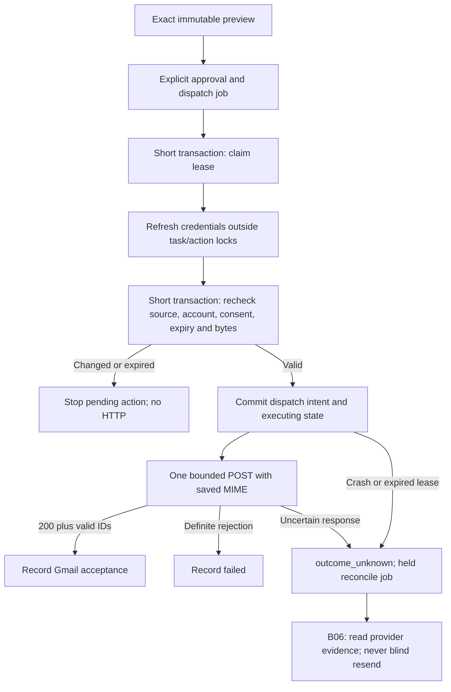
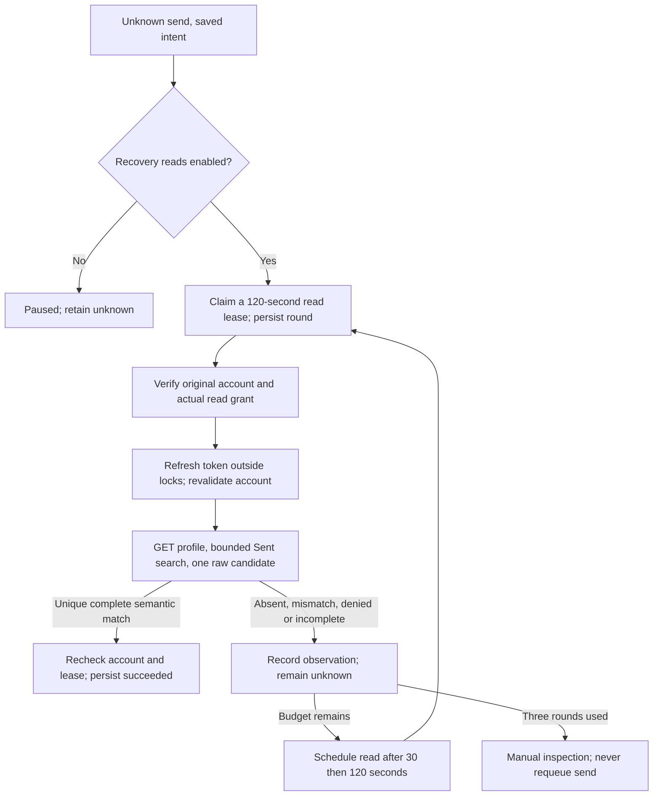

# Gmail actions and recovery — B05/B06

The dedicated worker now consumes internally approved email jobs and sends the
exact saved MIME through a bounded Gmail adapter. **Live sending and new public
approval remain disabled.** B06 adds bounded read-only reconciliation;
controlled-account verification is still required before enabling sends. No EC2
deployment or Google call was performed during this implementation.

## Implementation map

| Responsibility | Source |
|---|---|
| Owned proposal, MIME and source/account snapshot | `backend/app/actions/email_preview.py`, `email_payload.py` |
| Exact approval, outbox and durable stop receipts | `backend/app/actions/approval.py` |
| Claim, preflight, dispatch intent, result fencing and expired intent recovery | `backend/app/actions/worker.py` |
| Fixed Gmail endpoint, frozen request validation and response classification | `backend/app/actions/gmail_sender.py` |
| Bounded Sent lookup and semantic MIME comparison | `backend/app/actions/gmail_reconciliation.py` |
| Durable recovery rounds, account fencing and result persistence | `backend/app/actions/reconciliation.py` |
| Public result / error / recovery fields | `backend/app/schemas/actions.py` |
| Concurrency, transport and injected failures | `backend/tests/test_gmail_action_worker.py` |
| Real migration guards and model parity | `backend/tests/test_action_worker_migrated.py` |

There is no model, Flow, MIME regeneration or recipient lookup in the executor.
Generation jobs and action jobs have separate workers and lifecycles. Classifier
output, draft review and an assistant saying “sent” cannot authorize this worker.

## Lifecycle and transaction boundaries

1. Claims lock the owning task first with `SKIP LOCKED`, then action/job. A claim
   is **not** dispatch intent. Credential refresh is outside these transactions.
   Up to three preflight claims are allowed; a transient credential failure can
   requeue after 30 seconds. A held preflight job requires inspection or cancellation
   and a new reviewed action; no unbounded credential loop is installed.
2. Preflight takes task → action → account → job locks. It rechecks the current
   artifact/context, Google identity/account version and actual scopes, credential
   metadata, approval hash/version/expiry, and MIME/whole-payload hashes. It does
   not read Google mailbox content remotely. The token helper owns its separate
   refresh transactions and fences changed connections.
3. One transaction inserts `ActionAttempt(state=dispatched)` **before** changing
   the action to executing. This commit is the cancellation cutoff. A crash before
   commit leaves no attempt; an expired claim can safely be reclaimed. A crash
   after commit is uncertain even if the process never reached HTTP.
4. The POST uses only the frozen `mime_base64url` and optional saved Gmail
   `threadId`. It has no automatic retry or redirect, a 35-second total deadline,
   a 16 KiB response cap and sanitized evidence. No database transaction remains
   open across this call. Editing/cancelling/disconnecting can complete while it
   is blocked; a post-cutoff cancellation records intent, not recall or non-send.
5. Completion requires the original lease, action version and dispatched attempt.
   Attempt evidence and terminal action/job/event commit together. A stale result
   can append one bounded `late_response` observation to a nonterminal attempt;
   it cannot overwrite a terminal state or enqueue another send. If result commit
   fails, the durable intent remains for lease recovery.
6. Expired executing jobs become `outcome_unknown` with a held reconciliation job,
   including when writes are disabled. A corrupt executing record without an
   attempt is held with `action.recovery_required`; it never fabricates a result.

Lease duration defaults to 120 seconds (permitted 60–300). There is no heartbeat
or retry of the write. A slow preflight loses its lease before dispatch rather
than issuing a second POST. This prevents duplicate dispatch within Threadly's
job lifecycle; it is not a claim of provider exactly-once delivery.

## Result policy

| Observation | Persisted outcome | Automatic resend |
|---|---|---|
| HTTP 200, bounded valid JSON, valid message/thread IDs, matching reply thread | `succeeded`, `gmail_accepted` evidence and provider IDs | Never |
| Structured 400 `badRequest`, 401 `authError`, or 403 `domainPolicy` / `insufficientPermissions` / `forbidden` | `failed`, sanitized rejection code | Never |
| 403 rate limit, 429, 5xx, redirect, unrecognized error, invalid/duplicate JSON, wrong/missing IDs or oversized response | `outcome_unknown` | Never |
| Timeout, disconnect, unexpected interruption, expired committed dispatch lease | `outcome_unknown` | Never |
| Write gate disabled after intent but before HTTP begins | `failed`, `writes_disabled_before_http`; no POST | Never |

`succeeded` means **Gmail accepted the API request with a valid message identity**.
It does not prove recipient delivery, inbox placement or that no later bounce
occurs. Gmail's documentation explicitly distinguishes API response and delivery
pipeline behavior. Our conservative treatment of 429/server errors is an application
policy; it avoids applying a generic retry rule to a possibly completed write.
Sources: [send API](https://developers.google.com/workspace/gmail/api/reference/rest/v1/users.messages/send),
[sending guide](https://developers.google.com/workspace/gmail/api/guides/sending),
[error handling](https://developers.google.com/workspace/gmail/api/guides/handle-errors).

The owned action read/decision response adds nullable `result` (Gmail message/thread
IDs on acceptance) and `error_code`. The state remains authoritative. An unknown
action is not “failed” or “not sent”; do not offer blind retry. Evidence/events
omit MIME, recipients, token and provider error text. Existing privacy and retention
rules for the saved exact payload still apply.

## Configuration and rollout

`EMAIL_WRITES_ENABLED=false` is the default. `RECOVERY_READY=False` is an additional
code gate: setting the environment flag alone cannot send live mail. Tests use an
explicit in-process `httpx.MockTransport`; HTTP requests cannot select that seam.
The public approval route and capability response remain disabled independently.
Settings are read per worker process; a future environment-based kill switch needs
matching process restarts and cannot recall an already dispatched request.

Root Compose has an optional `actions` profile with `action-worker`, using
`python -m app.actions.worker` and the shared database. It has no ML volume or model
dependency. For a configured local stack, `docker compose --profile actions up -d
action-worker` starts the disabled worker. No new migration or dependency is added;
head remains `a0426e9bc731`.

The B06 EC2 staging Compose/deploy script now starts the gated action worker with
the matching API image, stops both workers before backup/migration, and checks both
containers are running. The pinned merged-release handoff still excludes this
unmerged change. Preserve unknown attempts/history on restart or rollback. When
rolling back to a pre-B06 deployment script, explicitly stop the action-worker with
the current Compose configuration first: old scripts do not know that service.
Container-running checks are not provider/readiness verification. Do not enable
the code gate solely to try it.

## Recovery matching and limits (B06)

`EMAIL_RECONCILIATION_ENABLED=false` independently controls provider reads. Enabling
reads cannot enable sending, and disabling writes does not discard unknown attempts.
Worker order is expired dispatch intent → eligible reconciliation → new dispatch.
Recovery uses the saved payload and original Google subject, not the latest draft;
edits, cancellation requests or expiry cannot erase a historical send result.

A round uses at most five GETs: profile, up to three list pages (20 entries per
page), then one raw message. More than one unique candidate, duplicate IDs/pages,
truncated pagination, malformed output or an oversized response stays unknown.
Total lookup deadline is 35 seconds, per-request timeout 10 seconds, response cap
192,000 bytes and raw base64 cap 172,000 characters. No redirects or HTTP retries.
Credentials have their own bounded refresh calls outside this lookup budget.

Search uses backend-generated RFC Message-ID, `SENT`, and integer epoch bounds
from five minutes before dispatch to one hour after. Candidates outside this
window remain unresolved; this is a conservative product bound, not a guarantee
about Google's indexing or delivery timing. The profile email must match the saved
sender; local subject/verified identity/read scope are checked before and after
credential refresh. Completion rechecks current account version and read grants.
Reconnecting the **same** subject can restore reads even without send permission.

Only a unique candidate with matching Gmail ID/thread, SENT label and internal
message time can proceed to comparison. Plain-text MIME is compared semantically:
From/To/Cc/Bcc addresses, Subject, Message-ID, Date instant, In-Reply-To, References
and decoded body must match. Header folding, address display names/order, transfer
encoding and CRLF/LF differences may normalize; body whitespace is never stripped.
Attachments/multipart/HTML, duplicate critical headers, decoding defects or changed
content stay unknown. Extra Sender/Reply-To must also match. Missing Bcc when Bcc
was approved is **incomplete evidence**, not proof all recipients received the email.

A matching Sent record establishes the saved message's observable Sent identity,
not recipient delivery. Message-ID search alone is not proof. Conflicting late
send observations keep the action unknown; compatible late observations cannot
bypass the independent lookup or lease/account checks. Provider transformations
outside the supported equivalences fail conservatively.

Google sources: [search syntax and epoch dates](https://developers.google.com/workspace/gmail/api/guides/filtering),
[list pagination and scopes](https://developers.google.com/workspace/gmail/api/reference/rest/v1/users.messages/list),
[raw format](https://developers.google.com/workspace/gmail/api/reference/rest/v1/Format).
The metadata-only grant is insufficient for this path; actual Gmail read grants
are required. No free-form user/model search text enters these requests.

## Durable recovery and public status

No migration is added. `ActionAttempt.evidence.reconciliation` contains `rounds`
and up to three observations (`round`, sanitized `code`, UTC `at`). Claim persists
the round before network calls. Attempts interrupted by process death consume a
round; expired read leases are reclaimable under the remaining budget. Exhaustion
holds the job and preserves unknown state. `ActionJob.attempts` remains the separate
B05 preflight counter; recovery does not reset it or return the job to dispatch.
Terminal evidence is immutable. A failed result transaction leaves its read lease
for restart recovery; repeating a read cannot generate a POST.

GET/decision responses add nullable `recovery` with `status` (`paused`, `scheduled`,
`checking`, `manual_inspection`), `rounds`, `max_rounds`, `next_check_at`, `last_code`
and static guidance. These are owned/no-store responses; raw provider content and
tokens never appear. Events are `action.reconciliation_started`,
`action.reconciliation_observed`, `action.reconciliation_required` and existing
`action.state_changed`. Public status is observational, not a retry authorization.

A task with an executing/unknown send cannot produce another email action, even
after a draft edit. Previously created candidates get `previous_send_unresolved`
in their blockers; approval/preflight therefore cannot use them to bypass recovery.
The original proposal key may replay its historical action. A definitely rejected
send may get a **new** preview and later new exact approval once enabled. The old
failed action is never reset or reused. There is no force-failed, manual-resend or
budget-reset endpoint. Legacy send remains 501.

## Operator and controlled-account gate

1. For unknown mail, read the owned action and inspect Sent in the original Google
   account. Retain action/attempt/provider IDs; do not export message bodies/tokens
   to logs or incident tickets. An empty immediate search does not justify resend.
2. Reconnect the original account if scopes/credentials were lost. Recovery reads
   require a protected environment change and worker restart. Exhausted budgets
   stay manual; reconnect alone does not reset them. Do not edit database history
   to fabricate failure or requeue a write.
3. Stop new dispatch using the write flag and restart the worker when live rollout
   eventually exists; already committed intent remains uncertain until evidence
   resolves it. Recovery reads can stay enabled independently.
4. Before any release opens the compiled send gate/public approval, record explicit
   controlled-account authorization, sender and consenting test recipients, actual
   OAuth grants and exact deployed commit. Run one new mail and one reply with
   To/Cc/Bcc; verify threading and IDs from sender/recipient accounts. Use a reviewed
   integration harness and retain sanitized evidence, not ad-hoc database approvals.
5. Exercise a controlled accepted/lost-response case with that harness; verify only
   one POST, read-only resolution and honest handling of stripped Bcc, delayed
   indexing and ambiguous matches. Exercise restart and write-disable behavior.
   Do not promise exactly-once delivery or mark B06-A5 passed using fixtures.
6. Finish the explicit approval UI (frontend remains deferred), retention/recovery
   ownership and release monitoring before a user pilot. The current API cannot
   authorize a live send; this PR does not claim the end-to-end live gate is closed.

Evidence: [B06 checkpoint](backend-execution/checkpoints/B06.md),
[B05 checkpoint](backend-execution/checkpoints/B05.md). Prior contracts:
[approval](action-approval.md), [preview](email-action-previews.md),
[storage](assistant-action-storage.md).

## MVP pilot update

The combined MVP adds `WRITE_PILOT_USER_IDS`. `RECOVERY_READY=False` still blocks
general rollout, but explicitly enrolled users can exercise the exact-approval path
when `EMAIL_WRITES_ENABLED=true`; all other users remain disabled. Production preflight
requires the allowlist and `EMAIL_RECONCILIATION_ENABLED=true` for that pilot. This
supersedes the historical no-real-dispatch description above only for enrolled accounts.
No user is enrolled and no flag is enabled by deploying the code. See
[the rollout procedure](../infra/deploy/ec2/MVP-ROLLOUT.md).
