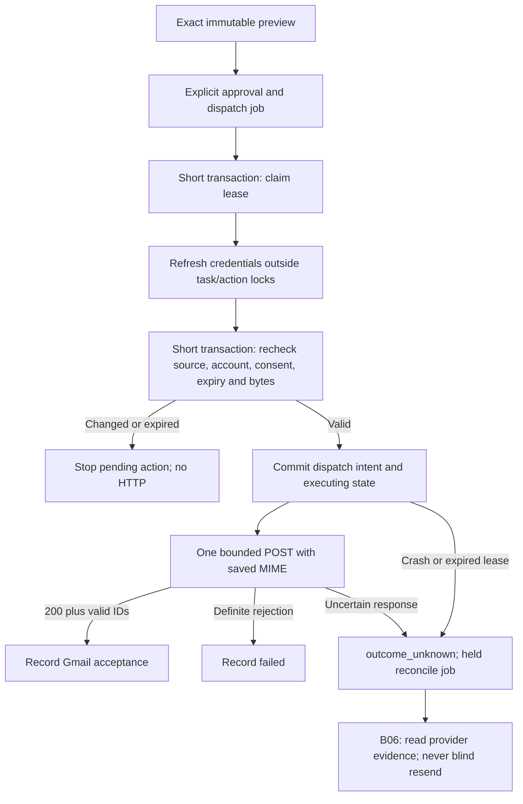

# Gmail action worker — B05

The dedicated worker now consumes internally approved email jobs and sends the
exact saved MIME through a bounded Gmail adapter. **Live sending and new public
approval remain disabled.** B06 reconciliation and controlled-account verification
are prerequisites to enabling them. No EC2 deployment or Google write was performed.

## Implementation map

| Responsibility | Source |
|---|---|
| Owned proposal, MIME and source/account snapshot | `backend/app/actions/email_preview.py`, `email_payload.py` |
| Exact approval, outbox and durable stop receipts | `backend/app/actions/approval.py` |
| Claim, preflight, dispatch intent, result fencing and expired intent recovery | `backend/app/actions/worker.py` |
| Fixed Gmail endpoint, frozen request validation and response classification | `backend/app/actions/gmail_sender.py` |
| Public result / error fields | `backend/app/schemas/actions.py` |
| Concurrency, transport and injected failures | `backend/tests/test_gmail_action_worker.py` |
| Real migration guards and model parity | `backend/tests/test_action_worker_migrated.py` |

There is no model, Flow, MIME regeneration or recipient lookup in the executor.
Generation jobs and action jobs have separate workers and lifecycles. Classifier
output, draft review and an assistant saying “sent” cannot authorize this worker.

## Lifecycle and transaction boundaries

1. Claims lock the owning task first with `SKIP LOCKED`, then action/job. A claim
   is **not** dispatch intent. Credential refresh is outside these transactions.
   Up to three preflight claims are allowed; a transient credential failure can
   requeue after 30 seconds. A held preflight job requires inspection or cancellation
   and a new reviewed action; no unbounded credential loop is installed.
2. Preflight takes task → action → account → job locks. It rechecks the current
   artifact/context, Google identity/account version and actual scopes, credential
   metadata, approval hash/version/expiry, and MIME/whole-payload hashes. It does
   not read Google mailbox content remotely. The token helper owns its separate
   refresh transactions and fences changed connections.
3. One transaction inserts `ActionAttempt(state=dispatched)` **before** changing
   the action to executing. This commit is the cancellation cutoff. A crash before
   commit leaves no attempt; an expired claim can safely be reclaimed. A crash
   after commit is uncertain even if the process never reached HTTP.
4. The POST uses only the frozen `mime_base64url` and optional saved Gmail
   `threadId`. It has no automatic retry or redirect, a 35-second total deadline,
   a 16 KiB response cap and sanitized evidence. No database transaction remains
   open across this call. Editing/cancelling/disconnecting can complete while it
   is blocked; a post-cutoff cancellation records intent, not recall or non-send.
5. Completion requires the original lease, action version and dispatched attempt.
   Attempt evidence and terminal action/job/event commit together. A stale result
   can append one bounded `late_response` observation to a nonterminal attempt;
   it cannot overwrite a terminal state or enqueue another send. If result commit
   fails, the durable intent remains for lease recovery.
6. Expired executing jobs become `outcome_unknown` with a held reconciliation job,
   including when writes are disabled. A corrupt executing record without an
   attempt is held with `action.recovery_required`; it never fabricates a result.

Lease duration defaults to 120 seconds (permitted 60–300). There is no heartbeat
or retry of the write. A slow preflight loses its lease before dispatch rather
than issuing a second POST. This prevents duplicate dispatch within Threadly's
job lifecycle; it is not a claim of provider exactly-once delivery.

## Result policy

| Observation | Persisted outcome | Automatic resend |
|---|---|---|
| HTTP 200, bounded valid JSON, valid message/thread IDs, matching reply thread | `succeeded`, `gmail_accepted` evidence and provider IDs | Never |
| Structured 400 `badRequest`, 401 `authError`, or 403 `domainPolicy` / `insufficientPermissions` / `forbidden` | `failed`, sanitized rejection code | Never |
| 403 rate limit, 429, 5xx, redirect, unrecognized error, invalid/duplicate JSON, wrong/missing IDs or oversized response | `outcome_unknown` | Never |
| Timeout, disconnect, unexpected interruption, expired committed dispatch lease | `outcome_unknown` | Never |
| Write gate disabled after intent but before HTTP begins | `failed`, `writes_disabled_before_http`; no POST | Never |

`succeeded` means **Gmail accepted the API request with a valid message identity**.
It does not prove recipient delivery, inbox placement or that no later bounce
occurs. Gmail's documentation explicitly distinguishes API response and delivery
pipeline behavior. Our conservative treatment of 429/server errors is an application
policy; it avoids applying a generic retry rule to a possibly completed write.
Sources: [send API](https://developers.google.com/workspace/gmail/api/reference/rest/v1/users.messages/send),
[sending guide](https://developers.google.com/workspace/gmail/api/guides/sending),
[error handling](https://developers.google.com/workspace/gmail/api/guides/handle-errors).

The owned action read/decision response adds nullable `result` (Gmail message/thread
IDs on acceptance) and `error_code`. The state remains authoritative. An unknown
action is not “failed” or “not sent”; do not offer blind retry. Evidence/events
omit MIME, recipients, token and provider error text. Existing privacy and retention
rules for the saved exact payload still apply.

## Configuration and rollout

`EMAIL_WRITES_ENABLED=false` is the default. `RECOVERY_READY=False` is an additional
code gate: setting the environment flag alone cannot send live mail. Tests use an
explicit in-process `httpx.MockTransport`; HTTP requests cannot select that seam.
The public approval route and capability response remain disabled independently.
Settings are read per worker process; a future environment-based kill switch needs
matching process restarts and cannot recall an already dispatched request.

Root Compose has an optional `actions` profile with `action-worker`, using
`python -m app.actions.worker` and the shared database. It has no ML volume or model
dependency. For a configured local stack, `docker compose --profile actions up -d
action-worker` starts the disabled worker. No new migration or dependency is added;
head remains `a0426e9bc731`.

The EC2 staging Compose/deploy script does **not** start this worker yet. Before live
rollout, B06/release work must wire it into deployment stop/migrate/restart and health
checks so old workers cannot run through a migration. Preserve unknown attempts and
all action history on restart/rollback. Do not enable the code gate solely to try it.

## B06 handoff

Recovery receives action payload hashes, frozen RFC Message-ID, optional Gmail
thread ID, approval, dispatch timestamp, lease identity and sanitized observations.
Implement bounded read-only Sent reconciliation, account/time scoping, observable
header/content/recipient matching, delayed indexing and Bcc limits. Empty searches
or exhausted read budgets must remain unknown. Add controlled new-mail/reply tests,
real To/Cc/Bcc/threading checks, deployment wiring and an operator recovery runbook
before public approval/live sends are enabled. Calendar and frontend are separate.

Evidence: [B05 checkpoint](backend-execution/checkpoints/B05.md).
Prior contracts: [approval](action-approval.md), [preview](email-action-previews.md),
[storage](assistant-action-storage.md).
