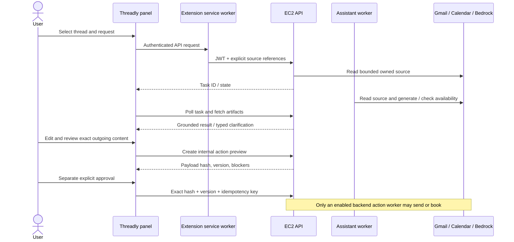

# Frontend ↔ backend integration handoff

The extension is a client of the existing FastAPI task system. It does not run
its own Gemini planner or use a Google access token directly. The backend owns
source access, task execution, model/Flow selection, approvals and external writes.

## Endpoint mapping

| Panel control              | Backend contract                                             | Completion / guard                                                                     |
| -------------------------- | ------------------------------------------------------------ | -------------------------------------------------------------------------------------- |
| Sign in                    | `/auth/google/begin`, `/auth/google/exchange`                | PKCE, one-use state, exact callback; JWT kept in trusted extension session storage     |
| Connect Gmail/Calendar     | `/auth/google/reconnect`                                     | Explicit capability; account binding remains backend-owned                             |
| Session maintenance        | `/auth/refresh`                                              | Refresh before expiry; clear session on 401                                            |
| Connection status          | `GET /assistant/capabilities`                                | Show actual account readiness; never infer send authority from Gmail read scope        |
| Use open Gmail thread      | content-script metadata → `GET /threads/{id}`                | Provider IDs only; validate account where visible; no DOM body import                  |
| Search mail                | `POST /assistant/mail-search`                                | Explicit date/folder window; one page at a time; query/cursor kept together            |
| Select source              | `POST /assistant/context-snapshots` schema 1.1               | Fresh thread version, included message IDs and explicit target; no supplied email body |
| Summary / question / draft | `POST /assistant/requests`                                   | Durable task; compose excludes selected-thread source                                  |
| Rewrite                    | `/assistant/requests` + `read_options.transform_text`        | Exactly one selected message                                                           |
| Multi-step / schedule      | `/assistant/workflow-proposals`, `/{id}/confirm`             | Display complete proposal; confirm saved plan hash before execution                    |
| Progress / history         | `GET /assistant/tasks`, `GET /assistant/tasks/{id}`          | Backend states; fetch step artifacts; keep task ID when connection is lost             |
| Clarification              | `/tasks/{id}/inputs` or `/scheduling-inputs`                 | Only fields requested by the current question; bind question ID and version            |
| Cancel task                | `/tasks/{id}/cancel`                                         | Versioned cancellation; no send implied                                                |
| Draft edit/history         | `/tasks/{id}/draft-revisions`                                | New immutable revision; edits hide and invalidate previous preview                     |
| Accept plan items          | `/tasks/{id}/plan-review`                                    | Explicit selected IDs; dependency validation remains server-side                       |
| Review email               | `/artifacts/{id}/review`, `/artifacts/{id}/actions`          | Exact recipients, subject and body returned by server                                  |
| Send/reject/cancel/status  | `/assistant/actions/{id}` and decision routes                | Explicit checkbox + hash/version; only permitted operations; uncertain outcomes polled |
| Calendar setup             | `/calendar/calendars`, `GET/PUT /calendar/preferences`       | Versioned, explicitly saved timezone and constraints                                   |
| Select slot                | `/calendar/negotiations`, offer + selection routes           | Fresh availability recheck; selecting is not booking                                   |
| Event preview and decision | `/artifacts/{id}/calendar-actions`, `/calendar-actions/{id}` | Separate exact event approval including invitation behavior                            |
| Insert body                | Narrow Gmail content-script message                          | Only one empty reply editor on the exact selected message; no click on Send            |
| Copy / dictation           | Browser APIs                                                 | Copy never sends; dictation only edits the request                                     |

## State, privacy and failure handling

- JWTs use trusted `chrome.storage.session`, so content scripts cannot read them.
  Google refresh tokens and client secrets remain on EC2.
- No mailbox or chat-text cache is written to extension storage. The panel holds
  loaded text in memory while open. The backend retains its existing task,
  artifact and source-reference records. Generated artifacts can contain excerpts;
  this is not a claim that no email-derived text exists in backend task history.
- Settings and action identifiers are the only durable extension data. Action
  references are namespaced by backend origin and backend user ID. Reopening a
  draft/booking reloads the authoritative action status, not a cached payload.
- Normal content scripts have no privileged backend bridge. API requests reject
  arbitrary URLs, traversal, redirects and direct authentication-route calls.
- Changing servers or signing out clears the visible session. A delayed login
  cannot restore a session after sign-out. No background login/send retries.
- Message numbering follows included sources; excluded messages are not counted.
  The target is independent of the source list. A reply never guesses the last
  message. Ordinals refer to the saved selection, not a later Gmail navigation.
- Polling pauses with an actionable message after repeated network errors. Task
  history recovers backend jobs; action references recover pending writes on the
  same installation. A lost browser profile cannot reconstruct action history
  without a future backend action-list endpoint; do not recreate uncertain sends.
- Stale source, preference, revision and approval conflicts are shown, not retried
  with modified payloads. Calendar offers expire and are never described as holds.
- External writes are still disabled in the current staging configuration. UI
  tests exercise approval through fake providers; live tests remain read/generation-only.

## Source layout

- `background.ts`: trusted backend transport, PKCE sign-in, session refresh and
  account-bound action references.
- `content.ts`, `lib/gmail-context.ts`: Gmail ID discovery and guarded body insertion.
- `lib/context.ts`: owned source retrieval and reference-only capture.
- `lib/use-assistant.ts`: task submission, polling, continuation and proposal confirmation.
- `components/TaskCard.tsx`: task progress, questions and workflow proposal review.
- `components/ArtifactCard.tsx`: human-readable results, draft revision/review and sending.
- `components/Booking.tsx`: slot recheck and exact Calendar event review.
- `components/Settings.tsx`: backend origin, Google capabilities and scheduling preferences.
- `components/MailSearch.tsx`: bounded provider search with manual pagination.
- `sidepanel.tsx`: shared panel shell, selection, composer, history and account lifecycle.

## Verification and external setup

Tests use synthetic addresses and receipts. Private Gmail output, JWTs and
screenshots must not enter Git, CI artifacts or PR descriptions. The live helper
is opt-in and only reads the user’s private laptop login session.

Google’s Web application must allow the stable extension callback documented in
README. Adding the callback to EC2 alone is insufficient. The interactive Google
consent flow requires the authorized account; an injected existing test session
only verifies authenticated frontend/API integration.

The original Plasmo 0.90.5 build chain retains transitive npm audit findings.
Compatible dependency patches were applied and the newly added Vitest dependency
was upgraded to 4.1.11. Do not use `npm audit fix --force` to silently downgrade
Plasmo. Keep the development server local; evaluate a build-tool migration as its
own change. These tools are development dependencies, not shipped service code.

### Recorded verification — 23 September 2026

- Frontend: TypeScript check passed; **41 tests passed**; production build passed.
- Packaged Chromium extension: **4 acceptance scenarios passed** (summary →
  question → edited reply → exact preview → reopen existing action; confirmed
  workflow → slots; preferences/history/logout; disconnected login displays
  connection recovery instructions without opening Google). No real providers used in these
  deterministic browser tests.
- Live built extension → SSM → EC2 → Google/Bedrock: **passed** bounded GYG search,
  selected summary, “What is the order total in this email?”, reply draft,
  independent compose with a thread still selected, and Calendar listing.
  Existing authenticated session used; no Google consent-window claim.
- No live approval/send/event-create requests were made; scheduling preferences
  were not changed by the live helper. Staging write controls remain disabled.
- Backend integration fix: PR #43, deployed commit
  `69755f52eef4e5e65745d3598c531bba9b58de8d`; **1,146 backend tests passed**, zero
  skipped, with the isolated PostgreSQL test database. API and both active workers
  were healthy after deployment.
- `npm audit --omit=dev`: zero findings. Build-only transitive findings remain as
  described above. No public model keys or direct Gmail-send code in the package.
- Still requires the project owner to register the extension callback in the
  existing Google Web application client. EC2's exact callback allowlist is ready.
  Real Chrome consent, real Gmail editor insertion, and live send/booking are
  separate user-account acceptance steps; they are not implied by mock tests.
