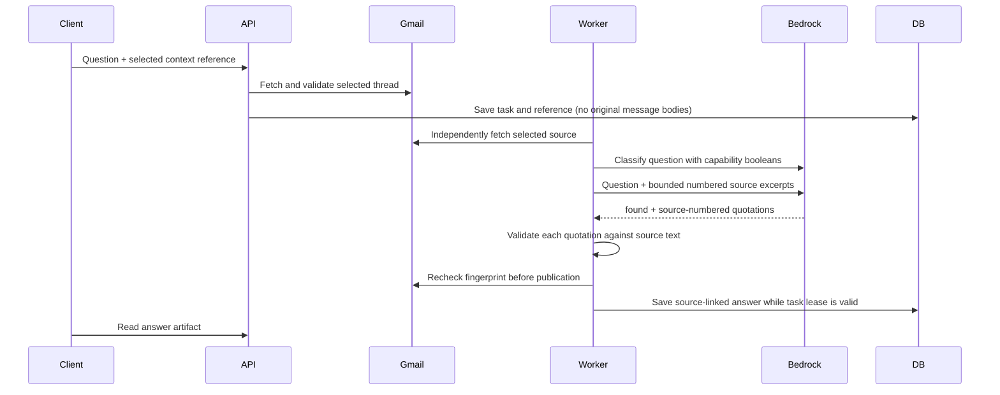

# Selected-thread fixes and grounded answers

This slice addresses live selected-receipt tests after PR40. The runtime changes
are versioned; historical failures remain failed and should be retried with fresh
request IDs. No database migration, Google scope change, mailbox import or external
write enablement is required.

## Four corrections

1. `summary-quality-task-1.1.0` accepts one complete JSON Markdown fence using the
   same bounded parser as routing/drafting. Duplicate keys, extra prose, unknown
   citations, extra fields, repeated content and word limits remain enforced.
   The historical raw-summary validator is unchanged.
2. `intent-preview-1.3.0` removes the contradiction between “no context” and trusted
   backend capability booleans. Names/addresses/IDs remain outside classifier
   authority. Clearing a missing precondition cannot promote an empty operation
   or clarification-shaped result to ready; it fails as `invalid_route_output`.
   Supported operations must survive classification even when context is missing.
3. `draft-artifact-1.2.0` treats the reply subject as a backend-owned header. The
   model supplies reply body, missing content facts and source numbers. A bounded
   optional subject echoed by older adapters is validated but never used. The exact
   original reply subject, recipients, thread and Message-ID remain in the backend
   envelope. Header injection and invented recipient fields are still rejected.
   Compose continues to require a generated subject.
4. `grounded-answer-1.0.0` connects a standalone `other / answer / lookup_entity`
   request to a bounded evidence-selection workflow. This answers factual questions
   from selected thread excerpts; it does not search the mailbox, calculate prices,
   consult outside knowledge or execute actions.

`contextual-task-1.2.0` pins these dependencies; lookup/draft pins
`lookup-draft-template-1.2.0`. Old queued tasks with unavailable release contracts
fail closed. Saved tasks are not relabelled or silently rerouted.

## Follow-up API contract

Use the existing authenticated `POST /assistant/requests` with `schema_version:
"1.0"`, a fresh `request_id`, `intent_hint: "other"`, the owned
`context_snapshot_id`, `continuation: null`, and the factual question in
`instruction`. Example: `How much did I pay for this order?` Do not attach draft
options. Each question explicitly retains the selected context; no conversation
memory or implicit cross-thread selection is inferred.

The generator may return only `found` and at most three `quotes`, each with a
1-based `source` and at most 600 characters of quoted text. The backend checks the
source index and exact text (whitespace normalization only), rejects duplicates
and invented quotes, then returns its own original source span. It does not accept
an uncited model-written answer. `found:false` must have no quotes and produces a
fixed “not stated in the selected excerpts” result, not a claim about the entire
mailbox. Relevance and correct selection among conflicting source facts still
need semantic evaluation; structural quote validation is not proof of relevance.

The artifact retains the existing `kind: answer` shape with `content.text`,
`content.claims`, `content.operation: lookup_entity`, `content.found`,
`content.search_scope: selected_thread_excerpts`, backend-built evidence and
`coverage: partial`. `GET /assistant/workflows` advertises `grounded_answers`.
Grounded answers use the configured Bedrock model adapter; this slice does not add
or silently repoint an AWS Flow alias. Existing summary/reply Flow dispatch remains
available through its configured registry.

Source-dependent summary/reply/answer publication now independently re-reads Gmail
outside the database transaction. Changed/deleted sources or revoked access prevent
publication. There is still a bounded race after the read; artifacts describe the
verified source version, not a guarantee that the mailbox can never change.
Generated answer quotations remain durable user-requested artifacts, distinct from
original-mail replication. No additional source cache is introduced.

## Verification

Run offline regressions against disposable PostgreSQL. The added cases cover
summary fences with unchanged citation/budget checks, exact reply headers even
when the model omits/alters a subject, header injection, unknown/duplicate quotes,
missing facts, ownership, no mailbox persistence and source changes before/during
generation.

`python -m app.planner.evaluate_thread_fixes` prints synthetic asset hashes without
calling a provider. Add `--live` with Bedrock configured and writes disabled for
six routing checks plus four generated outputs: summary, reply, factual answer,
and absent-fact answer. The committed evaluation receipt pins the exact assets and
records real Haiku results. Live GYG acceptance is kept in the PR as status-only
evidence; private mail and generated receipt text must not be committed to GitHub.
