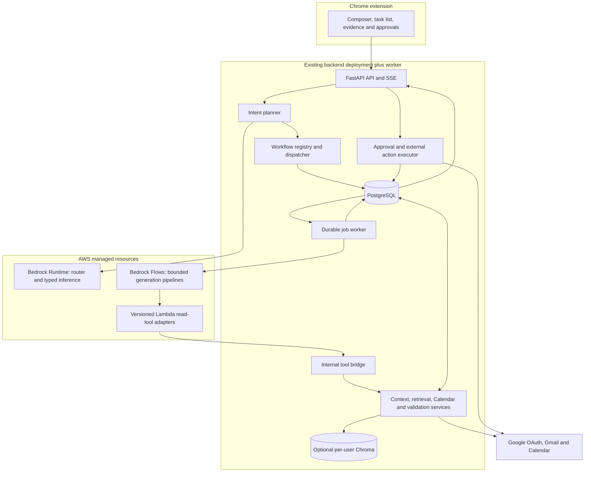

# 02 · Architecture, ownership and execution boundaries

## Components and deployment



Keep API and worker in the same Python codebase/image with separate entrypoints.
The initial deployment remains the current EC2/container stack plus a worker
service. PostgreSQL owns tasks, jobs, artifacts and approvals. Chroma is optional
style retrieval, not workflow memory or authoritative evidence.

Bedrock Runtime is used for structured routing and individual typed inference.
Flows coordinates predictable generation stages. Managed Bedrock Agents is an
optional later choice for a demonstrated need for dynamic tool selection; it is
not necessary to make every category work.

## Existing modules and planned homes

Paths in the existing column are present. Paths in the proposed column are
implementation targets, not claims that files already exist.

| Responsibility | Existing | Proposed extension |
|---|---|---|
| HTTP/auth/error envelope | `backend/app/api/`, `auth/` | `api/routes/assistant.py`, `actions.py`, `calendar.py`; scope-aware auth |
| Intent planning | `planner/planner.py`, `rules.py`, `orchestrator/intents.py` | Typed decision and bounded plan validator |
| Task dispatch | `orchestrator/orchestrator.py` | `orchestrator/registry.py`, `dispatcher.py` |
| Durable execution | Inline `/sync` only | `jobs/worker.py`, `jobs/repository.py` |
| Bedrock integration | `model_client/client.py`, `providers.py` | Bedrock provider + `flow_client.py`; task-oriented model configuration |
| Authoritative context | `db/repositories.py`, `sync/` | `context/service.py`, snapshots, evidence registry |
| Drafting | Stub `/draft`, draft table | `drafting/service.py`, recipient resolver and MIME builder |
| Scheduling/planning | No implementation | `planning/service.py`, `calendar/client.py`, `calendar/availability.py` |
| Safe external writes | Stub draft send | `actions/service.py`, `executor.py`, `reconcile.py` |
| Other lookups | Stub `extractor/`, entities/commitments routes | Implement extraction, named read handlers and evidence |
| Model assets | `ml/prompts/prompts.yaml` with TODO templates | `ml/prompts/`, `ml/evals/`, versioned release inputs |
| Infrastructure assets | Compose/Caddy/runbook | `infra/bedrock/`, `infra/lambda/`, release manifest |

## Ownership matrix

One owner is accountable for each deliverable; reviewers prevent mismatched
contracts. “AI team” here means the people responsible for model behavior.

| Deliverable | Accountable owner | Required collaboration |
|---|---|---|
| Intent taxonomy, labelled cases, prompt semantics | AI lead | Backend contract reviewer; product resolves ambiguity policy |
| Typed schemas and deterministic validators | Backend lead | AI signs example compatibility; frontend signs UI fields |
| Prompt/flow graph source | AI lead | Backend reviews tool/payload boundaries; infrastructure deploys |
| Tool adapters and provider integrations | Backend lead | AI supplies fixtures for each tool result/error |
| Task/approval/idempotency state | Backend lead | Frontend validates recovery and review experience |
| Review UI and task continuation | Frontend lead | Backend contract owner; AI checks wording behavior |
| Model/region benchmark | AI lead | Backend measures integration latency/cost; infra verifies access |
| Cloud permissions, versions and promotion | Infrastructure owner | Backend + AI identify immutable release inputs |
| End-to-end acceptance and release | Named release owner | All teams present evidence for their gates |

Named people are intentionally unset. At kickoff assign them in the backlog;
responsibility should not be inferred from whoever happens to run a coding agent.

## Four trust boundaries

1. **Client → API:** the session determines the user. IDs from the browser are
   references to validate, not proof of ownership. Check thread/task/artifact access.
2. **Content → model:** user instructions are separated from quoted email and
   retrieved content. Email can supply facts but cannot grant capabilities.
3. **Model → backend:** schema-valid output is still untrusted. Validate source IDs,
   slot IDs, recipients, chronology, permissions, budgets and allowed operation order.
4. **Backend → Google:** only the executor may perform external writes, using the
   stored approved payload and the correct account's encrypted credentials.

## Runtime sequence

```mermaid
sequenceDiagram
  participant U as User
  participant API as FastAPI
  participant DB as PostgreSQL
  participant W as Worker
  participant B as Bedrock
  participant G as Google
  U->>API: Request plus context reference
  API->>DB: Commit task and job atomically
  API-->>U: 202 task ID and events URL
  W->>DB: Claim job lease
  W->>B: Route or invoke selected flow
  B-->>W: Typed result or proposal
  W->>DB: Validate and persist artifact/status
  API-->>U: Result or action preview
  U->>API: Approve exact action version
  API->>DB: Commit approval and execution job
  W->>DB: Claim approved action
  W->>G: Recheck facts; execute approved payload
  G-->>W: Provider result
  W->>DB: Record outcome and provider ID
  API-->>U: Actual action outcome
```

The AI flow can make read-tool calls via the bridge between generation steps.
No request, DB transaction or Lambda invocation remains open while waiting for
human input. A task resumes by loading durable state and invoking the next bounded
stage. Completed read stages may be reused only while their snapshot remains valid.

## Internal tool bridge

Use small versioned Lambdas as adapters so Calendar/date/retrieval logic has one
backend implementation. An adapter receives a backend-issued run reference and
validated arguments, calls a fixed internal endpoint and returns a minimal result.
Credentials and approved action payloads are never supplied in prompt variables.

Proposed deployment: Lambda in private networking calls a private backend service
endpoint with service authentication. In a minimal EC2 prototype, an authenticated
HTTPS endpoint can be used with a scoped service identity; never expose a public
unauthenticated “run tool” endpoint. Resolve connectivity in `T03` before enabling
live bridge calls. A temporary fake adapter is the integration fallback, not a
network/security workaround.

Bind each tool grant to task/run, owner, fixed tool set, expiry and budget. Only
backend-issued fields on immutable input edges carry this grant; do not pass a
token through a Prompt node or permit a model to invent/replace it. The endpoint
checks the persisted run and service identity on every call. Return redacted
structured data. Repeated read calls may use a bounded run cache. Write tools
are not registered in the proposal flows.

## Current implementation risks to address

| Finding from code inspection | Why it matters | Work package |
|---|---|---|
| Thread upsert overwrites newest pointer on each message | Out-of-order sync can make context stale | T02 |
| Initial sync captures cursor after scan | Concurrent arrival can escape both backfill and history | T02 |
| Sender ownership uses substring matching | A message can be attributed to the wrong author | T02 |
| Missing RFC reply headers in stored messages | Replies may target/thread incorrectly | T02/T12 |
| Async provider fallback wraps iterator creation | Iteration-time failure escapes the intended fallback | T04 |
| Cloud masking map is discarded | Placeholders cannot reliably become user-facing identities | T04/T05 |
| Summary cache excludes model/prompt versions | A new release can reuse obsolete results | T08 |
| Prompt loader has only summary fallback; templates are TODO | New workflow names can fail instead of generating | T04/T06 |
| Auth refresh maps all Google errors to reauth | Transient outage and revoked consent become indistinguishable | T03 |
| No durable background queue | Restart loses request-bound processing | T05 |

These are scoped prerequisites, not a claim that all production risks have been
audited. Test the corrected behavior with dedicated fixtures.

## Cost and complexity boundaries

Start with one worker service and PostgreSQL-backed jobs. Introduce SQS only if
measured throughput/operations justify it; preserve transactional enqueue with an
outbox. Use one well-evaluated router call, avoid a supervisor model calling five
other models to decide a simple intent, and reuse deterministic paths. A native
summary cache hit and an entity lookup should not be forced through Flows.

Every model/flow invocation has a total deadline, attempt budget, input cap and
output cap. No silent provider-region fallback. Bedrock service access, model
features and region routing are verified per deployment, not inferred from the
console showing an empty canvas.
