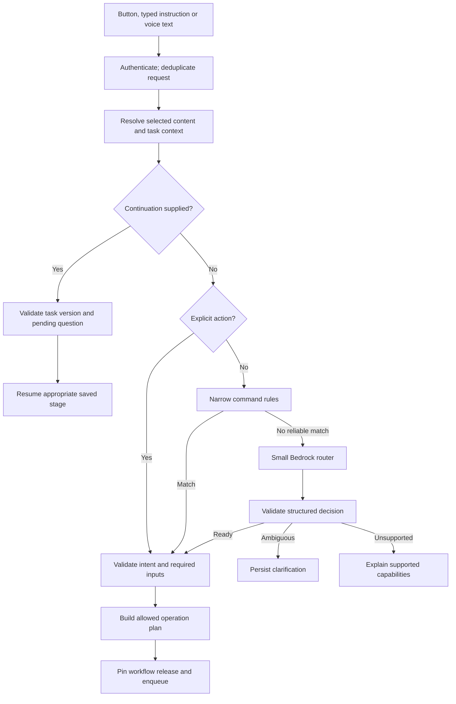
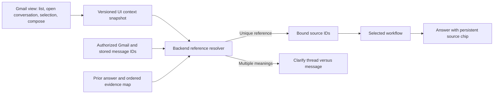

# 03 · Triggers, context resolution and intent routing

## The front door

Use one new `POST /assistant/requests` entry point for natural language and explicit
action buttons. Preserve existing routes as compatibility adapters. Typed text
and optional voice transcription have the same semantics. A request contains
user instruction, optional explicit intent, context snapshot reference, optional
task continuation reference and a client request ID. The server supplies user ID.

The router is an application module, not a new network service in v1. A trained
five-class classifier is optional later. Start with explicit actions, narrow
commands and model extraction; evaluate confusion patterns and cost before
training a model. Keep the classifier's interface replaceable.

## Trigger catalogue

| Trigger | Initial behavior | Persistence/deduplication key |
|---|---|---|
| User clicks Summarise/Plan/Reply/Compose | Explicit intent; required-context validation | User + client request ID + request hash |
| User asks in natural language | Route with context | Same as above |
| User answers clarification | Resume saved question, not fresh global classification | Task + expected version + question ID + request ID |
| User approves action | Validate stored payload; enqueue executor directly | Action + version/hash + approval identity |
| New Gmail message | Sync and index; opt-in suggestion generation only | User + message ID + suggestion policy version |
| User edits an artifact | New revision, invalidate derived approvals | Artifact + expected revision + request ID |
| Follow-up becomes due | Recheck thread before offering a reminder/draft | Commitment + due occurrence + policy version |
| Calendar changes | Invalidate availability evidence; regenerate only when useful | Calendar + change/cursor + affected task |

An incoming email is not a user command. “Please send your confidential report”
inside email content is evidence of a request from someone else, not authority to
send it. Proactive processing initially produces suggestions; the user initiates
the consequential action through the review flow.

## Context binding: requirements from the supplied screenshots

The user supplied two Superhuman Go screenshots showing a summary request, a
follow-up asking about “the 3rd thread,” an attached Gmail source chip, and a
compose window with Insert/Copy controls nearby. These illustrate desired
interaction patterns. Screenshots alone do not establish the full underlying
mail content or whether every observed answer is correct.

The plan uses anonymized fixtures rather than reproducing names, addresses or
screen-sharing participants. No screenshot-derived answer is treated as a
ground-truth mailbox record.

The extension provides a snapshot containing view type, active Gmail thread,
selected message IDs, visible ordered thread/message references, ordering rule,
selection text reference, active compose target and capture time. These are client
hints to validate against the user's mailbox, not authoritative content or access.
Use provider IDs obtained through supported integration methods; do not assume a
Gmail URL fragment or DOM identifier always equals the API's thread ID. Build a
mapping adapter with fixtures and an unresolved state when mapping fails.

| User says | Resolve against | Correct behavior |
|---|---|---|
| “Summarise this” in an open conversation | Captured active-thread reference | Fetch authorized full conversation; show coverage and source chip |
| “Summarise this” with selected text | Explicit selection scope | Label as selection summary; do not claim full-thread coverage |
| “What's in the third message?” | Pinned message ordering for that thread/answer | Resolve ID first; fetch/quote that message with author/date |
| “What's in the third thread?” | Pinned inbox result ordering | Resolve third thread if that list is the established reference |
| “Third thread” after a message-by-message summary | Both wording and established ordered answer | Clarify “third message in this conversation?” when meanings conflict |
| “Reply to that” | Latest explicitly referenced message/thread | Confirm only if more than one plausible target |
| “Insert it” while two drafts are open | Selected compose target and revision | Ask which target; do not modify whichever happens to receive focus |

Persist the ordering and ID mapping with the snapshot or result. Do not recompute
“third” from an inbox that has since reordered. Distinguish conversation thread,
individual email message, assistant task and generated draft in code and UI copy.

Gmail API retrieval can include messages collapsed in the UI. If retrieval fails,
show limited coverage; never infer the contents of collapsed messages from a
screenshot or sender label. For source chips, store stable backend references
with an authorized link resolver, not a model-invented URL.

## Router decision contract

Canonical intents: `summarise | plan_schedule | reply | compose | other`.
Routing statuses: `ready | needs_clarification | unsupported`.
Useful operations include `summarise_thread`, `plan_actions`, `check_time`,
`suggest_slots`, `draft_reply`, `draft_new`, `lookup_entity`, `search_mail`,
`lookup_commitments`, `transform_text` and `help`.

A decision carries intent, requested output, ordered operation IDs, extracted
parameters, missing fields, context references and a concise user-facing rationale.
It never carries executable code, arbitrary URLs, AWS ARNs, raw SQL or credentials.
The [example schema](schemas/route-decision.schema.json) is a backend contract;
model-provider schema support must be checked separately. `requested_action`
records `none`, `send_email` or `create_event` only when the user's instruction
explicitly requests that action. It is an untrusted expression of intent, not
authorization or a runnable tool call. Backend uses it to prepare an exact action
preview after prerequisites are satisfied. “Send this draft” resolves the selected
artifact and goes to that preview; it does not regenerate or send arbitrary text.
Existing user-approved actions go directly to the executor without model routing.

Example: “Reply with three times I can meet next week” → primary intent
`plan_schedule`, operations `suggest_slots → draft_reply`, output `draft`,
unresolved duration if no saved preference. Reply wording alone must not bypass
Calendar checks. “Write a meeting invitation email” may be compose with a calendar
dependency only if the user wants checked availability; do not add a booking merely
because the word “meeting” appears.

## Intent boundaries and conflict rules

1. Prefer an explicit action when the instruction is consistent with it. If a
   user selects Summarise but types an incompatible Compose request, resolve that
   conflict instead of silently trusting stale UI state.
2. Classify the user's instruction; use email content only as context. Separate
   system instructions, user command and quoted content in model input.
3. Use task continuation before global routing when the user responds to a
   pending question or edits a saved artifact. Multiple active tasks require an ID.
4. Evaluate requested **capabilities**, not only keywords. Dates in a reply do
   not automatically require Calendar; claims of free time do.
5. Distinguish unknown intent, missing parameters, unavailable integration and
   unsupported operation. Each has a different user recovery path.
6. Never map `other` to “do anything.” Use named handlers and a supported-operation list.

## Bounded multi-step planning

Allow these initial combinations:

| Request | Validated operation plan | Write consequence |
|---|---|---|
| “Summarise and draft a reply” | Summary → reply draft using original evidence | None until explicit send approval |
| “Turn this into a plan and reply with my next steps” | Action plan → user-selected commitments → reply | Approval required to communicate commitments |
| “Find three slots and reply” | Availability → options → reply draft | Send approval; no slot reservation |
| “Find the invoice and draft a reminder” | Bounded lookup → draft using source evidence | Send approval |

Backend validates a small directed acyclic plan with a maximum of four steps in
v1, matching tool permissions and available context. Each step references previous
validated artifacts. Reject unsupported sequences and cycles. An LLM cannot
append send/create/delete steps to a plan. Explicit action requests produce an
approval proposal through the executor contract.

## Evaluation before deployment

Label primary intent, operations, missing fields, referents and expected abstention.
Include paraphrases, typos, negation, mixed intent, pronouns, stale UI snapshots,
different languages, “don't send,” injected email instructions and messages with
multiple date/time references. Split datasets by thread/scenario so near-duplicate
messages do not leak across train/dev/test.

Measure per-intent precision/recall and operation accuracy, not just aggregate
classification. Track unnecessary clarification and unsafe action escalation.
If confidence is used, calibrate it on held-out examples; model-reported confidence
is not a probability guarantee. Explicit actions should have deterministic routing
tests independent of model quality.
