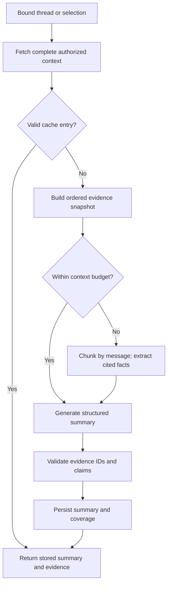
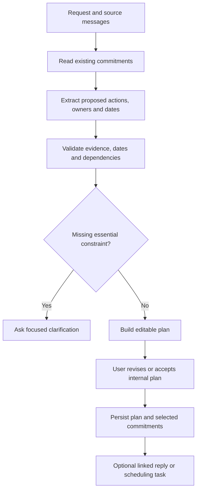
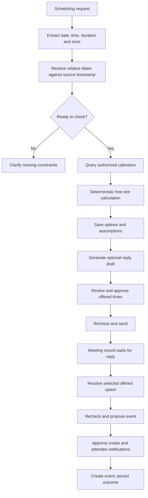
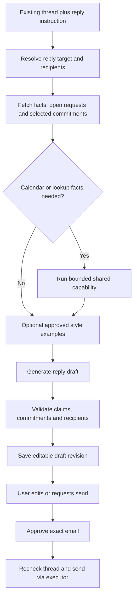
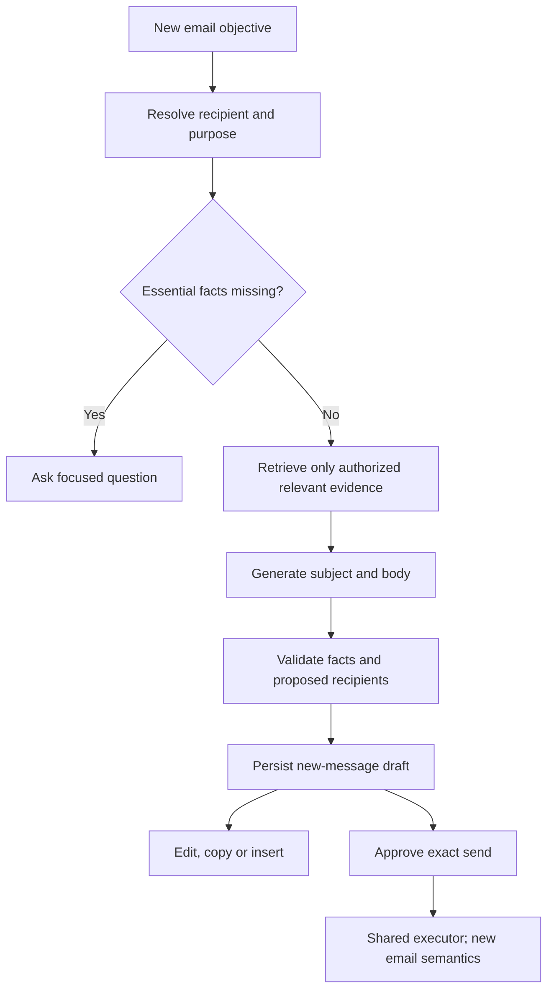
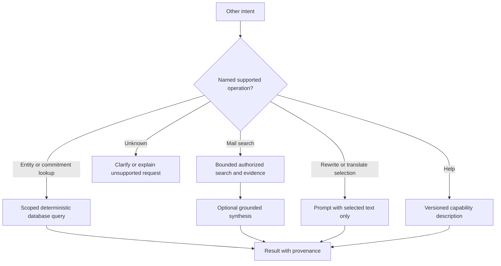

# 04 · Complete functional workflows

## Shared pipeline contract

Every workflow takes a validated request and a server-built context snapshot.
Every successful generation stage returns a typed artifact or clarification.
Backend checks source references, policy and output limits before persisting it.
An AWS execution reporting success is not evidence of email delivery or booking.

An artifact-only request completes when its artifact is ready. If the user asks
to send/book, its task waits for approval of the concrete action. A later Send
click on a completed draft starts a linked execution task. This distinction makes
“draft completed” meaningful without suggesting an email has already been sent.

## W1 · Summarise

**Goal:** explain the thread or selected scope accurately, with recoverable sources.

Inputs: thread/selection references, user instruction, detail level and language.
Output: overview, decisions, actions with owners/dates, unresolved questions,
evidence references and coverage metadata. Unknown owners/dates stay unknown.
Quoted requests, proposed decisions and final decisions remain distinguishable.

Backend fetches Gmail/stored messages by validated IDs and reliable order. Cache
key includes user/thread snapshot version, selected scope, language/detail,
prompt/schema/model/flow release and relevant preference version. Existing
`(thread_id,last_msg_id)` compatibility is migrated deliberately, not silently
treated as the new complete cache key.

For long threads, preserve whole-message boundaries and provenance during chunking.
Reduce cited facts into the final summary; retain access to original messages for
verification. Report `partial` coverage for unavailable attachment content,
unsynced messages or a truncated selection. Never describe a partial summary as
an exhaustive account. Backend can validate IDs/quotes deterministically; semantic
entailment requires evaluations and targeted verification, not just a JSON parser.

Follow-up “What was the third message?” is a context-resolved lookup. Do not
regenerate a summary and infer ordering. Return author/date/snippet with source.

**AI deliverable:** summary schema, prompt, chunk/reduce prompt if needed and
contradiction/omission fixtures. **Backend deliverable:** context snapshots,
cache/evidence validation and structured result adapter. **UI deliverable:** source
chips, expandable decisions/actions and coverage indicators.

**Acceptance:** source IDs belong to the requested scope; newest corrections are
not lost; cache invalidates on new messages or release changes; third-message
follow-up uses pinned ordering; selection and full-thread scopes are visibly different.

## W2 · Plan/schedule: action planning

**Goal:** turn correspondence into an editable plan, including work that has no meeting.

Inputs: thread(s), objective, planning horizon and selected existing commitments.
Output plan items: stable item ID, description, owner reference or unknown,
due time or unknown, dependency item IDs, evidence, priority and whether the
item is explicitly requested, inferred or user-confirmed.

The model may suggest decomposition and ordering. Backend detects cycles,
impossible dates, duplicates and unsupported owners. A proposed task is not proof
that the user promised to do it. Only user-confirmed items enter the confirmed
commitment store. A plan can carry optional estimates labelled as estimates;
do not invent promised completion dates from them.

Internal “accept plan” is a versioned user edit and audit event. Sending the plan
to another person, promising dates or creating events is a separate reviewed action.
Changing a plan invalidates derived drafts when their claims are no longer true.

**AI deliverable:** action extraction/decomposition with evidence and uncertainty.
**Backend deliverable:** plan storage, dependency/date/dedupe validators and
commitment linkage. **Acceptance:** a project email produces useful non-calendar
steps; unsupported deadlines remain unresolved; cycles and duplicate commitments fail.

## W3 · Plan/schedule: Calendar assistance and negotiation

Supported first-release operations: check a fixed time, propose up to three times,
create an approved single meeting and link an existing invitation when detected.
Rescheduling, cancellation and recurrence remain visible unsupported operations
until their own implementation/gates land; no silent approximation.

Resolve “tomorrow” using the email's date anchor and interpretation zone, not the
day processing happens. Store original phrase, UTC instant, IANA zone, duration
and assumption source. “4” can require AM/PM clarification. User-confirmed defaults
may resolve duration/hours, but show them in the proposal.

Backend availability algorithm: construct local working windows → convert with
zone/DST rules → union busy intervals across selected calendars → apply buffers
and minimum notice → subtract → generate duration-fitting candidates → rank with
explicit preferences and diversity. Use half-open intervals; test DST gaps/folds.
Return fewer than requested if constraints cannot produce enough options.

Calendar free/busy returns busy intervals and can contain per-calendar errors.
Treat incomplete reads as unknown availability. No access to an external sender's
calendar means we can offer times that work for the user, not establish mutual
availability. [Free/busy API](https://developers.google.com/workspace/calendar/api/v3/reference/freebusy/query).

Persist option IDs and the exact offer version. “Second one” resolves against that
version even after the inbox or candidate ranking changes. Suggestions do not
reserve time. Recheck before both sending availability claims and creating an
event; changes require renewed review. External changes can race a check because
availability and booking are not one atomic operation under our control.

**AI deliverable:** scheduling extraction and grounded offer wording.
**Backend deliverable:** Calendar client, deterministic slots, negotiation record,
event proposal/reconciliation. **Acceptance:** stale conflicts, unknown calendar,
expired options and delayed selection are handled without invented availability.

## W4 · Reply

Inputs: bound thread/reply message, instruction, tone/language, reply versus
reply-all choice, optional approved plan/slot references. Output: subject/body,
recipient proposal, source evidence, unresolved claims and revision.

Resolve Reply-To/From/To/Cc and the user's verified aliases in deterministic code.
Never invent an address. Bcc is explicit user input and must never be inferred
from thread participants. Keep the exact final recipients visible, especially
reply-all. Do not reveal prior Bcc recipients from unrelated stored context.

Model receives minimal required facts and optional user-consented sent-mail style
examples. Those examples teach tone, not facts about this conversation. Prefer
explicit tone preference if retrieval is unavailable. Claims such as “I attached
the report,” “I booked it” or “I will deliver Friday” must be supported by task
facts or flagged for user completion. A draft with unresolved placeholders cannot
be sent. A user's edits are authoritative writing intent but do not bypass
recipient/attachment/calendar consistency checks.

Backend MIME generation preserves subject/thread metadata and RFC reply headers.
Gmail requires the supplied thread ID and appropriate References/In-Reply-To and
subject matching for threading. [Gmail thread requirements](https://developers.google.com/workspace/gmail/api/guides/threads).

“Make it shorter” revises the current draft. “Reply to the other person instead”
changes the recipient proposal and requires review. A new inbound message after
drafting marks context stale; show the difference and regenerate or confirm a
new proposal without silently sending the old one.

**Acceptance:** correct reply/reply-all recipient set; no invented attachments or
commitments; editable/recoverable draft; obsolete approval fails; uncertain send
does not automatically retry. Full sender implementation is shared with Compose.

## W5 · Compose

Inputs: purpose, recipients or unresolved names, user-provided facts, optional
authorized source references, tone/language. No thread is required. A thread
used as background evidence is not automatically the destination conversation.

Initial recipient resolution uses explicit addresses and authorized mailbox
participants; Google Contacts is not assumed connected. If two Alexes match,
show known addresses/context and ask. If no address is known, request it. Extracting
an address from untrusted email cannot silently substitute a user-selected recipient.

The draft includes editable subject and body. Unknown factual details appear as
questions or internal missing fields; placeholders may be shown during editing
but block send. Unsupported attachment requests return an explicit next step.
Final MIME has no inherited thread ID or reply headers unless the task is explicitly
converted to Reply with a validated destination.

### Copy, Insert and Send are different operations

| Operation | Effect | Required context/result |
|---|---|---|
| Copy | Puts selected artifact text on clipboard | User click; report copied only if browser operation succeeds |
| Insert | Edits a selected Gmail composer | User action, composer target/revision; preview replacement if content exists |
| Send via Threadly | Sends approved content through backend | Stored approval/action and known provider outcome |
| User sends manually in Gmail | Outside Threadly's executor | Observe via later mailbox sync; do not claim send merely from insertion |

For Insert, recheck the target composer before applying text. If focus or draft
content changed, let the user choose or preview a diff. Preserve user-written text
unless replacement was requested. A content-script adapter failure offers Copy;
it must not report successful insertion. Browser clipboard/DOM permissions remain
frontend implementation requirements, not Bedrock tools.

**Acceptance:** no guessed addresses; new-message threading; preserve existing
composer content; correct distinction between copy/insert/send; shared approved
sender passes duplicate/timeout tests.

## W6 · Other: bounded assistance

Entity/commitment questions reuse typed stored data and message evidence. If data
has not been extracted or indexed, perform a bounded fallback search or say it is
unavailable; an empty index is not proof the email does not exist. Email search
returns scope/time range and source IDs before synthesis. Keep exact identifiers,
amounts and dates in backend rendering where possible.

Selected-text rewrite/translation uses the selected artifact version and preserves
critical numbers/names unless transformation is requested. It changes no external
document until the user chooses Insert or another explicit editing action.
General help reads the enabled feature registry so disabled capabilities are not
advertised as available. External web research is outside the first release.

**AI deliverable:** grounded synthesis and transformation prompts, supported
operation examples and abstention tests. **Backend deliverable:** extraction,
index status, authorized retrieval and capability registry. **Acceptance:** exact
entity answers bypass generation; no-source answers are explicit; unsupported
requests cannot invoke arbitrary tools.

## Optional W7 · Proactive follow-through

After the initial five-intent release, use new-mail and due-commitment events to
surface useful suggestions. Trigger detection is different from user intent
routing: it predicts an opportunity to help, not permission to act.

Eligibility rules: feature opted in, fresh message, not spam/trash or historical
backfill, no newer user response, no dismissed duplicate, per-user frequency cap,
quiet-hours preferences. Recheck before displaying. Expire stale cards. A user's
dismissal updates suppression state rather than retriggering next sync.

Follow-up drafts and suggested reminders still pass the same evidence/approval
pipeline. Automated sending, recurring nudges and cross-app task creation need
separate product policy and release scope.
