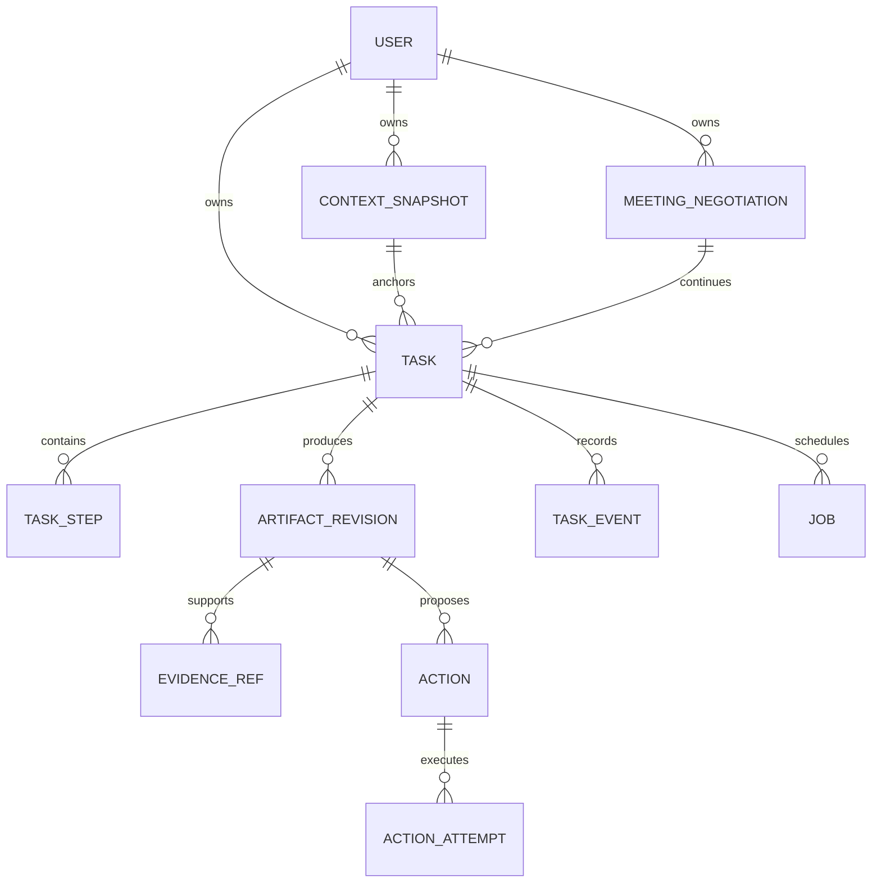
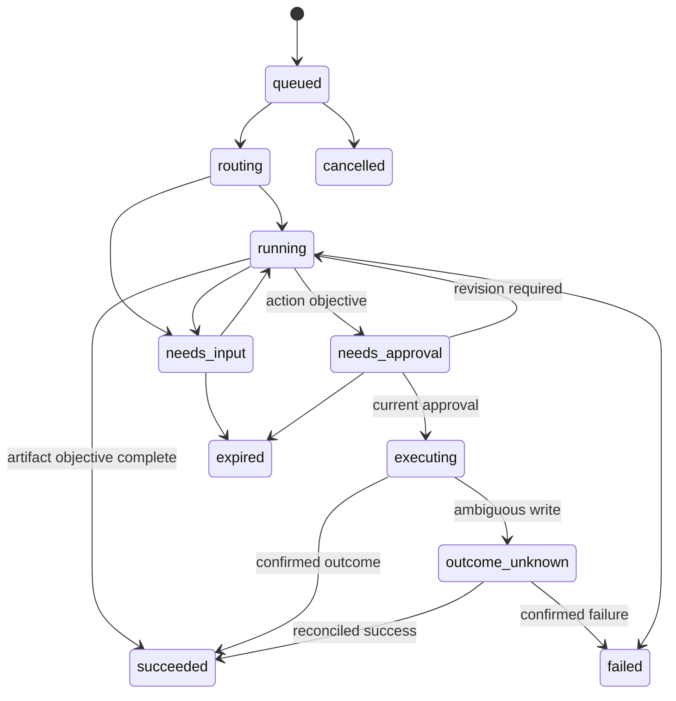
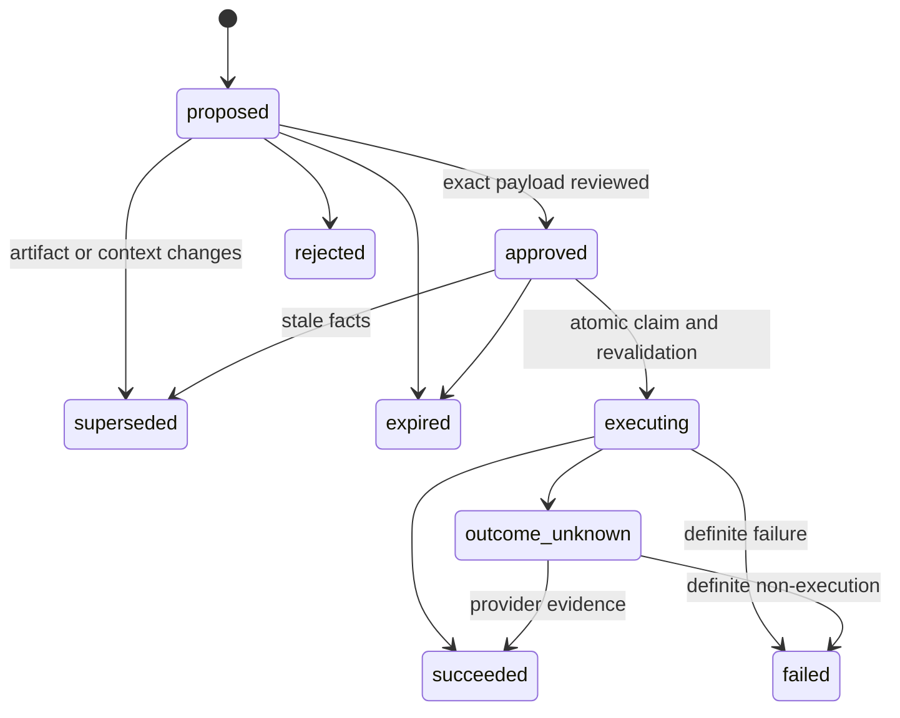

# 05 · Contracts, durable state and external action lifecycle

## Contract-first handoff

This chapter defines the proposed interface; current APIs remain documented in
[api-contract.md](../api-contract.md). Implementation task `T01` introduces the
new schemas and a coordinated contract change. Examples under [examples](examples)
and schemas under [schemas](schemas) are machine-readable planning artifacts.
They are not an OpenAPI export or a directly deployable AWS definition.

Use version `1.0` for these new envelopes. Additive compatible fields require
coordinated schema updates; breaking changes require a new major contract/release.
Backend Pydantic models will be authoritative for runtime validation; exported
JSON Schema and frontend types must match them. Model-native schema limitations
do not weaken server validation.

## Proposed public API

All routes use the session identity and existing error envelope. Scope every
lookup by owner before returning content. Never accept an authoritative `user_id`
from the browser.

| Method/path | Input | Output / semantics |
|---|---|---|
| `POST /assistant/context-snapshots` | UI references, ordering, selection/compose metadata | Validated snapshot ID or unresolved bindings |
| `POST /assistant/requests` | Instruction, intent hint, snapshot/task reference, request ID | `202` task ID, state, events URL; deduped identical request returns existing task |
| `GET /assistant/tasks` | Cursor, state filter | Owner's tasks, stable cursor pagination |
| `GET /assistant/tasks/{id}` | — | Durable state, goal, artifact/action references and latest event sequence |
| `GET /assistant/tasks/{id}/events` | Last event ID | Authenticated reconnectable SSE |
| `POST /assistant/tasks/{id}/inputs` | Question ID, answer, expected task version, request ID | Resume clarified task; stale input returns 409 |
| `POST /assistant/tasks/{id}/cancel` | Expected version, request ID | Cancellation request; report if an external write is already in flight |
| `GET /assistant/artifacts/{id}` | — | Current revision and typed result |
| `POST /assistant/artifacts/{id}/revisions` | Expected revision, validated changes | New immutable revision; invalidate derived action proposals |
| `POST /assistant/artifacts/{id}/actions` | Requested action type, selected revision, request ID | Concrete action preview, usually in a linked task |
| `POST /assistant/actions/{id}/approve` | Expected version, payload hash, request ID | Persist approval and enqueue execution; returns pending/existing result |
| `POST /assistant/actions/{id}/reject` | Expected version, request ID | Mark rejected before execution |
| `GET /assistant/actions/{id}` | — | Per-action result and reconciliation status |
| `GET /calendar/connection` | — | Granted capabilities, account, reconnect state |
| `GET /calendar/calendars` | — | Selectable authorized calendars |
| `PUT /calendar/preferences` | Expected version and validated settings | Updated settings/version |
| `GET /assistant/capabilities` | — | Available/enabled operations and missing connection requirements |

Existing `/draft/{id}/send` must delegate to the same action service; it cannot
be an alternate approval bypass. Existing summary SSE can remain a compatibility
adapter while the new task API exposes richer artifacts. Explicit button actions
and text requests converge on the same services.

## Public event stream

Each event has monotonic `sequence` within task, event type, UTC timestamp, task
version and typed payload. SSE `id` is the durable sequence. Use authenticated
fetch streaming or an equivalent header-capable client; do not place session JWTs
in a query string to accommodate browser EventSource.

| Event | Payload purpose |
|---|---|
| `task.accepted` | IDs and objective |
| `task.stage_changed` | User-readable progress stage |
| `task.input_required` | Question ID, fields, optional choices, expected version |
| `artifact.preview` | Optional draft text preview; explicitly not final/approvable |
| `artifact.ready` | Persisted validated artifact/revision |
| `action.approval_required` | Stored action/version/hash and exact preview |
| `action.state_changed` | Execution/unknown/success/failure with supported recovery |
| `task.finished` | Terminal state and result references |

Bedrock `InvokeFlow` output events are not a guaranteed token-by-token stream
from every internal prompt. Map available node/flow results to application progress.
Use direct model streaming where appropriate, without inventing intermediate
tokens or presenting a partial draft as approved.
[InvokeFlow response events](https://docs.aws.amazon.com/bedrock/latest/APIReference/API_agent-runtime_InvokeFlow.html).

On reconnect, replay persisted events after the last seen sequence. If events
were compacted, return a reset instruction and fetch the current task snapshot.
UI disconnect does not cancel a task. Event retention must outlast normal user
review windows; full artifact state persists independently.

## Core data model

| Table / extension | Essential fields and constraints |
|---|---|
| `users` extension | Actual granted scopes, connection state, verified account subject; retain encrypted tokens |
| `messages` extension | Parsed participants, RFC Message-ID/References/In-Reply-To/Reply-To/Cc, provider received timestamp and source date/zone |
| `threads` extension | Monotonic snapshot/version metadata and reliable newest message selection |
| `context_snapshots` | Owner, source kind, bound references, ordered ID maps, capture time and mapping status; immutable after validation |
| `tasks` | Owner, goal, intent, instruction reference, context version, parent/meeting references, state, optimistic version, pinned release |
| `task_steps` | Ordered operation, inputs/output references, state, attempt budget; UNIQUE task + step ordinal |
| `artifact_revisions` | Logical artifact ID + revision UNIQUE, kind, typed content, originating snapshot/release, expiry/coverage; immutable contents |
| `evidence_refs` | Owner, artifact revision, source message/entity/slot ID, offsets or quote hash, source version; no invented cross-owner reference |
| `actions` | Owner/task/artifact revision, type, canonical payload/hash, state/version, approver/time, expiry, provider IDs, idempotency key |
| `action_attempts` | Attempt ID, action, lease/fencing token, dispatch timestamp, outcome, redacted error, reconciliation evidence |
| `jobs` | Owner/task, kind, dedupe key UNIQUE, due time, lease owner/deadline, attempts, payload reference |
| `task_events` | Task + sequence UNIQUE, type, timestamp, redacted payload; append-only |
| `calendar_preferences` | Owner, zone, calendar choices, hours/buffers/minimum notice/defaults, version |
| `meeting_negotiations` | Owner/thread, offer revision, selected option, event ID and coordination state; distinct from generation runs |
| Existing `drafts` | Migrate/link to artifact revisions and preserve sent Gmail IDs; avoid two independent bodies/status authorities |
| Existing commitments/entities | Add provenance/version/status needed for corrections and user-confirmed plans |

Earlier scheduling-only tables can be implemented through this generic task and
artifact model; do not create duplicate stores for the same approval or draft.
Use normal columns for ownership, state, timestamps and lookup keys, and JSONB
for versioned typed payloads. Constrain ownership relationships at service and,
where practical, composite-key/database boundaries. UTC storage plus original
IANA display zone is required for time-bearing artifacts.

## State machines

Other allowed transitions such as cancellation of a still-read-only running task
are validated explicitly in code. Cancellation after dispatch cannot guarantee
reversal; record a cancellation request, reconcile and display what occurred.
A meeting negotiation can remain `awaiting_reply` after its offer-send task has
succeeded. A new reply creates/continues a linked task with a fresh snapshot.

Never transition `outcome_unknown` back to a fresh send merely because a lease
expired. A recovery worker first determines whether an external request may have
executed. Lost lease/fencing tokens prevent stale workers from committing another
attempt; API timeout and worker restart are explicitly modelled.

## Exact approval binding

Canonical payload includes action type, account, artifact revision, recipients,
subject/body or event fields, relevant source version, selected slots, destination
calendar and notification policy. Serialize deterministically and hash it. Store
the payload, hash, approval identity, timestamp and expiry together.

The router's `requested_action` field can request preparing a preview; it cannot
create an approval record or execute a tool. The backend also checks that the
actual user instruction supports the proposed action. A source email's request
to send or book is never sufficient.

The approval endpoint loads the action by owner and verifies supplied expected
version/hash. It never accepts replacement action arguments to execute. Approval
and job enqueue occur in one database transaction. The executor compares current
state/version, validates prerequisites, claims the action and records the attempt.
It sends only the stored approved bytes/fields. Any meaningful edit creates a new
proposal requiring review.

Approving an email does not authorize an event. A combined UI approval is allowed
only when both full actions are visible and independently tracked. Failure of one
does not erase success of the other.

## Retry and idempotency rules

Request idempotency scope is owner + operation + key, bound to request hash. Same
key/body returns the existing result; same key/different body returns 409.
Read/model retries are bounded and can restart from a clean stage. Generation
retries never append a second answer to partial output.

For a Gmail send, persist a pre-generated RFC Message-ID and full action metadata
before dispatch. If response is lost, reconcile Sent mail using those identifiers
and content/context checks. Search absence immediately after send is not proof of
failure. A Message-ID is not Gmail's idempotency guarantee; unresolved outcomes
remain visible and do not auto-resend.

For Calendar insertion, persist a valid stable event ID per action. After a
timeout, retrieve by that ID and verify the event belongs to the same action
before retry decisions. Use UUID-derived provider-compatible IDs and account for
the provider's collision caveats. [Calendar event insertion](https://developers.google.com/workspace/calendar/api/v3/reference/events/insert).

Do not hold DB transactions over network calls or human waits. Use short claims,
leases/heartbeat, persisted dispatch state and reconciliation. No combination of
local locks guarantees atomicity across a database and Google.

## Retention and deletion

Proposed configurable defaults: active proposals expire after 10 minutes for
availability claims; general draft actions after 24 hours; UI snapshots after
30 days; redacted execution metadata after 90 days. Validate product requirements
and storage budget before release. Artifacts required by an active task must not
be purged beneath it. User account deletion cancels pending work and removes tokens,
mail data, vectors and artifacts under a coordinated deletion job; retain only
explicitly permitted minimal operational records. Avoid logging raw email bodies,
OAuth tokens or complete Bedrock traces in production by default.
