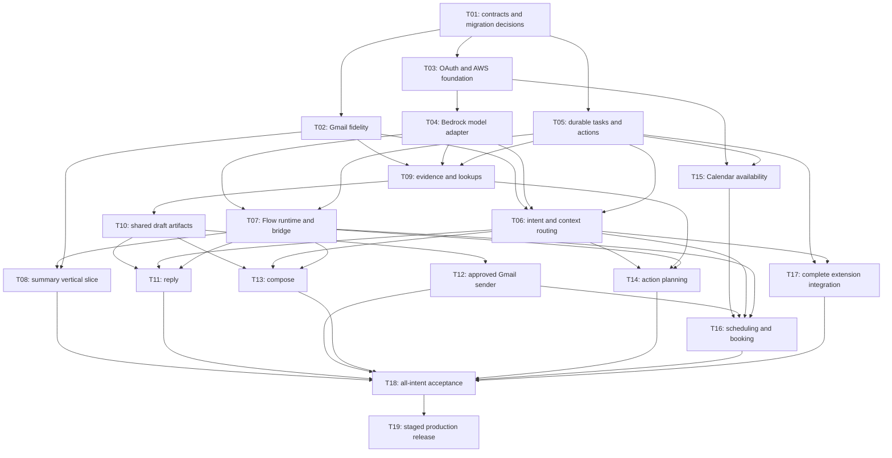

# 07 · Delivery plan and AI/backend collaboration

## Work package system

[Work package cards](12-work-packages.md) provide the human-readable task detail.
[backlog.json](backlog.json) contains the complete machine-readable work queue:
owner, dependencies, inputs, implementation targets, acceptance criteria, evidence
and handoff for each task. Every task begins `planned`. File existence and console
screenshots are insufficient evidence of completion.

Status lifecycle: `planned → in_progress → in_review → verified`; use `blocked`
with a concrete dependency/reason. “Verified” means the acceptance criteria passed
and the reviewer can find the evidence. Optional work is marked separately and
does not expand the initial release silently.

## Dependency map



This diagram highlights major edges. `depends_on` in backlog.json is the full
dependency definition and is checked for cycles. Task IDs remain stable if work
is reordered; record scope changes rather than reusing an ID for a different goal.

## Milestones and what can run together

| Milestone | Work | Team collaboration | Exit gate |
|---|---|---|---|
| M0 · Shared contract | T01 | All teams review five examples and approval semantics | Schemas, source-of-truth map and accepted migration ADR |
| M1 · Foundation | T02–T07 | Gmail fixes, auth/cloud and durable state can progress independently after contracts; AI develops fixtures/prompts against fake tools | Resumable request, resolved context, validated route, fake/live bridge contract parity |
| M2 · Read results | T08–T09 | AI summary/retrieval evaluation; backend snapshots/caches; frontend evidence display | Source-linked summary and named Other handlers work |
| M3 · Writing | T10–T13 | Shared draft model first; Reply and Compose then reuse it; sender developed with fake provider | Both writing paths plus exact approved send and uncertain-outcome handling |
| M4 · Planning and scheduling | T14–T16 | Action planning and Calendar read work independently; scheduling combines router/drafts/executor | Non-calendar plan and approved meeting negotiation both work |
| M5 · Complete product | T17–T18 | UI integrates every intent; joint adversarial/recovery demo | All initial-release acceptance scenarios pass |
| M6 · Pilot release | T19 | Release owner coordinates flags, budget, monitoring and rollback | Pilot metrics and write safety gates support expansion |

There are no calendar-date commitments here because team size, access readiness
and sprint capacity are not known. At planning, estimate each package after its
fixture contract exists; split anything too large for one reviewable PR. AI-assisted
coding can reduce implementation time but does not remove cloud access, integration,
evaluation or review dependencies.

## Detailed team handoffs

### AI → backend

Provide: prompt source/version, schema version, allowed operations, exact input
variables, expected structured outputs, clarification/error examples, token/context
budget, model/profile requirements, evaluation corpus/report and known failure
cases. Provide flow exports with node/edge names, input expressions and tool names.
No backend developer should have to reverse-engineer a console screenshot.

### Backend → AI

Provide: fake tool implementations, accepted input schema, success/empty/error
fixtures, ownership behavior, deterministic validators, output budget, trace IDs,
and a local harness that invokes the same adapter contract used in production.
Report schema and grounding failures as replayable fixture IDs with redacted data.

### Both → frontend

Provide: request/status/event examples, task/artifact/action distinctions,
clarification question types, editable fields, source-link resolver behavior,
stale/unknown outcome states and mock endpoints. The frontend can build without
waiting for live model credentials or working Gmail writes.

### Integration → release owner

Provide: release manifest, exact checks run, skipped tests/dependencies, evaluation
scorecard, failure-injection outcomes, migration/rollback plan, operational dashboard
links, per-user limits and feature-flag configuration.

## Working agreement for each task

1. Owner selects a task whose dependencies are verified or whose fixture-based
   portion is explicitly separable. Record scope and affected contract versions.
2. AI/backend pair agrees on one normal case, one ambiguous case and one failure
   case before implementation. Add them to fixtures with expected outcomes.
3. Code against fake adapters first, using exactly the same interface as live tools.
4. Make one coherent PR. If schema changes cross team ownership, use linked PRs
   and a compatible intermediate release. Follow the repository's `ml/` asset rule.
5. Run task-specific deterministic tests and relevant model evals. Attach evidence;
   do not replace tests with “looks good in the builder.”
6. Reviewer verifies acceptance and updates status. Record remaining limitations
   and the next task ID so a person or coding agent can continue without chat history.

## Suggested PR template additions

```text
Work package: Txx
User-visible result:
Contract/release versions affected:
Inputs and failure cases covered:
Implementation paths:
Verification commands and results:
Model evaluation report (if behavior changed):
Migration/configuration/rollback impact:
Remaining work and next task:
```

These additions are proposed; they do not overwrite the existing PR template.
Update that template in T01 if the team adopts them.

## Joint review agenda

Use a regular short cross-team integration review: inspect one end-to-end trace,
one routing/grounding failure, one approval/recovery case and the next blocked
dependency. Keep a fixture ID attached to every unresolved behavior. Product
questions such as “Does this ask for a reply or a booking?” become taxonomy examples,
not undocumented prompt tweaks.

## First coding assignments

- **Backend:** T01 contract models/examples; then T02 Gmail freshness and T05 task
  storage with fake providers. Implement actual migrations only in those tasks.
- **AI:** T01 labelled intent examples and output shapes; then T04 model benchmark
  and T06 routing/context corpus. Draft all five prompt families against fixtures.
- **Infrastructure:** T03 account/model/role/connectivity verification; then T07
  repeatable Flow export/promotion and Lambda adapter deployment.
- **Frontend:** prepare T17 mock task/evidence/review components from the examples,
  including the screenshot's ordinal references and Copy/Insert distinction.

## Deferred work with explicit gates

T20 proactive suggestions, T21 writing-style retrieval, T22 voice, T23 attachments
and T24 advanced calendar changes are optional follow-on packages. Do not make
them prerequisites for the initial five-intent release. Shared mailboxes, Outlook,
arbitrary web agents and organization-wide automation require new scope and contracts.
