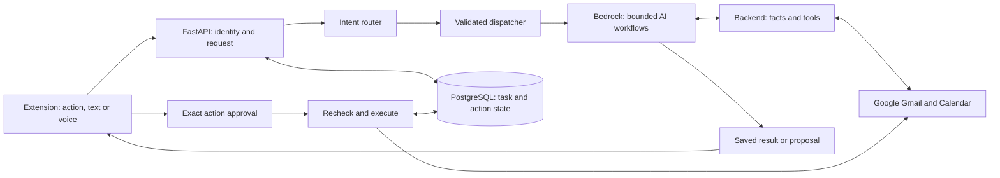

# Threadly: AI + backend implementation playbook

**Version 1.0 · 13 September 2026 · Implementation specification, not deployed functionality.**

Implementation has started. See [current evidence and remaining work](13-implementation-progress.md)
for branch-specific results; the architecture below remains the target design.

For implementation after merged PR #9, use the [backend execution handoff](../backend-execution/README.md):
26 dependency-ordered slices, a copy-paste coding-agent prompt, source maps,
acceptance assertions and resume checkpoints. The original T backlog remains the
product-level acceptance record.

This is the shared build plan for a Gmail assistant with five user intents:
**summarise, plan/schedule, reply, compose and other**. It covers user triggers,
Bedrock routing/Flows, backend services, Google integrations, evidence, approvals,
recovery, evaluation and delivery. Human engineers and coding agents should use
the same task IDs, contracts and acceptance criteria.

## Start here

| Reader | Reading path | Outcome |
|---|---|---|
| Everyone | This page → [product](01-product.md) → [architecture](02-architecture.md) | Understand scope, ownership and how a request becomes work |
| AI team | [routing](03-routing.md) → [workflows](04-workflows.md) → [Bedrock configuration](06-bedrock-and-integrations.md) → [evaluation](08-quality-and-operations.md) | Build prompts, flow definitions and evaluated model behavior |
| Backend team | [architecture](02-architecture.md) → [contracts/state](05-contracts-and-state.md) → [integrations](06-bedrock-and-integrations.md) → [delivery](07-delivery.md) | Implement trusted services and execution lifecycle |
| Frontend team | [product](01-product.md) → [contracts/state](05-contracts-and-state.md) → [workflow examples](04-workflows.md) | Build request, clarification, evidence and review experiences |
| Coding agent | [agent guide](09-coding-agent-guide.md) → assigned task in [backlog.json](backlog.json) | Implement one bounded task with verifiable completion |
| Release owner | [delivery](07-delivery.md) → [quality/operations](08-quality-and-operations.md) | Coordinate dependencies, gates and rollout |

For task-by-task deliverables and acceptance criteria, use the readable
[work package cards](12-work-packages.md), generated from the same backlog the
coding agents consume.

The [tool catalogue](tool-catalog.json), [prompt starters](prompts/README.md),
[typed examples](examples/index.json) and [routing seed cases](routing-fixtures.json)
make the handoffs concrete. The seed cases are not a completed evaluation dataset.

The Mermaid diagrams in these files render in compatible Markdown viewers,
including GitHub. [Diagram atlas](10-diagram-atlas.md) explains every diagram and
provides compact text explanations. [Sources and decisions](11-sources-and-decisions.md)
separates verified platform capabilities from proposed project choices.

## The architecture in one minute

**Bedrock produces interpretations and proposals. The backend owns identities,
facts, policy, durable state and external writes.** A human-facing category is not
necessarily one model call, one AWS resource or an autonomous agent. A scheduling
task may reuse reply generation; a cached summary may need no model call.

## Concrete deliverables

1. One request entry point with typed intent decisions and task continuation.
2. A working path for all five intents, including bounded multi-step requests.
3. Versioned Bedrock prompts/flow definitions, read-tool contracts and a release manifest.
4. Gmail/Calendar integration, persistent drafts and exact-payload approvals.
5. Durable execution, deduplication, reconciliation and honest outcome reporting.
6. Source-linked summaries/answers, inspectable assumptions and editable plans.
7. A shared evaluation suite, staged release gates and actionable operational runbooks.

## Baseline before implementation

This checkout has FastAPI, encrypted Google tokens, Gmail sync, PostgreSQL models,
summary SSE, and an Ollama/OpenRouter model client. Draft/send, entities,
commitments, voice, extraction and RAG are mostly stubs; the model router fallback
is unfinished. No Bedrock or Calendar implementation was found. Frontend code is
not in this checkout's `frontend/` directory; its README points to a separate branch.
These observations are code inspection findings, not a successful deployment audit.

## Authority and assumptions

- This playbook extends and replaces the earlier scheduling-only **proposal** in
  [bedrock-calendar-workflow.md](../bedrock-calendar-workflow.md) where designs differ.
- Existing [API](../api-contract.md), [data model](../data-model.md) and
  [architecture](../architecture.md) describe the current application. Their changes
  belong in the implementation PRs. This playbook does not silently change them.
- The requested direction is Bedrock + visual Flows. ADR 001 still documents the
  old inference policy; [ADR 003](../decisions/003-bedrock-migration.md) now supersedes
  its placement decision. The remaining T01 contract review is still pending.
- Confirmed primary audience: individual professionals and small teams using
  their own Gmail account. Enterprise shared mailboxes, organization-wide policy
  and non-Google providers are later scope.
- Numerical targets and implementation defaults are proposed starting values;
  they are not measured performance or promises of superiority over competitors.
- This package contains plans, examples and planning validation tools. It contains
  no deployed flows, production credentials, generated migration or live send.

## How the teams work together

Start each work package with an agreed example input, output and failure response.
AI supplies prompt/schema/evaluation changes; backend supplies deterministic
validators and tool implementations; frontend consumes the same examples.
No team needs another team's unfinished cloud resource to start: use fixtures and
fake adapters until the joint integration gate. Track completion through
[backlog.json](backlog.json); all entries begin `planned`.

The first vertical slice is **explicit summarise action → durable task → source-linked
summary**. After that, bring up intent routing, reply/compose, bounded lookup and
planning, then Calendar. The complete initial release requires all five intents;
the intermediate slices exist to make integration failures visible early.
