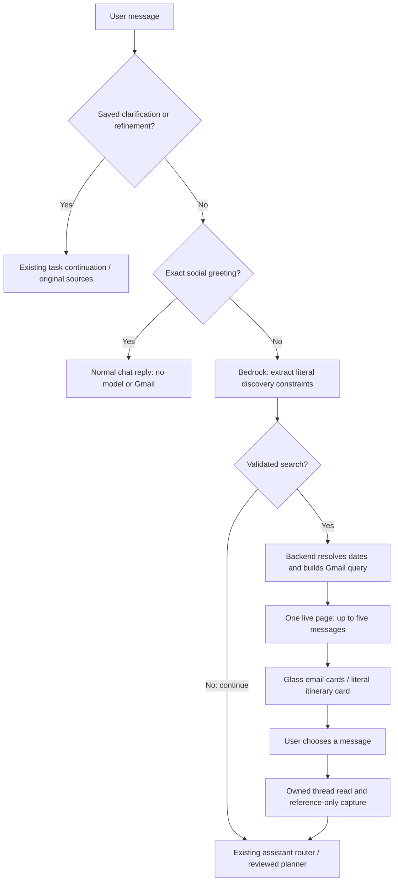

# Conversational inbox discovery — inbox-chat-1.0.0

The extension now accepts “Show me all the GYG emails” in the normal composer.
The API returns up to five live Gmail messages, with explicit search dates and an
opaque continuation cursor. There is no mailbox import, database cache of these
results, or background indexing. “All” does not mean the whole mailbox was read.

## Request and response contract

Both routes require the existing session JWT. Search requires the current Google
account’s Gmail read capability and on-demand mode. Existing error envelopes apply.

`POST /assistant/inbox-chat`

```json
{"instruction":"Show me all the GYG emails","timezone":"Australia/Melbourne"}
```

`instruction` is nonblank, at most 4,000 characters; timezone is an IANA name.
Unknown fields are rejected. The response has `release` and one of:

- `kind: message`, `text`: an exact social greeting, or a date clarification.
- `kind: continue`: submit the unchanged instruction to existing assistant task /
  proposal APIs. This response grants no authority to send, book or execute a plan.
- `kind: search`, `search`: `{filters, results, next_cursor, coverage}`.

`filters` contains `schema_version: 1.0`, literal `query`, `folder`
(`all_mail`, `INBOX`, `SENT`), UTC `received_from` / `received_before`, `cursor: null`.
Each result contains `message_id`, `thread_id`, `subject`, `sender`, `received_at`,
plain `snippet` (up to 220 characters), nullable `flight`. IDs are owned live Gmail
references. Selecting a card calls the existing owned `/threads/{id}` endpoint;
the frontend checks that the chosen message is still in that thread before capture.

`POST /assistant/inbox-search-page`

```json
{"filters":{"schema_version":"1.0","query":"GYG","folder":"all_mail","received_from":"2025-09-23T12:00:00Z","received_before":"2026-09-23T12:00:00Z","cursor":null},"cursor":"<opaque server cursor>"}
```

Returns the next search page. Reuse the exact returned filters. Existing cursor
signing binds user, Google account version, query scope and release/page size.
Changing filters or using another account rejects the cursor before a provider read.
Both a Show more button and the chat phrase “show more” reuse this endpoint.

## Routing and context



The prompt receives masked user text; protected values are restored only from the
same request’s mapping. Strict JSON and exact-substring grounding reject invented
search terms, dates and folders. The model cannot provide arbitrary Gmail operators.
Mixed discovery/action commands continue to the existing planner rather than quietly
running only the discovery fragment. Its existing supported operations still apply;
this release does not add arbitrary search-and-action DAGs.

Dates default to a visible rolling year; explicit supported calendar months/weeks
use the caller timezone, including daylight-saving boundaries. Maximum window is
366 days. Unsupported date language asks a question in chat; the next request must
include the desired search term/date together. Individual provider pages are sorted
by received time; this is not a complete-mailbox ordering guarantee.

## Presentation and limits

A flight card requires literal uppercase airport codes and an explicit flight /
itinerary marker in the email, e.g. `Flight itinerary: JFK → MEL. Flight QF12`.
The parser preserves the route quote; it does not invent airports, dates, times,
gates, flight status or a current aircraft location. Unsupported itinerary formats
remain ordinary email cards. The short SVG animation is decorative and respects
reduced motion. HTML from email is never rendered by these cards.

Search/greeting turns are ephemeral conversation state. Generated artifacts and
reviewed tasks retain their existing durable history. Arbitrary “the second one”
references and unconstrained conversational memory are not introduced: select a
card to bind follow-up questions to the right source. Normal task turns add one
small-model routing call; greetings, pagination and saved continuations do not.

## Evaluation / rollout

No migration, new container or new AWS Flow is required. Deploy the API before the
matching extension. Existing `/assistant/mail-search` keeps its default page size.
The interpreter uses the configured small Bedrock model and a 35-second timeout.
Failing interpretation produces a retryable human-readable error, never a guessed
provider query. External write gates and exact approval are unchanged.

Run `python -m app.planner.evaluate_inbox_chat --live` from backend with Bedrock
configured and both external writes disabled. Nine synthetic cases cover greeting,
GYG, flights, calendar-month dates, masked email addresses, latest mail and delegation
to existing workflows. The committed receipt pins prompt/schema/case hashes.
The first live run exposed a protected-email token being mistaken for missing input;
the final prompt explicitly permits copied protected tokens. The corrected run
passed all nine cases. This is evidence for those examples, not general accuracy.
