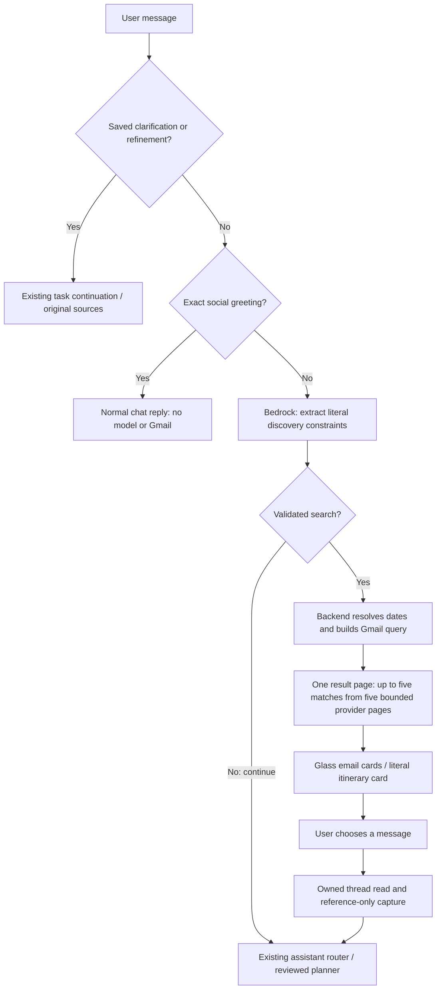

# Conversational inbox discovery — inbox-chat-1.1.0

The extension accepts “Show me all the GYG emails” in the normal composer. A request
such as “Find emails from person@example.com” searches that exact From address.
The API returns up to five matching live Gmail messages, with explicit search dates and an
opaque continuation cursor. To fill those cards after locally rejecting a Gmail hit,
it reads at most five provider pages and at most 25 candidate details per request.
There is no mailbox import, database cache of these
results, or background indexing. “All” does not mean the whole mailbox was read.

## Request and response contract

Both routes require the existing session JWT. Search requires the current Google
account’s Gmail read capability and on-demand mode. Existing error envelopes apply.

`POST /assistant/inbox-chat`

```json
{"instruction":"Show me all the GYG emails","timezone":"Australia/Melbourne"}
```

`instruction` is nonblank, at most 4,000 characters; timezone is an IANA name.
Unknown fields are rejected. The response has `release` and one of:

- `kind: message`, `text`: an exact social greeting, or a date clarification.
- `kind: continue`: submit the unchanged instruction to existing assistant task /
  proposal APIs. This response grants no authority to send, book or execute a plan.
- `kind: search`, `search`: `{filters, results, next_cursor, coverage}`.

`filters` contains `schema_version: 1.0`, literal `query` (which may be empty),
`sender_email` (an exact address or empty), `folder` (`all_mail`, `INBOX`, `SENT`),
UTC `received_from` / `received_before`, validated IANA `timezone` (legacy default UTC),
`limit` (1–5; the legacy interpreter uses 5)
and `cursor: null`. The address is a separate constraint, not part of the quoted
search phrase. Only a user-written “from” or “sent by” address can set it.
Each result contains `message_id`, `thread_id`, `subject`, `sender`, `received_at`,
plain `snippet` (up to 220 characters), nullable `flight`. IDs are owned live Gmail
references. Selecting a card calls the existing owned `/threads/{id}` endpoint;
the frontend checks that the chosen message is still in that thread before capture.
Results also contain `received_at_local` (ISO with offset), `received_timezone`,
`received_at_display` (local date/time, abbreviation, IANA zone and UTC offset), and
`timestamp_source: gmail.internalDate`. `received_at` remains the original provider
instant. Conversation message reads expose these same additive display fields.

`POST /assistant/inbox-search-page`

```json
{"filters":{"schema_version":"1.0","query":"GYG","sender_email":"","folder":"all_mail","received_from":"2025-09-23T12:00:00Z","received_before":"2026-09-23T12:00:00Z","limit":5,"cursor":null},"cursor":"<opaque server cursor>"}
```

Returns the next search page. Reuse the exact returned filters. Existing cursor
signing binds user, Google account version, query/sender/date/folder scope and
release/page size. The filter schema accepts `limit` from 1 to 5, but pagination
must preserve the first page's limit; changing it invalidates the cursor.
Timezone is also bound into the signed filter scope. Pre-update cursors must restart
their search because the new timezone field changes that scope.
Changing filters or using another account rejects the cursor before a provider read.
Both a Show more button and the chat phrase “show more” reuse this endpoint.

## Routing and context


```mermaid
flowchart TD
  A[User message] --> B{Saved clarification or refinement?}
  B -->|Yes| C[Existing task continuation / original sources]
  B -->|No| D{Exact social greeting?}
  D -->|Yes| E[Normal chat reply: no model or Gmail]
  D -->|No| F[Bedrock: extract literal discovery constraints]
  F --> G{Validated search?}
  G -->|No: continue| H[Existing assistant router / reviewed planner]
  G -->|Yes| I[Backend resolves dates and builds Gmail query]
  I --> J[One result page: up to five matches from five bounded provider pages]
  J --> K[Glass email cards / literal itinerary card]
  K --> L[User chooses a message]
  L --> M[Owned thread read and reference-only capture]
  M --> H
```

The prompt receives masked user text; protected values are restored only from the
same request’s mapping. Strict JSON and exact-substring grounding reject invented
search terms, dates and folders. The backend recognizes an explicit sender address,
builds the Gmail `from:` constraint, and checks returned parsed From addresses again.
Gmail's quoted phrase search can also match headers, so an address used as a general
query is not equivalent to a sender constraint. The model cannot provide arbitrary
Gmail operators.
Mixed discovery/action commands continue to the existing planner rather than quietly
running only the discovery fragment. Its existing supported operations still apply;
this release does not add arbitrary search-and-action DAGs.

Dates default to a visible rolling year; explicit supported calendar months/weeks
use the caller timezone, including daylight-saving boundaries. Maximum window is
366 days. Unsupported date language asks a question in chat; the next request must
include the desired search term/date together. Individual provider pages are sorted
by received time; this is not a complete-mailbox ordering guarantee.
Provider epoch query bounds include a one-second margin; the backend still enforces
the exact inclusive start and exclusive end against Gmail `internalDate`. This keeps
messages at the start boundary and in the final fractional second. `coverage.ordering`
is `received_at_desc_within_returned_page`, and coverage remains explicitly incomplete.

## Presentation and limits

A flight card requires literal uppercase airport codes and an explicit flight /
itinerary marker in the email, e.g. `Flight itinerary: JFK → MEL. Flight QF12`.
The parser preserves the route quote; it does not invent airports, dates, times,
gates, flight status or a current aircraft location. Unsupported itinerary formats
remain ordinary email cards. The short SVG animation is decorative and respects
reduced motion. HTML from email is never rendered by these cards.

Mail presentation policy `mail-presentation-1.0` cleans only transient snippets:
bounded nested HTML entities, invisible preheader padding, bare tracking links,
Markdown link destinations/emphasis and common footer lines. Meaningful word/emoji
joiners remain intact. Source bodies, exact evidence quotes, message/thread IDs,
selection/capture and Gmail data are unchanged. A snippet is not an exact-source quote.

Conversation release `contextual-conversation-1.8.3` adds typed `search_mail.selection`:
`latest_message` returns one card, and default `recent_matches` keeps the existing
1–5 `limit`. The existing explicit numbered-Inbox guard takes priority over a
contradictory model selection. Its prompt distinguishes a singular newest email from plural lists and
from searches requiring candidate comparison. It tells the model to use the backend's
local display timestamp and keep a simple listing answer concise. Interpretation is
semantic; no new matching phrase or sender-specific routing rule is added. The legacy
`/assistant/inbox-chat` interpreter retains its historical five-result behavior.

Search/greeting turns are ephemeral conversation state. Generated artifacts and
reviewed tasks retain their existing durable history. Arbitrary “the second one”
references and unconstrained conversational memory are not introduced: select a
card to bind follow-up questions to the right source. Normal task turns add one
small-model routing call; greetings, pagination and saved continuations do not.

## Evaluation / rollout

No migration, new container or new AWS Flow is required. Deploy the API before the
matching extension. Existing `/assistant/mail-search` keeps its default page size.
The interpreter uses the configured small Bedrock model and a 35-second timeout.
Failing interpretation produces a retryable human-readable error, never a guessed
provider query. External write gates and exact approval are unchanged.

Run `python -m app.planner.evaluate_inbox_chat --live` from backend with Bedrock
configured and both external writes disabled. Nine synthetic cases cover greeting,
GYG, flights, calendar-month dates, exact sender addresses, latest mail and delegation
to existing workflows. The [v2 receipt](evaluation/inbox-chat-live-v2.json)
pins the prompt, schema and case hashes; all nine synthetic Bedrock cases passed.
The earlier [v1 receipt](evaluation/inbox-chat-live-v1.json) pins the prompt/schema/case
hashes for `inbox-chat-1.0.0` and passed nine cases after a protected-email prompt
correction; it does not verify the new release. Synthetic replay is evidence for its
examples, not general accuracy.
