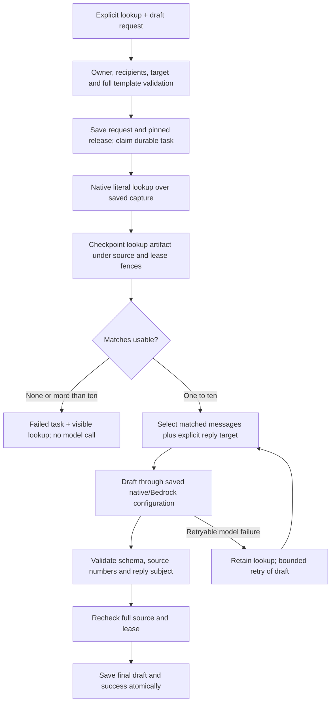

# Captured-text lookup → draft (B10b)

Implemented in this PR on PR #29 merge `e93541835e4e651a291a4a4d3dbf00839d4ab0c8`.
This is an explicit two-step workflow, not the general free-text command planner.
The existing summary templates and their release/hash remain unchanged.

## Contract

`POST /assistant/compound-requests` accepts two additional strict templates:
`lookup_then_reply` and `lookup_then_compose`. The request is discriminated by
`template`; unknown templates/keys, arbitrary steps, Flow IDs, send operations,
cursors, missing recipients and conflicting reply targets are rejected before enqueue.

```json
{
  "schema_version": "1.0",
  "request_id": "unique-lookup-draft-request",
  "context_snapshot_id": "owned-capture-uuid",
  "template": "lookup_then_reply",
  "query": "invoice",
  "draft_options": {
    "to": ["selected-recipient@example.test"],
    "reply_message_id": "selected-message-in-capture"
  },
  "draft_instruction": "Draft a short reply explaining the invoice status. Do not send it."
}
```

For compose select `lookup_then_compose` and omit the reply target. The source
must be an owned, nonempty saved thread capture. The search is case-insensitive
**literal body text**; it is not Gmail query syntax, semantic retrieval, an attachment
search, or a search across the mailbox. `POST /assistant/mail-search` remains the
separate explicit mailbox search API. Its results cannot be supplied as arbitrary
artifact references to this workflow.

The generation instruction applies only to the selected draft step. This endpoint
must be presented as an explicit workflow choice. Do not route a free-text command
here merely because BERT found a matching subset of its intents. Extra scheduling,
send, lookup or summary clauses require the future full-command planner; this API
cannot verify semantic completeness of arbitrary text.

## Execution and source mapping



Lookup uses `reads.search_page` (first page of ten matching messages). Each result
contains exact source IDs, source versions, quotes and captured-text coverage.
Matching excerpts are shown in the lookup artifact; drafting receives the **full
saved excerpts of matching messages**, not just the small matching quote. Replies
also receive the explicit reply target even when it does not match. Other messages
are excluded. All excerpts still respect the original capture limits.

Generation numbers only those selected messages and maps returned numbers back to
their original message IDs/versions. Public evidence `ref_id` is local to each artifact;
join evidence by `source_id`, not by assuming lookup and draft numbering are equal.
Recipients/Bcc/provider IDs are excluded from the prompt. The model cannot expand
source scope, choose a Flow, change the envelope, send, or book.

## Durable results and failures

- `compound.query` reports the literal query; lookup templates omit `summary_in_draft`.
- Step 1: operation `search_mail`, stream `lookup`, no dependencies.
- Step 2: `draft_reply`/`draft_new`, stream `result`, `depends_on: [1]`,
  `execution_after: [1]`. `requested_outputs` is `["lookup", "result"]`.
- A task's `artifact_id` stays null until final success. The lookup artifact remains
  available through its step reference if drafting fails. It is historical evidence,
  not a live freshness guarantee. Draft history/edit/review applies only to `result`.
- `lookup_no_matches`: zero matches **in this capture**, no model call. Submit a new
  request with a changed source/query; do not infer mailbox-wide absence.
- `lookup_scope_too_broad`: more than ten matching messages, no model call. Narrow
  the query using a new request ID; no silent first-page-only draft or pagination loop.
- Source changes stop the task (`read_source_changed`/`compound_source_changed`).
  A fresh capture/request is required; historical artifacts are never rewritten.
- Corrupted checkpoints/releases/dependencies fail closed. A lookup is re-derived
  locally before generation to validate source selection. Reuse means retaining the
  same saved step/artifact, not skipping inexpensive native integrity validation.
- Cancelled or replaced workers cannot publish. One attempt has a 120-second budget,
  task/step retries are bounded at three, and no transaction spans model calls.

The same backend executor owns both summary and lookup pairs. Release
`lookup-draft-template-1.2.1` pins its separate request/schema, read limits, prompt,
source-selection policy and inherited generation configuration. The original
`compound-template-1.0.0` contract hash is unchanged. Registry entries and AWS Flow
resources do not change: only draft generation invokes the configured Flow.

## Rollout and evidence

No migration, extra dependency, OAuth scope, role or new AWS Flow is needed. Head
remains `a0426e9bc731`. Deploy matching API and worker code together; old workers do
not support the new release. Before rollback, stop/drain new tasks; older code cannot
interpret these stored lookup templates. Retain historical tasks/artifacts.

Tests: `backend/tests/test_lookup_draft.py`, existing compound/migration suites and
versioned `backend/tests/fixtures/lookup_draft_v1.json`. Synthetic tests prove routing,
source selection and rejection, not model faithfulness. Live Haiku semantic evaluation,
configured staging invocation and frontend integration remain pending. Public email
approval/send stays gated; producing a draft does not authorize an external action.
