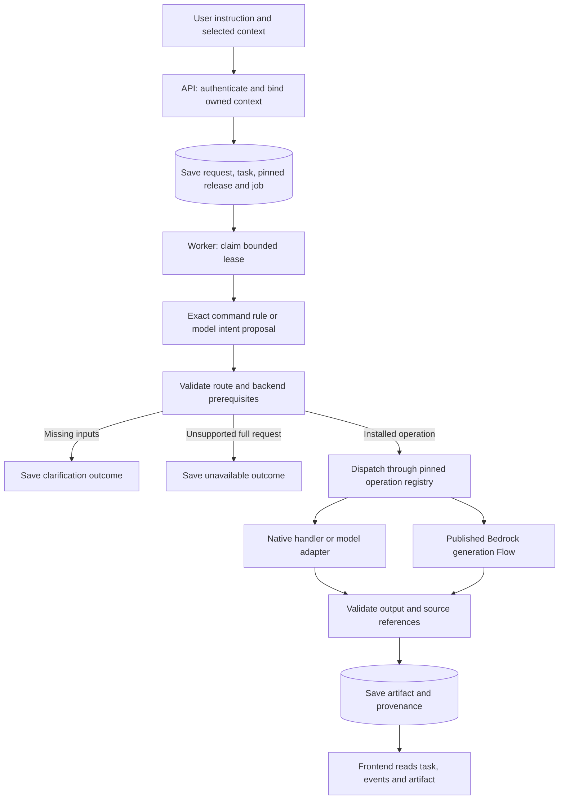
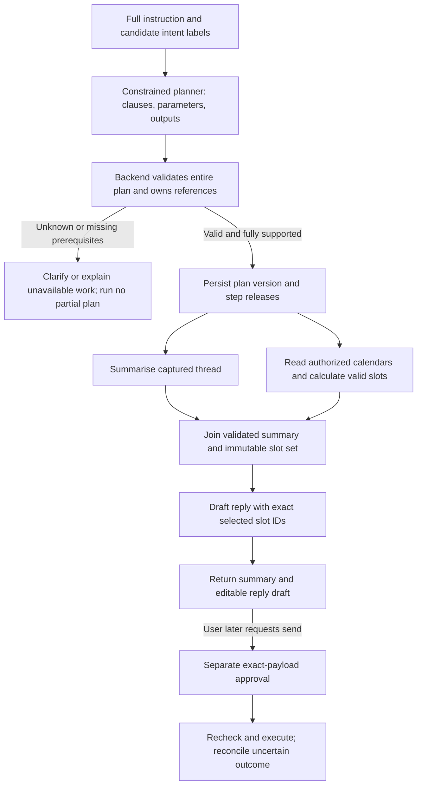

# Master workflow: current runtime and compound-request implementation contract

Baseline for this update: integration commit `fa23176` (PR #22 merged), plus
the B10a summary and B10b captured-lookup compound templates. This document distinguishes
working code from the next implementation. It does not claim the EC2 deployment
has this revision, the trained BERT package is wired in, or six prepared AWS Flows
are six executable application workflows.

## 1. One entry point; the backend is the coordinator

The frontend submits the user's complete request to `POST /assistant/requests`.
The API authenticates, checks ownership and saves a durable job. The separate
worker classifies, validates, dispatches and saves a result. There is no deployed
AWS “master Flow” that currently owns this lifecycle.



“Native” in the registry means backend implementation; summary/reply/compose may
still call the configured Bedrock model through the model adapter. A configured
Flow entry uses the versioned Flow invoker instead. Exact message lookup can
return saved text without model inference.

Code map:

| Responsibility | Current implementation |
|---|---|
| Request schema and five intent names | `backend/app/schemas/assistant.py` |
| Request acceptance, ownership, idempotency, leases | `backend/app/assistant/tasks.py` |
| Exact command rules, strict model proposal parsing | `backend/app/planner/intent_router.py` |
| Bind trusted context and check installed operations | `backend/app/assistant/routing.py` |
| Selected/ordinal message binding | `backend/app/assistant/ui_routing.py` |
| Route checkpoint, dispatch, bounded retry, publication | `backend/app/assistant/worker.py` |
| Operation → native/published Flow release mapping | `backend/app/workflows/registry.py` |
| Verify and invoke the pinned remote Flow | `backend/app/workflows/bedrock_flows.py` |
| Summary policy and output validation | `backend/app/assistant/summary_policy.py`, `summary_quality.py` |

No classifier result may specify an arbitrary Flow ARN, caller identity, provider
URL or permission to send mail. The backend resolves an allowlisted operation to
its configured implementation. The router does not receive email bodies; it gets
the user's instruction and backend-derived context-availability indicators.

## 2. What can run now

| User intent | Current generation/lookup path | What is still missing |
|---|---|---|
| Summarise | Thread summary and bounded selected-message summary | Current candidate's live quality gate; broader context/semantic evaluation |
| Reply | Reply draft using explicitly bound source and recipients | Exact send approval, execution and reconciliation |
| Compose | New draft with explicit recipients | Exact send approval, execution and reconciliation |
| Plan/schedule | Intent and selected operation pairs can be proposed | Installed planning/calendar handlers and their dependencies |
| Other | Exact mapped-message lookup, help/capture search/rewrite, scoped local-mail search | General natural-language retrieval and entity/commitment extraction |
| Multiple intents | Explicit summary or captured-text lookup → reply/compose templates via `/assistant/compound-requests` with checkpointed streams | Natural-language complete-plan planner, mailbox lookup coordination, Calendar triples and general compound execution |

`GET /assistant/workflows` reports **three installed generation operations**:
`summarise_thread`, `draft_reply`, `draft_new`, plus the bounded UI handlers. Its
`remote_resources_verified: false` is intentional: configuration is not a live
AWS readiness or quality check. `POST /assistant/route-preview` is diagnostic;
the frontend must not execute its returned operations itself.

On the original natural-language request endpoint, a recognized but uninstalled pair stops; it does not execute a supported
subset. The exact triple `summarise_thread → suggest_slots → draft_reply` is not
in the current proposal allowlist and is rejected as `invalid_route_output` if
returned by the model. That is a safe limitation, not satisfactory final UX.
The explicit B10a template endpoint is separate. This guard verifies the proposed operation list, not whether a model omitted a
clause while classifying. Command-to-plan coverage needs separate evaluation.
B10 must introduce an explicitly versioned planner and executor before advertising
this capability. Do not merely add the triple to an enum and call it implemented.

New tasks now have [typed durable clarification](assistant-continuation.md):
POST the current question ID/version and typed answer to the task inputs endpoint.
The original goal is preserved. Historical tasks and the old request.continuation
field retain their previous behavior. B10a adds explicit compound execution; general
plan continuation and automatic command planning remain pending.

## 3. BERT labels and user intent are different contracts

The user reports that BERT can return multiple labels for a query. Preserve that
capability, but verify its exact label map, training domain, output activation,
thresholds and evaluation before using it on assistant commands. A multi-label
email classifier is not automatically a command classifier. Do not infer these
properties from the presence of a `.safetensors` file.

In this merged baseline, `sync/worker.py::classify_needs_reply` returns `None` and
no BERT adapter is invoked by `planner/intent_router.py`. The separately committed
package/integration branch must be reviewed and merged explicitly; this change
does not edit another agent's working tree or download weights.

| Classification input | Meaning of result | Permitted use |
|---|---|---|
| Incoming email content | Action/category/priority of the email | Inbox ranking, badges, suggested user actions |
| User's explicit command | One or more requested capabilities | Advisory input to request planning |
| User's exact approval of a stored action | Authorization for that payload/version | Separate backend action executor, after rechecks |

Proposed classifier adapter output should retain model version, label-map version,
input kind, labels and per-label scores. Multi-label scores need not sum to one.
Thresholds require command-domain evaluation; low confidence/disagreement must
cause bounded fallback or clarification. Do not choose the highest-scoring label
and discard the rest. Do not expose this proposed envelope as an already accepted
`AssistantRequest` field; it needs a versioned schema/integration change.

Labels identify capabilities, not sequence, arguments, negation, dependencies or
permission. For “summarise this, don't reply, and check tomorrow's availability,”
a reply label must not override “don't reply.” A constrained planner needs the
original instruction and context bindings in addition to candidate labels.

## 4. Compound request: explicit steps and dependencies

Example command:

> Summarise this thread, find three 30-minute slots tomorrow during my working
> hours, and draft a reply including the summary and those slots. Don't send it.

Proposed execution, **after all handlers and prerequisites are installed**:



Summary and availability can be independent once the complete plan passes
preflight. An initial executor may run them sequentially to simplify correctness.
The reply waits for both because this command explicitly asks to include both.
If the user instead wants a summary for themselves and a reply containing only
slots, the reply depends on availability, not on the summary. Build dependencies
from data requirements rather than label order.

Illustrative **planned internal contract**, not valid input to the current API:

```json
{
  "schema_version": "proposed-compound-1.0",
  "intents": ["summarise", "plan_schedule", "reply"],
  "steps": [
    {
      "id": "summary",
      "operation": "summarise_thread",
      "depends_on": [],
      "inputs": {"context": "binding:source_context"},
      "output_type": "summary_artifact"
    },
    {
      "id": "availability",
      "operation": "suggest_slots",
      "depends_on": [],
      "inputs": {
        "calendar_selection": "binding:authorized_calendars",
        "preferences": "binding:calendar_preferences",
        "date_range": "binding:resolved_tomorrow",
        "duration_minutes": 30,
        "slot_count": 3
      },
      "output_type": "slot_set"
    },
    {
      "id": "reply",
      "operation": "draft_reply",
      "depends_on": ["summary", "availability"],
      "inputs": {
        "reply_target": "binding:reply_target",
        "summary": "step:summary",
        "slots": "step:availability"
      },
      "output_type": "draft_artifact"
    }
  ],
  "requested_outputs": ["summary", "reply"],
  "external_action": "none"
}
```

Every `binding:` value above stands for a server-created, owner-scoped reference;
the model cannot fabricate it. Runtime plan validation must resolve typed refs,
verify ownership, and pin inputs/release identities before making a step runnable.
Calendar code resolves “tomorrow” using the user's timezone and request time,
checks preferences and availability, and produces immutable candidate slots.
A model may phrase/rank permitted results but cannot manufacture free time or
invent three slots when only one exists. Slot-set validity is rechecked before a
later external action that relies on it.

## 5. Required planner/executor rules

1. Retain every explicit requested outcome and every negation. Labels alone cannot
   prove this; evaluate command → plan coverage, not only classifier accuracy.
2. Validate the entire supported operation graph before starting. Initial bound:
   at most five read/generation steps, no recursive planning or external write step.
   Reject cycles, unknown operations, missing refs and inconsistent types.
3. Collect all currently knowable missing inputs together: source, reply target,
   actual authorized calendars, timezone/preferences, date range and duration.
   Save typed clarifications and plan version through B08; a bare “yes” is not send approval.
4. Pin model/prompt/Flow and typed inputs per step. Persist step state and output
   atomically under a lease fence. Completion of a stale worker cannot publish.
5. Keep artifact streams distinct. Summary and draft can both be requested outputs;
   do not overwrite a summary with a draft or call the task complete after the first artifact.
6. Retry only failed retryable steps. Reuse valid successful dependencies; invalidate
   descendants when context, preferences, slot validity or user edits change inputs.
   A stale calendar result needs a fresh read and dependent draft, not blind reuse.
7. A downstream failure may show completed outputs as partial progress, but must
   leave the full request incomplete and offer recovery/cancellation. Initial
   unsupported plans run zero steps; this differs from failure after execution starts.
8. Enforce per-step and overall call/time budgets, cancellation, owner isolation and
   idempotency. Generation retry rules cannot be reused for Gmail/Calendar writes.
9. Source text and generated summaries never reroute the user's request. A summary
   contains facts and explicit outstanding requests; advice belongs to a requested
   planning operation. “Meeting proposed” never means “meeting booked.”

## 6. Work packages and joint acceptance gate

| Package | Concrete deliverable / owner | Gate |
|---|---|---|
| Classifier integration + T06 | AI supplies command-domain evaluation and versioned multi-label adapter; backend consumes advisory labels | Negation, multiple intents, domain mismatch and unknown labels tested; separate email metadata |
| B08 | Backend typed clarification implemented; frontend/staging gate pending | Owned versioned question/input acceptance; original goal preserved; no approval |
| B09 / B11 | AI + backend: bounded grounded answers / requested work plans | Evidence, no invented commitments, no execution implied |
| B10 | Backend + AI: versioned multi-step proposal and durable executor; frontend: separate output streams | Triple-intent scenarios, retries, stale refs, cancellation and unsupported-plan tests |
| B12–B13 | Backend: Calendar capabilities, freebusy, preferences and deterministic slot generation | Unknown access ≠ free; DST/conflict/insufficient-slot tests |
| B02–B06 / B14–B15 | Backend: approval, mail/calendar payload execution and reconciliation | Exact-payload approval and uncertain-write recovery |
| B16–B17 | AI + backend: reviewed operation registry/Flow releases and evaluations | Real test-account results with release identity before enabling |
| B18–B19 | Frontend + backend: presentation, explicit actions, end-to-end staging gate | Summary + slots + draft visible; Send separate; no false success |

B10's generic executor can be built before Calendar, using bounded fake handlers.
The scheduling triple cannot be enabled until B12/B13 and all relevant B10 gates
pass together. Its added acceptance criteria are in `backend-execution/tasks.json`
and the generated B10 card. Those criteria remain planned, not verified by this PR.

## 7. Pre-AWS summary gate

See [summary quality](summary-quality.md) and
`backend/tests/fixtures/summary_quality_v2.json`. The ten fixtures define source
text, intended behavior, a human reference, structural constraints and a rubric.
The offline replay can reject the reported delivery regression even though its
JSON is valid. These case-specific checks do not prove semantic grounding for
arbitrary emails or replace review of every clause against its sources.

Before promoting a candidate: local regression passes; old failed outputs fail the
new fixture assertions; every live candidate output is recorded against the same
fixture hash and verified prompt/model/Flow identity; all structural/regression
checks pass; human review finds no unsupported work/facts. Missing cases remain
not run. A different prompt requires a complete new candidate run. Preparing a
Flow is not release approval. No merge or report tool automatically deploys it.


## B09a explicit read entry path

[Bounded read actions](assistant-bounded-reads.md) add an explicit typed UI path
through the same durable task/worker system for help, saved-capture literal search
and rewriting one selected message. `read_options` pins one operation; a model
label alone does not activate retrieval. Existing natural-language routing and
unavailable compound behavior remain unchanged. B09's broader retrieval work is
still in progress before the complete multi-intent read/plan pipeline can be claimed.


## B09b scoped local search service

[Scoped mailbox search](assistant-mail-search.md) adds a native authenticated read
endpoint with explicit folder/date boundaries, local coverage and sync-version
pagination. It does not invoke the intent router or a model. Clients can select a
result and capture its source before submitting a task; automatic retrieval-to-
generation coordination remains pending with the read planner and compound engine.


## B10a implemented compound templates and testing map

[Compound runtime](assistant-compound-workflows.md) defines the implemented
`summary_then_reply` and `summary_then_compose` templates. These use a backend-owned
two-step plan, separately checkpointed artifact streams, a task final-result pointer,
source/lease fences and bounded retry. Frontend selection is required; the old
classifier/router cannot silently activate them or drop an uninstalled Calendar
clause. `summary_in_draft` determines the summary data dependency.

The [full workflow/testing map](workflow-testing-map.md) maps all five intents,
compound paths, provider configuration, exact implementation files and remaining
gates. [Machine-readable mapping](workflow-runtime-map.json) is the coding-agent
handoff. B10 remains in progress; this is not the complete master planner.

## B10b captured-lookup continuation

[Lookup → draft](lookup-draft-workflows.md) adds explicit captured-text search before
reply/compose through the same task/step lifecycle. Native lookup checkpoints its
result; only matching messages plus the selected reply target enter generation.
No match/too-many matches stop before generation. This is not classifier-driven
selection or a full-command planner. The next planner must account for all clauses
and negations before selecting any installed kernel. See the
[full progress report](backend-progress.md) for remaining packages and live gates.
