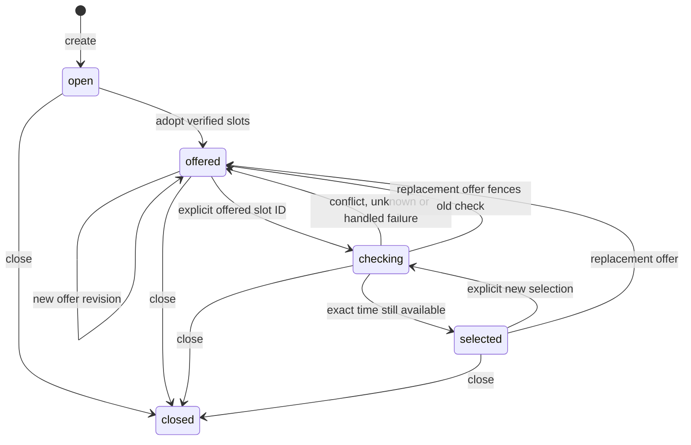

# Meeting offers and explicit selection — B14a

This is the persistent negotiation foundation of B14. It links an owned synced
email thread to immutable offers from [B13 slot queries](calendar-slots.md), then
rechecks an explicitly selected time. **Selected is not booked or approved.**
No email is sent and no event/action/job is created by these endpoints.

B14 is still incomplete: natural-language constraint extraction, B08 scheduling
continuation, assistant artifacts, AI-written offer replies, later-email interpretation
and complete scheduling/compound dispatch belong to B14b. These routes consume typed
user choices; untrusted email/model text cannot call a booking action through them.

## API sequence

All routes below require JWT ownership, actual Calendar read grants and return
`Cache-Control: no-store`. Gmail thread IDs and current thread versions are available
from `GET /threads` or thread detail. Slot/offer/selection IDs are UUIDs returned by
these APIs; never generate replacements for the stored IDs in the UI/model.

| Route | Input / result |
|---|---|
| `POST /calendar/negotiations` | 201; create or replay an owned thread-bound negotiation |
| `GET /calendar/negotiations/{id}` | Current version/state, offer and selection with freshness blockers |
| `POST /calendar/negotiations/{id}/offers` | 201; adopt a fresh nonempty B13 slot query as a new immutable offer revision |
| `GET /calendar/negotiations/{id}/offers/{offer_id}` | Exact historical offer; stale/superseded records remain visible but unusable |
| `POST /calendar/negotiations/{id}/selections` | 202; persist explicit slot selection, perform fresh exact-time read, publish receipt |
| `GET /calendar/negotiations/{id}/selections/{selection_id}` | Exact check receipt plus current usability/blockers |
| `POST /calendar/negotiations/{id}/close` | Close this negotiation; pending checks cannot restore it |

Create input (use the selected real thread ID/version):

```json
{"request_id":"meeting-1","thread_id":"example-thread","expected_thread_version":1}
```

Run B13 after the latest thread update, then create an offer using its returned UUID.
The UUID below is illustrative and must be replaced by that actual response:

```json
{
  "request_id":"offer-1",
  "expected_version":1,
  "expected_thread_version":1,
  "slot_request_id":"11111111-1111-4111-8111-111111111111"
}
```

An offer contains `id`, `revision`, `created_version`, `current_version`,
`thread_version`, `slot_request_id`, creation/expiry timestamps, immutable slot
options/labels and assumptions from B13, plus `usable` and `blockers`. Invitee
availability is always `unknown`; `reservation` is always false. There are no
caller-supplied option times, invitee-availability claims or prose fields.

Select with the current negotiation version, exact offer UUID and one of its slot
UUIDs. The backend does not accept “second option” or “yes” as an implicit choice.
A later B14b interpreter must propose that mapping against the original offer and
obtain explicit user confirmation.

```json
{
  "request_id":"select-1",
  "expected_version":2,
  "offer_id":"22222222-2222-4222-8222-222222222222",
  "slot_id":"33333333-3333-4333-8333-333333333333"
}
```

Typical version sequence: create = 1; first offer = 2; selection reservation = 3;
check publication = 4. Always use the current version returned by GET. Offer
revision counts offers only; negotiation version also counts selection and closing.
Close input: `{"request_id":"close-1","expected_version":4}`.

## State and freshness



The stored state describes history. **Clients must inspect `usable` and `blockers`**
on each offer/selection: a stored `selected` receipt can become stale later. The
backend never turns a stale historical result into an approval or event.

- Offers inherit the slot query's expiry; adopting/replaying/revising an offer does
  not extend it. Selection lifetime cannot exceed either its original offer or the
  fresh check. B13 limits remain in force.
- Every read and mutation checks source versions/expiry. A changed synced thread,
  preference/account/policy change, expired evidence, closed negotiation or superseded
  offer makes a choice unusable. Missing/foreign records return 404; missing grants 403.
- New replies must be synced first. To replace an offer, supply the latest thread
  version and a B13 query accepted after that thread update. Sync now stamps source
  updates with the actual database clock, not transaction-start time; a lock wait
  cannot make an older slot query appear newer than the source change.
- Unsynced incoming mail is not visible to this backend. External calendar changes
  within a result's TTL are also possible; no reservation or exclusivity is promised.
- Selection always checks the **same UTC start/end** with current calendar data.
  A busy result returns `conflict`; incomplete coverage returns `unknown`; provider
  failure returns `failed`. It never substitutes another offered/free time.
- Selection receipts carry `checked_slot_request_id`, exact original slot, status,
  expiry and blockers. `booking_approved` and `reservation` are always false.
  Negotiation `event_created` is also false.

## Concurrency, idempotency and recovery

```mermaid
sequenceDiagram
    participant U as Authenticated caller
    participant N as Negotiation service
    participant DB as PostgreSQL
    participant C as B13 / Google reads
    U->>N: Offer ID + slot ID + expected version + request key
    N->>DB: Lock account, preferences, thread, negotiation
    N->>DB: Check source/expiry; save checking receipt; advance version; commit
    N->>C: Recheck exact UTC time (no open caller DB transaction)
    C-->>N: Saved fresh slot query or sanitized provider error
    N->>DB: Re-lock and compare version, offer, thread and preferences
    alt Same context and exact time free
        N->>DB: Publish selected receipt and advance version
    else Conflict, unknown, stale or superseded
        N->>DB: Publish non-usable outcome; preserve original time/history
    end
    N-->>U: Receipt; no booking approval or external write
```

Request keys are scoped by owner for creation, and by negotiation plus operation
for offer/selection creation. Same key and normalized body returns the existing
identity; different body returns 409 `idempotency_conflict`. Replay returns current
usability, so timestamps/IDs remain stable while blockers/version may change.
Closing has its own saved key/hash and is idempotent after closure.

Concurrent duplicate selections perform one provider check. A competing distinct
selection is rejected while checking. A replacement offer or close may supersede a
pending check; late publication cannot overwrite it. Source/settings changes during
reads prevent a usable selection. The backend revalidates saved check input against
the exact receipt/query/slot binding before publishing.

A process interruption leaves `checking`; replay reports that receipt without another
read. There is no automatic check retry/job in B14a. Poll its GET route. After a stuck
or expired check, explicitly adopt a fresh offer (or close), using the latest version;
old checks remain unusable. If grant revocation/deletion prevents finalization, the
error envelope includes `detail.selection_id`. Reconnect/sync, inspect the receipt,
and replace stale context rather than silently retrying old selections.

Common 409 codes include `negotiation_changed`, `thread_changed`,
`slot_query_precedes_thread`, `no_verified_slots`, `offer_superseded`, `offer_expired`,
`selection_in_progress` and B13 calendar freshness codes. An unknown slot ID in an
owned offer returns 422 `slot_not_offered`. Malformed/extra fields use the standard
422 envelope. No raw provider responses or mailbox text are placed in these errors.

## Storage, validation and next handoff

Migration `e14026e9a034` follows `d13026e9a033`. It adds `meeting_negotiations`,
`meeting_offers`, `meeting_selections` and thread-owner uniqueness. Composite FKs
bind current pointers, offers, slot queries and checks to their owner/negotiation.
Offers are immutable. Selection checking→terminal publication is the only mutable
receipt transition; expiry can only shorten. Negotiation identity is immutable and
changes require exactly one version increment; closed negotiations cannot reopen.
Downgrade refuses while negotiations exist. Evidence needed by offers cannot be
removed independently; retention cleanup remains an explicit B19 design task.

Local tests cover API/PostgreSQL/Google-transport paths, ownership, version races,
process loss, rollback, fresh checks, unknown/conflict outcomes, schema rejection,
old-data migration, constraints and actual service publication under migration
triggers. [Checkpoint and recorded results](backend-execution/checkpoints/B14.md).
No live Google, model, deployment or external-write result is claimed here.

**Next: B14b** — connect this lifecycle to assistant scheduling tasks, validated
constraint extraction and B08 continuation, grounded options/answer artifacts and
reply drafts, and later-email selection proposals. Do not pass arbitrary times or
claims through an unconstrained draft prompt. Then **B15** freezes exact event
payloads and handles explicit booking approval, fresh dispatch checks and uncertain
provider outcomes. Current selection alone does not authorize B15 execution.
