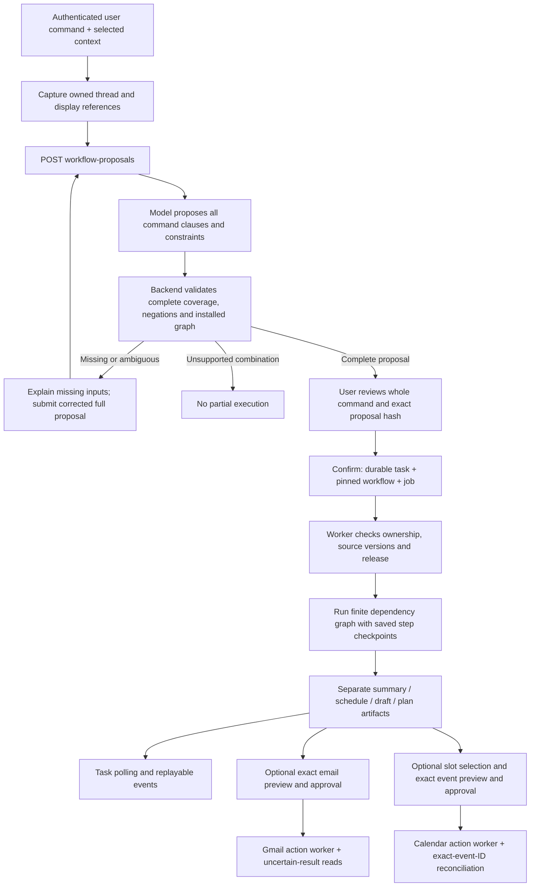

# MVP backend integration and testing handoff

> Current correction: [on-demand Gmail](on-demand-gmail.md) supersedes the mailbox-sync,
> local-search and stored-source assumptions below. Default runtime fetches selected sources
> from Gmail and stores references only; bulk sync is retired. See that contract before integration.

17 September 2026. Base: merged PR #36 (`06ca1a0b45afb50bd20dad9dfb6c02cc66603d0f`).
This combined integration implements the remaining bounded backend paths. It does not
certify live Google/Bedrock behavior or frontend completion. Use OpenAPI and the
runtime schemas as the field-level authority. Frontend integration remains deferred.

## Request lifecycle



The classifier does not select endpoints, Flow ARNs, recipients or permissions.
The supplied BERT package is an email-content softmax classifier (approve, attend,
complete_submit, edit, no_action, reply, review), not a trained multi-label command
router. It is not wired into this coordinator. Importing those weights or treating
email labels as a command plan would be incorrect. A future command-domain classifier
can supply advisory candidates after calibrated holdout evaluation.

## Installed operation mappings

| User intent | Entry / execution | Output and authority |
|---|---|---|
| Summarise | Coordinator → `summary`; existing assistant requests retained | Evidence-checked concise summary; no send |
| Reply | Coordinator → `draft_reply`; selected reply target and recipients required | Editable draft, separate exact MIME review/approval |
| Compose | Coordinator → `draft_new`; literal recipients required | Editable new-message draft; never implicit sending |
| Plan, non-calendar | Coordinator → `plan`; `plan_actions` generation | Evidence-backed proposed items, nullable owner/date, dependency graph |
| Schedule | Coordinator → typed `schedule` | Backend computes availability/options from owned Calendar evidence |
| Bounded Other | help, transform_text, captured text search; new lookup_entity / lookup_commitments | Scoped answer with coverage; extracted values remain candidates |
| Search mailbox | Existing `/assistant/mail-search` with explicit window/folder | Local synced mailbox only; master does not silently translate it to captured lookup |
| Later email chooses a time | `/assistant/meeting-response-proposals` → review → exact-time check | Fresh availability artifact, no automatic selection or booking |
| Send / book | Separate typed action APIs | Exact payload, current version, explicit approval, pilot scope |

Supported complete multi-step graphs:

- Existing summary → reply/compose and captured lookup → reply/compose.
- New schedule → reply/compose.
- New summary → schedule → reply/compose, with explicit include/separate summary choice.
- Accepted plan → reply/compose via an explicitly selected current plan artifact.

These are finite templates, not an arbitrary tool planner. Unsupported combinations
stop as a whole. In particular, `send` and `book` in a command are not downgraded to
`draft` and `check`. A plan must be reviewed/selected before another request uses it
as a commitment. Correcting a master proposal creates a new immutable full proposal;
in-place free-text plan revision is not installed. Existing typed scheduling task
continuation still supports contextual time/date clarification. Do not ask AM/PM if
saved explicit context resolves it; ambiguity must remain visible when it does not.

## Cross-team API sequence

1. Authenticate. Read `/assistant/capabilities` and `/assistant/workflows`; request only needed
   Google grants. Read readiness means configured, not a live model test.
2. Capture the selected source with `/assistant/context-snapshots`. Keep the returned
   capture ID, source versions and UI display mapping; never invent a message index.
3. POST `/assistant/workflow-proposals` with `schema_version`, unique `request_id`,
   complete `instruction`, `context_snapshot_id` and optional `draft_options`,
   `expected_preferences_version`, `anchor_message_id`, `transform_message_id`.
4. Render the complete returned proposal and missing/unsupported reason. POST
   `/assistant/workflow-proposals/{id}/confirm` with the exact `plan_hash` and
   `confirm_complete_command: true` only after user review. Confirmation is idempotent.
5. Follow `/assistant/tasks/{id}` or its event stream. `workflow.steps` identifies
   operation, state and artifact; `completed_steps/total_steps` is task progress.
   A saved intermediate artifact is not proof the whole task succeeded.
6. Fetch the artifacts, render their actual kind, coverage, assumptions and blockers.
   Do not show JSON as the product summary; render summary content and source links.
7. Draft edits create revisions. Exact email action preparation, approval and sending
   use the existing email action endpoints; copying/inserting text is not sending.

Standalone compose and single scheduling commands can use the master coordinator without
an email capture: they dispatch to the existing typed handlers and retain the saved
scheduling request anchor. Source-dependent operations still require an owned capture.

A caller that already collected explicit fields can POST `/assistant/workflow-requests`
directly. The request is still preflighted in full before a task is queued:

```json
{
  "schema_version": "1.0",
  "request_id": "client-generated-unique-id",
  "instruction": "Summarise this, find three times tomorrow, and draft an email.",
  "context_snapshot_id": "owned-capture-id",
  "operations": ["summary", "schedule", "draft_new"],
  "summary_in_draft": false,
  "schedule": {
    "operation": "suggest_slots",
    "expected_preferences_version": 1,
    "constraints": {"date": "tomorrow", "count": 3}
  },
  "draft_options": {"to": ["recipient@example.invalid"]}
}
```

IDs, versions and recipients above are placeholders. Relative dates are anchored by
backend acceptance time or the explicitly selected message. Do not reuse the example
request ID for different content. On 409 refresh the indicated source/revision;
blindly resubmitting with a new key can create unwanted duplicate proposals.

## Planning and commitments

`plan_actions` can propose at most 12 items and five questions. Every proposed item
must cite existing numbered sources and an exact quote. Generated owners and ISO
dates must appear literally in that quote; missing facts remain null. Structural
validation cannot establish semantic entailment, so human review and the live model
rubric remain necessary.

POST `/assistant/tasks/{id}/plan-review` with a unique request ID and
`expected_revision`, plus either edited `items` or `accepted_item_ids`. Edits can
retain/remove existing items and revise their text/owner/date/dependencies. They
reset selections and are marked user-authored; new-item insertion is not installed.
Selection must include required dependencies. A subsequent draft request supplies
`accepted_plan_artifact_id`; only selected items are included. Editing the plan later
makes dependent drafts stale. `/commitments?context_snapshot_id=...` reports current
selected items for that captured thread, never that work has been completed.

## Scheduling, later replies and booking

```mermaid
sequenceDiagram
  participant U as User
  participant B as Backend
  participant M as Model
  participant G as Google Calendar
  U->>B: Reviewed schedule constraints
  B->>G: Read selected calendar ACL and free/busy
  B->>B: Resolve time, buffers, working hours, stable slots
  B-->>U: Options + optional literal-time draft
  U->>B: Explicit offer and slot selection
  Note over U,B: Later email can first produce a reviewed choice proposal
  B->>M: Selected response + historical numbered offer
  M-->>B: Choice/ambiguous/declined + exact quote
  B-->>U: Review proposal; confirmation only authorizes a fresh read
  B->>G: Recheck exact historical time
  B-->>U: Fresh option; explicitly adopt offer and select
  U->>B: Preview event with title, attendees, notifications
  B-->>U: Exact immutable payload and hash
  U->>B: Separate event approval
  B->>G: Recheck ACL and buffered free/busy
  B->>B: Persist one dispatch intent
  B->>G: Insert stable event ID once
  alt Confirmed exact matching response
    B-->>U: Succeeded + provider event ID
  else Timeout, collision or crash
    B->>G: Read exact event ID, bounded reconciliation
    B-->>U: Matched success or outcome unknown
  end
```

A later response must belong to the owned meeting thread and postdate the recorded
offer. Old option numbers are interpreted against the stored offer, never newly
sorted options. An expired historical offer can be interpreted, but its availability
cannot be reused. After a successful recheck, use existing negotiation offer/selection
APIs with the fresh slot request and fresh slot ID; interpretation alone does not
change selection. Unknown/busy results never substitute another time silently.

`POST /assistant/artifacts/{id}/calendar-actions` accepts `request_id`,
`expected_revision`, `selection_id`, `calendar_id`, `title`, optional description,
location, attendees and `send_updates` (`all` or `none`). Attendees require `all`.
Times come from the selected slot. GET `/assistant/calendar-actions/{id}` returns the
preview, blockers, version and payload hash. POST its `/approve` with request ID,
expected version and hash; `/reject` and `/cancel` remain separate user decisions.

The backend uses one stable event ID and a private action marker; exact-ID reads
compare the event fields before declaring success. A 404 is not permission to retry
insertion. Reconciliation is bounded to three read rounds. Cancel after dispatch
cannot guarantee the provider did not act. Calendar booking and an email send are
separate actions, not an atomic transaction. Free/busy and event insertion are also
not atomic: another client may add an event between them. Google defines client event
IDs and notification options in [Events.insert](https://developers.google.com/workspace/calendar/api/v3/reference/events/insert)
and duplicate/conflict responses in its [error guide](https://developers.google.com/workspace/calendar/api/guides/errors).

## Bedrock ownership and reproducibility

The original registry retains `summarise_thread`, `draft_reply`, `draft_new` unchanged.
`ASSISTANT_AUXILIARY_WORKFLOW_MANIFEST` optionally maps `route_command`, `plan_actions`,
`interpret_meeting_response` to native generation or pinned published Bedrock Flows.
Empty configuration uses the configured model adapter (Bedrock in staging). There is
no implicit alternate-cloud fallback in Bedrock mode. Calendar arithmetic, lookups,
approval and Google execution are backend code, not model tool calls.

Backend-owned context prefetch supersedes the proposed Lambda read callback for this
MVP; see [ADR 004](decisions/004-mvp-backend-owned-orchestration.md). AWS visual graphs
are generation-only Input → Prompt → Output. Human waits live in PostgreSQL. The six
old console prototypes are experiments; preparing them does not activate these APIs.
Published alias/version/definition/role checks still apply. A changed configuration
can require re-review of an unconfirmed proposal; accepted queued Flow tasks retain
pinned targets. Native queued tasks fail closed when their model contract changes.

Versioned assets: `backend/fixtures/mvp/prompts-v1.json`; replay validation:
`test_mvp_auxiliary.py`, `test_mvp_coordinator.py`, `test_mvp_workflows.py`,
`test_meeting_responses.py`, plus existing summary/draft/extraction suites. Model
output is bounded and source-validated, but mocked output is not live quality evidence.
PII masking can make exact quote validation fail for email-address-containing quotes;
that yields a safe invalid-output result, not fabricated evidence.

## Reliability and operations

POST `/sync/jobs` with a unique `request_id`, then poll `/sync/jobs/{id}`. The dedicated
sync worker saves page cursors and staged messages, replays history, then atomically
publishes the complete mailbox change. Account/sync versions and leases prevent stale
publication. A transient page error retries with backoff; expired history can restart
full backfill twice. Five failed attempts on one page stop the job. Default staging
limit is 5,000 distinct messages; exceeding it fails without partial publication.
Operators may raise `MAILBOX_SYNC_MAX_MESSAGES` after sizing the host. The old inline
`POST /sync` remains for compatibility; new clients should use jobs.

GET `/assistant/operational-status` returns only the authenticated owner's state counts,
queue age and rollout controls. Worker container health checks use local heartbeats;
health does not verify Google grants, model quality or that a stalled job is correct.
`ASSISTANT_DISABLED_INTENTS` accepts summarise, plan_schedule, reply, compose, other;
it blocks new dispatch and the new workflow's step/publication checkpoints. Existing
legacy handlers check before dispatch, not during an already running provider call.
External write controls are separate and remain off by default.

`python -m app.operations.retention` is a bounded dry run. `--apply` explicitly removes
expired unconsumed proposals/OAuth states, old orphan captures and terminal sync staging.
It preserves referenced captures and all task/artifact/action recovery records. This
is not a comprehensive account-erasure or legal retention policy. Run it deliberately;
no automatic deletion schedule is added.

## Acceptance before calling the MVP complete

Use [the release gate](testing/mvp-release-gate.md) and
[the EC2 deployment runbook](../infra/deploy/ec2/MVP-ROLLOUT.md). Local checks cover
storage, route boundaries, failure/recovery and deterministic contracts. Still required:
current published Flow/model holdout evaluation, live OAuth/revocation, real Calendar
comparison, explicitly approved controlled send/event, restore rehearsal on deployed
backup, frontend interaction and pilot sign-off. Voice, proactive suggestions, personal
style learning, attachments, recurrence and event editing remain later scope.
