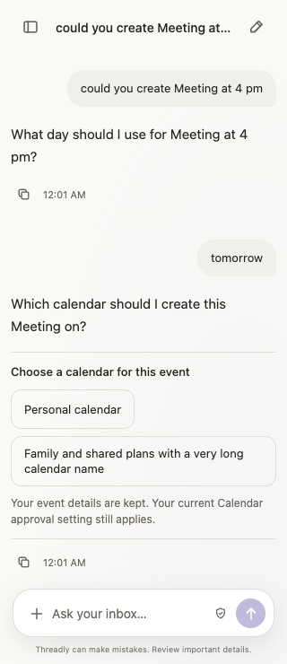
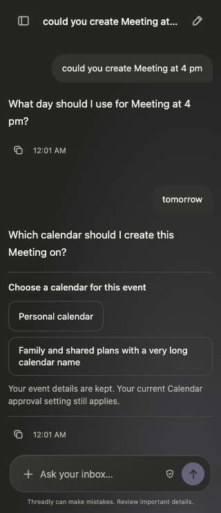

# Calendar choice review

Built Chromium extension with a local fake API and synthetic calendar names.
Captured at 320 × 740. No real Google data or events were used.

The browser regression in `tests/e2e/extension.spec.ts` covers Meeting at 4 p.m.,
the separate date answer, panel reopen, keyboard selection, exact request retry,
and the resulting Ask approval card. It also confirms the selected calendar label
is never sent as a chat instruction and no event approval occurs during selection.

Local validation: 162 unit tests, 32 local Chromium tests, one separate
public-origin Chromium test, typecheck, formatting and both builds passed.
The companion backend's issued choice handles and retained event state are a
deployment dependency; fake API outcomes are not live model-quality evidence.
