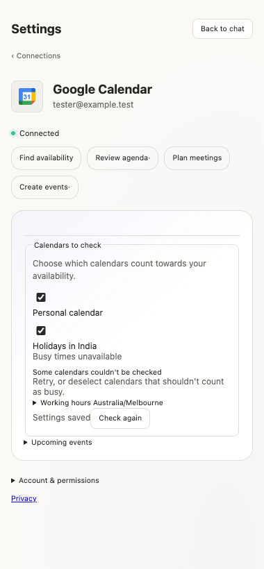
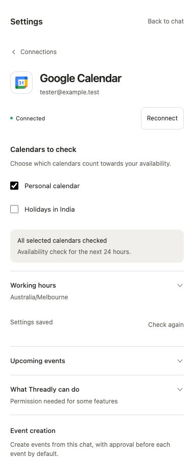
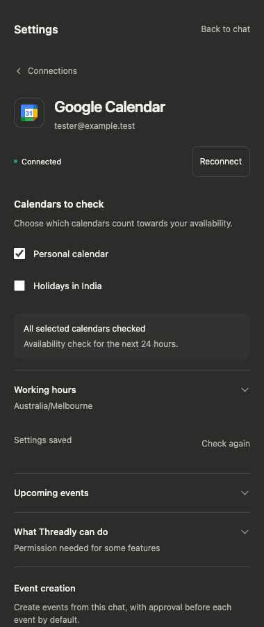
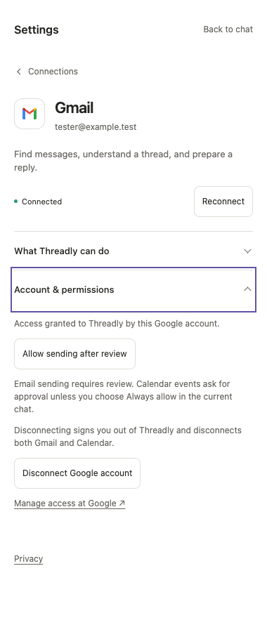
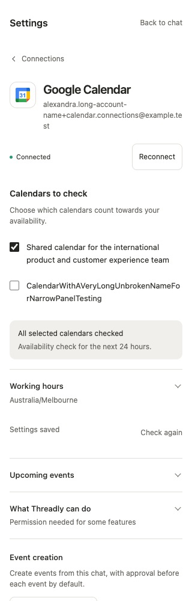

# Google connection settings redesign

The Gmail and Google Calendar screens now use one account header, an explicit
connection status and a visible reconnect action. Calendar choices align their
checkboxes with their labels. Simple dividers replace nested fieldsets and the
tinted card. Feature availability appears as readable text under “What Threadly
can do”, including missing permissions and unavailable features.

The presentation retains the existing system font, color tokens and Google icons.
Buttons have 44px targets; disclosures have keyboard focus outlines; long account
and calendar names wrap in narrow panels. Gmail/Calendar scopes, OAuth handling,
capability checks, preference versioning, shared disconnect confirmation,
Calendar approval modes and event execution are unchanged.

## Review base

Ownership was coordinated with the Calendar and context owners before editing.
Work started from PR #88 commit `8fc2590c8d7228d8e432a75f90284cb52a5e09fd` in an
isolated checkout. PR #88 then merged as `679d532`; its tree is identical to the
starting commit. The redesign branch was fast-forwarded to that frontend merge.
Only `components/Connectors.tsx` and the connection/settings rules in `style.css`
change production code. The Calendar functionality owner's components are intact.

## Screenshots

All images are from the actual built extension in isolated Playwright Chromium,
using synthetic account/API fixtures. They do not use a real Google account.
Screens taller than the panel continue through normal vertical scrolling.

| Before | Calendar after |
| --- | --- |
|  |  |

| Dark mode | Gmail permissions | Long names at 320px |
| --- | --- | --- |
|  |  |  |

## Verification

- `npm run typecheck` — passed.
- `npm test` — 130 tests passed across 14 files.
- `npx prettier --check components/Connectors.tsx style.css tests/connectors.test.tsx tests/e2e/connections-design.spec.ts tests/e2e/extension.spec.ts` — passed.
- `git diff --check` — passed.
- `python3 -m unittest discover -s scripts/release -p 'test_*.py' -v` — 29 passed.
- `npm run build && npm run test:e2e` — 28 passed; the public-origin test is intentionally skipped in this local-origin build and passed separately below.
- `PLASMO_PUBLIC_THREADLY_BACKEND_ORIGIN=https://api.threadly.au npm run build` followed by `PLASMO_PUBLIC_THREADLY_BACKEND_ORIGIN=https://api.threadly.au npx playwright test tests/e2e/public-origin.spec.ts --output test-results/public-origin-run` — passed. This is a local build/test, not a deployment.

The added Chromium coverage exercises connected/disconnected Gmail and Calendar,
explicit consent controls, missing permissions, loading, dismissal during loading,
retryable Calendar errors, reconnect pending/cancellation feedback, keyboard
focus and Enter/Space operation, disconnect cancellation, list/back-to-chat
navigation, working hours, checkbox edits, light/dark mode, and long names.
Responsive checks cover widths 320, 375, 768, 1024 and 1440px. Existing tests also
verify stale preferences, failed calendar coverage, exact versioned saves,
disconnect success/failure, chat approval modes and event cards.

Reconnect screenshots use a fixture-only LOGIN response to avoid opening real
Google consent. Unit tests verify the unchanged requested capability IDs.
No real OAuth permission was granted, email sent or event created. This visual
review does not validate or release the separate backend authorization work.

The build emits the existing optional `svgo`/htmlnano warning; builds complete.
