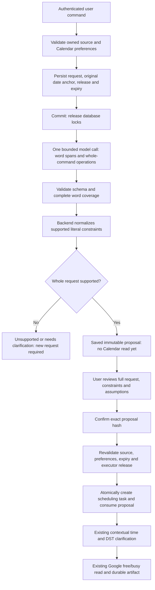
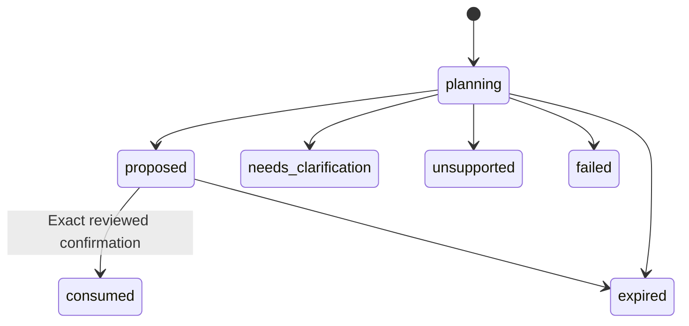

# Reviewed natural-language scheduling (B14b2a)

This release adds **user command → scheduling proposal → explicit review → existing
Calendar-read task**. It does not send mail, book meetings, interpret incoming-email
selections or automatically dispatch a mixed-intent request. B14 remains in progress.

Release: `reviewed-scheduling-extraction-1.0.0`. Executor stays
`assistant-scheduling-1.0.0`; old accepted requests, release hashes and worker behavior
remain compatible. Migration: `f14026e9a036`, after PR #35's `f14026e9a035`.

## Workflow and authority



The BERT intent classifier can suggest entering this surface. It neither supplies
Calendar facts nor authorizes confirmation. The original `/assistant/requests`
router and four existing compound templates are unchanged. No new master AWS Flow
or Flow ARN is created: extraction uses the existing configured model adapter
(`inference_provider=bedrock` uses the configured Bedrock model). It is a backend
preparation step, independently versioned from the scheduling worker. The same
adapter retains its existing explicit legacy-provider behavior when configured;
this module adds no retry or alternate-provider policy.

## API walkthrough

All routes require the existing user authentication. Save Calendar preferences and
connect the required Google Calendar read grants first. Context IDs must belong to
the user. Optional `anchor_message_id` must name a captured message with a timestamp;
it explicitly anchors relative dates to that message. Otherwise dates use the
**database receipt time**, not model-completion or confirmation time.

`POST /assistant/scheduling-proposals` (202):

```json
{
  "schema_version": "1.0",
  "request_id": "schedule-proposal-001",
  "instruction": "Check tomorrow afternoon at four for 30 minutes",
  "expected_preferences_version": 1
}
```

The response has `proposal_id`, `state`, `request`, `result`, `proposal_hash`,
`release`, `expires_at` and nullable `task_id`. `result` contains:

- Literal command clauses and field `sources`, plus the model's indexed extraction.
- Backend-compiled `SchedulingRequest` or null when not confirmable.
- Original `anchor_at`/`anchor_source`, timezone/duration/default-count assumptions.
- Missing `pending_fields` and an explicit notice that contextual AM/PM and DST
  resolution still happens in the worker after review. The proposal is not an
  availability answer; `calendar_checked` is false and invitee availability unknown.
- Provider/model provenance for successful parsing; sanitized failure reasons.

Display the entire original command, clauses, compiled operation/constraints,
assumptions, missing fields and expiry before allowing confirmation. Structural
coverage validates word ranges; **it cannot prove the model understood every word**.
Users must reject an incorrect interpretation. Live semantic evaluation is pending.
Do not treat a model's `proposed` status or a classifier label as user approval.

`GET /assistant/scheduling-proposals/{proposal_id}` returns the saved owner-scoped
proposal. Expired planning/proposed receipts display `expired`; reads do not mutate
history. Current source/preferences are checked at confirmation, not claimed fresh
by GET. `POST /assistant/scheduling-proposals/{proposal_id}/confirm` (202):

```json
{
  "proposal_hash": "<exact 64-character hash from the reviewed response>",
  "confirm_complete_request": true
}
```

The actual hash is required; the placeholder above is illustrative. Confirmation
accepts no edited constraints, replacement instruction, slot IDs or tool names.
It returns the usual task response. Follow its events/status/artifact and, if asked,
answer through `/assistant/tasks/{task_id}/scheduling-inputs`. See
[typed scheduling contract](assistant-scheduling.md). Corrections or an unsupported
phrase require a **new request ID** and reviewed proposal (or the explicit typed API).

## Supported language boundary

| Field | Accepted literal phrases | Handling |
|---|---|---|
| Date | `today`, `tomorrow`, ISO `YYYY-MM-DD` | Backend resolves relative dates against saved anchor and selected timezone |
| Date window | `next week` for suggest_slots | Next Monday through Sunday, disclosed as policy; 7 days |
| Clock | Existing typed clocks e.g. `4`, `4 pm`, `16:00`; supported number words | Bare `4` preserves ambiguity; no model-selected AM/PM |
| Daypart | morning/afternoon/evening with exact clock | Explicit local context window 00–12 / 12–18 / 18–24; existing resolver checks consistency |
| Duration | Integer/supported number word + minutes/mins/hours/hrs | 5–480 minutes; otherwise clarification |
| Count | one/two/three or 1–3 for suggest_slots | Defaults to 3, shown as an assumption; never silently cap larger counts |
| Timezone | Geographical IANA zone or `UTC` | Abbreviations such as EST require clarification; defaults to saved timezone |

Supported number words are one through twelve, fifteen, twenty, thirty, forty-five
and sixty. Other phrases (e.g. Tuesday, half an hour) fail closed for this release.
No recurring meetings, exclusions, arbitrary date ranges, multiple meetings, or
invitee-availability claims are supported. They must appear in `unhandled`, preventing
confirmation. Daypart-only slot search is not installed; it requests clarification.
The typed route still supports its existing richer explicit fields, including DST
fold and participant display timezones.

Mixed “summarise + find slots + reply”, “check and book” or “check and send” returns
unsupported as a whole when represented by the extractor; no subset is dispatched.
Source emails never enter the model prompt in this release. A supplied capture pins
freshness and an optional date anchor only. Extracting constraints from source email
and resolving email references are future work; the caller must give a self-contained
user command. Do not claim this release understands “do what this email asks”.

## Persistence, races and recovery

The `scheduling_proposals` table stores owner, idempotency key/hash, original command,
owned source reference/hash, immutable binding (account version/preferences/original
anchor), release hashes, state, result/hash, expiry and owned consumed task pointer.
Database constraints enforce owner-scoped context/task references. The migration's
trigger guards immutable input/result and allowed state transitions.



Reservation commits before the single model call (45 seconds, maximum 2400 output
tokens, 24,000-character accepted JSON). Same key/body replays the receipt, including failures;
same key/different body is a conflict. Inference interruption leaves `planning` until
15-minute expiry. It is not retried automatically: explicitly submit a new key.

Confirmation locks account → preferences → source → proposal → task. It recompiles
the stored word spans and compares the complete result, checks executor availability,
and atomically creates one durable task plus consumed pointer. Task acceptance hashes
include the internal saved binding only on this new path; old request hashes are
unchanged. Rollback creates neither task nor consumed receipt. Concurrent confirmation
returns one task. A consumed receipt replays that task without repeating inference or
Google operations, even if the proposal has since expired. Task source/preference
and cancellation/lease fences continue to apply in the worker.

The task receives the proposal's **original** anchor, even when a missing date is
answered later. Current calendar read evidence is obtained only after confirmation.
Model/provider errors return a sanitized failed proposal. Unsupported/malformed
outputs never enqueue work. Changed source/preferences, hash mismatch, expiry or
unavailable release prevents confirmation; use a fresh request after resolving it.

## Validation, rollout and remaining gates

- Synthetic replay fixture: `backend/tests/fixtures/scheduling_extraction_v1.json`.
- Run from backend: `python -m app.planner.evaluate_scheduling --output report.json`.
- Checked-in [replay report](evaluations/scheduling-extraction-v1.json) records the
  release/contract hash and each expectation. This measures deterministic handling
  of supplied outputs, **not Haiku extraction accuracy**.
- Persistence/API/concurrency: `tests/test_scheduling_proposals.py`; real migrated
  schema/API/worker: `tests/test_scheduling_proposal_migration.py`.
- Apply migration with matching API/worker code. Downgrade refuses while proposal
  rows exist; do not delete production history merely to bypass that guard.
- No new credentials, dependencies, AWS resources or environment variables. No EC2
  deployment, billed model evaluation or live Google test performed by this PR.

Before pilot rollout, the AI team must evaluate the exact configured Haiku release
on labelled unseen commands, mixed intents, omitted/contradictory constraints,
contextual times, timezone/DST boundaries and injection attempts. Agree acceptance
thresholds first; record denominator, failures and human adjudication. Do not present
synthetic contract pass counts as model quality. Backend follow-ons: slot-grounded
reply proposals, later-email selection review, then B15 approved event execution and
uncertain-result reconciliation. Broader multi-intent scheduling graphs remain open.
