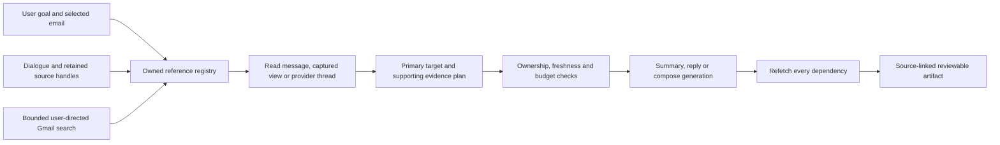

# Shared email context — backend implementation

Release `contextual-conversation-1.7.0`, source policy `mail-context-1.0`.
Local implementation; live model/Gmail acceptance and deployment are separate gates.

This combined release includes the merged Calendar creation/approval behavior from
PR #87 (`8a9e72c`) and shared mail context from 1.6.0. Retained email handles and
pending Calendar event details coexist independently. Calendar authorization,
action status hydration and stored receipt filtering remain backend-owned.
Historical 1.5.0/1.6.0 assets and evaluation receipts remain unchanged; their live
model results do not establish semantic quality for this combined release.

The reported thread summary used one selected message. Conversation tools defaulted
to that message, and `visible_thread` meant the extension's captured subset. Gmail
had fuller history available. Workflow preparation reduced evidence to one reference,
and new searches discarded earlier search handles.

## Shared design

`app/assistant/context_plan.py` owns plan capture and deterministic excerpts.
`app/conversation/mail_context.py` owns bounded source retention. Model tool
arguments select issued handles and scopes; the backend resolves and validates them.

| Concept | Implemented behavior |
|---|---|
| Primary reference | Anchors the workflow; the explicit selected message determines reply headers. |
| `thread` | Default conversation read/workflow scope. Includes provider history and collapsed messages. |
| `selected_message` | Explicit individual-message work; no neighbouring-message expansion. |
| `visible_thread` | Existing owned UI subset/order; never means the complete provider thread. |
| Supporting evidence | Up to four additional already-read references using each source's most recent read scope. Cannot change recipients or the reply target. |
| Retained sources | Eight stable `context-N` handles survive searches/pin changes. History records which handles each turn used. These references contain no original mail text. |
| Retrieval | Bounded on-demand Gmail reads/search using user-supplied terms. No mailbox import, embeddings or autonomous whole-mailbox search. |
| Freshness | Re-read on each request/attempt; check all owner/account/fingerprint bindings. Independently re-read every dependency before artifact publication. |

A reply uses earlier sent mail and other threads while preserving its selected
target. A new draft uses the same evidence without becoming a reply. Ambiguous
targets or missing recipients use existing clarification. Source text cannot
authorize tools, replace recipients or approve external actions.

## Budgets and coverage

A plan contains at most five threads, 50 messages and 24,000 body characters.
Message slots are shared between threads. Oversized threads retain first/last
messages, the explicit reply target and intermediate samples; omissions are counted.
Character allocation gives every included message a share and redistributes unused
space from short messages. A long latest email cannot consume the entire context.
The existing provider limit of 200 messages per thread remains in force.

Generation receives source numbers, thread groups, subjects, sender/date, owner-authored
flags, excerpts and coverage. Supporting provider IDs and recipient authority are
excluded. Artifacts disclose thread/message counts, omissions and truncation.
Attachment contents are unavailable. This is bounded coverage, not attachment
parsing, semantic relevance ranking or unlimited conversation summarization.

## Persistence and compatibility

No migration: existing `ContextSnapshot` JSON stores `gmail-context-plan-1.0`.
The primary thread remains the relational anchor; nested references record all
supporting owner/account/thread versions, fingerprints and scoped message IDs.
Primary version metadata stays at the top level, preventing unchanged recaptures
from spuriously bumping thread versions. Policy and prompt hashes pin
materialization; unknown hashes fail closed.

Legacy `gmail-reference-1.0` excerpts/hashes and old queued generation inputs remain
unchanged. Generation adds metadata/instructions only for new plans. Existing
extension capture/conversation APIs need no new browser permission or request
shape. No Bedrock Flow is provisioned. Previously failed summaries need a new
request after rollout.

Conversation retention remains seven days and 12 exchanges. Retained handles are
working context, not fresh facts: later use requires a read. Removing the pin clears
the active selection; historical handles remain for explicit follow-ups.
Starting/deleting a chat clears that working context.

## Verification

`tests/test_shared_mail_context.py` replays synthetic employment-verification history
through PostgreSQL, conversation handling, capture and the generation worker. It
checks collapsed-message coverage, supporting threads, target separation, ownership,
staleness, fair budgeting, reference retention, version stability and reference-only
storage. Existing tests preserve explicit individual-message semantics.
`tests/test_mail_calendar_context_integration.py` also carries retained email handles
through Calendar clarification and idempotent replay under both Ask and Always allow.

Deterministic tests establish context delivery and validation, not live semantic
quality. The release gate remains a measured model replay and controlled Gmail
checks for a collapsed-message summary, a reply using earlier sent mail and a draft
using two threads. Attachment-derived conclusions remain unsupported.
