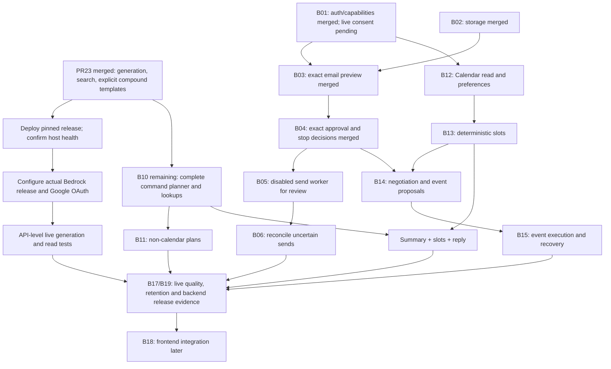

# Backend and AI workflow map: what to test next

Updated 16 September 2026. This is a shared engineering handoff, not a claim that
all target workflows are installed. Machine-readable companion:
[workflow-runtime-map.json](workflow-runtime-map.json).

## Release layers

| Layer | Evidence / status |
|---|---|
| EC2 host, API, DB and worker | User-supplied deployment output confirms PR #23 / `954b492`, migration `c8291e4a6f03`, API and dependency checks passed |
| Provider connectivity on that deployment | Output explicitly reports Bedrock model selection and Google OAuth configuration pending |
| Merged source / deployment target | PR #26 merge `68e7b5e` adds exact email previews; deployment command prepared, host result pending |
| Current feature branch | B04 exact approval/outbox and durable stop decisions; new public approval and sending disabled |
| Trained BERT / auth work in another checkout | Auth seed copied into an isolated branch and completed; original checkout/classifier work preserved |

## Whole target lifecycle and ownership

```mermaid
flowchart LR
    UI[Frontend: request and owned source selection] --> API[Backend: auth and idempotency]
    API --> ROUTE[Command router / future complete-plan planner]
    ROUTE --> CHECK[Backend: full plan and capability validation]
    UI --> TEMPLATE[Explicit compound template selection: B10a]
    TEMPLATE --> CHECK
    CHECK --> CLARIFY[Save missing inputs; frontend supplies typed answer]
    CLARIFY --> CHECK
    CHECK --> WORK[Durable worker and pinned steps]
    WORK --> READ[Backend-owned source / future Calendar reads]
    READ --> AI[AI: versioned prompts and Bedrock Flows]
    AI --> VALIDATE[Backend: schema, evidence and deterministic facts]
    VALIDATE --> ART[Separate artifact streams and partial progress]
    ART --> REVIEW[Frontend: inspect, edit, copy or review]
    REVIEW --> STORE[B02: immutable action storage and edit supersession]
    STORE --> PREVIEW[B03: exact MIME preview merged]
    PREVIEW --> APPROVE[B04: approval and stop decisions for review; public approval disabled]
    APPROVE --> WRITE[Pending: dedicated send / booking executor]
    WRITE --> RECON[Pending: reconcile uncertain provider outcome]
```

The backend coordinates; no cloud master Flow currently orchestrates all these
stages. Bedrock handles bounded generation. Prompt changes alone cannot install
Calendar reads, send approvals or the recovery worker.

## Intent, API, handler and output map

| Intent / path | Current entry | Code / dispatch | Output | Remaining gate |
|---|---|---|---|---|
| Summarise | `/assistant/requests` + owned capture | `tasks.py → worker.py → summary_quality.py`; registry `summarise_thread` | Source-linked summary | Current live model quality, frontend display |
| Reply | Same + selected target/recipients | `routing.py → drafting.py`; `draft_reply` | Threadly draft | Send approval/execution/reconciliation absent |
| Compose | Same + explicit recipients | `routing.py → drafting.py`; `draft_new` | Threadly draft | Send approval/execution/reconciliation absent |
| Other: help/capture search/rewrite | Same + `read_options` | `reads.py`; backend reads / bounded rewrite | Answer, exact quotes or suggested text | General natural-language retrieval and extraction incomplete |
| Other: mailbox search | `/assistant/mail-search` | `mail_search.py`, owned local DB query | Scoped page and stable cursor | PR #22 deployment; automatic query planning pending |
| Contextual clarification | `/assistant/tasks/{id}/inputs` | `continuation.py` | Requeued original task with typed inputs | Frontend/staging exercise; not a compound-plan editor |
| Summary + reply/compose | `/assistant/compound-requests` | `steps.py`; explicit two-step templates | Summary stream + final editable draft | PR #23 deployed; provider configuration/live gate pending |
| Non-calendar plan | Existing router can recognise intent | Handler pending B11 | Target: editable plan, confirmed commitments | B10 broader execution / B11 |
| Schedule/check time/slots | Existing router can propose operations | Calendar handler pending B12–B14 | Target: authoritative slots and negotiation | Actual scopes, preferences, freebusy, deterministic time calculations |
| Summary + slots + reply | Complete-plan contract is documented | Full graph not installed | Target: separate summary and slot-grounded draft | B10 planner + B12/B13; never run supported subset |
| Email send / event creation | Email proposal/read APIs; Calendar pending | B02/B03 preview and B04 decision services; pending B05/B06 / B14/B15 | Email preview only; target: confirmed or unknown provider outcome | Exact payload approval + rechecks + reconciliation |

## Fastest route to useful testing

### Track 1: test what is already implemented

Backend/release owner configures protected server environment values using
[APP-DEPLOYMENT.md](../infra/deploy/ec2/APP-DEPLOYMENT.md) and
[Bedrock workflow runtime](workflow-runtime.md). Do not paste secrets into
chat, fixtures, logs or Git. Keep the existing loopback API + SSM tunnel approach
until the agreed public callback/domain setup is ready.

Required checks, in order:

1. Confirm exact deployed commit/migration and `/healthz`, `/readyz`.
2. Configure the selected Haiku model/profile and the published operation manifest
   if using Flows; confirm caller role and Flow execution role can invoke them.
   Record actual configuration/resource versions. Do not substitute an experiment's
   output schema for the backend runtime contract.
3. Configure Google OAuth and the exact client callback flow; log in with an allowed
   test account. Verify actual granted scopes and reconnect behavior before external writes.
4. Sync a synthetic test thread; capture it through the API. Do not test with guessed
   source IDs or a fake success response.
5. Run summary, reply draft and compose draft through API → DB → worker → Bedrock.
   Verify evidence, recipients, draft-only wording, edits and event replay.
6. After PR #22 deployment, exercise local-mail search with two test users and
   explicit folder/date boundaries. After PR #23 deploys, run both compound
   templates and confirm separate summary/draft output and draft revision history.

Frontend integration is deferred by user request. Backend fixtures and API-level
staging tests can proceed without frontend implementation. Live test
results remain pending until the same paths run through the configured staging host.
A healthy API alone does not establish Google login or Bedrock generation readiness.

### Track 2: finish the remaining backend scope in bounded PRs

| Order / dependency | Work | Concrete completion evidence |
|---|---|---|
| B01 / merged PR25 | Live-check actual-scope persistence, OAuth ownership and capability state | Revoked/missing scopes and account changes tested; controlled OAuth smoke |
| B10b after this slice | Complete command planner, all-clause/negation coverage, lookup steps, plan clarification | Fixed versioned corpus, zero partial execution for unsupported plans; source invalidation and recovery |
| BERT adapter after AI handoff | Verify label map/domain/activation/thresholds; separate email metadata from command routing | Multi-label and low-confidence fixtures; no dynamic Flow/permission authority |
| B11 after required B10 contracts | Non-calendar plans and explicit commitment selection | Evidence-backed owner/deadline ambiguity, revisions and selected-only draft content |
| B12/B13 after actual Calendar capability | Preferences, timezone anchors, freebusy and deterministic slot sets | DST gaps/folds, busy/unknown calendars, buffers, conflicts, insufficient slots |
| B04 merged; B05 worker review; B06 next | Exact email action payload, approval, dedicated executor, reconciliation | Stale edit/approval races; timeout-after-send remains unknown until reconciled; no blind resend |
| B14/B15 after slots/action contracts | Negotiation and approved Calendar writes/recovery | Expired offer, changed availability and uncertain event creation tests |
| B16/B17 throughout | Versioned Flow manifests, bounded read adapters where needed, live evaluations | Same replay cases locally and through recorded AWS release; semantic review |
| B18/B19 release gate | Frontend/API contract tests, retention/recovery, full staging scenario matrix | All five intents, compound task, approved writes and failure recovery verified together |

Source/capability work and AI evaluation can progress independently of compound
execution where interfaces are settled. Do not merge the other agent's dirty auth
checkout blindly or enable a sender before its recovery implementation exists.

### Track 3: shared acceptance matrix

| Scenario | Required observable result | Gate today |
|---|---|---|
| Paid invoice thread summary | Resolved issue, no invented follow-up work | Offline summary cases exist; current live run pending |
| Explicit summary + reply | Both artifacts, bound recipients, final draft editable | PR #23 deployed, offline fixtures pass; provider setup/live pending |
| Draft failure after summary | Partial summary, incomplete task, retry only draft | Local compound regression |
| Cancellation / replaced lease | Late model result does not publish | Local compound regression |
| Changed thread during generation | Source error; historical output unchanged | Local compound regression |
| Cross-user capture/task/step/artifact | No data exposure or cross-owner references | Local ownership / DB constraints |
| “Summarise, don't reply, check tomorrow” | Preserve negation and all clauses; no partial execution | Full planner + Calendar pending |
| “Tomorrow at 4” in context | Resolve from sufficient context; clarify genuine ambiguity | Continuation foundation exists; Calendar time engine pending |
| Three requested slots, only one free | Return one grounded option, no invented slots | B12/B13 pending |
| Edit after action approval | Old approval cannot authorize changed payload | B04 approval/edit races and B05 mock dispatch tested; public live approval still gated |
| Provider accepts send but response times out | Unknown outcome; reconcile before any retry | B06 live gate pending |

## Human/AI handoff rules

- Frontend uses the actual OpenAPI/request schema and workflow capability response.
  A classifier response is never an instruction for the browser to invoke AWS.
- AI changes versioned prompts/schema/fixtures together and records model/profile,
  Flow version and semantic failures. Synthetic adapters establish control flow,
  not a measured model-quality pass rate.
- Backend owns auth, context IDs, recipients, availability, persistence, retries
  and approvals. Preserve immutable historical evidence across edits and retries.
- Each PR records tested/untested gates and the next dependency in its checkpoint.
  The [B05 checkpoint](backend-execution/checkpoints/B05.md) is the current resume
  point; [B10](backend-execution/checkpoints/B10.md) records the compound foundation; do not infer completion from the presence of diagrams or prepared Flows.

## Critical path before enabling complete workflows

These are dependency gates, not a numerical completion estimate. Storage passing
unit/integration tests does not make a provider write or live workflow complete.

B01–B04 are merged at PR27; merged-branch migration head a0426e9bc731.
B05 adds the dedicated disabled worker without DDL and is ready for review.
After merge, B06 reconciliation is next; live sending also requires controlled-account evidence.
The original dirty auth/classifier checkout remains preserved.
B02 supplies a deletion guard; the final retention/recovery/purge policy remains
a release prerequisite. Classifier labels remain advisory: complete-plan validation
must reject unsupported clauses before executing any part of a request.

Deployment instructions and confirmation criteria: [current EC2 release](deployment-current-release.md).
Detailed storage lifecycle: [action storage](assistant-action-storage.md).

Exact payload/API contract: [email action previews](email-action-previews.md).

Decision API and cutoff: [exact approval and stopping actions](action-approval.md).

Worker code map, failure matrix and no-resend policy: [email actions](email-actions.md).
