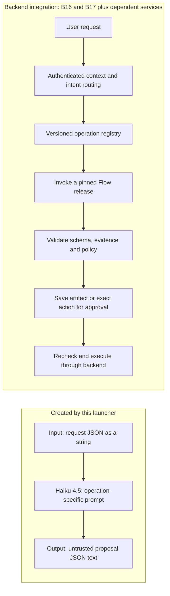

# CloudShell: six Bedrock Flow prototypes

Status: provisioning code and offline tests; **not an integrated backend release**.
This is a user-requested preparatory subset of B16/B17, not completion of those tasks.
The current assistant worker continues to use its native handlers. No API, database,
worker, EC2 instance profile or application configuration changes are made here.

## What the launcher creates

One CloudFormation stack owns six `AWS::Bedrock::Flow` resources and one IAM role.
The Flows have distinct inline prompts and are prepared for console experiments:

| Flow | Prototype behavior | Required input beyond the instruction |
|---|---|---|
| summary | Source-grounded summary or clarification | Supplied message IDs, bodies, display order and coverage |
| plan | Editable proposed action plan | Relevant evidence and known constraints |
| schedule | Meeting-offer wording from supplied candidates | Backend-validated slots, resolved date/timezone/duration |
| reply | Proposed reply text | Explicit target message and source context |
| compose | Proposed subject/body | User's brief and known facts |
| other | Bounded source Q&A, rewrite or extraction | Supplied sources |



These graphs contain no Google, Lambda, knowledge-base, agent or write nodes.
They do not fetch Gmail, read a screen, compute free/busy, create invitations,
send mail, persist a draft, or implement durable human waits. Prompts request JSON;
**JSON/schema correctness and evidence validity are not enforced by these graphs**.
Use synthetic data for console experiments; the production context/PII path is
not attached. A prompt instruction is not an authorization boundary.

## Selected model and region

The launcher uses `ap-southeast-2` and resolves
`au.anthropic.claude-haiku-4-5-20251001-v1:0` through `GetInferenceProfile` in the
signed-in account. It checks ACTIVE status, account, model and Australian destination
ARNs before creating anything. There is no silent global or alternative-model fallback.
AWS documents Sydney/Melbourne routing for this Australian Haiku profile. If it is
not available in the account, stop and inspect the error before choosing a different
region/profile. Discovering an active profile does **not** verify permission to infer,
Anthropic onboarding, quota, Marketplace prerequisites or successful model output.

The new role can invoke only that profile and its returned Australian model ARNs.
Foundation-model invocation is conditioned on the selected profile. Its trust is
restricted to Bedrock Flows in the current account and Sydney; the resource wildcard
allows these six Flows to share the role without a CloudFormation dependency cycle.
It grants no Google, Lambda, EC2, S3 or secrets permissions. This role is separate
from the EC2 application's role. The role receives no general Bedrock admin policy.

## Run from AWS CloudShell

Use the checksum-pinned download command supplied with the PR/handoff. Alternatively,
from a checkout containing this file:

```bash
python3 infra/bedrock/cloudshell_flows.py
```

Requirements: Python 3 and a current AWS CLI with `bedrock-agent` commands. CloudShell's
signed-in principal needs read access to STS identity and this inference profile;
CloudFormation validate/create/describe/get-template permissions; Bedrock Flow
create/get/prepare/delete/tag/list-tags permissions needed by CloudFormation;
and IAM create/get/pass/tag role, inline-policy and cleanup permissions. The script
acknowledges `CAPABILITY_IAM` for the new unnamed execution role. It does not grant
these deployment permissions to your user, submit provider forms or accept agreements.
Organization SCPs and permission boundaries may still block resource creation/inference.

The script verifies the template with CloudFormation, creates/resumes the stack,
compares the resulting Flow definitions with the checked-in definitions, then calls
PrepareFlow and waits for each to be Prepared. It prints a six-step progress bar.
Creation/preparation performs no explicit `InvokeFlow` or model call. Pressing Run in
the Bedrock console invokes the Flow and incurs usage charges independently of EC2.
No always-running server is added by this stack.

Outputs go into a private `threadly-flows-*` directory in the current CloudShell
folder: generated CloudFormation template, six API-shaped Flow definition exports,
and `manifest.json` with IDs/ARNs, prompt/definition release hash, preparation status,
`backend_enabled: false` and `live_eval: not_run`. Keep this manifest as the handoff;
it contains account resource identifiers, not credentials. Don't commit real manifests.

The stack/Flow names include a content-derived release hash. Repeating the same script
with the same account/profile resumes or reuses the resources, without updating an
existing stack or publishing extra versions. A different prompt/release/model set
creates a new stack. DRAFT and its built-in `TSTALIASID` are for experiments only;
no numbered production version or application alias is published by this launcher.
Console changes cause drift: the script stops rather than overwriting them.

## Failures and cleanup

If a CloudShell tab disconnects, rerun the identical launcher. Resource creation may
still be running. Inspect the named CloudFormation stack and its Events before taking
other actions. The launcher does not delete failed resources or broadly retry permission
errors. A `ROLLBACK_COMPLETE` stack requires inspection and deliberate deletion before
recreating the same release. IAM propagation/model access failures can require a later
rerun after the underlying problem is resolved. The local manifest may be incomplete;
AWS stack state is authoritative, not the presence of a local file.

For deliberate cleanup, open CloudFormation in Sydney, select exactly the
`threadly-flow-prototypes-<hash>` stack printed by this launcher, review its seven
resources and choose Delete. This stack is separate from `threadly-staging`; deleting
it should not target the EC2 deployment. Future aliases/versions or manual changes can
block deletion and must be inspected. Never force-delete an unfamiliar resource.

## Inputs, outputs and replay fixtures

The Input node takes **one String containing a JSON object**, not a Bedrock Object.
For console testing, paste the selected case's `request` object serialized to JSON
into the input text box. `fixtures.json` contains synthetic examples and review rubrics.
For example:

```json
{"instruction":"Summarise this thread","coverage":"complete","sources":[{"id":"msg-1","display_order":1,"text":"The design review moved to Thursday. The room is unconfirmed."}]}
```

The prompt asks for:

```json
{"operation":"summary","status":"proposal","text":"The design review moved to Thursday; the room is unconfirmed.","evidence_ids":["msg-1"],"questions":[],"assumptions":[],"proposed_slot_ids":[]}
```

This is a **prototype envelope**, not the existing Threadly artifact API schema.
B17 must either adapt it to that schema or replace it with an evaluated final prompt.
For reply, `target_message_id` must name a supplied source. For scheduling,
`validated_slots` entries have `id`, `start`, `end` (offset-bearing timestamps),
`timezone`, and `display`; the backend supplies correct candidate facts. `requested_slot_count`
is a positive integer. This prototype does not validate these input fields itself.

Replay every fixture against each candidate model/prompt release when authorized to
run billed evaluation. Save the exact definition hash, profile, Flow ID/version,
fixture ID, terminal invocation status, observed output and rubric result in a private
evaluation record. Source/slot IDs must be subsets of supplied IDs; invented evidence,
claimed external execution and fabricated availability fail the evaluation. Human
review checks meaning, uncertainty, faithful quotation and prompt-injection behavior.
Run malformed/empty inputs and native/Flow parity tests in B17 as well. These seed cases
are not a complete adversarial benchmark and no live evaluation is recorded here.

## Work remaining before app use

1. **Backend — B16:** operation registry, immutable release identities, input/output
   contracts, readiness checks, old queued-release compatibility and rollback.
2. **Backend — B17:** bounded InvokeFlow event-stream adapter, owner-scoped authorized
   context/read bridge, masking, output/evidence validators, provenance and failures.
3. **Backend — dependent work:** Calendar free/busy and deterministic slot computation,
   durable drafts and exact-payload approvals, execution/reconciliation and continuation.
4. **AI + backend:** replay fixtures with Haiku, evaluate schema/factual correctness,
   align prompts to runtime contracts, publish numbered Flow versions and aliases,
   authorize the worker role for those aliases and enable one verified operation at a time.
5. **Frontend:** consume backend task/artifact/clarification/review APIs; never call
   these Flows directly with AWS credentials or treat their output as action approval.

## Local verification

```bash
python3 infra/bedrock/cloudshell_flows.py --render-only
python3 -m unittest discover -s infra/bedrock/tests -v
ruff check infra/bedrock
cfn-lint -t threadly-flows-*/template.json
```

Unit tests need botocore (included with boto3); provisioning itself uses only stdlib
and AWS CLI. Render-only uses a synthetic account and makes zero AWS calls. Offline
checks validate graph shapes, IAM boundaries, reruns, drift, failures and bounded waits;
they do not prove cloud deployment, permission to invoke or model quality.

## Official references

- [CloudFormation Bedrock Flow resource](https://docs.aws.amazon.com/AWSCloudFormation/latest/TemplateReference/aws-resource-bedrock-flow.html)
- [Flow execution role](https://docs.aws.amazon.com/bedrock/latest/userguide/flows-permissions.html)
- [Haiku 4.5 model and Australian profile](https://docs.aws.amazon.com/bedrock/latest/userguide/model-card-anthropic-claude-haiku-4-5.html)
- [Inference profiles in inline Flow prompts](https://docs.aws.amazon.com/bedrock/latest/userguide/inference-profiles-use.html)
- [Profile IAM permissions](https://docs.aws.amazon.com/bedrock/latest/userguide/inference-profiles-prereq.html)
